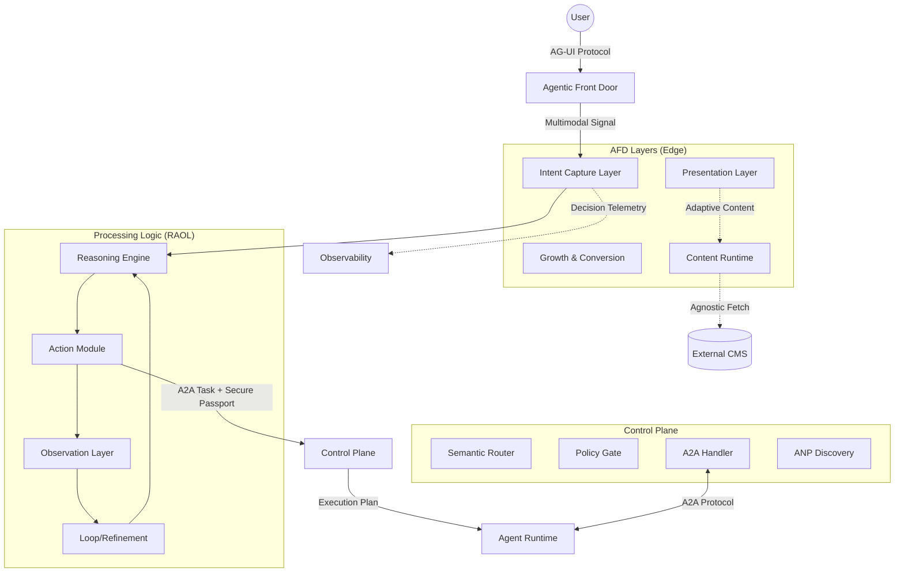
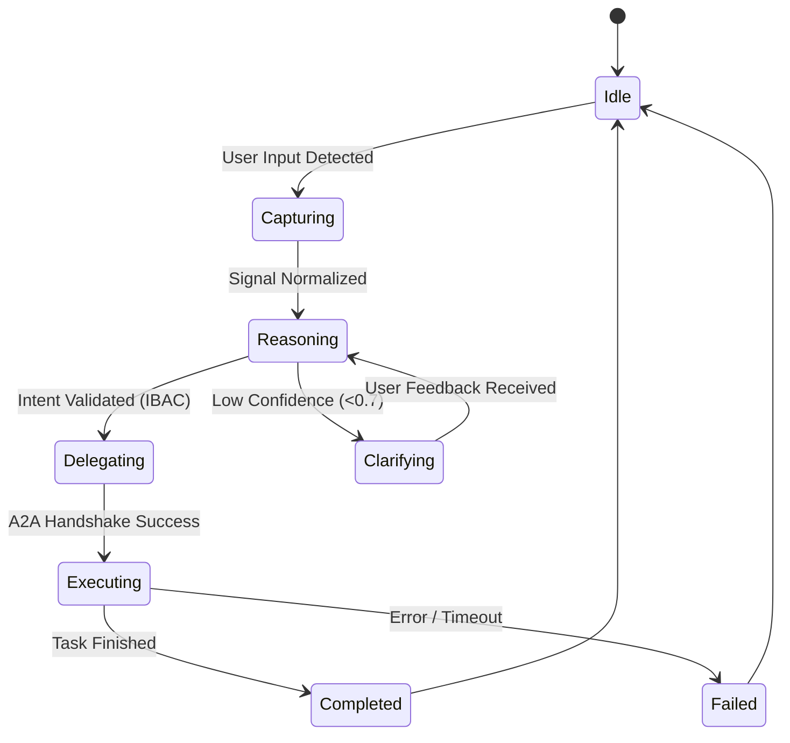
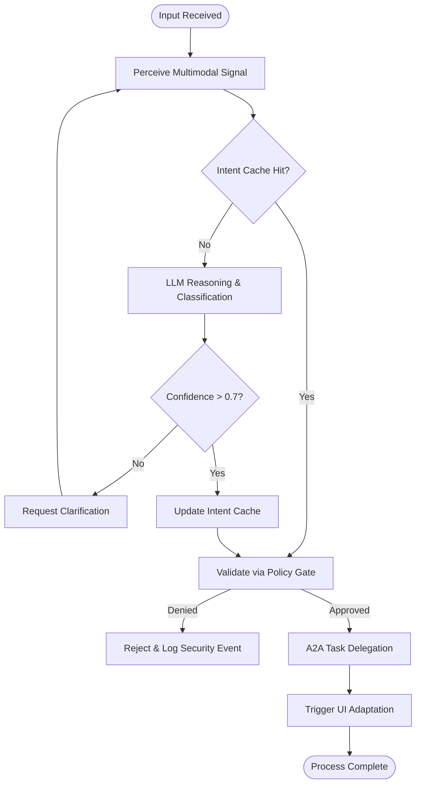

# Agentic Front Door (AFD) - Technical Specification & Architecture

---
**Version**: 1.2.0  
**Status**: Production Ready Concept  
**Owner**: @SBASuperAgent (Orchestration)  
**Collaborators**: @SOLOBuilder (Architect), @SOLOCoder (Implementation)  
**Last Updated**: 2025-12-31  

---

## **Table of Contents**
1. [Core Philosophy & Value Proposition](#1-core-philosophy--value-proposition)
2. [Technical Architecture](#2-technical-architecture)
   - 2.1 [Technology Stack](#21-technology-stack)
   - 2.2 [System Architecture Diagram](#22-system-architecture-diagram)
   - 2.3 [Layer Detail](#23-layer-detail)
3. [API Specifications](#3-api-specifications)
4. [Infrastructure Requirements](#4-infrastructure-requirements)
5. [Agentic Workflow & Collaboration](#5-agentic-workflow--collaboration)
6. [Implementation Requirements](#6-implementation-requirements)
7. [Validation & Testing Strategy](#7-validation--testing-strategy)
8. [Referensi & Dokumen Terkait](#8-referensi--dokumen-terkait)
9. [Changelog](#9-changelog)

---

## 1. Core Philosophy & Value Proposition

**Agentic Front Door (AFD)** adalah *entry point* cerdas, multimodal, dan *signal layer* utama bagi sistem SBA-Agentic. Berbeda dengan halaman pemasaran tradisional, AFD berfungsi sebagai lapisan persepsi awal yang menangkap, mengklasifikasikan, dan merutekan intensi pengguna (Intent) ke Control Plane dengan transparansi penuh.

| Prinsip           | Implementasi               | Deskripsi |
| ----------------- | -------------------------- | --------- |
| **CMS-agnostic**  | Content Runtime + Resolver | Marketing tidak tahu CMS apa yang digunakan (Basehub, Payload, dsb). |
| **Agent-aware**   | Semua event → Agent Signal | Setiap interaksi user menjadi sinyal untuk memori agen. |
| **Deterministic** | Adaptive tapi traceable    | UI bisa berubah tapi keputusannya harus bisa direply dan diaudit. |
| **Transparent**   | Agent Ops UI               | Menampilkan aktivitas AI untuk membangun kepercayaan pengguna. |
| **Multimodal**    | Text, Voice, UI            | Mendukung berbagai cara interaksi modern (Voice-to-Intent). |

### Key Values
1.  **Intent-First**: Setiap interaksi (klik, scroll, form, voice command) diterjemahkan menjadi *business intent*.
2.  **Zero-Trust**: Validasi keamanan dilakukan di pintu depan (Edge) sebelum mencapai Control Plane.
3.  **Observability**: Jejak audit penuh dari interaksi awal hingga eksekusi agen.

---

## 2. Technical Architecture

AFD dibangun di atas stack modern yang menjamin performa tinggi dan keamanan ketat, mengikuti pola **Reason-Act-Observe-Loop (RAOL)** untuk pemrosesan intent.

### 2.1 Technology Stack
*   **Framework**: Next.js 15 (App Router)
*   **Runtime**: Edge Runtime (Middleware) untuk pemrosesan sinyal cepat.
*   **Protocols**: 
    *   **MCP (Model Context Protocol)**: Untuk penyediaan konteks dan penggunaan tool.
    *   **A2A (Agent-to-Agent)**: Untuk koordinasi antara AFD dan agen eksekutor, mendukung **Secure Passport Extension** untuk berbagi context state.
*   **State**: Semantic Cache (Redis/KV) dengan TTL adaptif.
*   **Content**: Headless CMS (Abstracted via Content Runtime).
*   **Security**: IBAC (Intent-Based Access Control) dengan Zero-Trust di Edge.

### 2.2 System Architecture Diagram



### 2.3 State Transition & Decision Flow

#### 2.3.1 Intent State Transition


#### 2.3.2 Decision Flow Logic


---

## 3. Technical Design Document (TDD)

### 3.1 Component Specifications

#### 3.1.1 Content Runtime (CMS-Agnostic)
Memisahkan aplikasi dari vendor CMS (Basehub, Payload, dsb) melalui interface resolver.
```ts
export interface ContentResolver {
  getPage(slug: string): Promise<PageContent>;
  getBlock(id: string): Promise<Block>;
  getMetadata(slug: string): Promise<Metadata>;
}
```

#### 3.1.2 Semantic Router
Menggunakan embedding model (via MCP) untuk memetakan input natural language ke `Intent Taxonomy`.
- **Latency Target**: < 200ms (Cache Hit), < 800ms (Cache Miss).
- **Fallback**: Jika confidence < 0.7, arahkan ke `system.intent.clarify`.

#### 3.1.3 A2A Handler (Secure Passport)
Mengelola pertukaran context state antara AFD (Client) dan Agent Runtime (Server).
- **Passport Extension**: Menyertakan `tenant_id`, `session_id`, dan `compliance_tier` dalam setiap request.

#### 3.1.4 AG-UI Protocol Implementation
Protokol komunikasi antara Frontend dan Backend Agentic yang mendukung streaming response dan UI partial updates.

---

## 4. API Specifications

Berikut adalah kontrak interface TypeScript untuk komponen inti AFD:

```ts
/**
 * Kontrak Utama AFD Intent Emitter
 */
export interface AFDIntentEmitter {
  /** Menangkap input multimodal dan memancarkan intent */
  emitIntent(input: MultimodalInput): Promise<IntentResponse>;
  
  /** Mengambil status kesehatan agen marketing */
  getAgentStatus(): Promise<AgentStatus>;
}

export interface MultimodalInput {
  type: 'text' | 'voice' | 'ui_event' | 'visual';
  payload: string | Blob | UIEventPayload | ImageBlob;
  context: {
    page_slug: string;
    visitor_id: string;
    tenant_id: string;
    metadata?: Record<string, any>;
  };
}

export interface IntentResponse {
  intent_id: string;
  confidence: number;
  action_required: boolean;
  suggested_ui_adaptation?: UIAdaptationPlan;
  trace_id: string; // Reasoning Trace ID
}

export interface UIAdaptationPlan {
  component_id: string;
  variant: string;
  reasoning: string; // Reasoning Trace untuk transparansi
}

export interface AgentStatus {
  status: 'online' | 'processing' | 'offline';
  active_tasks: number;
  last_decision: string;
  uptime: number;
}
```

---

## 5. Infrastructure Requirements

1.  **Edge Runtime**: Wajib digunakan untuk `middleware.ts` guna validasi intent di level request terluar.
2.  **Redis (Upstash/KV)**:
    *   `TTL`: 300 detik untuk session context.
    *   `Semantic Cache`: Digunakan untuk menyimpan pemetaan input -> intent guna mengurangi biaya LLM.
3.  **Voice Streaming**: Mendukung WebSockets (WSS) untuk transkripsi real-time jika input berupa suara.
4.  **CDN Strategy**: Cache konten statis di CDN, namun bypass untuk `agentic-marketing` layer.
5.  **Observability**: Integrasi dengan ELK Stack atau Prometheus untuk monitoring metrik per tenant.

---

## 6. Deployment Guide

### 6.1 Pipeline Stages
1.  **Build**: 
    - `pnpm lint`: Memastikan kepatuhan kode.
    - `pnpm build`: Next.js static & dynamic build.
    - `pnpm test:schema`: Validasi schema YAML terhadap `rules-specification`.
2.  **Staging**: 
    - Deploy ke lingkungan staging (Edge Runtime enabled).
    - Jalankan **Chaos Engineering** untuk menguji resilience `A2A Handler`.
3.  **Production**:
    - **Blue-Green Deployment**: Menghindari downtime saat update agentic layer.
    - **Canary Release**: Rollout fitur baru ke 5% traffic awal.

### 6.2 Rollback Policy
- Jika `error_rate > 1%` dalam 5 menit pertama deployment, otomatis rollback ke versi stabil sebelumnya.
- Jika `latency_p99 > 1500ms`, trigger investigasi otomatis oleh `ObserverAgent`.

---

## 7. Agentic Workflow & Collaboration

Pengembangan AFD mengikuti protokol kolaborasi ketat antara agen AI:

1.  **@SOLOBuilder (Architect)**: 
    *   Merancang `Content Resolver` contract.
    *   Mendefinisikan schema `Intent Capture`.
    *   Menjamin integritas dokumen SSOT.
2.  **@SOLOCoder (Implementer)**:
    *   Membangun folder `agentic-marketing`.
    *   Mengintegrasikan `observability` hooks.
    *   Implementasi `Agent Ops UI`.
3.  **@SBASuperAgent (Orchestrator)**:
    *   Melakukan audit kode terhadap spesifikasi.
    *   Memvalidasi `Reasoning Trace`.
    *   Menjalankan automated validation scripts.

---

## 8. Implementation Requirements

### 8.1 Boundary Rules (Aturan Keras)
1.  ❌ **No Direct DB Access**: AFD tidak boleh menyentuh database utama.
2.  ❌ **No Heavy Compute**: Logika berat harus di-offload ke Control Plane / Workers.
3.  ✅ **Signal Only**: Fokus utama adalah menghasilkan sinyal intent yang bersih.

### 8.2 Directory Structure (Target)
```text
apps/marketing/src
├── app/                         # Next.js routing only
├── presentation/                # PURE UI & SEO (No logic)
├── growth/                      # Conversion & Growth (CTA, Funnels)
├── agentic-marketing/           # ⭐ CORE VALUE: Signal Layer
│   ├── intent-capture/          # Signal Translators (MCP based)
│   ├── adaptive-content/        # Contextual Rendering Logic
│   ├── agent-ops-ui/            # Trust & Transparency UI
│   └── decision-telemetry/      # Audit & Replay Data
├── content-runtime/             # CMS abstraction (Basehub, etc)
├── observability/               # Full visibility (Telemetry, Audit)
├── security/                    # Trust & compliance (Bot detection, Consent)
└── infrastructure/              # Webhooks, Edge, Integrations
```

### 8.3 Migration Checklist (File-by-file)
*   [ ] Relocate `features/hero` -> `presentation/sections/hero`
*   [ ] Relocate `features/cta-*` -> `growth/cta/*`
*   [ ] Implement `content-runtime/resolvers/basehub`
*   [ ] Inject `agentic-marketing/intent-capture` hooks into `presentation` layer.

---

## 7. Validation & Testing Strategy

AFD menggunakan pendekatan multi-layer untuk menjamin keakuratan dokumentasi dan keandalan sistem.

### 7.1 Technical Review & Compliance
Setiap perubahan pada spesifikasi AFD wajib melalui review oleh **@SOLOBuilder** untuk memastikan kepatuhan terhadap arsitektur SBA-Agentic.
- **IBAC Audit**: Verifikasi bahwa semua intent baru memiliki kebijakan keamanan yang sesuai.
- **A2A Handshake Test**: Simulasi handshake antara AFD dan Agent Runtime menggunakan mock passport.

### 7.2 Consistency Checks (SSOT)
Menjamin tidak ada diskrepansi antara dokumen spesifikasi dan implementasi teknis.
- **Drift Detection**: Script otomatis yang membandingkan `Intent Taxonomy` di `.md` dengan konfigurasi di `Semantic Router`.
- **Cross-Doc Validation**: Memastikan referensi di `Glossary` dan `SBA Feature Design` sinkron dengan AFD spec.

### 7.3 Automated Documentation Testing
Menggunakan perkakas untuk memvalidasi elemen teknis dalam dokumen:
- **Mermaid Lint**: Validasi sintaks diagram secara otomatis di CI/CD.
- **OpenAPI Validation**: Memastikan file `afd-openapi.yaml` valid dan sinkron dengan interface di dokumen ini.

### 7.4 User Acceptance Testing (UAT)
- **Usability Testing**: Mengukur efektivitas *Adaptive UI* dalam membantu user mencapai tujuannya.
- **Latency Benchmarking**: Memastikan target latensi (< 200ms cache hit) tercapai di lingkungan produksi.

---

## 8. Referensi & Dokumen Terkait

*   [Glossary of Terms - SBA](file:///home/inbox/smart-ai/sba-agentic/docs/Strategy%20%26%20Capability%20Framework/concepts/Glossary%20of%20Terms%20-%20SBA.md)
*   [Docs sebagai Single Source of Truth - AFD](file:///home/inbox/smart-ai/sba-agentic/docs/Strategy%20%26%20Capability%20Framework/concepts/Docs%20sebagai%20Single%20Source%20of%20Truth%20-%20AFD.md)
*   [Finalize Intent Taxonomy SBA (Global)](file:///home/inbox/smart-ai/sba-agentic/docs/Strategy%20%26%20Capability%20Framework/concepts/Finalize%20Intent%20Taxonomy%20SBA%20(Global).md)
*   [SBA Feature Design](file:///home/inbox/smart-ai/sba-agentic/docs/Strategy%20%26%20Capability%20Framework/concepts/SBA%20Feature%20Design.md)

---

## 9. Appendix

### A. AFD Error Codes
| Code | Description | Recommended Action |
| :--- | :--- | :--- |
| AFD-001 | Intent Not Found | Trigger `system.intent.clarify` |
| AFD-002 | A2A Handshake Failed | Check Secure Passport & Network |
| AFD-003 | IBAC Permission Denied | Log as Security Incident & Notify User |
| AFD-004 | Multimodal Stream Timeout | Fallback to Text-Only Mode |

---

## 10. Changelog

| Versi | Tanggal | Deskripsi Perubahan | Author |
| :--- | :--- | :--- | :--- |
| 1.0.0 | 2025-12-28 | Inisialisasi spesifikasi AFD. | @SBASuperAgent |
| 1.1.0 | 2025-12-29 | Penambahan Testing Checklist & Directory Structure. | @SBASuperAgent |
| 1.2.0 | 2025-12-31 | Integrasi MCP/A2A, API Specs detail, Infrastructure, TDD, dan Deployment Guide. | @SBASuperAgent |

---
*Dokumen ini adalah Single Source of Truth untuk implementasi Agentic Front Door.*


---
*Dokumen ini adalah Single Source of Truth untuk implementasi Agentic Front Door.*
