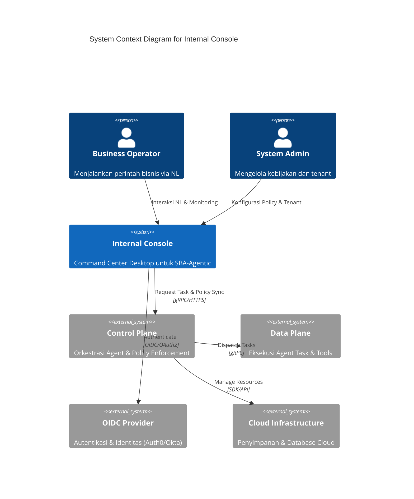
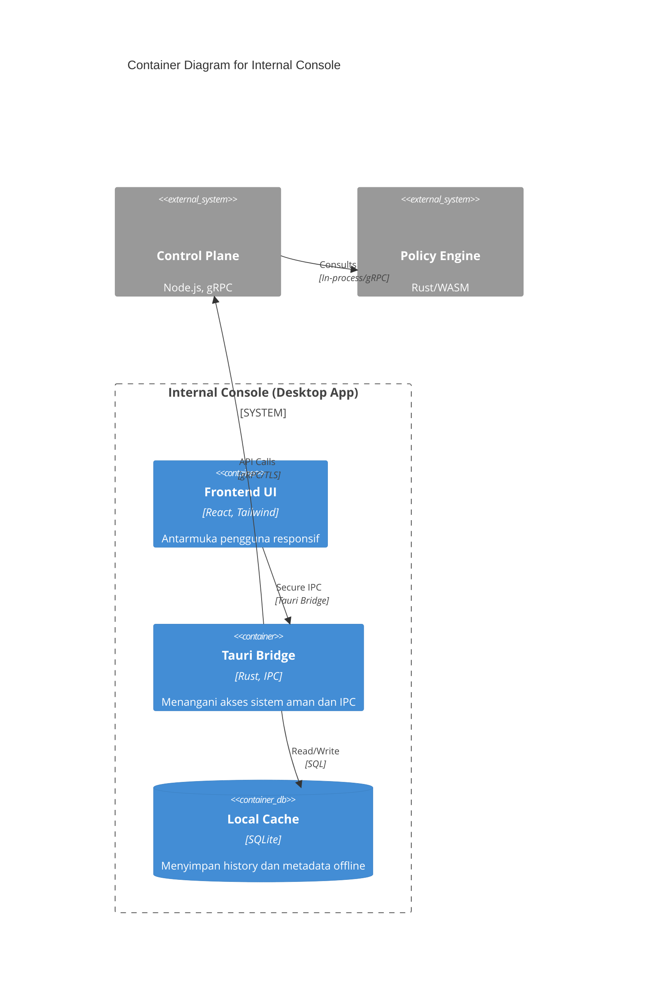
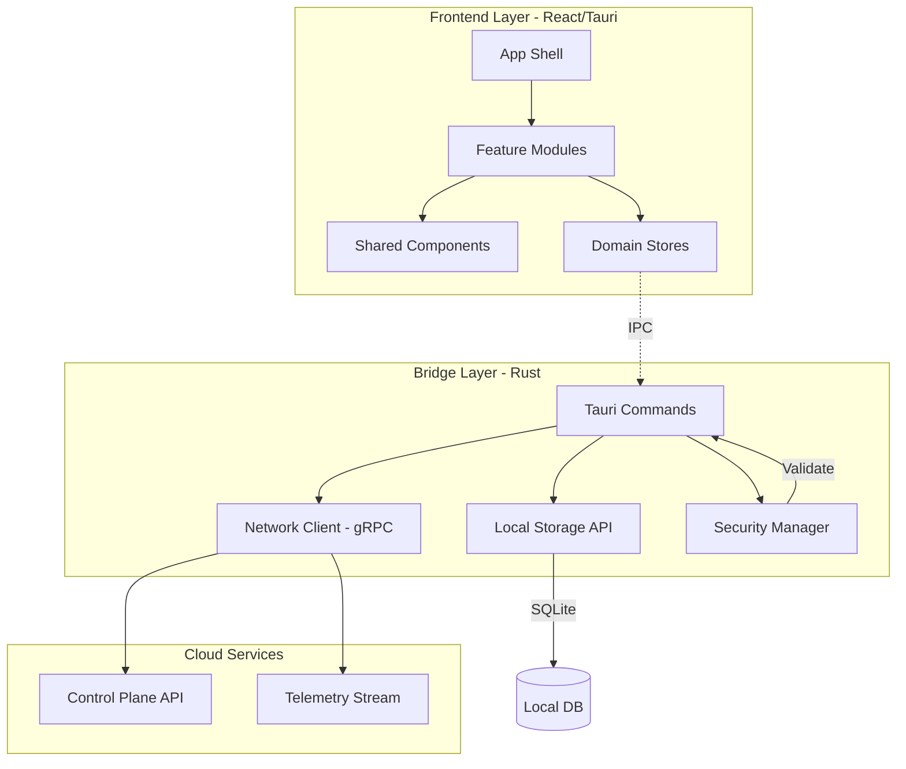
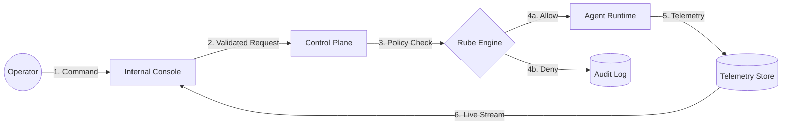

---

title: Control & Intelligence Console
slug: control-intelligence-console
created_at: 2025-12-29
last_modified: 2025-12-29
author: SBA-Agentic Team
status: Final
version: 1.2.1
--------------

# Control & Intelligence Console

> **Unified Desktop Control Plane** untuk mengelola, mengobservasi, dan mengorkestrasi seluruh kemampuan **SBA‑Agentic (Smart Business Assistant)** secara aman, terukur, dan explainable.

Dokumen ini adalah **landing page resmi** dan **kontrak teknis** untuk aplikasi **`apps/internal-console`**.

---

## 1. Introduction
### 1.1 Purpose
Dokumen ini mendefinisikan arsitektur, standar keamanan, dan spesifikasi teknis untuk Internal Console. Dokumen ini berfungsi sebagai panduan bagi pengembang platform, auditor keamanan, dan stakeholder bisnis untuk memahami bagaimana kontrol dijalankan di atas ekosistem agentic.

### 1.2 Scope
Mencakup seluruh fungsionalitas di `apps/internal-console`, termasuk integrasi Control Plane, manajemen kebijakan Rube, dan visualisasi telemetri agent.

### 1.3 Definitions
- **Control Plane**: Layanan backend terpusat yang mengelola koordinasi agent.
- **Data Plane**: Lingkungan eksekusi tempat agent melakukan aksi.
- **Internal Console**: Aplikasi desktop (Tauri) sebagai antarmuka operator.

---

## 2. Architecture Overview
Sistem ini menggunakan arsitektur **Control Plane vs Data Plane** yang terpisah untuk memastikan skalabilitas dan keamanan.

### 2.1 System Context Diagram
Diagram ini menunjukkan interaksi Internal Console dengan entitas eksternal.



### 2.2 Container Diagram
Diagram kontainer mendetailkan blok bangunan internal aplikasi.



### 2.3 Component Diagram (Module Dependency Mapping)
Diagram berikut mendetailkan modul-modul internal dalam `apps/internal-console` dan ketergantungannya.



### 2.4 Critical Data Flow (DFD Level 1)
Aliran informasi kritis dari operator hingga ke eksekusi agent dan umpan balik observabilitas.



### 2.5 Security Boundary Model & Privilege Matrix
Pemisahan hak akses yang ketat berdasarkan peran dan konteks tenant.

| Role | Agent Invoke | Policy Edit | Tenant Config | Audit View | DR Trigger |
| :--- | :---: | :---: | :---: | :---: | :---: |
| **SuperAdmin** | ✅ | ✅ | ✅ | ✅ | ✅ |
| **SecurityEng** | ❌ | ✅ | ❌ | ✅ | ❌ |
| **Operator** | ✅ | ❌ | ❌ | ❌ | ❌ |
| **Auditor** | ❌ | ❌ | ❌ | ✅ | ❌ |

#### 2.5.1 Data Isolation & Encryption
- **Tenant Isolation**: Setiap request wajib menyertakan `X-Tenant-ID`. Data Plane menggunakan Row-Level Security (RLS) pada PostgreSQL dan prefix-based isolation pada Vector DB.
- **Encryption Standards**:
    - *At-Rest*: AES-256 untuk database (Cloud & Local SQLite).
    - *In-Transit*: TLS 1.3 untuk semua komunikasi API dan gRPC.
    - *Secrets*: Integrasi dengan AWS Secrets Manager / HashiCorp Vault.
- **Security Boundary**: Frontend (JS) tidak memiliki akses langsung ke filesystem atau network mentah; semua harus melalui Tauri Rust Bridge dengan validasi permission eksplisit.

---

## 3. API Contract Specification (OpenAPI 3.0)
Integrasi antara Internal Console dan Control Plane mengikuti standar OpenAPI 3.0 dengan kebijakan keamanan dan rate limiting yang ketat.

### 3.1 Versioning & Compatibility Policy
- **Versioning Strategy**: Menggunakan Semantic Versioning (SemVer) pada URL (e.g., `/v1`, `/v2`).
- **Backward Compatibility**: API versi N akan didukung selama minimal 6 bulan setelah versi N+1 dirilis. Perubahan yang memutus (breaking changes) dilarang dalam versi minor.
- **Deprecation Policy**: Endpoint yang akan dihentikan akan menyertakan header `Warning: 299 - "Deprecated"` dan didokumentasikan dalam Release Notes minimal 3 bulan sebelum dihapus.

```yaml
openapi: 3.0.3
info:
  title: SBA-Agentic Control Plane API
  version: 2.1.0
  description: API orkestrasi untuk agentic ecosystem.

paths:
  /agents/invoke:
    post:
      summary: Eksekusi Agent Task
      x-rate-limit: 100/min
      security:
        - BearerAuth: []
        - TenantAuth: []
      requestBody:
        required: true
        content:
          application/json:
            schema:
              $ref: '#/components/schemas/InvokeRequest'
      responses:
        '200':
          description: Sukses
        '429':
          description: Rate Limit Exceeded

  /workflows/start:
    post:
      summary: Inisialisasi Workflow Multi-step
      security:
        - BearerAuth: []
      requestBody:
        required: true
        content:
          application/json:
            schema:
              type: object
              required: [template_id, parameters]
              properties:
                template_id: { type: string }
                parameters: { type: object }
      responses:
        '201':
          description: Workflow Started
          content:
            application/json:
              schema:
                properties:
                  instance_id: { type: string }

  /policy/publish:
    post:
      summary: Publikasi Kebijakan Rube Baru
      security:
        - BearerAuth: []
        - AdminAuth: []
      requestBody:
        required: true
        content:
          text/yaml:
            schema:
              type: string
      responses:
        '200':
          description: Policy Published
        '400':
          description: Validation Error (Conflict detected)

  /tenants/onboard:
    post:
      summary: Onboarding Tenant Baru
      security:
        - BearerAuth: []
        - SuperAdminAuth: []
      requestBody:
        required: true
        content:
          application/json:
            schema:
              type: object
              required: [name, config]
              properties:
                name: { type: string }
                config: { type: object }
      responses:
        '201':
          description: Tenant Created
          content:
            application/json:
              schema:
                properties:
                  tenant_id: { type: string }

  /analytics/generate:
    post:
      summary: Request Laporan Analitik
      security:
        - BearerAuth: []
      requestBody:
        required: true
        content:
          application/json:
            schema:
              type: object
              required: [type, range]
              properties:
                type: { type: string, enum: [PDF, CSV] }
                range: { type: object }
      responses:
        '200':
          description: Report Generation Started
          content:
            application/json:
              schema:
                properties:
                  download_url: { type: string }

components:
  securitySchemes:
    BearerAuth:
      type: http
      scheme: bearer
    TenantAuth:
      type: apiKey
      in: header
      name: X-Tenant-ID
    AdminAuth:
      description: Membutuhkan role ADMIN
      type: apiKey
      in: header
      name: X-Admin-Role
    SuperAdminAuth:
      description: Membutuhkan role SUPER_ADMIN
      type: apiKey
      in: header
      name: X-SuperAdmin-Role

  schemas:
    InvokeRequest:
      type: object
      required: [input, agent_id]
      properties:
        input: { type: string }
        agent_id: { type: string }
        context: { type: object }
```

### 3.2 Rate Limiting Policies
- **User Level**: 50 req/min (Soft Limit), 100 req/min (Hard Limit).
- **Tenant Level**: 500 req/min per tenant cluster.
- **Burst**: Diizinkan hingga 20% di atas Hard Limit untuk < 30 detik.
- **Shared Resource Allocation**: Resource LLM dan CPU dibagi berdasarkan tier tenant (Standard, Enterprise).

### 3.3 Authentication & Authorization Mechanisms
1. **OIDC Flow**: Autentikasi user via Auth0/Okta untuk mendapatkan JWT.
2. **Context Injection**: Internal Console menyuntikkan `X-Tenant-ID` pada setiap request.
3. **Policy-Based Authz**: Control Plane memvalidasi JWT + Tenant ID + Rube Policy sebelum memberikan akses ke resource.

---

## 4. Offline Mode & Desktop Capabilities
Sebagai aplikasi desktop-first, `internal-console` dirancang untuk tetap operasional dalam kondisi jaringan yang tidak stabil.

### 4.1 Offline Mode Capabilities
- **Local Persistence**: Menggunakan SQLite terenkripsi untuk menyimpan metadata tenant, konfigurasi agent, dan history aktivitas lokal.
- **Deferred Synchronization**: Perintah yang dilakukan saat offline akan masuk ke dalam *Outbox Queue* dan akan disinkronkan secara otomatis saat koneksi kembali stabil.
- **Conflict Resolution**: Menggunakan strategi **Vector Clocks** untuk mendeteksi konflik dan **Last-Write-Wins (LWW)** sebagai default, dengan opsi intervensi manual untuk konflik data sensitif.
- **Storage Quotas**: Batas penyimpanan lokal adalah 500MB per tenant; data lama (> 90 hari) akan di-archive ke cloud.

### 4.2 Desktop Integration
- **System Tray**: Monitoring status agent di latar belakang.
- **Native Notifications**: Pemberitahuan untuk eskalasi workflow atau peringatan keamanan.
- **Secure IPC**: Komunikasi antara frontend (React) dan backend (Rust/Tauri) menggunakan bridge yang terisolasi untuk mencegah serangan XSS mengakses API sistem.
- **Custom Branding Support**: Mendukung kustomisasi logo dan skema warna UI (Theme injection) berdasarkan konfigurasi tenant.

---

## 5. Compliance Requirements Matrix
Dokumen ini mendefinisikan kepatuhan sistem terhadap standar keamanan dan regulasi global yang relevan dengan operasi AI Agentic.

| Requirement | Category | Description | Standard | Control Objective | Evidence |
| :--- | :--- | :--- | :--- | :--- | :--- |
| **Data Privacy** | Regulatory | Enkripsi data at-rest & in-transit, PII masking otomatis. | GDPR, PDP | No unauthorized access to PII | Encryption logs, PII scanner reports, DPA |
| **Auditability** | Security | Log perubahan state, keputusan agent, dan akses admin secara immutable. | SOC2, ISO 27001 | Immutable audit trail & traceability | Signed audit logs, Traceability matrix, Audit report |
| **Explainability** | AI Ethics | Traceability alasan keputusan AI (Reasoning Trace) di setiap langkah. | EU AI Act | AI decisions must be explainable | Reasoning traces in JSON format, Model transparency docs |
| **Resilience** | Operations | Offline capability, Disaster Recovery (RTO < 4h, RPO < 15m). | BCP | Maintain operations during regional outage | DR test reports, Offline sync logs, Chaos engineering logs |
| **Access Control** | Governance | RBAC & ABAC (Attribute-based Access Control) dengan MFA. | NIST SP 800-53 | Least privilege enforcement | IAM logs, RBAC policy files, MFA enrollment logs |
| **Supply Chain** | Technical | Pemindaian kerentanan dependencies dan container images. | SLSA | Secure software supply chain | SBOM (Software Bill of Materials), Vulnerability scan reports |

---

## 6. Architecture Decisions & Analysis
### 6.1 Architecture Decision Records (ADR) Log
Daftar keputusan arsitektur kunci yang membentuk fondasi `internal-console`.

| ID | Decision | Rationale | Consequences |
| :--- | :--- | :--- | :--- |
| **ADR-01** | **Desktop-First (Tauri)** | Keamanan lebih ketat via Rust bridge, akses native API, dan performa tinggi dibanding browser murni. | Memerlukan instalasi client; update aplikasi melalui mekanisme auto-update secure. |
| **ADR-02** | **Rube Policy Engine** | Memisahkan logika izin dari kode aplikasi. Memungkinkan perubahan aturan secara dinamis tanpa redeploy. | Kompleksitas dalam penulisan rule YAML; memerlukan validasi skema yang ketat. |
| **ADR-03** | **Local-First Sync** | Memastikan operator tetap produktif di area dengan koneksi tidak stabil (Gudang, Remote Area). | Memerlukan logika resolusi konflik (Vector Clocks) dan manajemen storage lokal. |
| **ADR-04** | **gRPC over TLS 1.3** | Efisiensi bandwidth untuk streaming data telemetri agent yang padat secara real-time. | Memerlukan load balancer yang mendukung HTTP/2 dan gRPC; proxy configuration lebih kompleks. |
| **ADR-05** | **FSD Architecture** | Memastikan skalabilitas tim pengembang dengan pemisahan domain dan fitur yang jelas. | Struktur folder lebih dalam; kurva belajar bagi pengembang baru. |

### 6.2 Runtime Characteristics & Performance SLOs
Sistem dipantau terhadap ambang batas performa berikut:

| Metric | Target (SLO) | Monitoring Method | Alerting Threshold |
| :--- | :--- | :--- | :--- |
| **P95 Latency** | < 200ms (Local Command) | Prometheus Histogram | > 500ms for 5 mins |
| **API Availability** | 99.9% Uptime | Synthetic Monitoring | < 99.5% in 1 hour |
| **Memory Usage** | < 500MB (Peak) | Tauri System Metrics | > 800MB persistent |
| **Startup Time** | < 3 seconds | Telemetry Traces | > 5 seconds (Cold start) |
| **Sync Success Rate** | > 99.5% | Sync Service Logs | < 95% in 15 mins |

### 6.3 Security Boundary & Risk Mitigation
Model mitigasi risiko untuk setiap zona interaksi dalam Internal Console.

| Zone | Primary Risk | Mitigation Strategy |
| :--- | :--- | :--- |
| **User Input** | Prompt Injection / Command Injection | Input sanitization, Rube validation layer, LLM guardrails. |
| **IPC Bridge** | Unauthorized Native API Call | Hardened Tauri allowlist, strictly typed commands, signature verification. |
| **Local Storage** | Data Theft (Physical access) | AES-256-GCM encryption with hardware-backed key (Keytar/Secret Service). |
| **Network** | Man-in-the-Middle (MITM) | mTLS, certificate pinning, TLS 1.3 only. |
| **Agent Execution** | Resource Exhaustion | Quota management, timeout enforcement, circuit breakers. |

---

## 7. Change Log
| Version | Date | Author | Description |
| :--- | :--- | :--- | :--- |
| 1.2.1 | 2025-12-29 | SBA-Agentic Team | Enhanced: System Context, C4 Container, Compatibility Policy, and Compliance Details. |
| 1.2.0 | 2025-12-29 | SBA-Agentic Team | Enhanced specs: C4 Container Diagram, RBAC Matrix, Rate Limiting Policy, and OpenAPI 3.0. |
| 1.1.0 | 2025-12-29 | SBA-Agentic Team | Finalisasi landing page & kontrak teknis (Enterprise-grade). |
| 1.0.0 | 2025-12-29 | SBA-Agentic Team | Inisialisasi landing page. |

---

## 8. Referensi Terkait
* [Use Case Specifications — Internal Console](file:///home/inbox/smart-ai/sba-agentic/docs/01-product/Use%20Case%20Specifications%20%E2%80%94%20Internal%20Console%20(sba-agentic).md)
* [Arsitektur Internal Console](file:///home/inbox/smart-ai/sba-agentic/docs/02-architecture/Arsitektur%20internal-console.md)
* [SBA-Agentic Workflow Standard](file:///home/inbox/smart-ai/sba-agentic/docs/SBA-Agentic-Workflow-Standard.md)
