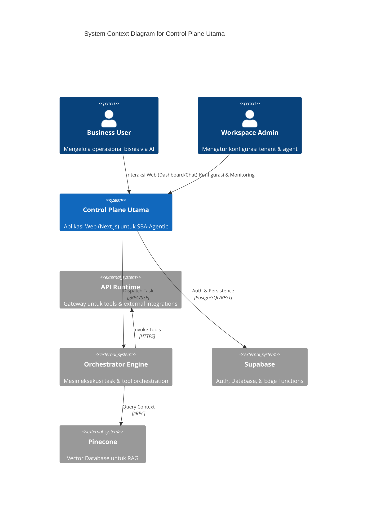
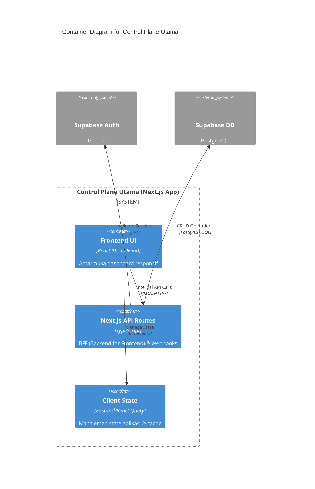

# Control Plane Utama

> **Unified Web Orchestrator** (Next.js 15) yang berfungsi sebagai pusat komando untuk mengelola seluruh ekosistem **SBA‑Agentic**, mulai dari manajemen tenant dan workspace hingga pemantauan real-time eksekusi agent.

Dokumen ini adalah **landing page resmi** dan **kontrak teknis** untuk aplikasi **`apps/app`**.

---

## 1. Introduction
### 1.1 Purpose
Dokumen ini mendefinisikan spesifikasi teknis, standar keamanan, dan kontrak API untuk Control Plane Utama. Dokumen ini menjadi acuan bagi pengembang frontend, backend, dan tim operasional dalam memastikan konsistensi platform.

### 1.2 Scope
Mencakup seluruh fungsionalitas di `apps/app`, termasuk manajemen siklus hidup agent, integrasi database Supabase, orkestrasi workflow, dan visualisasi meta-events.

### 1.3 Definitions
- **Control Plane Utama**: Aplikasi web berbasis Next.js sebagai antarmuka pengguna utama.
- **Orchestrator**: Layanan backend yang mengatur aliran tugas antar agent.
- **Rube Engine**: Mesin kebijakan yang memvalidasi setiap tindakan agent berdasarkan aturan bisnis.

---

## 2. Architecture Overview
Control Plane Utama menggunakan pendekatan **Control Plane vs Data Plane** yang terisolasi secara ketat.

### 2.1 System Context Diagram
Diagram ini menunjukkan posisi Control Plane Utama dalam ekosistem SBA-Agentic.



### 2.2 Container Diagram
Blok bangunan internal dari `apps/app`.



### 2.3 Security & Encryption Standards
- **Authentication**: OIDC & JWT via Supabase Auth.
- **Authorization**: Row-Level Security (RLS) pada PostgreSQL dan validasi kebijakan via Rube Engine.
- **Data-at-Rest**: AES-256-GCM untuk data sensitif di database.
- **Data-in-Transit**: TLS 1.3 wajib untuk seluruh endpoint API.
- **Isolation**: Multi-tenant isolation menggunakan `tenant_id` pada setiap query dan request.

---

## 3. API Contract Specification (OpenAPI 3.0)
Control Plane Utama mengekspos API internal (BFF) untuk dikonsumsi oleh frontend.

### 3.1 Versioning Strategy
- Menggunakan prefix `/api/v1/` untuk endpoint stabil.
- Perubahan non-breaking diizinkan pada versi minor.

```yaml
openapi: 3.0.3
info:
  title: Control Plane Internal API
  version: 1.2.0
  description: API internal untuk apps/app dashboard.

paths:
  /api/agents:
    get:
      summary: List all agents in workspace
      security:
        - CookieAuth: []
      responses:
        '200':
          description: List of agents
          content:
            application/json:
              schema:
                type: object
                properties:
                  agents:
                    type: array
                    items:
                      $ref: '#/components/schemas/Agent'
    post:
      summary: Create new agent
      requestBody:
        required: true
        content:
          application/json:
            schema:
              $ref: '#/components/schemas/CreateAgentRequest'

components:
  schemas:
    Agent:
      type: object
      properties:
        id: { type: string }
        name: { type: string }
        type: { type: string, enum: [ai, workflow] }
        isActive: { type: boolean }
    CreateAgentRequest:
      type: object
      required: [name, type]
      properties:
        name: { type: string }
        type: { type: string }
        description: { type: string }
```

---

## 4. Compliance & Observability
### 4.1 Compliance Matrix
| Requirement | Category | Standard | Evidence |
| :--- | :--- | :--- | :--- |
| **Data Privacy** | Regulatory | GDPR / PDP | PII Masking logs, Data encryption status |
| **Audit Trail** | Security | ISO 27001 | Immutable logs in Supabase `audit` table |
| **Explainability** | AI Ethics | EU AI Act | Reasoning trace stored per interaction |

### 4.2 Monitoring SLOs
- **Frontend Load Time**: < 1.5s (LCP).
- **API Response (P95)**: < 300ms.
- **Stream Latency**: < 100ms (TTFT - Time To First Token).

---

## 5. Change Log
| Version | Date | Author | Description |
| :--- | :--- | :--- | :--- |
| 1.2.1 | 2025-12-29 | SBA-Agentic Team | Inisialisasi landing page & kontrak teknis untuk apps/app. |

---
---

## 6. Referensi Terkait
* [Use Case Specifications — Control Plane](./Use%20Case%20Specifications%20—%20Control%20Plane%20(sba-agentic).md)
* [Arsitektur apps-app](../02-architecture/Arsitektur%20apps-app.md)
* [SBA-Agentic Operational Standard](../08-operations/OPERATIONAL_STANDARD.md)
