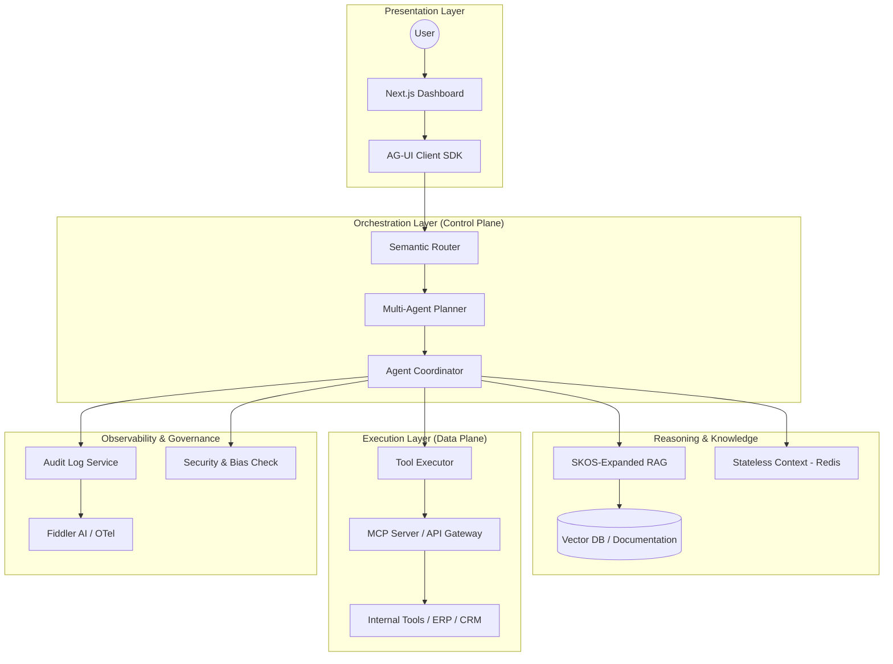
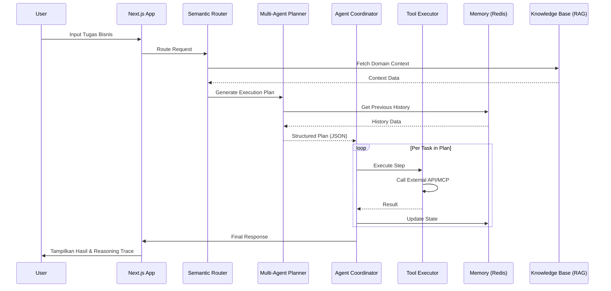

# 📄 SBA-Agentic: Spesifikasi Pengembangan Komprehensif (Smart Business Assistant)

**Versi:** 1.7.0  
**Status:** Active Specification  
**Tanggal Terakhir Diperbarui:** 29 Desember 2025

---

## 1. Analisis Kebutuhan Bisnis & Studi Kasus

SBA-Agentic diposisikan sebagai **AI-Native Business Operating System** yang mentransformasi operasional bisnis dari otomasi linear menjadi sistem otonom berbasis tujuan (*goal-oriented*).

### 1.1 Kebutuhan Utama Industri (2025-2026)
- **Autonomous Reasoning & Scaled Impact:** Perusahaan bergeser dari sekadar eksperimen (pilot) ke implementasi skala besar yang membuktikan ROI nyata. Target utamanya adalah reduksi biaya operasional hingga 60% melalui otomasi tugas administratif yang kompleks (PwC, 2025).
- **Enterprise-Grade Security (Zero Trust):** Isolasi data multi-tenant yang ketat dan kepatuhan terhadap regulasi global (EU AI Act, SOC2/GDPR). Keamanan bukan lagi fitur tambahan, melainkan fondasi utama.
- **Transparency & Responsible AI (RAI):** Setiap keputusan AI harus dapat dijelaskan (*explainable AI*). Audit trail yang permanen dan mekanisme "Responsible AI" menjadi standar operasional untuk membangun kepercayaan (McKinsey, 2025).
- **Hybrid Workforce Management:** Integrasi antara tenaga kerja manusia (carbon-based) dan agen AI (silicon-based) melalui perencanaan kerja yang terpadu (Deloitte, 2026).

### 1.2 Evolusi Sistem Informasi Bisnis
SBA-Agentic mewakili puncak evolusi dari Sistem Informasi Manajemen (SIM) tradisional:
- **Era 1 (Manual/Mekanik):** Fokus pada efisiensi input data.
- **Era 2 (Client-Server):** Digitalisasi proses bisnis inti.
- **Era 3 (Cloud/SaaS):** Aksesibilitas data global dan integrasi API.
- **Era 4 (Agentic/Autonomous):** Pengambilan keputusan otonom, adaptasi real-time terhadap sinyal bisnis, dan orkestrasi multi-sistem.

### 1.3 Studi Kasus Implementasi Industri
1.  **Walmart (Retail):** Menggunakan "AI Super Agent" untuk optimasi inventaris real-time di 4.700+ toko. Hasil: Peningkatan penjualan e-commerce sebesar 22% dan pengurangan drastis insiden stok kosong (Flobotics, 2025).
2.  **Toyota (Supply Chain):** Implementasi agen untuk visibilitas rantai pasok, menggantikan interaksi manual dengan puluhan layar mainframe menjadi aliran informasi real-time otonom (Deloitte, 2026).
3.  **Mapfre (Asuransi):** Penggunaan agen untuk manajemen klaim rutin (penilaian kerusakan) dengan tetap menjaga "Human-in-the-Loop" untuk komunikasi pelanggan yang sensitif.
4.  **Moderna (Biotech):** Menggabungkan fungsi HR dan IT untuk mengelola "Work Planning" yang mencakup orang dan teknologi AI sebagai satu kesatuan sumber daya.

---

## 2. Spesifikasi Teknis & Arsitektur Sistem

### 2.1 Arsitektur Modular (The AG-UI Protocol)
SBA-Agentic menggunakan arsitektur modular yang memisahkan antara lapisan presentasi, orkestrasi penalaran, dan integrasi layanan, terinspirasi oleh **Model Context Protocol (MCP)**.



### 2.2 Stack Teknologi Terkini
- **Frontend:** Next.js 15 (App Router), React 18, Tailwind CSS, Radix UI.
- **Backend/Service:** Supabase (PostgreSQL, Auth, Storage) + Edge Functions.
- **Core Engine:** TypeScript-based Agentic Framework dengan dukungan **LangGraph** untuk alur kerja siklikal.
- **Model Intelligence:** Claude 3.5 Sonnet (Reasoning), GPT-4o (Orchestration), dan Haiku/Gemini Flash (Sub-tasks).
- **Data & Connectivity:** 
    - **MCP (Model Context Protocol):** Standar untuk menghubungkan LLM dengan aplikasi dan dataset.
    - **Upstash Redis:** Untuk *stateless context management* dan sinkronisasi status real-time.
- **Observability:** OpenTelemetry (OTel), Prometheus, Fiddler AI.

### 2.3 Diagram Urutan (Sequence Diagram: Request to Execution)
Diagram berikut menunjukkan aliran data dari input pengguna hingga eksekusi tool otonom.



---

## 3. Agentic Reasoning Engine & Design Patterns

Mesin penalaran SBA-Agentic dirancang dengan prinsip **"Reasoning First, Execution Second"** dan mengadopsi pola desain industri terbaru.

### 3.1 Pola Desain Agen (Agent Design Patterns 2025)
1.  **Orchestrator-Worker Pattern:** Planner (Manager) memecah tugas besar menjadi sub-tugas kecil yang dikerjakan oleh Executor (Worker) yang terspesialisasi.
2.  **Multi-Agent Collaboration:** Penggunaan agen ahli domain (misalnya: Agen Legal, Agen Finance, Agen IT) yang berinteraksi untuk menyelesaikan masalah lintas fungsi.
3.  **Self-Correction Loop (Reflexion):** Agen melakukan evaluasi mandiri terhadap outputnya sendiri sebelum dikirim ke pengguna. Jika gagal, agen mencoba pendekatan berbeda secara otomatis.
4.  **Retrieval-Augmented Reasoning (RAG):** Integrasi dinamis antara basis pengetahuan perusahaan (internal docs) dengan logika penalaran LLM untuk mengurangi halusinasi.
5.  **State-Machine Workflows (LangGraph):** Menjaga alur kerja agen tetap deterministik dan dapat dipantau melalui grafik status yang terdefinisi dengan jelas.

### 3.2 Komponen Inti Penalaran
- **Semantic Router:** Menggunakan *vector embeddings* untuk memetakan intent tugas ke tool atau domain bisnis yang tepat.
- **Advanced RAG with SKOS:** Menggunakan standar SKOS (*Simple Knowledge Organization System*) untuk navigasi grafik pengetahuan.
- **Dynamic Self-Correction:** Loop pemulihan otonom yang menganalisis kegagalan eksekusi tool dan mencoba pendekatan alternatif.

### 3.3 Siklus Penalaran (Reasoning Cycle)
1. **Analysis Phase:** Router mengidentifikasi tool; Retriever mengambil konteks SKOS.
2. **Planning Phase:** Planner menyusun rencana eksekusi terstruktur (JSON).
3. **Validation Phase:** Reviewer memvalidasi rencana terhadap aturan bisnis (Rube Engine).
4. **Execution Phase:** Eksekusi toolCall melalui gateway API terproteksi atau MCP Server.
5. **Reflection Phase:** Supervisor mengevaluasi hasil dan mencatat *learning points*.

---

## 4. Persyaratan Sistem (Requirements)

### 4.1 Persyaratan Fungsional (FR)
- **FR-01: Multi-tenant Isolation:** Memastikan data antar perusahaan tidak pernah tercampur (PostgreSQL RLS).
- **FR-02: Autonomous Planning:** Mampu memecah tugas kompleks menjadi minimal 10 langkah deterministik.
- **FR-03: Real-time Tool Integration:** Integrasi ke sistem eksternal (Stripe, HubSpot, SAP) melalui MCP atau REST.
- **FR-04: Human-in-the-loop (HITL):** Mekanisme interupsi otomatis jika skor kepercayaan (*confidence score*) < 0.7 atau untuk transaksi sensitif.
- **FR-05: Self-Learning Feedback Loop:** Sistem belajar dari koreksi pengguna untuk meningkatkan akurasi di masa depan.

### 4.2 Persyaratan Non-Fungsional (NFR)
- **NFR-01: Latency:** TTFT (Time to First Token) < 1.5 detik; penyelesaian tugas kompleks < 30 detik.
- **NFR-02: Scalability:** Mendukung hingga 10.000 agen aktif secara bersamaan per tenant.
- **NFR-03: Reliability:** Tingkat keberhasilan eksekusi tool minimal 99% dengan mekanisme retry otomatis.
- **NFR-04: Auditability:** 100% jejak audit untuk setiap tool call dan keputusan penalaran.
- **NFR-05: Explainability:** Menyediakan visualisasi "Reasoning Trace" untuk setiap jawaban.

---

## 5. Keamanan, Tata Kelola AI, & Kepatuhan

SBA-Agentic mematuhi standar keamanan tertinggi dan kerangka kerja **Responsible AI**.

### 5.1 Tata Kelola AI & Kepatuhan (EU AI Act Ready 2026)
- **Transparency by Design:** Setiap keputusan agen disertai dengan *reasoning trace* yang dapat diaudit oleh manusia.
- **Bias Detection & Mitigation:** Audit berkala terhadap output LLM untuk mendeteksi bias gender, ras, atau sosio-ekonomi.
- **Risk-Based Classification:** Implementasi kontrol ekstra untuk tugas yang dikategorikan sebagai "High-Risk" menurut EU AI Act.
- **Data Sovereignty:** Dukungan untuk lokalisasi data (misalnya: data residensi di EU/Indonesia) sesuai regulasi lokal.

### 5.2 Model Otorisasi (Zero Trust RBAC)
- **Role Matrix:** Pemisahan tugas antara SuperAdmin, Supervisor, ExecutionAgent, dan ReviewAgent.
- **PII Masking:** Middleware otomatis untuk menyamarkan data sensitif (Email, NIK, Phone) dalam log audit menggunakan enkripsi asimetris.

### 5.3 Isolasi Tenant & Security
- **RLS Enforcement:** Setiap query database wajib menyertakan filter `tenant_id` yang divalidasi oleh kebijakan Row-Level Security PostgreSQL.
- **Tool Sandbox:** Eksekusi tool dilakukan dalam sandbox terisolasi (Edge Functions/V8 Isolate) untuk mencegah akses silang memori atau data.
- **AI Detection & Response (AIDR):** Monitoring real-time terhadap upaya *prompt injection* atau *data exfiltration* oleh agen.

---

## 6. Panduan Implementasi & Integrasi

### 6.1 Tahapan Pengembangan
1.  **Phase 1: Foundation (Weeks 1-4):** Setup Supabase, skema database tenant, dan integrasi LLM dasar.
2.  **Phase 2: Reasoning Engine (Weeks 5-8):** Implementasi Planner dan Executor menggunakan LangGraph.
3.  **Phase 3: Tool Gateway (Weeks 9-12):** Membangun konektor MCP untuk sistem bisnis populer.
4.  **Phase 4: UI/UX & Observability (Weeks 13-16):** Dashboard manajemen agen dan sistem monitoring audit.

### 6.2 Contoh Integrasi MCP (Model Context Protocol)
Berikut adalah contoh skema koneksi agen ke sistem ERP melalui MCP Server.

```typescript
// Contoh integrasi di layer Executor
const response = await mcpClient.execute({
  server: "erp-server",
  tool: "get_inventory_status",
  arguments: { sku: "SBA-2025-001" }
});

// Respon akan diproses kembali oleh Agent Coordinator
coordinator.processResult(response);
```

### 6.3 Setup Awal Pengembangan
```bash
# Clone dan Install
git clone https://github.com/smart-ai/sba-agentic.git
pnpm install

# Setup Environment
cp .env.example .env.local

# Database Migration
pnpm --filter @sba/api prisma migrate deploy
```

---

## 7. Kriteria Pengujian & Metrik Keberhasilan (KPI)

### 7.1 Key Performance Indicators (SLA)
- **Task Success Rate:** Target > 85% tugas selesai tanpa intervensi manusia.
- **Reasoning Accuracy:** > 98% langkah penalaran logis dan benar.
- **Hallucination Rate:** < 1% klaim data palsu/tidak ada.
- **Operational Cost Reduction:** Target penurunan biaya operasional 40-60%.

### 7.2 Protokol Pengujian
- **Automated Reasoning Tests:** Menguji kemampuan Planner dalam skenario edge-case.
- **Security Penetration Testing:** Memastikan isolasi tenant tidak dapat ditembus.
- **Latency Benchmarking:** Mengukur performa sistem di bawah beban tinggi.

---

## 8. Referensi & Sumber Penelitian

1.  **PwC (2025):** *2026 AI Business Predictions: Boosting ROI and Efficiency.*
2.  **McKinsey & Company (2025):** *The State of AI: From Generative to Agentic Era.*
3.  **Deloitte Insights (2026):** *Agentic AI Strategy: Reimagining Operations.*
4.  **Microsoft Convergence (2025):** *The Era of Agentic Business Applications.*
5.  **Anthropic/Microsoft:** *Model Context Protocol (MCP) Specification.*
6.  **Gartner (2024):** *Top Strategic Technology Trends for 2025: Agentic AI.*
7.  **European Commission (2024):** *EU Artificial Intelligence Act (AI Act) Regulatory Framework.*
8.  **The Future Society (2025):** *Ahead of the Curve: Governing AI Agents under the EU AI Act.*
9.  **LangChain/LangGraph Docs:** *Orchestrating Multi-Agent Systems with State-Machine Graphs.*
10. **AWS/Google Cloud (2025):** *Agentic AI Design Patterns and Enterprise Orchestration.*

---
*Dokumen ini merupakan draf hidup dan akan diperbarui seiring dengan perkembangan teknologi dan feedback dari proses review.*
