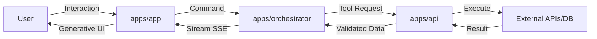

# 📄 SBA-Agentic: Spesifikasi Pengembangan Komprehensif (Smart Business Assistant)

**Versi:** 1.0.0  
**Status:** Draft Spesifikasi GTM  
**Tanggal:** 28 Desember 2025

---

## 1. Task Management

Sistem manajemen tugas ini dirancang untuk memastikan eksekusi teknis yang selaras dengan arsitektur agentic dan multi-tenant.

### 1.1 Daftar Tugas Teknis Utama

| Task ID | Deskripsi Tugas                                       | Prioritas | Dependensi | Penanggung Jawab |
| ------- | ----------------------------------------------------- | --------- | ---------- | ---------------- |
| TM-01   | Konsolidasi Domain Inti (Chat, Knowledge) dengan FSD  | High      | None       | Lead Engineer    |
| TM-02   | Integrasi AG-UI & Reasoning Pipeline (SSE/WS)         | High      | TM-01      | AI Agent Builder |
| TM-03   | Implementasi Multi-tenant RBAC (Owner/Admin/Operator) | High      | None       | Security/Infra   |
| TM-04   | Setup Observability (OTel + Prometheus Metrics)       | Medium    | TM-01      | DevOps/Ops       |
| TM-05   | Pengembangan Self-optimizing Feedback Loop            | Medium    | TM-02      | AI Research/Dev  |
| TM-06   | Integrasi Pembayaran & Billing (Stripe)               | Low       | TM-03      | Backend Dev      |

### 1.2 Timeline & Prioritas

- **P0 (Critical):** Keamanan (RLS), Autentikasi (Supabase), dan Core Chat. (Estimasi: 4 minggu)
- **P1 (High):** Reasoning Engine (Rube), Knowledge Base (RAG), dan Agentic UI. (Estimasi: 6 minggu)
- **P2 (Medium):** Analytics, Monitoring (OTel), dan Automation Workflow. (Estimasi: 8 minggu)

### 1.3 Matriks RACI (Responsibility Assignment)
| Aktivitas | Lead Engineer | AI Developer | DevOps | Product | UI/UX |
|-----------|---------------|--------------|--------|---------|-------|
| Arsitektur Core | **R/A** | **C** | **I** | **I** | **I** |
| Engine Reasoning | **C** | **R/A** | **I** | **C** | **I** |
| Setup Multi-tenancy | **R/A** | **I** | **C** | **I** | **I** |
| Design System | **I** | **I** | **I** | **C** | **R/A** |
| Observability | **C** | **I** | **R/A** | **C** | **I** |

---

## 2. Roadmap Pengembangan

Pendekatan bertahap untuk memastikan stabilitas dan skalabilitas sistem.

### 2.1 Fase Pengembangan

- **Short-term (Q4 2025):** Pembentukan domain core (Chat, Knowledge, Analytics stable). Fokus pada stabilitas infrastruktur monorepo.
- **Mid-term (Q1-Q2 2026):** Integrasi penuh AG-UI, multi-agent reasoning pipeline, dan self-optimizing agentic loop.
- **Long-term (Q3 2026+):** Multi-tenant orchestration skala besar, AI-driven decision intelligence, dan integrasi enterprise (ERP/CRM).

### 2.2 Milestone Utama

1. **M1: Core Infrastructure Ready** (Supabase, Redis, Monorepo Setup).
2. **M2: Agentic reasoning MVP** (Planner-Executor pattern operasional).
3. **M3: Production Readiness** (100% test coverage, a11y compliance, security audit).
4. **M4: GTM Launch** (Release GA untuk tenant enterprise pertama).

### 2.3 Alokasi Sumber Daya

| Fase        | Tim / Peran                      | Fokus Utama                              |
| ----------- | -------------------------------- | ---------------------------------------- |
| **Phase 1** | 2 Backend, 1 Frontend, 1 DevOps  | Infrastruktur, Auth, Core API, RLS Setup |
| **Phase 2** | 2 AI Engineer, 2 Frontend, 1 QA  | Reasoning Engine (Rube), AG-UI, Testing  |
| **Phase 3** | 1 Data Analyst, 1 Product, 1 Ops | Analytics, GTM Prep, Feedback Loop, OTel |

---

## 3. Fitur Utama

Fitur inti yang mendefinisikan SBA-Agentic sebagai AI-Native Business OS.

### 3.1 Fitur Inti & Alur Interaksi

1. **Single Control Plane (apps/app):** Dashboard terpadu untuk monitoring kesehatan sistem, status agen, dan optimasi insight.
2. **Agentic Reasoning UI:** Antarmuka dinamis yang menampilkan langkah-langkah pemikiran agen (Analysis -> Planning -> Execution -> Reflection).
3. **Multimodal Chat Interface:** Mendukung teks, gambar, dan eksekusi tool secara real-time.
4. **Workflow Builder:** Visual builder untuk merancang alur kerja agentic tanpa kode (low-code).
5. **Knowledge Hub:** RAG-based knowledge base dengan kemampuan pembaruan mandiri melalui feedback loop.

### 3.2 Spesifikasi Teknis Implementasi

- **Orchestrator:** Menggunakan `apps/orchestrator` untuk penjadwalan tool dan retry logic.
- **Execution Gateway:** `apps/api` sebagai gerbang eksekusi tool dengan validasi skema YAML.
- **Real-time:** Menggunakan Supabase Realtime dan SSE untuk streaming respon agen.

---

## 4. Ide & Use Case

Skenario nyata yang memberikan nilai bisnis instan melalui implementasi agen cerdas.

### 4.1 Detail Use Case Per Domain

#### **A. Human Resources (HR) & People Ops**
- **Persona:** HR Manager, People Ops Specialist.
- **Skenario:** "Autonomous Recruiting & Onboarding". Agen mengelola siklus hidup kandidat dari screening awal hingga hari pertama kerja.
- **Value Proposition:** Reduksi 70% waktu administrasi rekrutmen dan standarisasi kualitas onboarding lintas departemen.
- **Implementasi Konkret:**
    - Agen melakukan screening CV berdasarkan kriteria teknis dan kultural.
    - Menjadwalkan interview otomatis dengan sinkronisasi kalender tim.
    - Mengirimkan paket onboarding digital (SOP, akses akun, jadwal mentoring) secara otomatis setelah kontrak ditandatangani.

#### **B. Marketing & Growth Intelligence**
- **Persona:** Marketing Lead, Growth Hacker, Content Strategist.
- **Skenario:** "Hyper-Personalized Campaign Orchestrator". Agen melakukan riset pasar real-time dan menyusun strategi kampanye yang adaptif.
- **Value Proposition:** Peningkatan konversi hingga 25% melalui pesan yang sangat relevan dan optimasi budget iklan berbasis data.
- **Implementasi Konkret:**
    - Agen memantau tren di media sosial dan kompetitor (Market Monitoring).
    - Menghasilkan draf konten promosi (email, ad copy) yang disesuaikan dengan segmen audiens tertentu.
    - Melakukan A/B testing pada headline dan visual secara otonom untuk menemukan performa terbaik.

#### **C. Finance & Accounting Automation**
- **Persona:** CFO, Finance Controller, Accountant.
- **Skenario:** "Intelligent Financial Reporting & Anomaly Detection". Agen mengawasi arus kas dan kepatuhan finansial secara proaktif.
- **Value Proposition:** Eliminasi kesalahan manusia dalam pelaporan dan deteksi dini risiko finansial atau kecurangan (fraud).
- **Implementasi Konkret:**
    - Rekonsiliasi otomatis invoice dengan mutasi bank menggunakan OCR.
    - Pembuatan laporan keuangan bulanan (P&L, Balance Sheet) yang siap direview.
    - Notifikasi instan jika ditemukan transaksi anomali atau pengeluaran yang melebihi budget departemen.

#### **D. Customer Support & Experience (CX)**
- **Persona:** Customer Success Manager, Support Lead.
- **Skenario:** "24/7 Multi-Agent Support Copilot". Sistem agen yang mampu menyelesaikan masalah teknis tanpa campur tangan manusia.
- **Value Proposition:** CSAT (Customer Satisfaction Score) yang lebih tinggi dan ketersediaan dukungan global tanpa menambah headcount.
- **Implementasi Konkret:**
    - Agen menyelesaikan tiket bantuan dengan mencari solusi di Knowledge Hub.
    - Melakukan eskalasi cerdas ke tim manusia jika masalah terlalu kompleks (confidence < 0.7).
    - Memberikan ringkasan kasus (summary) kepada agen manusia saat serah terima (handover).

### 4.2 Proposisi Nilai Global (Value Proposition)
- **Efisiensi Tanpa Batas:** Mengurangi beban administratif hingga 60%, memungkinkan fokus pada strategi bisnis.
- **Akurasi Data:** Menjamin integritas data melalui validasi otomatis dan pemrosesan data cerdas.
- **Skalabilitas Otonom:** Menangani ribuan tugas sekaligus tanpa penambahan sumber daya manusia secara linier.

---

## 5. Acceptance Criteria & Route to Screen

Standar kualitas untuk setiap interaksi pengguna.

### 5.1 Kriteria Penerimaan (Definition of Done)

- Semua aksi agen harus dapat direplay (auditability).
- Keputusan agen wajib menghasilkan meta-event untuk pelacakan.
- Confidence score < 0.7 wajib memicu intervensi manusia (Human-in-the-loop).
- UI harus menjelaskan _mengapa_ (reasoning) suatu tindakan diambil.

### 5.2 User Journey & Navigation
- **Login Flow:** Auth via Supabase -> Tenant Selection -> Dashboard Utama.
- **Agent Interaction:** Dashboard -> Chat Window -> Reasoning Step Visualization -> Action Execution.
- **Workflow Creation:** Sidebar -> Workflow Builder -> Drag & Drop Nodes -> Test Run -> Deploy.

### 5.3 Penanganan Error & Edge Cases
- **Low Confidence Recovery:** Jika `confidence_score < 0.7`, sistem otomatis menjeda eksekusi dan meminta input klarifikasi dari user.
- **Tool Execution Failure:** Mekanisme *retry* otomatis hingga 3 kali dengan *exponential backoff* sebelum melaporkan kegagalan ke user.
- **Rate Limit Handling:** Notifikasi proaktif jika kuota API tool eksternal hampir habis atau terkena *rate limit*.
- **Data Validation Error:** Validasi skema input/output di level `apps/api` untuk mencegah korupsi data.

---

## 6. Domain Bisnis

Pemetaan kebutuhan spesifik industri.

### 6.1 Kategori Utama

- **BPA (Business Process Automation):** Fokus pada efisiensi proses berulang.
- **CX (Customer Interaction):** Personalisasi pengalaman pelanggan.
- **DA (Data Analysis & Reporting):** Insight berbasis data real-time.
- **SI (System Integration):** Konektivitas ekosistem enterprise.

### 6.2 Metrik Keberhasilan Bisnis
- **Efficiency Gain:** Reduksi waktu proses tugas manual (target > 40%).
- **Accuracy Rate:** Tingkat keberhasilan eksekusi agen (target > 95%).
- **User Adoption:** Tingkat penggunaan aktif harian (DAU) pada platform.

### 6.3 Analisis Dampak Bisnis
- **Reduksi OPEX:** Pengurangan biaya operasional yang signifikan melalui otomasi tugas administratif.
- **Peningkatan Kapasitas:** Perusahaan dapat menangani volume kerja yang lebih tinggi tanpa menambah headcount.
- **Kualitas Keputusan:** Keputusan yang lebih cepat dan berbasis data melalui analitik prediktif dan intelijen bisnis.

---

## 7. UI/UX Guidelines

Prinsip desain untuk antarmuka agentic yang intuitif.

### 7.1 Design System (Atomic Design)

- **Atoms:** Button, Input, Badge (Generic components).
- **Molecules:** SearchBar, StatusCard, ChatBubble.
- **Organisms:** Sidebar, Header, ReasoningPanel, KPI-Dashboard.
- **Templates:** DashboardLayout, ChatLayout.

### 7.2 Prinsip Interaksi
- **Clarity & Focus:** Hilangkan gangguan visual yang tidak perlu.
- **Immediate Feedback:** Setiap aksi agen harus memberikan respon visual seketika.
- **Accessibility:** Kepatuhan WCAG 2.1 AA untuk semua komponen UI.

### 7.3 Prototype & Usability Testing
- **Internal Pilot:** Pengujian mingguan oleh tim internal untuk memvalidasi alur navigasi.
- **Usability Lab:** Sesi pengujian terarah dengan persona target untuk mengidentifikasi hambatan UX.
- **Heatmap Analysis:** Penggunaan alat analitik (apps/web) untuk memantau perilaku klik dan durasi interaksi user.

---

## 8. Functional Requirements

Arsitektur teknis dan standar keamanan yang mendukung operasional skala enterprise.

### 8.1 Arsitektur Sistem

- **Monorepo:** Turborepo + pnpm workspaces untuk manajemen dependensi terpusat.
- **Frontend Framework:** Next.js (App Router) dengan pola **Feature-Sliced Design (FSD)**.
- **UI Architecture:** Atomic Design (Atoms -> Molecules -> Organisms -> Templates).
- **Backend Service:** NestJS untuk `apps/orchestrator` (orkestrasi tool) dan `apps/api` (gateway).
- **Database & Auth:** Supabase (PostgreSQL, Auth, Storage) dengan integrasi **Upstash Redis** untuk caching dan rate-limiting.
- **Real-time Communication:** Protokol **SSE (Server-Sent Events)** dan WebSockets untuk streaming reasoning agen secara real-time.

### 8.2 Security & Data Protection
- **Multi-tenancy:** Isolasi data tingkat tinggi menggunakan **Row Level Security (RLS)** Supabase berbasis `tenant_id`.
- **RBAC (Role-Based Access Control):** Definisi peran standar: `Owner`, `Admin`, `Operator`, dan `Viewer`.
- **Secret Management:** Enkripsi rahasia API; agen hanya memiliki akses ke tool yang divalidasi melalui gateway.
- **Observability:** Implementasi **OpenTelemetry (OTel)** untuk tracing dan **Prometheus** untuk metrik performa (latency p95/p99).
- **Audit Trail:** Logging komprehensif untuk setiap keputusan agen (Analysis -> Reflection) untuk transparansi penuh.

### 8.3 Diagram Alur Data & Spesifikasi API

- **RESTful API:** Gateway `apps/api` mengekspos endpoint terproteksi untuk eksekusi tool.
- **SSE Endpoints:** Streaming reasoning agen tersedia melalui `/api/agent/stream`.
- **Schema Registry:** Semua input/output tool wajib terdaftar di `packages/rube/schemas`.

---

## 9. Go-To-Market (GTM) Strategy

Strategi kompetitif untuk peluncuran produk.

### 9.1 Analisis Kompetitif & Diferensiasi

| Kompetitor                     | Kelemahan                                        | Diferensiasi SBA-Agentic                                                           |
| ------------------------------ | ------------------------------------------------ | ---------------------------------------------------------------------------------- |
| Chatbot Tradisional            | Statis, tidak bisa mengambil keputusan otonom.   | **Agentic:** Mampu melakukan dekomposisi tugas kompleks secara mandiri.            |
| Platform Otomasi (Zapier/Make) | Berbasis aturan (rule-based) yang kaku.          | **Dynamic Workflow:** Alur kerja yang beradaptasi dengan konteks bisnis real-time. |
| AI Assistant Umum              | Kurang konteks bisnis & isolasi data enterprise. | **Enterprise-Grade:** Multi-tenant, RLS, dan memori operasional kolektif.          |

### 9.2 Positioning & Value Proposition

- **Positioning:** "Operating System Bisnis AI-Native Pertama".
- **Value Proposition:** "Mentransformasi proses bisnis manual menjadi alur kerja cerdas yang otonom, aman, dan dapat diaudit sepenuhnya."

### 9.3 Strategi Peluncuran & Adopsi

- **Beta Phase:** Pengujian tertutup dengan 5-10 partner enterprise terpilih untuk validasi use-case nyata.
- **Growth Phase:** Ekspansi ke pasar SaaS menengah dengan template use-case siap pakai (HR, Finance, Support).
- **Ecosystem Phase:** Membuka SDK untuk developer pihak ketiga membangun "Agent Skills" di marketplace internal.

### 9.4 Rencana Pengukuran Keberhasilan

- **KPI Teknis:** 99.9% uptime, < 2s latency untuk intent detection, 100% auditability.
- **KPI Bisnis:** > 30% reduksi biaya operasional tenant, > 80% user satisfaction score (CSAT).

---

## 10. Pendekatan Agentic (Core Philosophy)

SBA-Agentic dibangun dengan filosofi "Agent-First", di mana setiap tugas diproses melalui siklus kognitif yang terstruktur.

### 10.1 Siklus Penalaran (Reasoning Cycle)
Setiap agen wajib mengikuti pola **ReasoningStep** untuk menjamin transparansi dan akurasi:
1.  **Analysis:** Memahami intent pengguna, konteks tenant, dan batasan (constraints) sistem.
2.  **Planning:** Mendekomposisi tugas kompleks menjadi langkah-langkah deterministik (JSON format).
3.  **Validation:** Memverifikasi rencana terhadap aturan bisnis (Rube) dan kebijakan keamanan.
4.  **Execution:** Menjalankan aksi melalui **Rube Tool Layer** (Execution Gateway).
5.  **Reflection:** Mengevaluasi hasil eksekusi, mencatat keberhasilan/kegagalan, dan memperbarui memori operasional.

### 10.2 Taksonomi & Koordinasi Multi-Agent
Sistem menggunakan orkestrasi antar peran agen yang berbeda:
- **PlannerAgent:** Bertanggung jawab atas dekomposisi tugas dan pembuatan rencana aksi.
- **ExecutorAgent:** Fokus pada eksekusi teknis tool dan integrasi API.
- **ObserverAgent:** Melakukan audit real-time, deteksi anomali, dan penjagaan guardrails.
- **ReviewerAgent:** Menangani intervensi manusia (Human-in-the-loop) untuk keputusan berisiko tinggi.

### 10.3 Mekanisme Self-Learning
- **Feedback Loop:** `FeedbackLoopService` mengumpulkan metrik performa (latensi, success rate) untuk penyesuaian parameter agen secara dinamis.
- **Contextualization:** Penggunaan `tenant_context` dan `contextSnapshot` untuk memastikan setiap tindakan agen relevan dengan domain bisnis spesifik pengguna.
- **Scalability & Extensibility:** Arsitektur modular yang memungkinkan penambahan "Agent Skills" baru tanpa memodifikasi core engine.

---

## 11. Evaluasi Arsitektur & Rencana Skalabilitas (As-Is vs To-Be)

Untuk memastikan kesuksesan peluncuran pasar, SBA-Agentic harus bertransformasi dari sistem berbasis monorepo tunggal menjadi infrastruktur yang siap skala enterprise.

### 11.1 Evaluasi Kondisi Saat Ini (As-Is)
- **Monorepo Architecture:** Menggunakan Turborepo untuk manajemen paket, namun dependensi antara `apps/orchestrator` (logic engine) dan `packages/rube` (tool definitions) masih sangat erat, membatasi independensi deployment.
- **State Management:** `OrchestratorEngine` saat ini menyimpan state eksekusi (plan steps, current status) di dalam memori proses. Hal ini menyebabkan hilangnya state jika instance restart dan mencegah horizontal scaling (sticky session requirement).
- **Execution Security:** Meskipun ada validasi peran (RBAC), eksekusi tool masih berjalan di konteks proses yang sama dengan gateway, yang berisiko jika tool pihak ketiga memiliki celah keamanan.
- **Observability Gap:** Penelusuran (tracing) belum mencakup siklus "Reflection" secara mendalam, sehingga sulit untuk mendiagnosa mengapa agen mengambil keputusan tertentu yang salah.

### 11.2 Target Arsitektur Masa Depan (To-Be)
- **Stateless & Distributed Orchestration:**
    - Memindahkan state eksekusi ke **Upstash Redis** dengan skema *distributed locking*.
    - Memungkinkan orkestrator berjalan secara *serverless* atau di beberapa kontainer sekaligus.
- **Enhanced Tool Sandboxing:**
    - Implementasi **Isolated V8 Environments** untuk menjalankan handler tool.
    - Setiap eksekusi tool diisolasi dari resource sistem utama, hanya memiliki akses ke API yang diberikan secara eksplisit.
- **Scoped Tool Tokens:**
    - Penggunaan JWT berumur pendek (TTL < 5 menit) yang dihasilkan secara dinamis untuk setiap panggilan tool.
    - Token hanya berisi izin (`scopes`) untuk resource yang dibutuhkan oleh tool tersebut (prinsip *Least Privilege*).
- **Unified & Immutable Audit Ledger:**
    - Log audit disimpan di database terpisah dengan kebijakan *append-only* dan enkripsi pada tingkat record untuk kepatuhan SOC2/GDPR.

### 11.3 Rencana Keamanan (Security Hardening)
1. **Zero Trust Integration:** Implementasi mTLS (mutual TLS) untuk komunikasi antar service internal.
2. **Recursive PII Masking:** Middleware otomatis di `apps/api` yang mendeteksi dan menyamarkan data sensitif (NIK, Email, Phone) dalam payload request/response sebelum logging.
3. **Anomaly Detection Engine:** `ObserverAgent` yang memantau pola panggilan API yang tidak biasa (misal: eksekusi tool massal di luar jam kerja) dan melakukan pemutusan otomatis.

---

## 12. Strategi Peluncuran Pasar & Roadmap Produk

Fokus pada pencapaian *Product-Market Fit* melalui eksekusi strategis yang terukur, mengacu pada [GTM_STRATEGY.md](../01-product/GTM_STRATEGY.md).

### 12.1 Analisis Target Pasar & Diferensiasi
- **Diferensiasi:** Dibandingkan dengan Zapier/Make, SBA-Agentic menawarkan "Autonomous Reasoning" (bukan sekadar linear triggers). Dibandingkan dengan ChatGPT, SBA-Agentic memiliki "Operational Memory" dan integrasi native dengan tool bisnis yang aman.
- **Target Utama:** Perusahaan dengan proses HR/Finance yang kompleks dan membutuhkan audit trail ketat.

### 12.2 Roadmap Produk (Phased Approach)
- **Fase 1 (Alpha/Beta):** Stabilisasi core engine, implementasi 3 domain utama (HR, Finance, Ops), dan integrasi Supabase RLS secara penuh.
- **Fase 2 (Growth):** Peluncuran Marketplace Skills, SDK untuk developer eksternal, dan integrasi dengan ekosistem enterprise (SAP, Salesforce).
- **Fase 3 (Scale):** Deployment on-premise, sertifikasi industri, dan orkestrasi multi-cloud.

---

## 13. Implementasi Fitur Inti: HR & People Ops

Fokus pada transformasi proses rekrutmen dan onboarding menjadi alur kerja yang otonom dan personal.

### 13.1 Alur Kerja: Employee Onboarding (Automated)
Proses ini dirancang menggunakan `hr.onboarding.initiate` tool dan koordinasi antar agen.

**A. Skenario Penggunaan:**
"Kandidat John Doe telah menandatangani kontrak. Mulai proses onboarding untuk departemen Engineering mulai tanggal 15 Januari."

**B. Alur Kerja Agentic:**
1.  **PlannerAgent:** Mendeteksi intent onboarding -> Mencari data John Doe di sistem rekrutmen -> Membuat rencana onboarding (Setup email, IT equipment, Welcome package).
2.  **ExecutorAgent:** 
    - Memanggil `hr.onboarding.initiate` dengan parameter `employeeId`, `firstName`, `lastName`, `startDate`, dan `department`.
    - Mengirimkan email sambutan otomatis melalui `notification.send_email`.
    - Membuat tiket permintaan perangkat di IT via `workflow.approval_request`.
3.  **ObserverAgent:** Memantau setiap langkah eksekusi tool untuk memastikan tidak ada kebocoran data (PII masking) dan mencatat log audit.
4.  **Reflection:** Jika ada kegagalan (misal: stok laptop habis di ERP), agen akan memberikan saran alternatif kepada HR Admin (ReviewerAgent).

### 13.2 Spesifikasi Teknis (HR Domain)
- **Tool ID:** `hr.onboarding.initiate`
- **Security:** `tenant_scope: isolated`, `guards: [enforce_tenant, audit_log]`
- **Validation:** Skema parameter ketat menggunakan JSON Schema untuk `employeeId` dan `startDate`.
- **UI Interaction:** Dashboard onboarding yang menampilkan progress bar real-time yang diupdate via SSE dari `apps/orchestrator`.

---

## 14. Functional Requirements & Security

### 14.1 Persyaratan Sistem & Skalabilitas
- **Database:** PostgreSQL (Supabase) dengan ekstensi `pgvector` untuk pencarian semantik di Knowledge Hub.
- **Messaging:** Redis/Upstash untuk antrian tugas (`BullMQ`) dan caching state orkestrator.
- **Runtime:** Node.js (TypeScript) dengan Turborepo untuk manajemen monorepo.

### 14.2 Keamanan Data & Compliance
- **Isolasi Multi-tenant:** Setiap query database wajib melalui kebijakan RLS (Row Level Security) berdasarkan `tenant_id`.
- **Encryption:** Enkripsi data sensitif (at rest) menggunakan AES-256 dan (in transit) menggunakan TLS 1.3.
- **Auditability:** Setiap aksi yang diambil oleh agen harus memiliki `reasoning_trace` yang tersimpan secara permanen.

---

15. **Acceptance Criteria & Quality Gates**
- **Test Coverage:** Minimal 80% untuk paket inti.
- **Latency:** < 2 detik untuk deteksi intent awal.
- **Accuracy:** > 90% keberhasilan tugas pada benchmark use-case standar.

---
_Dokumen ini bersifat dinamis dan akan terus diperbarui seiring dengan perkembangan teknis SBA-Agentic._
