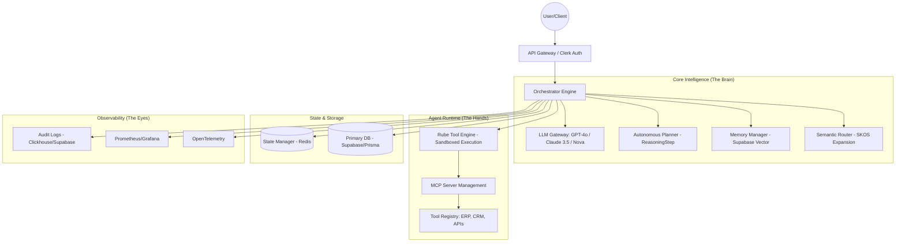

# 🧠 SBA-Agentic Master Specification (Smart Business Assistant)

**Version:** 2.3.0 | **Status:** Active | **Last Updated:** 2025-12-29

---

## 📌 PART I: EXECUTIVE OVERVIEW

### 1. Visi dan Misi SBA-Agentic

#### 1.1 Visi
Menjadi **"Sistem Saraf Digital" (Digital Nervous System)** bagi *Agentic Enterprise* masa depan yang mengintegrasikan secara mulus tenaga kerja manusia dan digital (*Silicon + Carbon Workforce*). Kami membayangkan ekosistem di mana SBA-Agentic bertindak sebagai mitra proaktif yang mampu memahami intensi strategis, mengelola memori jangka panjang organisasi, dan mengeksekusi misi bisnis secara otonom dalam koridor etika dan keamanan yang ketat.

#### 1.2 Misi
1.  **Akselerasi Agentic Enterprise**: Mentransformasi bisnis tradisional menjadi organisasi berbasis agen yang adaptif dan skalabel melalui infrastruktur AI otonom.
2.  **Sinergi Silicon + Carbon**: Menciptakan harmoni kolaborasi di mana agen AI menangani kompleksitas data dan eksekusi rutin, membebaskan manusia untuk fokus pada kreativitas, empati, dan pengambilan keputusan strategis.
3.  **Otonomi Berbasis Tujuan (Goal-Oriented Autonomy)**: Mengembangkan agen yang tidak hanya mengikuti instruksi, tetapi mampu melakukan penalaran tingkat tinggi (*High-level Reasoning*) untuk mencapai hasil akhir yang diinginkan.
4.  **Infrastruktur Kepercayaan (Trust Infrastructure)**: Membangun standar emas dalam keamanan AI, mencakup privasi data otonom, auditabilitas transparan, dan kedaulatan informasi tenant.
5.  **Interoperabilitas Universal**: Menghapus sekat-sekat aplikasi melalui integrasi dinamis berbasis **Model Context Protocol (MCP)**, memungkinkan agen berinteraksi dengan alat apa pun secara instan.

---

### 2. Business Value & Use Cases

SBA-Agentic mengadopsi model **Hybrid Workforce (Silicon + Carbon)**, di mana agen menangani proses terdefinisi sementara manusia fokus pada tata kelola (governance) dan inovasi.

#### 2.1 Persona Target & Value Proposition
-   **The Efficiency Seeker (Operations)**: Reduksi tugas manual rutin hingga 80% melalui orkestrasi alur kerja otonom.
-   **The Data-Driven Exec (Leadership)**: Ringkasan eksekutif dan wawasan real-time dari jutaan titik data tanpa intervensi manual.
-   **The Security Guardian (IT/Security)**: Kontrol akses agen granular dan perlindungan PII otomatis.

#### 2.2 Domain-Specific Use Cases (2025-2026 Edition)

| Domain | Skenario Nyata | Kapabilitas Agentic | Value Driven |
| :--- | :--- | :--- | :--- |
| **HR & People** | **Onboarding Otonom** | Orchestrator mengoordinasikan pembuatan kontrak, setup IT, dan penjadwalan mentor. | 90% reduksi waktu admin HR. |
| **Sales & Revenue** | **Lead Activation & SDR** | Agen melakukan riset LinkedIn, mengirim email personalisasi, dan memicu workflow CRM. | 3x peningkatan rasio meeting. |
| **Logistics** | **Dynamic Supply Chain** | Deteksi *bottleneck* pengiriman secara real-time dan re-routing otomatis via API ekspedisi. | Optimalisasi biaya logistik 15%. |
| **Finance** | **Autonomous Auditing** | Verifikasi invoice otomatis, rekonsiliasi bank, dan deteksi penipuan berbasis pola. | Eliminasi kesalahan manusia. |
| **IT Ops** | **Self-Healing Infra** | Observability terintegrasi yang memicu perbaikan otomatis pada kegagalan layanan mikro. | 99.99% Availability. |

#### 2.3 Deep Dive: Onboarding Otonom Flow
Berikut adalah visualisasi bagaimana `ReasoningStep` bekerja dalam skenario HR:
1.  **Analysis**: Agen menerima event `candidate.hired`. Ia mengidentifikasi kebutuhan: Kontrak, Email, Akses Slack, dan Jadwal Meeting.
2.  **Planning**: Agen membuat rencana:
    - `Step 1`: Generate kontrak menggunakan template `HR-001`.
    - `Step 2`: Kirim kontrak via DocuSign API.
    - `Step 3`: Tunggu tanda tangan (status: `waiting_tool`).
    - `Step 4`: Setelah ditandatangani, buat akun Google Workspace & Slack.
3.  **Execution**: Agen memanggil handler `document.extract_data` dan `notification.send_email`.
4.  **Reflection**: Agen mencatat keberhasilan dan memperbarui status onboarding di dashboard HR.

#### 2.4 Deep Dive: Sales Lead Activation
Skenario di mana agen bertindak sebagai Sales Development Representative (SDR):
1.  **Trigger**: Event `lead.created` dari HubSpot CRM.
2.  **Research Phase**: Agen memanggil `knowledge.search` untuk mencari berita terbaru tentang perusahaan calon klien.
3.  **Personalization**: Agen menggunakan LLM untuk menyusun pesan yang relevan dengan masalah yang dihadapi perusahaan klien tersebut.
4.  **Omnichannel Outreach**: Agen mengirimkan email (Resend) dan pesan LinkedIn (via MCP integration).
5.  **Autonomous Follow-up**: Jika tidak ada respon dalam 3 hari, agen menganalisis sentimen email sebelumnya dan mengirimkan tindak lanjut yang lebih spesifik.

---

### 3. Roadmap Pengembangan (Strategic Path)

#### 🏁 Fase 1: Foundation Strengthening (Q1-Q2 2026)
- **Core Engine GA**: Peluncuran Rube Engine dengan dukungan penuh `ReasoningStep`.
- **MCP Hub**: Integrasi dengan 50+ server MCP populer (Postgres, GitHub, Slack, etc.).
- **Security V1**: Implementasi PII Masking dan Immutable Audit Logs tingkat enterprise.

#### 📈 Fase 2: Advanced Reasoning & Memory (Q3-Q4 2026)
- **Long-term Organization Memory**: Agen mampu mengingat keputusan bisnis tahun lalu untuk memberikan konteks saat ini.
- **Multi-agent Swarm Orchestration**: Kemampuan untuk menjalankan misi kompleks yang melibatkan >3 agen spesialis.
- **Cross-Tenant Knowledge Transfer**: (Opsional/Opt-in) Berbagi pola solusi anonim antar tenant untuk meningkatkan akurasi.

#### 🧠 Fase 3: The Autonomous Enterprise (2027+)
- **Agentic Economy**: Agen memiliki dompet digital (*Agentic Wallets*) untuk membayar API atau layanan pihak ketiga secara mandiri.
- **Self-Evolving Systems**: Agen mampu menulis dan melakukan deployment perbaikan kode mereka sendiri (dalam lingkungan sandbox).
- **Global Governance Standard**: SBA-Agentic menjadi referensi standar industri untuk etika dan keamanan AI otonom.

---

## 🛠️ PART II: TECHNICAL SPECIFICATION

### 4. Arsitektur Sistem (Agentic Architecture)

SBA-Agentic menggunakan arsitektur **Micro-Orchestration** yang mengutamakan skalabilitas, keamanan, dan *Observability*.

#### 4.1 Diagram Arsitektur Tingkat Tinggi

#### 4.2 Scalability & Performance
- **Stateless Orchestration**: Orchestrator dirancang *stateless* untuk memungkinkan scaling horizontal tak terbatas. State sesi dikelola sepenuhnya di Redis Cluster.
- **Sandboxed Execution**: Menggunakan teknologi isolasi (e.g., gVisor atau WebAssembly) untuk menjalankan kode alat secara aman tanpa risiko eskalasi hak akses.
- **Edge Deployment**: Kemampuan untuk menjalankan agen ringan di edge node untuk mengurangi latensi dalam interaksi real-time.

### 5. Komponen Inti (Core Components)

#### 5.1 Orchestrator Engine (Rube Engine)
Pusat kendali yang mengelola lifecycle agen, mulai dari interpretasi pesan hingga resolusi tugas.
- **Reasoning Policy**: Mengikuti pola `Analysis -> Planning -> Validation -> Execution -> Reflection`.
- **Confidence Scoring**: Ambang batas minimal 0.7 untuk eksekusi otonom; di bawah itu memerlukan HITL (Human-in-the-loop).

#### 5.2 ReasoningStep Framework
Framework internal untuk dekomposisi tugas kompleks menjadi sub-tugas yang dapat dikelola.
- **Step Analysis**: Mengidentifikasi intent, parameter, dan dependensi.
- **Plan Generation**: Menghasilkan urutan aksi dalam format JSON yang valid terhadap skema `Rube`.
- **Reflection Loop**: Mengevaluasi output setiap langkah dan menyesuaikan rencana secara dinamis.

#### 5.3 Memory & Context Management
- **Short-term Memory**: State sesi aktif yang disimpan di Redis.
- **Long-term Memory**: Penyimpanan vektor (Supabase Vector) dengan dukungan **pgvector** untuk pencarian semantik tingkat lanjut.
- **SKOS Semantic Expansion**: Memperluas query pengguna menggunakan taksonomi bisnis untuk hasil pencarian memori yang lebih relevan.
- **Summarization Pipeline**: Kompresi otomatis history chat panjang tanpa kehilangan konteks krusial.

#### 5.4 Tool Gateway & MCP Integration
- **Model Context Protocol (MCP)**: Standar terbuka yang memisahkan logika agen dari implementasi alat. SBA-Agentic mendukung:
    - **MCP Servers**: Host lokal atau remote yang menyediakan alat (tools) dan sumber daya (resources).
    - **Dynamic Discovery**: Agen dapat mencari dan mempelajari kapabilitas alat baru secara runtime melalui file `mcp-config.json`.
- **Action Handlers Catalog**: Daftar kapabilitas yang dapat dieksekusi (e.g., `db.upsert_record`, `notification.send_email`).
- **Domain Events Catalog**: Sistem pub/sub berbasis event (e.g., Kafka atau RabbitMQ) untuk memicu aksi agen.

#### 5.5 Multi-agent Swarms (Agent Coordination)
SBA-Agentic mendukung orkestrasi beberapa agen spesialis yang bekerja sama:
- **Planner Agent**: Bertanggung jawab atas dekomposisi tugas dan strategi.
- **Executor Agent**: Fokus pada interaksi alat dan penanganan error teknis.
- **Observer Agent**: Memantau kepatuhan (*compliance*) dan keamanan secara real-time.
- **Reviewer Agent**: Bertindak sebagai proxy untuk persetujuan manusia (*Human Approval*).
- **Coordination Protocol**: Menggunakan mekanisme *Blackboard Architecture* di mana agen berbagi informasi melalui state bersama.

### 6. Standar Keamanan & Privasi Data

#### 6.1 Multi-Tenancy Isolation
- **Tenant Context Contract**: Memastikan data antar tenant tidak pernah tercampur melalui level isolasi Row Level Security (RLS) di Postgres dan prefixing di Redis.
- **Workspace-level RBAC**: Kontrol akses berbasis peran yang ketat untuk setiap aset dan alat agen.

#### 6.2 Perlindungan Data Sensitif
- **Automated PII Masking**: Deteksi dan penyamaran otomatis informasi pribadi (email, nomor telepon, alamat) sebelum data dikirim ke LLM eksternal.
- **Data Sovereignty**: Dukungan untuk deployment on-premise atau private cloud untuk data yang sangat sensitif.

#### 6.3 Audit & Transparansi
- **Immutable Audit Logs**: Setiap langkah penalaran (Reasoning Chain) dan eksekusi alat dicatat secara permanen di Clickhouse/Supabase, memastikan transparansi penuh.
- **Explainable AI (XAI)**: Agen wajib menyertakan atribut `reasoning_path` dalam setiap output, memungkinkan manusia memahami logika di balik setiap keputusan.
- **Drift Detection**: Observer Agent secara otomatis mendeteksi jika perilaku agen mulai menyimpang dari kebijakan Rube yang ditentukan.

### 7. Integrasi Platform Bisnis (The Ecosystem)

SBA-Agentic dirancang untuk menjadi pusat saraf yang terhubung ke:
- **Communication**: Slack, Microsoft Teams, WhatsApp Business API.
- **Productivity**: Google Workspace, Microsoft 365, Notion.
- **Sales & Marketing**: Salesforce, HubSpot, Mailchimp.
- **Operations & ERP**: SAP, Odoo, Oracle Netsuite.
- **Development**: GitHub, GitLab, Jira.

---

## 🚀 PART III: IMPLEMENTATION & QUALITY ASSURANCE

### 8. Metrik Keberhasilan & KPI

| Kategori | Metrik | Target | Definisi |
| :--- | :--- | :--- | :--- |
| **Performance** | Task Completion Rate | > 95% | Persentase misi yang diselesaikan tanpa intervensi manual. |
| **Efficiency** | Time Saved per User | > 10 jam/minggu | Estimasi waktu manual yang digantikan oleh aksi agen. |
| **Accuracy** | Hallucination Rate | < 2% | Frekuensi agen memberikan informasi yang tidak akurat atau fiktif. |
| **Security** | Security Incidents | 0 | Jumlah kebocoran data atau akses alat yang tidak sah. |
| **Reliability** | System Uptime | 99.9% | Ketersediaan infrastruktur Orchestrator dan Tool Gateway. |

### 9. Panduan Implementasi Praktis

#### 9.1 Development Workflow
1.  **Define Domain**: Tentukan domain bisnis dan use case menggunakan template YAML.
2.  **Register Tools**: Daftarkan API dan fungsi yang diperlukan ke Tool Registry via MCP.
3.  **Configure Rube Rules**: Buat aturan kebijakan (YAML) untuk memandu perilaku agen.
4.  **Test & Iterate**: Gunakan simulator untuk menguji skenario dan feedback loop.

#### 9.2 Deployment Strategy
- **Blue-Green Deployment**: Untuk pembaruan engine tanpa downtime.
- **Canary Releases**: Meluncurkan fitur agen baru ke subset tenant untuk validasi.

---

### 10. Glosarium (Glossary)
- **Agentic AI**: Sistem AI yang mampu mengejar tujuan secara otonom dengan merencanakan dan menjalankan langkah-langkah secara mandiri.
- **MCP (Model Context Protocol)**: Standar terbuka untuk menghubungkan model AI dengan sumber data dan alat eksternal.
- **Rube Engine**: Mesin orkestrasi internal SBA-Agentic yang mengelola logika penalaran dan eksekusi.
- **ReasoningStep**: Framework dekomposisi tugas yang membagi misi besar menjadi langkah-langkah kecil yang dapat dikelola.
- **HITL (Human-in-the-loop)**: Mekanisme di mana manusia meninjau atau menyetujui aksi agen sebelum dieksekusi.
- **Silicon + Carbon Workforce**: Konsep tenaga kerja masa depan yang menggabungkan kemampuan digital (AI) dan manusia secara sinergis.

### 11. Referensi & Sumber Penelitian

- [Salesforce: The Agentic Enterprise](https://architect.salesforce.com/fundamentals/agentic-enterprise-it-architecture)
- [AWS: Agentic AI Solutions](https://aws.amazon.com/ai/agentic-ai/)
- [UiPath: Agentic Automation Security](https://www.uipath.com/platform/agentic-automation/foundation)
- [Model Context Protocol (MCP) Specification](https://modelcontextprotocol.io)
- [NexaStack: Private AI Assistant Blueprint](https://www.nexastack.ai/blueprints/private-ai-assistant/)

---

## 📄 Lampiran: Versi Teknis Mendetail

Untuk dokumentasi teknis yang lebih mendalam, silakan merujuk pada:
- [Arsitektur Sistem (Detail)](file:///home/inbox/smart-ai/sba-agentic/docs/02-architecture/README.md)
- [API Reference](file:///home/inbox/smart-ai/sba-agentic/apps/api/README_API.md)
- [Rube Engine Specification](file:///home/inbox/smart-ai/sba-agentic/apps/orchestrator/README.md)
- [Agentic Reasoning Policy](file:///home/inbox/smart-ai/sba-agentic/.trae/rules/agent-reasoning.md)
