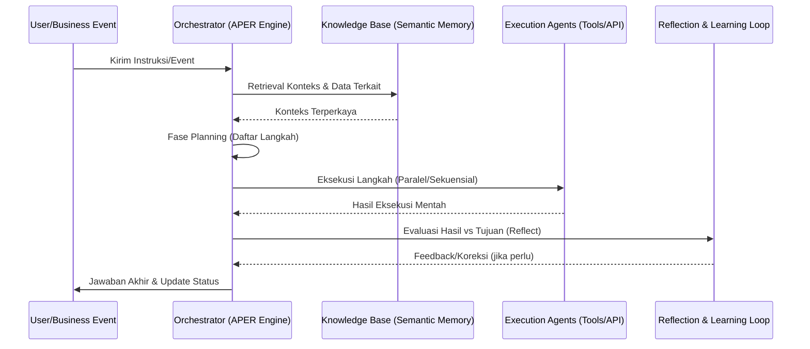

# 🧠 SBA-Agentic Production Implementation Index (Smart Business Assistant)

**Version:** 2.3.0 | **Status:** Production Ready (Active) | **Last Updated:** 2025-12-29
**Lead Architect:** SuperAgent | **Environment:** Enterprise Multi-Tenant

---

## 📌 1. Pendahuluan & Visi Operasional

Indeks ini berfungsi sebagai pusat kendali otoritatif untuk implementasi **SBA-Agentic (Smart Business Assistant)** ke lingkungan produksi. Dokumen ini menyatukan strategi arsitektur, kapabilitas inti, dan metrik keberhasilan untuk memastikan transisi yang mulus dari pengembangan ke operasional bisnis skala besar.

### 1.1 Visi "Digital Nervous System"
SBA-Agentic dirancang sebagai infrastruktur otonom yang mengintegrasikan tenaga kerja manusia (Carbon) dan agen AI (Silicon). Tujuannya adalah menciptakan ekosistem bisnis yang adaptif, transparan, dan sangat efisien melalui orkestrasi multi-agent.

### 1.2 Prinsip Desain Utama
- **Agentic > Rule-based**: Keputusan adaptif dalam koridor aturan bisnis untuk menghindari "scope creep" dan ketergantungan pada instruksi statis.
- **Event-Driven Resilience**: Arsitektur berbasis event (EDA) yang memungkinkan respons real-time terhadap dinamika pasar dan operasional.
- **Security-First (Zero Trust)**: Isolasi data tenant yang ketat menggunakan Row-Level Security (RLS) dan enkripsi end-to-end.
- **Explainable Reasoning (XAI)**: Transparansi penuh pada proses berpikir AI untuk membangun kepercayaan pengguna dan memudahkan audit operasional.

---

## 🏛️ 2. Arsitektur Sistem Komprehensif (7-Layer Framework)

SBA-Agentic mengadopsi kerangka kerja modular yang dirancang untuk skalabilitas enterprise dan interoperabilitas tanpa hambatan dengan sistem legacy.

### 2.1 Lapisan Arsitektur & Detail Teknologi
| Layer | Komponen Utama | Deskripsi Teknis |
| :--- | :--- | :--- |
| **1. Infrastructure** | GKE / AWS EKS | Fondasi cloud-native dengan auto-scaling, redundansi geografis, dan container orchestration. |
| **2. Foundation** | Multi-LLM Gateway | Orkestrasi model (GPT-4o, Claude 3.5, Gemini) dengan mekanisme fallback dan redundancy untuk ketersediaan tinggi. |
| **3. Knowledge** | Vector DB (Supabase) | Memori semantik menggunakan pgvector dengan strategi *multi-hop retrieval* dan ekspansi semantik SKOS. |
| **4. Orchestration** | APER Engine | Engine meta-kognitif yang mengelola siklus **Analysis-Plan-Execute-Reflect** menggunakan state machines (LangGraph). |
| **5. Integration** | EAI Gateway | Hub terpusat untuk integrasi dengan Salesforce, SAP, Slack, dan ERP melalui GraphQL/REST dengan manajemen OAuth2. |
| **6. Governance** | Security Guardrails | Penegakan kebijakan dinamis (Casbin), PII Masking Engine, dan penanganan bias/konten ofensif secara real-time. |
| **7. Interaction** | AG-UI (Next.js) | Antarmuka pengguna adaptif dengan streaming SSE (Server-Sent Events) untuk visualisasi proses penalaran. |

### 2.2 Alur Kerja Agentic (Siklus APER)
Sistem tidak hanya menjalankan tugas, tetapi juga merefleksikan hasilnya untuk perbaikan berkelanjutan.

---

## ✨ 3. Kapabilitas & Fitur Unggulan

### 3.1 Fitur Inti Operasional
- **Autonomous Multi-Step Planning**: Memecah tujuan bisnis yang kompleks menjadi tugas-tugas teknis yang dapat dieksekusi secara mandiri.
- **Semantic RAG 2.0 (Deep Retrieval)**: Pencarian informasi lintas dokumen dan database dengan pemahaman konteks yang mendalam, meminimalkan halusinasi informasi.
- **Unified Enterprise Gateway**: Konektor native ke ekosistem bisnis (Salesforce, Google Workspace, Slack) tanpa konfigurasi manual yang rumit.
- **Dynamic PII Masking**: Perlindungan data sensitif otomatis pada tingkat protokol sebelum data diproses oleh model LLM eksternal.

### 3.2 Fitur Pengembangan Bisnis (Strategic Growth)
- **Market & Trend Analysis**: Agen mampu melakukan riset pasar secara otonom melalui pencarian web dan analisis dokumen kompetitor.
- **Workflow Redesign Assistant**: Mengidentifikasi inefisiensi dalam proses bisnis saat ini dan menyarankan desain alur kerja baru yang dioptimalkan oleh AI.
- **Predictive Maintenance & Ops**: Memantau kesehatan sistem dan operasional untuk mendeteksi anomali sebelum terjadi kegagalan sistem.

---

## 🚀 4. Proses Implementasi & Tahapan Pengembangan

Pengembangan SBA-Agentic mengikuti metodologi **ADDIE (Analysis, Design, Development, Implementation, Evaluation)** yang diintegrasikan dengan prinsip **Agile Product Delivery**.

### Fase 1: Analysis (Deep Discovery)
- **Requirement Analysis**: Pemetaan Business Requirements Document (BRD) ke kapabilitas agen.
- **Human-AI Gap Analysis**: Mengidentifikasi tugas mana yang paling efektif dilakukan oleh AI vs Manusia.
- **Market Research**: Analisis kebutuhan pasar dan pelanggan untuk menyelaraskan fitur produk.

### Fase 2: Design (Blueprint & Policy)
- **Agent Modeling**: Mendefinisikan peran spesifik agen (Planner, Executor, Observer).
- **Prompt Engineering Standard**: Menyusun library sistem prompt yang konsisten dan teruji.
- **Architecture Design**: Perancangan skema database dengan Row-Level Security (RLS).

### Fase 3: Development (Build & Integration)
- **Core Engine Build**: Implementasi orkestrasi meta-kognitif dan penanganan state.
- **Integration Layer**: Membangun konektor API dan sistem integrasi aplikasi enterprise (EAI).
- **Security Hardening**: Implementasi protokol PII masking dan audit logging permanen.

### Fase 4: Implementation (Scale & Adoption)
- **Canary Deployment**: Peluncuran bertahap (5-10% user) untuk meminimalkan risiko operasional.
- **Employee Training**: Program edukasi untuk memastikan adopsi pengguna dan budaya kolaborasi Manusia-AI.
- **Continuous Integration (CI/CD)**: Automasi pengujian skema dan validasi rule bisnis.

### Fase 5: Evaluation (Learning Loop)
- **KPI Monitoring**: Evaluasi real-time terhadap metrik ROI dan efisiensi.
- **Thematic Analysis**: Menganalisis feedback pengguna secara kualitatif untuk fine-tuning model.
- **Self-Learning Optimization**: Update otomatis basis pengetahuan berdasarkan interaksi yang sukses.

---

## 📊 5. Kriteria Kesuksesan & Metrik (ROI Focused)

| Kategori | Metrik Utama | Target (Enterprise) | Deskripsi |
| :--- | :--- | :--- | :--- |
| **Business Impact** | EBIT Impact | > 5% Increase | Dampak langsung terhadap profitabilitas melalui efisiensi. |
| | ROI Ratio | > 3.5x | Perbandingan penghematan biaya vs investasi sistem. |
| **Operational** | Time-to-Action | Reduksi 80% | Kecepatan penyelesaian tugas dari instruksi ke hasil. |
| | Task Completion Rate | > 95% | Persentase tugas yang diselesaikan tanpa intervensi manusia. |
| **Quality** | Reasoning Accuracy | > 98.5% | Akurasi langkah penalaran terhadap "Golden Standard". |
| | Hallucination Rate | < 0.3% | Frekuensi informasi yang tidak akurat atau palsu. |
| **Security** | Compliance Score | 100% | Kepatuhan terhadap GDPR, SOC2, dan EU AI Act. |

---

## 🛡️ 6. Keamanan, Tata Kelola & Kepatuhan

- **Multi-Tenant Isolation**: Isolasi data yang ketat di tingkat database, memastikan data antar penyewa (tenant) tidak pernah bercampur.
- **Human-in-the-Loop (HITL)**: Mekanisme persetujuan manusia untuk tindakan yang memiliki risiko tinggi atau dampak finansial besar.
- **Explainability**: Setiap langkah penalaran agen dicatat dalam format yang dapat diaudit, mendukung transparansi sesuai standar **EU AI Act 2026**.
- **Data Anonymization**: Kebijakan anonimisasi data permanen untuk data yang digunakan dalam proses pelatihan ulang (fine-tuning).

---

## 🚦 7. Status Implementasi & Referensi Dokumen

| Modul | Dokumen Referensi | Status |
| :--- | :--- | :--- |
| **Strategy & Framework** | [AFD → Capability Mapping Matrix](../Strategy%20&%20Capability%20Framework/AFD%20→%20Capability%20Mapping%20Matrix.md) | ✅ Active |
| **Core Orchestrator** | [agent-reasoning.md](file:///home/inbox/smart-ai/sba-agentic/.trae/rules/agent-reasoning.md) | ✅ Active |
| **Control Plane Utama** | [Control Plane Utama — Sba-agentic.md](./Control Plane Utama — Sba-agentic.md) | ✅ Active |
| **Internal Console** | [Control & Intelligence Console — Sba-agentic.md](./Control & Intelligence Console — Sba-agentic.md) | ✅ Active |
| **Security Protocols** | [PII_MASKING_PROTOCOL.md](../04-rules/PII_MASKING_PROTOCOL.md) | ✅ Active |
| **Governance & Policy** | [audit-policy.md](file:///home/inbox/smart-ai/sba-agentic/.trae/rules/audit-policy.md) | ✅ Active |
| **Operational Standard** | [SBA-Agentic Operational Standard.md](../SBA-Agentic Operational Standard.md) | 🔄 Updating |

---

## 🛠️ 8. Administrasi & Kolaborasi
- **Otoritas**: @SuperAgent (Governance & Final Reviewer)
- **Operasional**: @SOLOBuilder (Infrastructure Lead) & @SOLOCoder (Implementation Lead)
- **Prosedur Perubahan**: Setiap perubahan besar wajib melalui proses RFC (Request for Comments) sesuai [PROJECT_RULES.md](../.trae/rules/project_rules.md).

---
*Dokumen ini adalah aset intelektual SBA-Agentic. Pembaruan dilakukan secara berkala melalui mekanisme Self-Evolution.*
