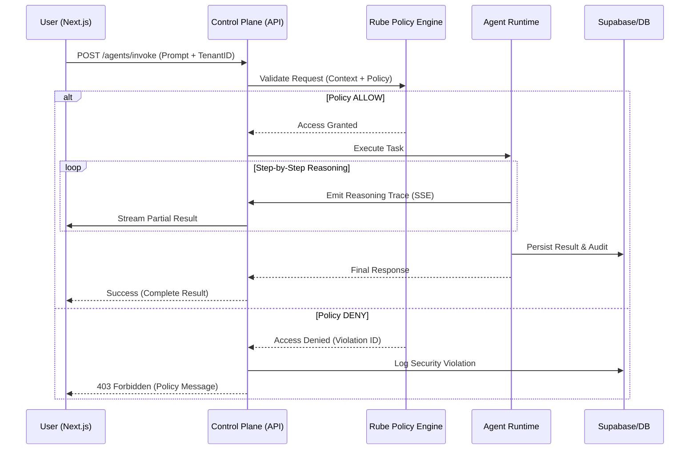
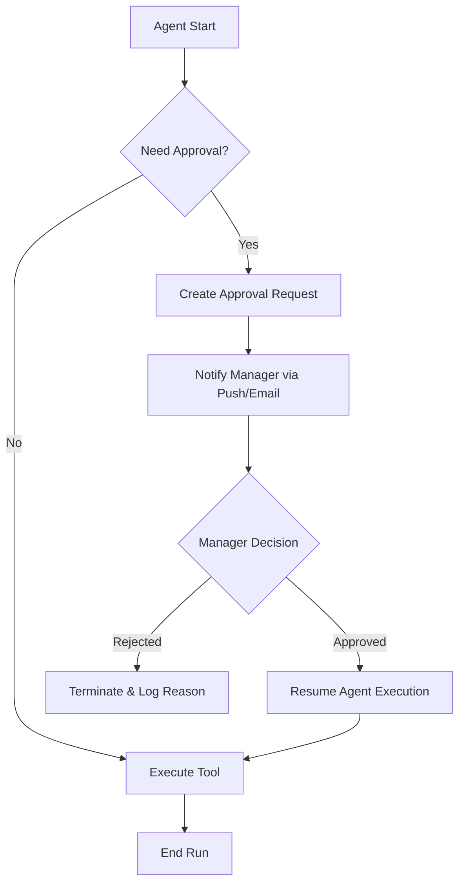

# Use Case Specifications — Control Plane

> **Control Plane Utama (apps/app)** adalah pusat orkestrasi berbasis web (Next.js 15) yang mengelola siklus hidup agent, alur kerja bisnis, dan integritas data dalam ekosistem **SBA‑Agentic**.

Dokumen ini merinci 15 use case operasional kritis, diagram alir (BPMN), dan urutan interaksi (Sequence) untuk memastikan keselarasan antara desain produk dan implementasi teknis.

---

## 1. Executive Summary
Control Plane berfungsi sebagai "otak" bagi pengguna manusia untuk berinteraksi dengan armada AI. Fokus utamanya adalah pada **Explainability**, **Multi-tenancy**, dan **Operational Observability**.

---

## 2. Operational Use Cases (15 Scenarios)

### 2.1 Identity & Access Management (IAM)
| ID | Use Case | Actor | Description | Audit Trail |
| :--- | :--- | :--- | :--- | :--- |
| **UC-01** | **Tenant-Aware Login** | User | Autentikasi via Supabase Auth dengan validasi tenant_id wajib. | `auth.login`, `tenant.validate` |
| **UC-02** | **Workspace Context Switch** | User | Berpindah antar workspace dalam satu tenant tanpa re-login. | `workspace.switch` |
| **UC-12** | **Rube Policy Enforcement** | System | Validasi setiap aksi user terhadap kebijakan Rube Engine (BPA/CX). | `policy.evaluate`, `access.denied` |

### 2.2 Agent & Intelligence Management
| ID | Use Case | Actor | Description | Audit Trail |
| :--- | :--- | :--- | :--- | :--- |
| **UC-03** | **Agent Factory** | Admin/Op | Membuat agent baru dengan konfigurasi persona, tools, dan model LLM. | `agent.create`, `config.update` |
| **UC-04** | **Reasoning Chat** | User | Interaksi NL dengan agent yang menampilkan langkah penalaran (Reasoning Trace). | `agent.invoke`, `trace.generated` |
| **UC-10** | **Explainability Audit** | Auditor | Menganalisis alasan di balik keputusan agent menggunakan visualisasi trace. | `audit.view_trace` |

### 2.3 Workflow & Automation
| ID | Use Case | Actor | Description | Audit Trail |
| :--- | :--- | :--- | :--- | :--- |
| **UC-05** | **Visual Workflow Designer** | Admin | Mendesain alur kerja multi-agent menggunakan antarmuka grafis. | `workflow.save`, `node.connect` |
| **UC-14** | **HITL Approval** | Manager | Menyetujui atau menolak langkah agent yang memerlukan intervensi manusia. | `workflow.approve`, `step.resume` |
| **UC-11** | **Meta-Event Feedback** | System | Memberikan feedback pada hasil kerja agent untuk pembelajaran mandiri. | `feedback.submit` |

### 2.4 Data & Integration
| ID | Use Case | Actor | Description | Audit Trail |
| :--- | :--- | :--- | :--- | :--- |
| **UC-07** | **Knowledge Indexing** | Admin | Mengunggah dokumen (PDF/Docx) untuk diindeks ke Vector DB (RAG). | `document.upload`, `vector.index` |
| **UC-08** | **Capability Binding** | Admin | Menghubungkan agent dengan tool eksternal (CRM, ERP via API). | `tool.bind`, `api.connected` |

### 2.5 Monitoring & Reliability
| ID | Use Case | Actor | Description | Audit Trail |
| :--- | :--- | :--- | :--- | :--- |
| **UC-06** | **Live Run Observation** | User | Memantau eksekusi workflow secara real-time via WebSocket/SSE. | `run.start`, `stream.active` |
| **UC-09** | **Operational Dashboard** | User | Melihat metrik KPI (Latency, Cost, Success Rate) per tenant. | `metrics.view` |
| **UC-13** | **Compliance Reporting** | Auditor | Menghasilkan laporan aktivitas untuk kebutuhan regulasi (GDPR/ISO). | `report.generate` |
| **UC-15** | **System Health Watch** | DevOps | Memantau kesehatan backend services dan ketersediaan API. | `health.check` |

---

## 3. Interaction Diagrams

### 3.1 Agent Execution Flow (UC-04 & UC-12)
Diagram ini menunjukkan bagaimana permintaan pengguna divalidasi oleh Rube Engine sebelum dieksekusi oleh Agent.

### 3.2 Human-in-the-Loop Workflow (UC-14)
Alur ketika agent memerlukan persetujuan manusia untuk langkah sensitif (misal: pengeluaran dana).

---

## 4. Technical Specifications & Constraints

### 4.1 Accessibility Standards (WCAG 2.1 AA)
- **Contrast**: Rasio kontras minimal 4.5:1 untuk teks normal.
- **Keyboard Navigation**: Semua elemen interaktif (DataTable, Sidebar) wajib dapat diakses via `Tab` dan `Enter`.
- **Screen Readers**: Penggunaan ARIA labels yang tepat pada chart dan status badges.

### 4.2 Error Recovery & Resilience
- **UC-06 Recovery**: Jika koneksi SSE/WebSocket terputus saat monitoring, sistem wajib melakukan *auto-reconnect* dan melakukan *state-sync* dari database.
- **Circuit Breaker**: Jika eksekusi agent melebihi `maxSteps` (default: 50), sistem akan memutus eksekusi untuk mencegah *infinite loop* dan kebocoran biaya LLM.

### 4.3 Globalization (i18n)
- Mendukung multi-bahasa via `i18next`.
- Format tanggal dan angka disesuaikan berdasarkan locale pengguna (ISO-8601 default).

---

## 5. Deliverables & Validation
- **Deliverable**: Dokumen Spesifikasi v1.2.1 (Final).
- **Validation Method**:
    - **UAT**: Verifikasi 15 use case melalui skenario pengujian manual.
    - **Automated**: E2E tests menggunakan Playwright untuk alur kritis (UC-01, UC-04, UC-06).

---

## 6. Change Log
| Version | Date | Author | Description |
| :--- | :--- | :--- | :--- |
| 1.2.1 | 2025-12-29 | SBA-Agentic Team | Initial detailed specification for Control Plane (apps/app). |

---
---

## 7. Referensi Terkait
* [Control Plane Utama — Sba-agentic](./Control%20Plane%20Utama%20—%20Sba-agentic.md)
* [Arsitektur apps-app](../02-architecture/Arsitektur%20apps-app.md)
* [SBA-Agentic Operational Standard](../SBA-Agentic%20Operational%20Standard.md)
