# Use Case Specifications — Internal Console (SBA-Agentic)

> **Kontrak Operasional & Spesifikasi Use Case** untuk aplikasi `apps/internal-console`. Dokumen ini mendetailkan interaksi antara operator manusia, AI Agent, dan Control Plane.

---

## 1. Document Overview
### 1.1 Goal
Menyediakan spesifikasi teknis yang detail untuk setiap interaksi utama dalam Internal Console, memastikan konsistensi antara desain UI, logika bisnis, dan implementasi backend.

### 1.2 Context
Aplikasi ini bertindak sebagai "Command Center" desktop yang terhubung ke Control Plane SBA-Agentic. Fokus utamanya adalah pada eksekusi tugas bisnis yang aman (Policy-driven) dan transparan (Observable).

---

## 2. Stakeholders & Actors
- **Business Operator**: Pengguna utama yang menjalankan perintah bisnis harian.
- **System Admin**: Mengelola konfigurasi tenant, kebijakan, dan integrasi sistem.
- **AI Ops / Auditor**: Memantau kesehatan sistem dan melakukan audit terhadap keputusan AI.
- **Control Plane**: Backend service yang mengorkestrasi permintaan dari Console.

---

## 3. Operational Use Case Specifications

### UC-01: Interact with Business AI (NL Command)
**Description**: Operator mengirimkan perintah dalam bahasa alami untuk memicu aksi bisnis atau analisis data.

- **BPMN Operational Flow**:
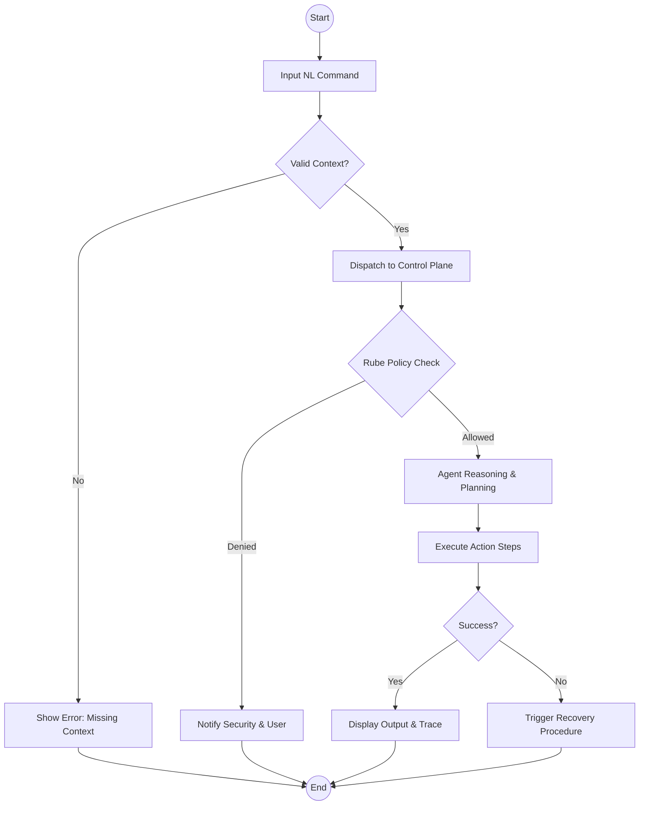

- **Actors**: Business Operator, Planner Agent, Executor Agent.
- **Pre-conditions**: 
    * Sesi user aktif (JWT valid).
    * Tenant context tersedia dalam state manager.
    * Rube Policy Engine online (Health Check status: GREEN).
    * Konektivitas ke Control Plane stabil (Latency < 500ms).
- **Post-conditions**: 
    * Aksi dieksekusi atau informasi disajikan.
    * Audit trail tersimpan secara immutable dengan checksum.
    * Resource usage (tokens, CPU) dicatat.
- **Main Flow**:
    1. Operator memasukkan perintah teks.
    2. Console mengirimkan perintah ke Control Plane via `/v1/agents/invoke`.
    3. Planner Agent melakukan dekomposisi tugas.
    4. Rube Engine memvalidasi setiap sub-tugas terhadap kebijakan tenant.
    5. Executor Agent menjalankan aksi yang diizinkan.
    6. Hasil dikirimkan kembali ke UI secara streaming.

- **Sequence Diagram**:
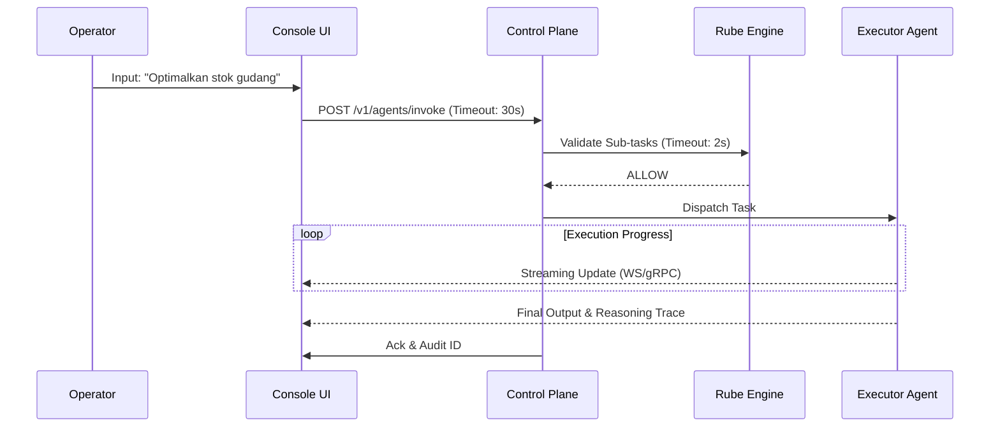

- **Error Handling & Recovery**:
    - *Policy Denied*: UI menampilkan alasan penolakan. **Recovery**: Sediakan tombol 'Request Exception' atau eskalasi ke UC-06.
    - *Agent Timeout*: Jika tidak ada respon > 30 detik. **Recovery**: Kirim 'Cancel Signal', tampilkan status 'Stuck', dan tawaran 'Resume from last step'.
    - *Network Failure*: UI beralih ke 'Syncing Mode'. **Recovery**: Retry otomatis dengan exponential backoff (max 5 retries).

- **Audit Trail (ISO 27001)**: 
    * `timestamp` (RFC3339), `trace_id`, `actor_id`, `tenant_id`.
    * `input_hash` (SHA-256), `policy_decision_id`.
    * `resource_consumption_metadata`.

---

### UC-02: Execute Workflow (Multi-step)
**Description**: Eksekusi alur kerja yang terdiri dari beberapa langkah deterministik yang melibatkan koordinasi antar service.

- **Actors**: Business Operator, Orchestrator, Integration Service.
- **Pre-conditions**: 
    * Definisi workflow (JSON/YAML) tersedia dan valid.
    * Resource (API/DB) online.
    * Auth token valid dengan permission `workflow:start`.
- **Post-conditions**: 
    * Workflow selesai (Success/Failed).
    * State tersimpan di DB.
    * Notifikasi dikirim ke stakeholder terkait.
- **Main Flow**:
    1. Operator memilih template workflow.
    2. Mengisi parameter yang dibutuhkan.
    3. Menjalankan workflow via `/v1/workflows/start`.
    4. Memantau progres setiap langkah secara real-time.

- **Sequence Diagram**:
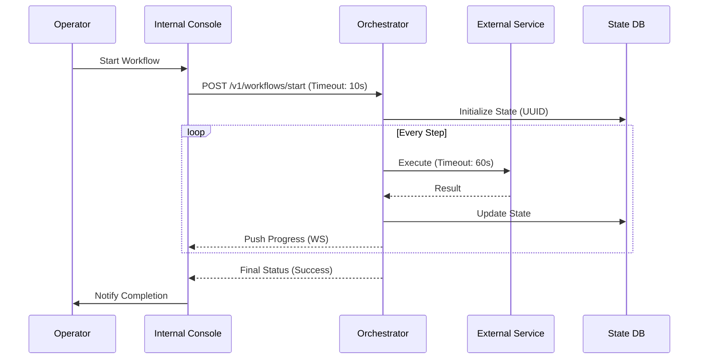

- **Error Handling & Recovery**:
    - *Step Failure*: UI menampilkan error log. **Recovery**: Opsi 'Retry from failed step', 'Skip step', atau 'Rollback to Snapshot'.
    - *Orchestrator Crash*: **Recovery**: Mekanisme 'Self-healing' pada restart akan mengambil state dari DB dan me-resume workflow yang pending.

- **Audit Trail (ISO 27001)**: 
    * `workflow_instance_id`, `step_index`, `input_payload`, `output_payload`, `execution_duration`.

---

### UC-03: Manage Agent Rules & Policy
**Description**: Admin mengonfigurasi aturan perilaku agent menggunakan YAML yang divalidasi oleh Rube Engine.

- **Actors**: System Admin, Rube Engine, Control Plane.
- **Pre-conditions**: 
    * Hak akses admin terverifikasi (MFA Required).
    * Repository kebijakan (Git/DB) online.
- **Post-conditions**:
    * Kebijakan baru aktif di runtime.
    * Versi kebijakan diperbarui.
    * Notifikasi perubahan dikirim ke tim security.

- **Sequence Diagram**:
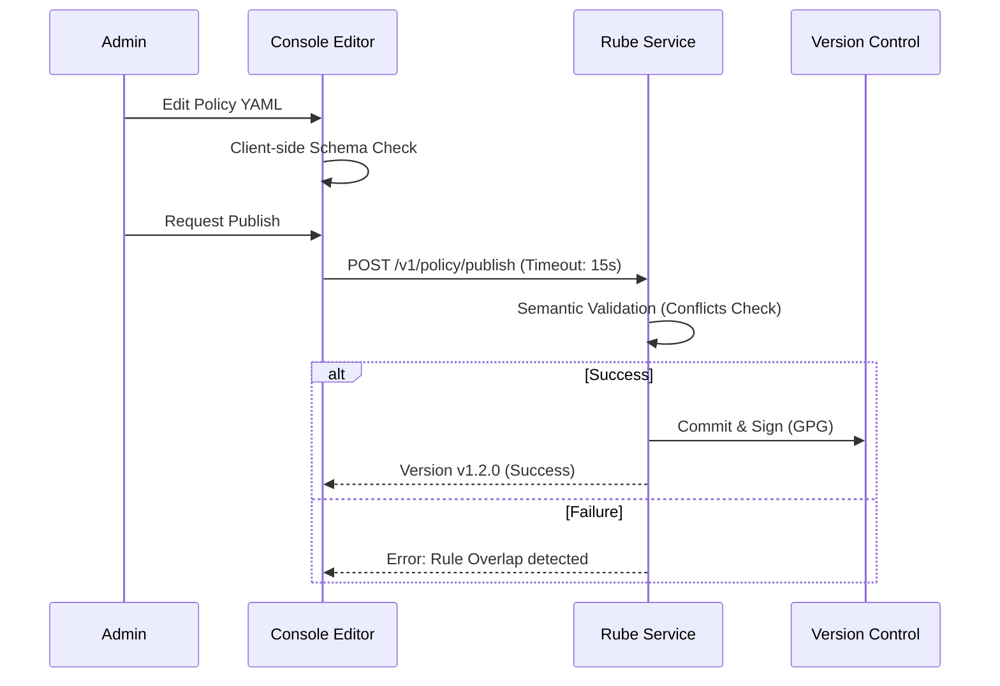

- **Error Handling & Recovery**:
    - *Conflict Detected*: **Recovery**: UI menampilkan diff antara aturan lama dan baru, menyoroti baris konflik.
    - *Git Push Error*: **Recovery**: Simpan sebagai 'Local Draft' dan beri notifikasi 'Sync Pending'.

- **Audit Trail (ISO 27001)**: 
    * `admin_id`, `policy_id`, `version_before`, `version_after`, `digital_signature`, `approval_reference`.

---

### UC-04: Real-time Observability & Replay
**Description**: Memantau aktivitas agent secara live dan memutar ulang sesi untuk audit.

- **Actors**: AI Ops, Auditor.
- **Pre-conditions**: 
    * Sesi agent memiliki logging level 'TRACE'.
    * Izin `audit:read` tersedia.
- **Post-conditions**:
    * Trace data ditampilkan secara visual.
    * Replay berhasil dilakukan tanpa mengubah data asli.

- **Sequence Diagram**:
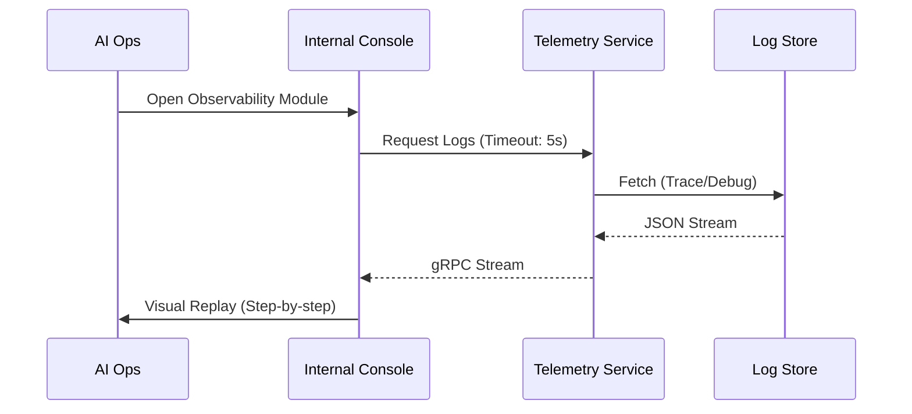

- **Error Handling & Recovery**:
    - *Data Missing*: **Recovery**: Trigger request ke Archive Service untuk restore log dari S3/Cold Storage (ETA: 5-10 mins).
    - *Connection Lag*: **Recovery**: Switch ke 'Buffered Mode' atau 'Low-resolution View'.

- **Audit Trail (ISO 27001)**: 
    * `session_id`, `accessed_by`, `data_integrity_hash`, `replay_timestamp`.

---

### UC-13: Disaster Recovery Initiation (Manual Failover)
**Description**: Admin memicu prosedur failover manual saat terdeteksi kegagalan regional pada Control Plane.

- **Actors**: System Admin, Platform Engineer.
- **Pre-conditions**: 
    * Health Check sistem mendeteksi kegagalan kritis.
    * Izin `system:failover` aktif.
    * Multi-admin approval (2-man rule) jika diaktifkan.
- **Post-conditions**:
    * Traffic dialihkan ke region sekunder.
    * State disinkronkan dari backup terakhir.
- **Sequence Diagram**:
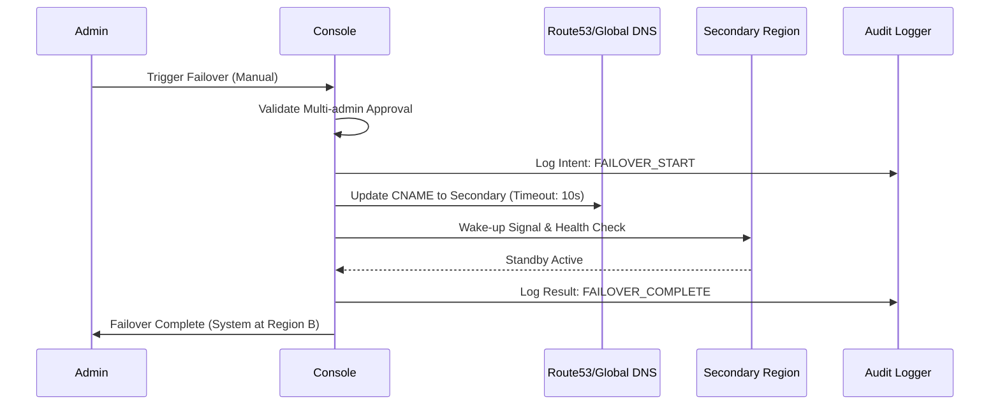

- **Error Handling & Recovery**: 
    - *DNS Propagation Delay*: Tampilkan status 'Propagating' dan estimasi waktu.
    - *Secondary Region Down*: **Recovery**: Eskalasi ke 'Full System Outage' protocol dan aktifkan static maintenance page.

- **Audit Trail (ISO 27001)**: 
    * `admin_id`, `failover_reason`, `source_region`, `target_region`, `timestamp`, `approval_ids`.

---

### UC-14: Batch Security Patching (Policy Update)
**Description**: Memperbarui kebijakan keamanan secara massal untuk seluruh tenant guna merespon ancaman baru (Zero-day).

- **Actors**: Security Engineer, Rube Engine.
- **Pre-conditions**: 
    * Patch YAML tersedia dan telah di-test di staging.
    * Emergency approval aktif.
- **Post-conditions**: 
    * Semua tenant menerapkan kebijakan baru dalam < 60 detik.
    * Laporan kepatuhan di-generate.
- **Sequence Diagram**:
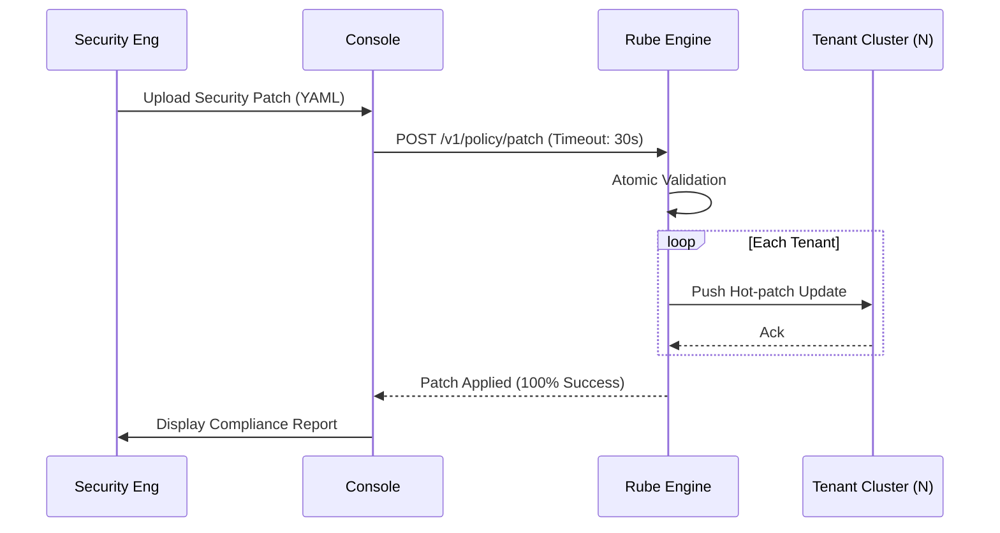

- **Error Handling & Recovery**:
    - *Patch Conflict*: Aturan baru bertabrakan dengan custom policy tenant. **Recovery**: Skip tenant bermasalah, tandai 'Attention Required', lanjutkan patch ke tenant lain.

- **Audit Trail (ISO 27001)**: 
    * `security_id`, `patch_id`, `affected_tenants_count`, `compliance_status`, `timestamp`.

---

### UC-15: System Capacity Scaling (Manual Override)
**Description**: Mengatur ulang alokasi resource tenant secara manual untuk menangani lonjakan beban yang tidak terduga.

- **Actors**: Platform Engineer.
- **Pre-conditions**: 
    * Monitoring menunjukkan penggunaan resource > 90%.
    * Kapasitas infrastruktur cloud mencukupi.
- **Post-conditions**: 
    * Quota diperbarui; HPA (Horizontal Pod Autoscaler) disesuaikan.
    * Latensi sistem kembali ke baseline.
- **Sequence Diagram**:
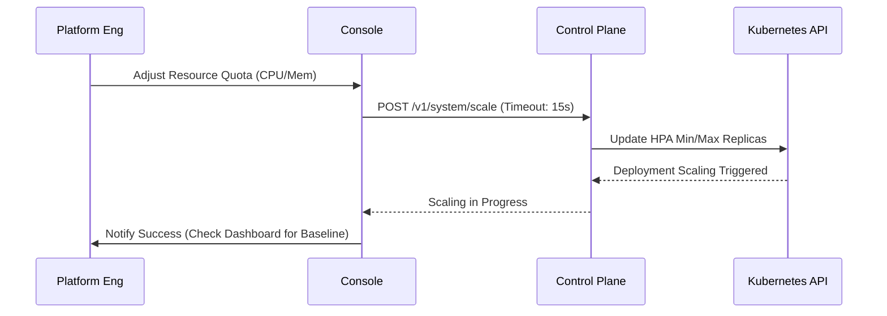

- **Error Handling & Recovery**:
    - *Cloud Limit Hit*: Gagal menambah replica karena quota cloud habis. **Recovery**: Notifikasi ke admin untuk 'Contact Provider' atau 'Reduce Other Tenant Quota'.

- **Audit Trail (ISO 27001)**: 
    * `ops_id`, `tenant_id`, `previous_quota`, `new_quota`, `justification`, `timestamp`.

---

### UC-05: Tenant Onboarding & Configuration
**Description**: System Admin membuat tenant baru dan mengonfigurasi parameter dasar seperti storage quota dan model preferences.

- **Actors**: System Admin, Control Plane.
- **Pre-conditions**: Admin terautentikasi, Nama tenant unik.
- **Post-conditions**: Tenant ID dibuat, Default policy di-apply, Database schema di-provision.
- **Main Flow**:
    1. Admin mengisi form pendaftaran tenant.
    2. Console mengirimkan data ke `/v1/tenants/onboard`.
    3. Control Plane menginisialisasi resource tenant (DB, S3 Bucket).
    4. Notifikasi sukses dikirim ke admin.

- **Sequence Diagram**:
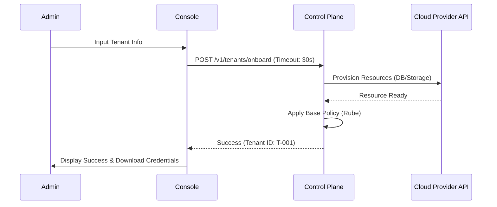

- **Error Handling**:
    - *Infra Failure*: Resource gagal dibuat. **Recovery**: Rollback partial creation dan trigger manual intervention ticket.
    - *Duplicate Tenant*: Validasi gagal. **Recovery**: Minta admin menggunakan nama lain.

- **Audit Trail**: `admin_id`, `tenant_name`, `provisioned_resources`, `status`, `timestamp`.

---

### UC-06: Incident Response & Manual Intervention
**Description**: Operator mengambil alih kendali saat agent terdeteksi melakukan anomali atau membutuhkan persetujuan manusia untuk aksi berisiko tinggi.

- **Actors**: Operator, Reviewer Agent, Rube Engine.
- **Pre-conditions**: Agent memicu status `WAITING_FOR_APPROVAL`.
- **Post-conditions**: Aksi dilanjutkan (Approve) atau dibatalkan (Deny).
- **Main Flow**:
    1. Agent terhenti pada langkah kritis sesuai kebijakan Rube.
    2. Notifikasi muncul di Internal Console.
    3. Operator meninjau *Reasoning Trace* dan *Context Snapshot*.
    4. Operator memilih 'Approve' atau 'Deny with Comment'.

- **Sequence Diagram**:
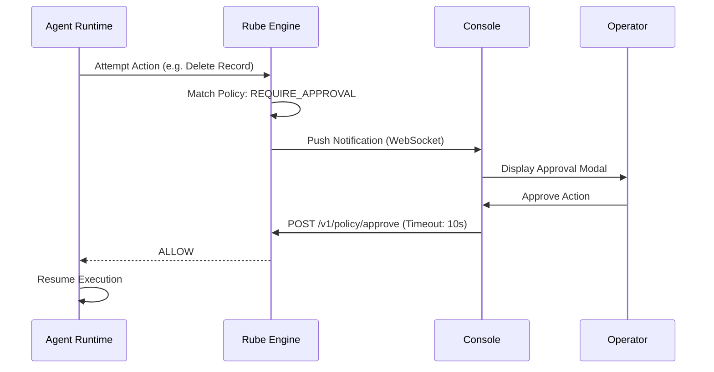

- **Error Handling**:
    - *Approval Timeout*: Operator tidak merespon dalam 10 menit. **Recovery**: Default aksi menjadi 'Deny' dan agent masuk ke state 'Hibernated'.

- **Audit Trail**: `approval_id`, `operator_id`, `agent_step`, `decision`, `comment`, `timestamp`.

---

### UC-07: Custom Report Generation (Business Intelligence)
**Description**: Menghasilkan laporan analitik berdasarkan aktivitas agent dan performa bisnis tenant.

- **Actors**: Business Operator, Analytics Service.
- **Pre-conditions**: 
    * Data aktivitas tersedia dalam Telemetry Store.
    * User memiliki permission `analytics:generate`.
- **Post-conditions**: 
    * File laporan (PDF/CSV) tersedia untuk diunduh.
    * Link unduhan dicatat dalam history laporan.
- **Main Flow**:
    1. Operator memilih parameter laporan (Range waktu, Tenant, Metrik).
    2. Console mengirim permintaan ke `/v1/analytics/generate`.
    3. Analytics Service mengagregasi data dari Prometheus/Loki.
    4. Link unduhan dikirim ke UI.

- **Sequence Diagram**:
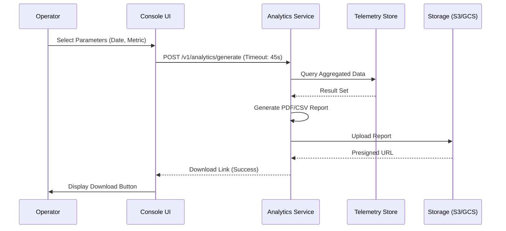

- **Error Handling & Recovery**:
    - *Data Incomplete*: Beberapa metrik hilang. **Recovery**: Tandai bagian laporan sebagai 'Incomplete' dan beri catatan alasan.
    - *Generation Timeout*: Laporan terlalu besar. **Recovery**: Kirim via email saat selesai, beri notifikasi 'Processing in Background'.

- **Audit Trail (ISO 27001)**: 
    * `user_id`, `report_type`, `parameters`, `file_hash`, `timestamp`.

---

### UC-08: Batch Knowledge Sync
**Description**: Sinkronisasi dokumen atau data internal ke dalam Knowledge Base (Vector DB) agar dapat diakses oleh AI Agent.

- **Actors**: System Admin, Knowledge Engine.
- **Pre-conditions**: 
    * Dokumen tersedia di storage lokal atau cloud.
    * Koneksi ke Vector DB (Pinecone/Milvus) stabil.
- **Post-conditions**: 
    * Dokumen di-index dan siap untuk RAG (Retrieval-Augmented Generation).
    * Namespace tenant diperbarui.
- **Main Flow**:
    1. Admin memilih folder atau file untuk disinkronkan.
    2. Console mengirimkan metadata ke Knowledge Engine.
    3. Knowledge Engine melakukan chunking dan embedding.
    4. Vektor disimpan di Vector DB.

- **Sequence Diagram**:
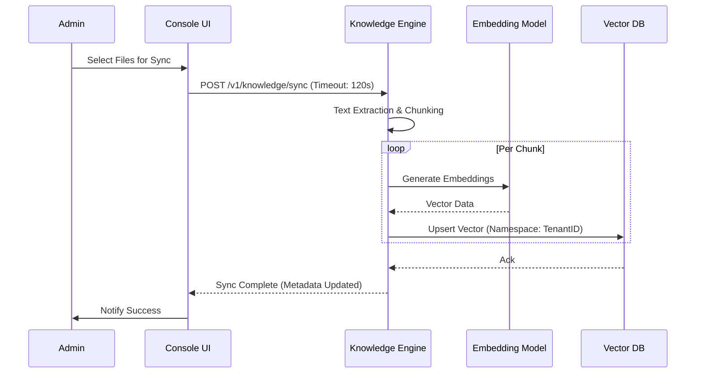

- **Error Handling & Recovery**:
    - *Embedding Failure*: Gagal melakukan vektorisasi. **Recovery**: Masukkan file ke antrean 'Retry' otomatis.
    - *Quota Exceeded*: Vector DB penuh. **Recovery**: Minta admin upgrade storage atau hapus index lama.

- **Audit Trail (ISO 27001)**: 
    * `admin_id`, `file_list`, `vector_id`, `sync_status`, `timestamp`.

---

### UC-09: User Role & Privilege Management
**Description**: Mengatur hak akses operator menggunakan model RBAC (Role-Based Access Control) untuk memastikan prinsip *least privilege*.

- **Actors**: System Admin, IAM Service.
- **Pre-conditions**: 
    * Admin memiliki role 'SuperAdmin'.
    * User target sudah terdaftar di sistem.
- **Post-conditions**: 
    * Role user diperbarui dalam database IAM.
    * Cache permission di-refresh (TTL < 5 mins).
- **Main Flow**:
    1. Admin membuka modul 'Identity & Access'.
    2. Memilih user atau membuat role baru.
    3. Mengalokasikan permission (e.g., `policy:edit`, `audit:view`).
    4. Menyimpan perubahan; sistem mencatat digital signature admin.

- **Error Handling**: 
    - *Privilege Escalation Attempt*: Sistem menolak jika admin mencoba memberikan hak akses di atas level mereka sendiri.
- **Audit Trail**: `admin_id`, `target_user_id`, `role_assigned`, `permissions_modified`, `timestamp`.

---

### UC-10: System Health Diagnostic
**Description**: Menjalankan pengecekan kesehatan menyeluruh pada seluruh komponen ekosistem SBA-Agentic.

- **Actors**: AI Ops, Monitoring Service.
- **Pre-conditions**: Akses ke status endpoint semua service (Control Plane, Agent Runtime, DB, Vector DB).
- **Post-conditions**: Laporan kesehatan sistem ditampilkan dengan status GREEN/YELLOW/RED.
- **Main Flow**:
    1. Ops memicu 'System Diagnostic'.
    2. Console mengirimkan heartbeat ke semua microservices.
    3. Mengumpulkan metrik latensi, disk usage, dan konektivitas API.
    4. Menampilkan dashboard kesehatan real-time.

- **Error Handling**: 
    - *Component Timeout*: Tandai komponen sebagai 'Unreachable' dan kirim alert ke Slack/PagerDuty.
- **Audit Trail**: `ops_id`, `diagnostic_result`, `affected_components`, `timestamp`.

---

### UC-11: API Key & Credential Rotation
**Description**: Mengelola dan merotasi kunci API untuk integrasi pihak ketiga secara aman tanpa downtime.

- **Actors**: System Admin, Secret Manager (Vault/AWS).
- **Pre-conditions**: 
    * Izin `secrets:manage` aktif.
    * MFA terverifikasi.
- **Post-conditions**: 
    * Key baru aktif; key lama dinonaktifkan setelah grace period.
    * Konfigurasi runtime diperbarui.
- **Main Flow**:
    1. Admin memilih integrasi (e.g., 'Resend API').
    2. Memicu 'Rotate Credentials'.
    3. Sistem membuat key baru di Secret Manager.
    4. Update konfigurasi Control Plane secara hot-reload.
    5. Verifikasi konektivitas dengan key baru.

- **Sequence Diagram**:
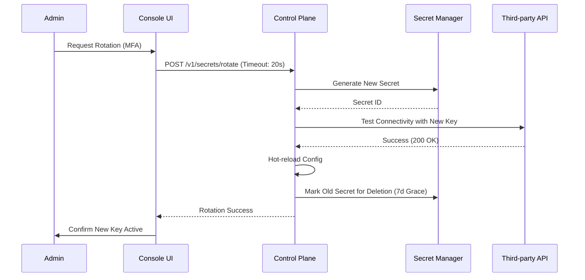

- **Error Handling & Recovery**:
    - *Connection Test Fail*: Key baru tidak valid. **Recovery**: Batalkan rotasi, tetap gunakan key lama, and log error.
    - *Hot-reload Failure*: Service gagal update config. **Recovery**: Trigger manual restart pods.

- **Audit Trail (ISO 27001)**: 
    * `admin_id`, `integration_id`, `rotation_status`, `new_key_id_mask`, `timestamp`.

---

### UC-12: Resource Quota & Rate Limit Management
**Description**: Mengatur batas penggunaan resource (CPU, Memory, API Calls, LLM Tokens) per tenant.

- **Actors**: System Admin, Rube Engine.
- **Pre-conditions**: 
    * Data penggunaan tenant tersedia.
    * Permission `tenant:quota_manage` aktif.
- **Post-conditions**: 
    * Kebijakan quota baru diterapkan di runtime.
    * Notifikasi dikirim ke pemilik tenant.
- **Main Flow**:
    1. Admin meninjau dashboard penggunaan tenant.
    2. Mengatur 'Hard Limit' dan 'Soft Limit' pada panel konfigurasi.
    3. Menyimpan aturan ke Rube Engine.
    4. Sistem melakukan enforcement secara real-time pada request berikutnya.

- **Sequence Diagram**:
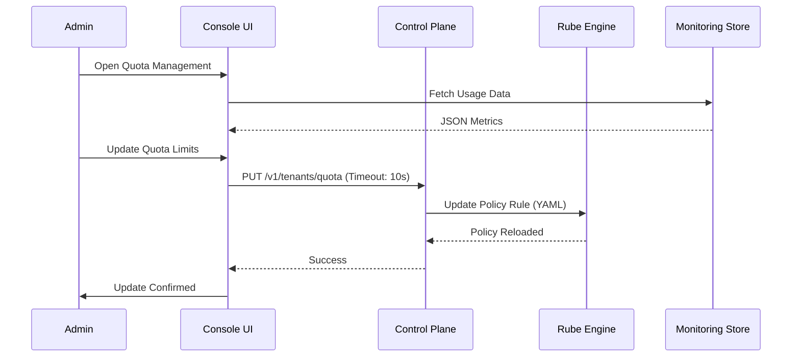

- **Error Handling & Recovery**:
    - *Invalid Limit*: Hard limit < Current Usage. **Recovery**: UI memberi peringatan dan mencegah penyimpanan kecuali 'Override' dipilih.
    - *Policy Sync Fail*: Rube gagal update. **Recovery**: Retry otomatis 3x, jika gagal rollback ke state sebelumnya.

- **Audit Trail (ISO 27001)**: 
    * `admin_id`, `tenant_id`, `quota_type`, `limit_value`, `timestamp`.

---

## 4. Non-Functional Requirements

### 4.1 Desktop-First Principles
- **Atomic Design Principles**: UI dibangun menggunakan komponen atom (Button, Input), molekul (Search Bar), dan organisme (Sidebar, Dashboard Grid) untuk konsistensi dan skalabilitas.
- **Command Palette**: Akses cepat ke semua fitur via `Ctrl+K`.
- **Responsive Breakpoints**:
    - *Compact*: < 1024px (Optimasi Sidebar).
    - *Standard*: 1024px - 1440px.
    - *Ultra-wide*: > 1440px (Multi-panel dashboard view).
- **Accessibility Standards**: Mematuhi WCAG 2.1 AA (Kontras warna, navigasi keyboard, Screen Reader support).
- **Localization Framework**: Support i18next untuk multi-bahasa (ID, EN, JP) dengan dynamic context loading.

### 4.2 Agent Task State Diagram
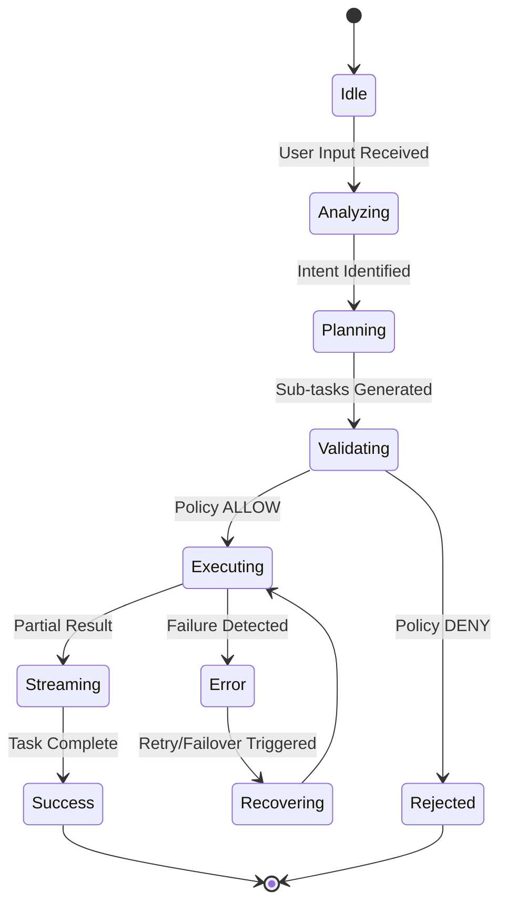

### 4.3 Performance Benchmarks
- **Initial Load**: Aplikasi harus siap digunakan dalam < 3 detik.
- **Interaction Latency**: Respon UI terhadap input user (click/type) harus < 100ms.
- **Sync Latency**: Data offline harus tersinkronisasi ke cloud dalam < 5 detik setelah koneksi kembali.

### 4.3 Disaster Recovery Scenarios
- **Scenario: Local Data Loss**: Jika database SQLite korup, aplikasi secara otomatis melakukan re-sync seluruh state dari Control Plane.
- **Scenario: Regional Cloud Outage**: Aplikasi mendeteksi kegagalan API regional dan secara otomatis mengalihkan (failover) ke endpoint Control Plane di region alternatif.

### 4.4 Offline & Sync Strategy
- **Local Cache**: Metadata dan history 30 hari terakhir tersedia secara offline via SQLite.
- **Background Sync**: Proses sinkronisasi berjalan di thread terpisah (Rust side) untuk menjaga UI tetap responsif.

---

## 5. Technical Contract Appendix (Control Plane Integration)

### 5.1 API Specification Details

#### Endpoint: `POST /v1/agents/invoke`
*Memicu interaksi dengan agent.*
- **Request Header**: `X-Tenant-ID`, `Authorization (Bearer JWT)`
- **Request Body**:
```json
{
  "input": "Optimalkan stok gudang",
  "agent_id": "planner-01",
  "context": {
    "location": "Jakarta",
    "priority": "high"
  }
}
```
- **Response (200 OK)**:
```json
{
  "trace_id": "uuid-v4",
  "output": "Rencana optimasi telah dibuat...",
  "reasoning": [
    { "step": "analysis", "content": "Menganalisis data stok saat ini..." },
    { "step": "planning", "content": "Membuat jadwal restock..." }
  ]
}
```

#### Endpoint: `POST /v1/policy/publish`
*Mempublikasikan aturan kebijakan baru.*
- **Request Body**:
```json
{
  "policy_name": "inventory-access",
  "content_yaml": "base64_encoded_yaml",
  "comment": "Update limit transaksi"
}
```
- **Response (201 Created)**:
```json
{
  "version": "1.2.0",
  "status": "published",
  "commit_hash": "sha256..."
}
```

#### Endpoint: `GET /v1/audit/logs`
*Mengambil log audit terfilter.*
- **Query Params**: `tenant_id`, `start_time`, `end_time`, `event_type`
- **Response (200 OK)**:
```json
{
  "total": 150,
  "data": [
    {
      "id": "log-uuid",
      "timestamp": "2025-12-29T10:00:00Z",
      "actor": "user-01",
      "event": "policy.update",
      "status": "SUCCESS"
    }
  ]
}
```

### 5.2 Observability Metrics Schema (Prometheus Format)
| Metric Name | Type | Labels | Description |
| :--- | :--- | :--- | :--- |
| `console_agent_invoke_duration_seconds` | Histogram | `agent_id`, `tenant_id` | Latensi eksekusi agent. |
| `console_policy_validation_errors_total` | Counter | `reason`, `tenant_id` | Jumlah kegagalan validasi kebijakan. |
| `console_sync_pending_items` | Gauge | `tenant_id` | Antrean sinkronisasi offline. |
| `console_active_sessions` | Gauge | `user_role` | Jumlah user aktif di Console. |

---

## 6. Change Log
| Version | Date | Author | Description |
| :--- | :--- | :--- | :--- |
| 1.2.1 | 2025-12-29 | SBA-Agentic Team | Enhanced: Added BPMN flows, State Diagrams, and UI accessibility/localization specs. |
| 1.2.0 | 2025-12-29 | SBA-Agentic Team | Enhanced specs: 15 use cases, timeout values, recovery procedures, and performance benchmarks. |
| 1.1.0 | 2025-12-29 | SBA-Agentic Team | Update detail UC-03, UC-04, API Appendix, dan Metrics Schema. |
| 1.0.0 | 2025-12-29 | SBA-Agentic Team | Inisialisasi dokumen spesifikasi use case. |

---

## 7. Referensi Terkait
* [Control & Intelligence Console — Landing Page](file:///home/inbox/smart-ai/sba-agentic/docs/00-index/Control%20&%20Intelligence%20Console%20—%20Sba-agentic.md)
* [Arsitektur Internal Console](file:///home/inbox/smart-ai/sba-agentic/docs/02-architecture/Arsitektur%20internal-console.md)
* [SBA-Agentic Workflow Standard](file:///home/inbox/smart-ai/sba-agentic/docs/SBA-Agentic-Workflow-Standard.md)
* [Rube Policy Engine Standards](file:///home/inbox/smart-ai/sba-agentic/.trae/rules/rube-yaml-standards.md)
