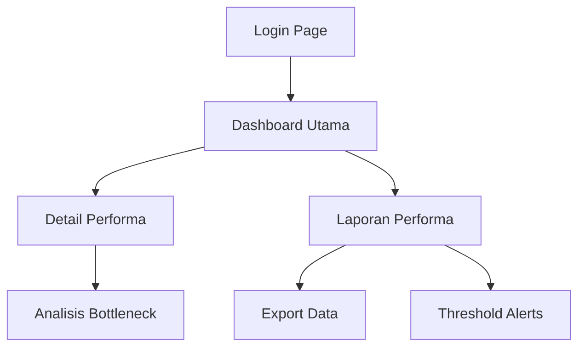
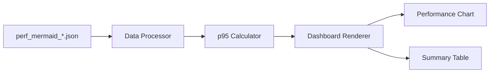

## 1. Product Overview

Dashboard performa yang menampilkan metrik rendering Mermaid untuk memantau dan menganalisis performa visualisasi diagram. Produk ini membantu tim pengembang dan QA untuk mengidentifikasi bottleneck rendering dan mengoptimalkan performa Mermaid.

## 2. Core Features

### 2.1 User Roles

| Role        | Registration Method | Core Permissions                                         |
| ----------- | ------------------- | -------------------------------------------------------- |
| Developer   | SSO/GitHub OAuth    | View all metrics, export data, filter by date range      |
| QA Engineer | SSO/GitHub OAuth    | View metrics, create reports, set performance thresholds |
| Viewer      | Guest access        | View readonly dashboard                                  |

### 2.2 Feature Module

Dashboard performa terdiri dari halaman-halaman berikut:

1. **Dashboard utama**: Grafik metrik p95, tabel ringkasan performa, filter waktu
2. **Detail performa**: Detail rendering per artefak, timeline performa, analisis bottleneck
3. **Laporan performa**: Export PDF/CSV, scheduling laporan, threshold alerts

### 2.3 Page Details

| Page Name        | Module Name         | Feature description                                                                                                         |
| ---------------- | ------------------- | --------------------------------------------------------------------------------------------------------------------------- |
| Dashboard utama  | Grafik metrik p95   | Tampilkan grafik line chart untuk metrik p95 rendering time dari artefak JSON perf*mermaid*\* dengan interval waktu 5 menit |
| Dashboard utama  | Tabel ringkasan     | Tampilkan tabel dengan kolom: artefak name, avg p95, min p95, max p95, total renders, error rate                            |
| Dashboard utama  | Filter waktu        | Date picker untuk memilih range 1h, 6h, 24h, 7d, 30d dengan preset dan custom range                                         |
| Detail performa  | Detail rendering    | Tampilkan detail per artefak: rendering time breakdown, size impact, complexity score                                       |
| Detail performa  | Timeline performa   | Grafik area chart menampilkan trend performa 30 hari terakhir                                                               |
| Detail performa  | Analisis bottleneck | Identifikasi komponen Mermaid yang paling lambat dengan warna merah                                                         |
| Laporan performa | Export data         | Download data sebagai PDF (formatted report) atau CSV (raw data)                                                            |
| Laporan performa | Threshold alerts    | Konfigurasi email alert saat p95 melebihi threshold tertentu                                                                |

## 3. Core Process

**Developer Flow**: Login → Dashboard utama → Filter metrik → Klik artefak → Lihat detail → Export laporan → Konfigurasi alert

**QA Engineer Flow**: Login → Dashboard utama → Analisis bottleneck → Validasi threshold → Generate laporan → Schedule monitoring

## 4. User Interface Design

### 4.1 Design Style

- **Primary color**: #2563eb (blue-600) untuk header dan primary actions
- **Secondary color**: #64748b (slate-500) untuk secondary elements
- **Success color**: #10b981 (emerald-500) untuk performa baik
- **Warning color**: #f59e0b (amber-500) untuk threshold warning
- **Danger color**: #ef4444 (red-500) untuk performa buruk dan error
- **Button style**: Rounded-lg dengan shadow-sm, hover:shadow-md transition
- **Font**: Inter font family, 14px untuk body, 16px untuk headers
- **Layout**: Card-based dengan grid 12-column system
- **Icons**: Heroicons untuk konsistensi, ChartBarIcon untuk metrik

### 4.2 Page Design Overview

| Page Name        | Module Name         | UI Elements                                                                               |
| ---------------- | ------------------- | ----------------------------------------------------------------------------------------- |
| Dashboard utama  | Grafik metrik p95   | Line chart tinggi 300px, warna gradient blue-teal, tooltip on hover, legend di kanan atas |
| Dashboard utama  | Tabel ringkasan     | Tabel dengan sorting, pagination 20 rows, status indicator berwarna, search bar di atas   |
| Dashboard utama  | Filter waktu        | Button group horizontal dengan preset, date range picker dengan calendar popup            |
| Detail performa  | Detail rendering    | Card layout 2-column, progress bar untuk breakdown, metric cards dengan icon              |
| Detail performa  | Timeline performa   | Area chart tinggi 250px, gradient fill, brush untuk zoom, axis labels rotasi 45°          |
| Detail performa  | Analisis bottleneck | Heatmap grid 8x8, color scale red-yellow-green, hover detail popup                        |
| Laporan performa | Export data         | Dropdown button untuk format, loading spinner saat generate, success toast notification   |
| Laporan performa | Threshold alerts    | Form dengan input number, email validation, test alert button, active/inactive toggle     |

### 4.3 Responsiveness

Desktop-first design dengan breakpoint:

- Desktop: 1280px+ (layout 3-column)
- Tablet: 768px-1279px (layout 2-column)
- Mobile: <768px (layout 1-column, horizontal scroll untuk tabel)

Touch interaction optimization untuk filter dropdown dan chart zoom.

## Acceptance Criteria

- [ ] Grafik p95 rendering time update real-time setiap 5 menit
- [ ] Filter waktu bekerja untuk semua preset range tanpa error
- [ ] Tabel ringkasan bisa sorting dan pagination < 2 detik
- [ ] Export PDF menghasilkan laporan lengkap dalam < 10 detik
- [ ] Threshold alerts terkirim dalam 1 menit setelah threshold terlampaui
- [ ] Dashboard load time < 3 detik untuk 1000 artefak
- [ ] Mobile view tampil dengan baik tanpa horizontal scroll berlebihan

## Non-Goals

- Tidak mendukung editing artefak JSON
- Tidak menyediakan comparison antar environment
- Tidak ada fitur collaborative annotation
- Tidak mendukung custom Mermaid themes
- Tidak menyediakan API publik untuk eksternal

## QA Requirements

- **Performance**: Page load < 3s, chart render < 1s, export < 10s
- **Compatibility**: Chrome 90+, Firefox 88+, Safari 14+, Edge 90+
- **Data Accuracy**: P95 calculation akurat ±1ms, no data loss
- **Error Handling**: Graceful degradation untuk network failure
- **Accessibility**: WCAG 2.1 AA compliant, keyboard navigation
- **Security**: No XSS di chart rendering, sanitized JSON input

## Placeholder Diagram

