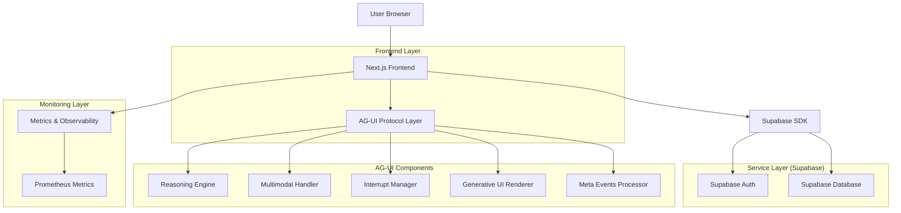

# Arsitektur Teknis SBA-Agentic

## 1. Desain Arsitektur

## 2. Deskripsi Teknologi

- **Frontend**: Next.js 15 + React 18 + TypeScript + Tailwind CSS
- **Alat Inisialisasi**: create-next-app
- **Backend**: Supabase (PostgreSQL + Auth + Storage)
- **Manajemen State**: React Context + Zustand untuk state kompleks
- **Komponen UI**: Komponen kustom dengan Radix UI primitives
- **Styling**: Tailwind CSS dengan design tokens kustom
- **Testing**: Vitest (unit), Playwright (e2e)
- **Linting**: Biome / ESLint dengan aturan TypeScript dan import
- **Package Manager**: pnpm untuk manajemen monorepo

## 3. Definisi Route

| Route | Tujuan |
| :--- | :--- |
| `/` | Dashboard utama dengan metrik performa dan aksi cepat |
| `/auth/login` | Halaman autentikasi pengguna dengan integrasi Supabase |
| `/auth/register` | Registrasi pengguna baru dengan verifikasi email |
| `/agents` | Antarmuka manajemen agen dengan daftar dan kemampuan pembuatan |
| `/agents/new` | Wizard pembuatan agen dengan konfigurasi multimodal |
| `/agents/[id]` | Halaman konfigurasi dan pengaturan agen individual |
| `/agents/[id]/chat` | Antarmuka chat real-time dengan interaksi agen |
| `/analytics` | Dashboard analitik dengan metrik performa |
| `/analytics/heatmap` | Visualisasi heatmap interaktif untuk pola penggunaan |
| `/workflows` | Manajemen workflow dan antarmuka visual builder |
| `/settings` | Preferensi pengguna dan konfigurasi sistem |
| `/admin/users` | Panel admin untuk manajemen pengguna dan penugasan role |
| `/admin/audit` | Log audit keamanan dan pemantauan event sistem |
| `/api/auth/*` | Endpoint autentikasi Supabase |
| `/api/agents/*` | Operasi CRUD untuk manajemen agen |
| `/api/chat/*` | Penanganan chat dan pesan real-time |
| `/api/analytics/*` | Pengambilan data analitik dan metrik |
| `/api/workflows/*` | Eksekusi dan manajemen workflow |

## 4. Definisi API (Highlights)

### 4.1 API Autentikasi

`POST /api/auth/login`

- **Request**: email, password.
- **Response**: user object, session object, access_token.

### 4.2 API Manajemen Agen

`POST /api/agents/create`

- **Request**: name, description, multimodal_config, interrupt_settings, workflow_config.
- **Response**: agent_id, status, config object.

### 4.3 API Interaksi Chat

`POST /api/chat/send-message`

- **Request**: agent_id, message, thread_id, context.
- **Response**: response_id, content, reasoning, interrupt, meta_events.

## 5. Data Model (Highlights)

- **USERS**: id, email, role, metadata, timestamps.
- **AGENTS**: id, user_id, name, description, configs, is_active, timestamps.
- **CONVERSATIONS**: id, user_id, agent_id, thread_id, context, status, timestamps.
- **MESSAGES**: id, conversation_id, message_type, content, reasoning_data, interrupt_data, is_from_agent, created_at.

## 6. Security & Accessibility

- **Security**: CSP Headers, Rate Limiting (public: 100/hr, auth: 1000/hr), RBAC (User vs Admin).
- **A11y**: WCAG AA Compliance (4.5:1 contrast), Keyboard navigation, Screen Reader support (ARIA).
