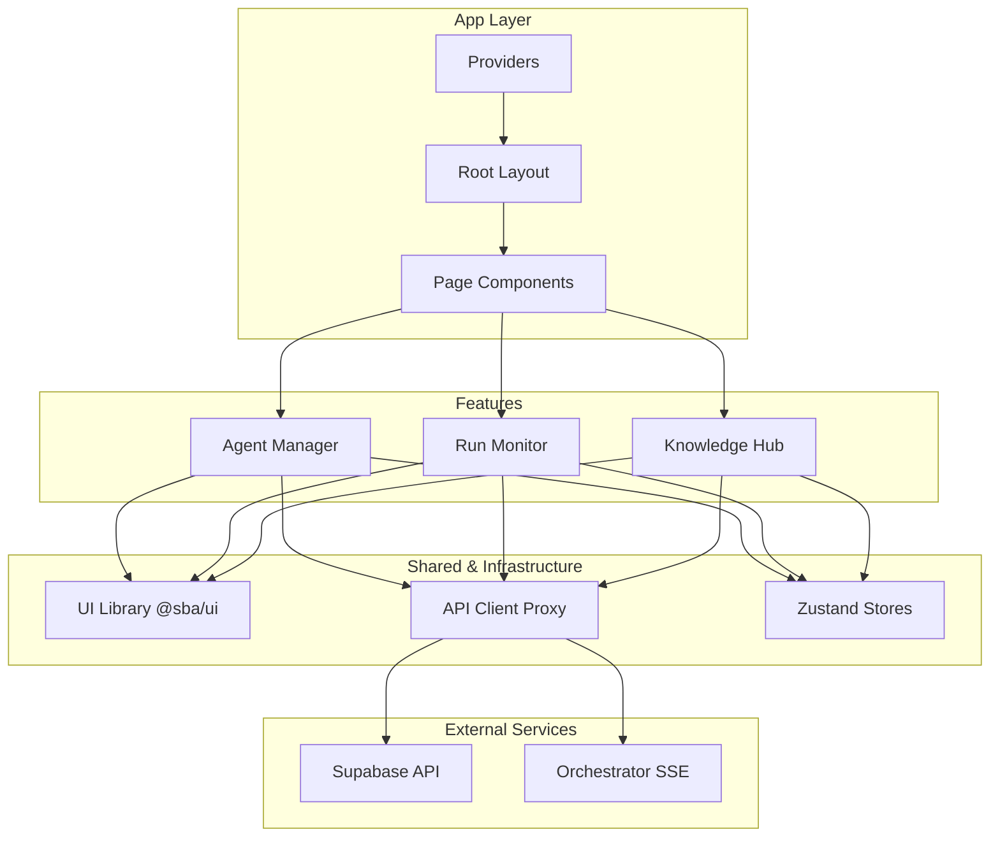
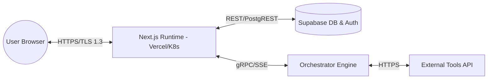

# Arsitektur Control Plane Utama

**SBA-Agentic (Smart Business Assistant)**

**Status**: Final – Production Oriented
**Audience**: Product Owner, Lead Engineer, Frontend Developer, Platform Engineer, Security & Ops
**Scope**: `apps/app` (Next.js 15 Control Plane)

---

## 1. Pendahuluan
Control Plane Utama (`apps/app`) adalah antarmuka web pusat yang mengorkestrasi interaksi antara pengguna manusia dan ekosistem AI Agentic. Dibangun di atas **Next.js 15**, aplikasi ini mengutamakan kecepatan (App Router), keamanan (Supabase RLS), dan skalabilitas (Feature-Sliced Design).

---

## 2. Prinsip Arsitektur
| Prinsip | Implementasi |
| :--- | :--- |
| **Separation of Concerns** | Feature-Sliced Design (FSD) + Shared Packages. |
| **Zero Trust Security** | Supabase RLS + JWT + Rube Policy Enforcement. |
| **Real-time First** | SSE/WebSocket untuk streaming reasoning traces. |
| **Atomic Design** | UI components berbasis @sba/ui (Shadcn/UI). |
| **Type Safety** | End-to-end TypeScript dari DB hingga UI. |

---

## 3. High-Level Architectural Overview

### 3.1 Technology Stack
- **Framework**: Next.js 15 (App Router, Server Components).
- **Language**: TypeScript.
- **Styling**: Tailwind CSS.
- **State Management**: Zustand (Global), React Query (Server Cache).
- **Backend-as-a-Service**: Supabase (Auth, DB, Storage).
- **Policy Engine**: Rube Engine (Rust/WASM).

### 3.2 Feature-Sliced Design (FSD) Structure
Aplikasi dibagi menjadi lapisan-lapisan yang saling terisolasi:
- **App**: Inisialisasi provider, layout global, dan routing.
- **Features**: Modul bisnis fungsional (e.g., `agents`, `runs`, `knowledge`).
- **Entities**: Data model dan logika bisnis inti.
- **Shared**: Komponen UI atomik, utility, dan API client.

---

## 4. Interaction Diagrams (C4 Diagrams)

### 4.1 Component Diagram (Module Dependency)

---

## 5. Technical Debt Inventory
Daftar hutang teknis yang perlu ditangani untuk menjaga kesehatan jangka panjang `apps/app`.

| ID | Component | Description | Priority | Effort |
| :--- | :--- | :--- | :--- | :--- |
| **TD-01** | Hydration | Server components hydration mismatch pada beberapa dashboard widgets. | Medium | Low |
| **TD-02** | Bundle Size | Beberapa library charting (Recharts) menambah bundle size signifikan. | Low | Medium |
| **TD-03** | Testing | Unit test coverage untuk `features/runs` masih di bawah 50%. | High | Medium |
| **TD-04** | Error Boundary | Perlu implementasi error boundary yang lebih granular per feature widget. | Medium | Low |

---

## 6. Risk Assessment Matrix
Evaluasi risiko teknis dan operasional untuk Control Plane Utama.

| Risk Scenario | Likelihood | Impact | Mitigation Strategy |
| :--- | :---: | :---: | :--- |
| **Session Hijacking** | Low | Critical | JWT expiry short-lived + Refresh Token rotation. |
| **SSE Connection Leak** | Medium | Medium | Connection timeout & heartbeat monitoring. |
| **RLS Bypass** | Low | Critical | Automated security tests for Supabase RLS policies. |
| **LLM Cost Spike** | High | Medium | Token usage monitoring & tenant-level quotas. |

---

## 7. Runtime Architecture Blueprint
### 7.1 Deployment Topology
Control Plane Utama dideploy sebagai aplikasi SSR di platform cloud (Vercel/K8s).

---

## 8. Observability & Monitoring Framework
Kerangka kerja untuk memastikan visibilitas penuh terhadap kesehatan aplikasi dan kinerja agent.

### 8.1 Logging Standards
- **Structured Logging**: Menggunakan format JSON untuk semua log aplikasi.
- **Trace ID Propagation**: Setiap request dari frontend ke backend (BFF) menyertakan `x-trace-id` untuk distributed tracing.
- **Reasoning Trace Audit**: Log penalaran agent disimpan di tabel `agent_reasoning_traces` dengan retensi 90 hari (ISO 27001 compliance).

### 8.2 Dashboard & Metrics
- **Performance Metrics**: LCP, FID, CLS dipantau via Vercel Analytics / Sentry.
- **Error Tracking**: Sentry digunakan untuk menangkap exception di sisi client dan server.
- **Business KPI Dashboard**: Visualisasi real-time untuk:
    - Total Active Runs per Tenant.
    - Average Reasoning Time.
    - Success vs Failure Rate of Tool Executions.

### 8.3 Alerting Policy
- **Critical Errors**: Notifikasi Slack/PagerDuty jika error rate > 5% dalam 5 menit.
- **Security Violations**: Alert instan jika terdeteksi percobaan bypass RLS atau anomali akses tenant.

---

## 9. Change Log
| Version | Date | Author | Description |
| :--- | :--- | :--- | :--- |
| 1.2.1 | 2025-12-29 | SBA-Agentic Team | Inisialisasi arsitektur detail untuk Control Plane Utama (apps/app). |

---
---

## 9. Referensi Terkait
* [Control Plane Utama — Landing Page](../00-index/Control%20Plane%20Utama%20—%20Sba-agentic.md)
* [Use Case Specifications — Control Plane](../01-product/Use%20Case%20Specifications%20—%20Control%20Plane%20(sba-agentic).md)
* [SBA-Agentic Operational Standard](../SBA-Agentic%20Operational%20Standard.md)
