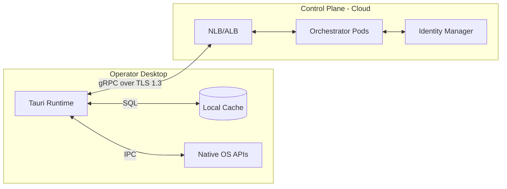
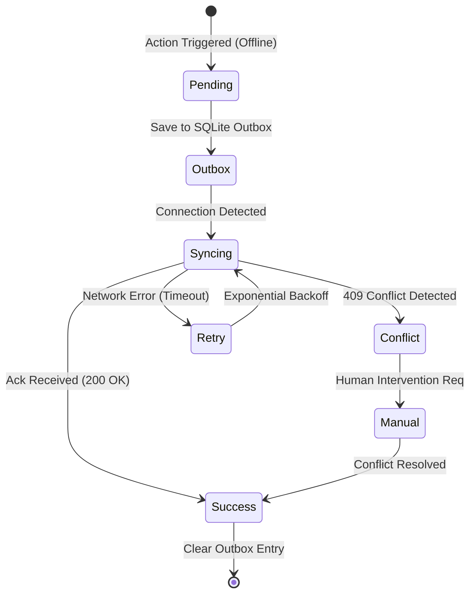

# Arsitektur Internal Console

## SBA-Agentic (Smart Business Assistant)

**Status**: Final – Production Oriented
**Audience**: Product Owner, Lead Engineer, AI Agent Engineer, Platform Engineer, Security & Ops
**Scope**: `apps/internal-console`

---

## 1. Pendahuluan

Internal Console adalah **tulang punggung operasional dan intelektual** dari platform SBA-Agentic. Ia bukan sekadar admin dashboard, melainkan:

> **Control Plane + Intelligence Console + Governance System**
> untuk seluruh lifecycle agent, rule, workflow, dan observability SBA.

Dokumen ini menjelaskan arsitektur internal-console dari **sudut pandang sistem, domain, teknis, operasional, dan evolusi jangka panjang**.

---

## 2. Tujuan & Prinsip Arsitektur

### 2.1 Tujuan Utama

Internal Console dirancang untuk:

1. Mengontrol dan mengawasi **AI Agent & Workflow**
2. Menyediakan **human-in-the-loop interface**
3. Menjadi pusat **observability, audit, dan compliance**
4. Memastikan **keamanan, konsistensi, dan governance**
5. Mendukung **eksperimen, simulasi, dan rollback**

---

### 2.2 Prinsip Arsitektur

| Prinsip                | Implementasi                   |
| ---------------------- | ------------------------------ |
| Separation of Concerns | Clean Architecture + DDD       |
| Deterministic Control  | Policy & rules explicit        |
| Observability-first    | Metrics, logs, audit by design |
| Human-in-the-loop      | UI sebagai decision surface    |
| Multi-tenant safe      | Isolasi state & akses          |
| Test as Governance     | Test = enforcement layer       |

---

## 3. Posisi Internal Console dalam Ekosistem SBA

### 3.1 Context Diagram (Konseptual)

```text
┌─────────────────────────────┐
│   Tenant Apps / End Users   │
└─────────────┬───────────────┘
              │ events
              ▼
┌─────────────────────────────┐
│     Agent Runtime Plane     │
│  (execution, reasoning)     │
└─────────────┬───────────────┘
              │ telemetry
              ▼
┌─────────────────────────────┐
│      Internal Console       │
│ Control • Intelligence • UI │
└─────────────┬───────────────┘
              │ policy / config
              ▼
┌─────────────────────────────┐
│      Control Plane APIs     │
└─────────────────────────────┘
```

Internal Console **tidak mengeksekusi agent**, tetapi:

* Mengamati
* Mengendalikan
* Mengatur batasan
* Mengambil keputusan

---

## 4. High-Level Architectural Overview

Internal Console menerapkan **layered architecture**:

```text
Presentation Layer (UI)
↓
Feature / Use Case Layer
↓
Domain Layer
↓
Infrastructure Layer
↓
Local API / Observability Backend
```

Pendekatan ini memastikan:

* UI tidak mengandung logika bisnis
* Domain bersifat portable & testable
* Infrastruktur dapat diganti tanpa efek sistemik

---

## 5. API & Backend Context (`/api`)

### 5.1 Peran API Internal Console

Folder `/api` berfungsi sebagai **Backend-for-Frontend (BFF)**:

* Mengumpulkan telemetry agent
* Menyimpan metrics & audit
* Menyediakan API ringan untuk UI
* Menjadi boundary keamanan

### 5.2 Komponen Utama

| Komponen                | Fungsi                    |
| ----------------------- | ------------------------- |
| `metrics/aggregator.ts` | Mereduksi event agent     |
| `alerts.ts`             | Deteksi anomali awal      |
| `audit.ts`              | Governance & traceability |
| `auth.ts`               | Akses internal            |
| `storage.ts`            | Abstraksi penyimpanan     |

### 5.3 Storage Strategy

Saat ini:

* SQLite (local-first, deterministic)

Evolusi:

* TSDB (Prometheus / ClickHouse)
* Append-only audit log

---

## 6. Observability Architecture

### 6.1 Filosofi

Agent dianggap sebagai **living system**, bukan static workflow.

Observability mencakup:

* Metrics (quantitative)
* Logs (contextual)
* Traces (causal)
* Audit (governance)

### 6.2 Dual-View Strategy

| View                | Target         |
| ------------------- | -------------- |
| Internal Console UI | Decision maker |
| Grafana Dashboard   | Operator / SRE |

---

## 7. UI & Presentation Layer

### 7.1 UI Shell (`src/app`)

* Bootstrap aplikasi
* Routing otomatis (`routes.generated.tsx`)
* Dependency Injection via `repository.context.tsx`

➡️ Ini memastikan UI **tidak mengikat ke implementasi konkret**.

---

### 7.2 Component Layer (`/components`)

* Stateless
* Reusable
* Bebas dari domain logic

Digunakan untuk:

* Layout
* Navigasi
* Accessibility

---

## 8. Feature Layer (Use Case Driven)

Folder `/features` merepresentasikan **kapabilitas bisnis**, bukan halaman.

Contoh:

* `header`
* `navigation`
* `sidebar`
* `theme`

Setiap feature:

* Mengorkestrasi state
* Mengatur interaksi user
* Menghubungkan UI ke domain

➡️ Cocok untuk feature flag & controlled rollout.

---

## 9. Domain Layer (Core Intelligence)

### 9.1 Filosofi Domain

Domain adalah:

> Satu-satunya tempat kebenaran logika bisnis.

UI dan API **tidak boleh**:

* Menentukan policy
* Mengambil keputusan domain

---

### 9.2 Domain yang Sudah Ada

| Domain     | Tanggung Jawab           |
| ---------- | ------------------------ |
| Monitoring | Health & anomaly         |
| Document   | Knowledge & config       |
| Navigation | Structural control       |
| Theme      | Policy-driven appearance |

---

### 9.3 Entities & Value Objects

Digunakan untuk:

* Menjaga invariant
* Validasi
* Immutability

Penting karena:

> Internal Console **mengubah sistem produksi**

---

## 10. Infrastructure Layer

### 10.1 Prinsip

Infra adalah:

* Replaceable
* Testable
* Tidak mengandung bisnis

---

### 10.2 Komponen

| Komponen     | Fungsi         |
| ------------ | -------------- |
| HttpClient   | Retry, breaker |
| Logger       | Traceability   |
| Storage      | Sync / async   |
| Repositories | IO boundary    |

---

## 11. State Management

Digunakan:

* Store per domain / feature
* Derived state, bukan global mutable

Tujuan:

* Predictable behavior
* Debuggable system
* Time-travel 가능 (future)

---

## 12. Testing Strategy

Testing adalah **lapisan governance**, bukan sekadar quality.

| Jenis Test  | Tujuan               |
| ----------- | -------------------- |
| Domain test | Policy correctness   |
| Integration | Boundary safety      |
| a11y        | Operator reliability |
| Infra test  | Failure tolerance    |

---

## 13. Security & Governance

### 13.1 Prinsip Keamanan

* Least privilege
* Explicit access
* Audit by default

### 13.2 Audit Trail

Semua aksi:

* Dicatat
* Dapat direplay
* Dapat diaudit

---

## 14. Multi-Tenant & Future Readiness

Internal Console disiapkan untuk:

* Multi-tenant admin
* Per-tenant policy
* Environment isolation (dev/staging/prod)

---

## 15. Evolusi Arsitektur (Roadmap Teknis)

### Phase Selanjutnya

1. Agent lifecycle management
2. Rule & policy authoring
3. Simulation & replay
4. Incident response workflow
5. Explainability & reasoning trace

---

## 16. Runtime Architecture Blueprint

### 16.1 Deployment Topology & Infrastructure

Internal Console dideploy sebagai aplikasi desktop native menggunakan Tauri (Rust backend + React frontend).



### 16.2 Scaling & Performance Strategy

* **Frontend Scaling**: Karena berbasis desktop, beban komputasi (UI rendering, local sync) didistribusikan ke workstation user.
* **Backend Scaling**: Control Plane menggunakan Horizontal Pod Autoscaler (HPA) berdasarkan metrik latensi dan jumlah koneksi aktif.
* **Data Scaling**: Penggunaan partitioned tables per tenant_id untuk performa query audit yang konsisten.

### 16.3 Failure Domain Analysis & Mitigation

| Domain | Scenario | Impact | Mitigation Strategy |
| :--- | :--- | :--- | :--- |
| **Local** | SQLite Corruption | History lost | Automatic recovery from cloud state sync. |
| **Network** | High Latency | UI Sluggish | Background sync & optimistic UI updates. |
| **Cloud** | Regional Outage | Remote ops fail | Multi-region active-passive failover (UC-13). |
| **Agent** | Logic Loop | Resource drain | Rube Policy: Maximum reasoning steps per task. |

---

## 17. Observability Framework

### 17.1 Metrics Collection & SLOs

Sistem mengumpulkan metrik operasional untuk memastikan kepatuhan terhadap Service Level Objectives (SLOs).

#### 17.1.1 Metrics Schema (JSON)

Metrik dikirim dalam format JSON terstruktur ke Telemetry Store.

```json
{
  "timestamp": "2025-12-29T10:00:00Z",
  "tenant_id": "T-12345",
  "actor_id": "U-67890",
  "trace_id": "trace-abc-123",
  "metric_type": "AGENT_INVOCATION",
  "payload": {
    "agent_id": "planner-01",
    "duration_ms": 1500,
    "tokens_consumed": 450,
    "status": "SUCCESS",
    "reasoning_steps": 4,
    "tool_calls": ["db.query", "knowledge.search"]
  },
  "labels": {
    "env": "production",
    "region": "ap-southeast-1",
    "version": "v1.2.0"
  }
}
```

#### 17.1.2 Service Level Objectives (SLOs)

* **Availability**: 99.9% uptime untuk Control Plane APIs.
* **Latency (P95)**: < 200ms untuk validasi kebijakan Rube.
* **Throughput**: Mendukung hingga 10k concurrent agent traces per tenant.

### 17.2 Logging & Alerting Standards

* **Logging**: Format JSON terstruktur dengan `trace_id` yang konsisten di seluruh layer.
* **Alerting Thresholds**:
  * **CRITICAL**: > 5% failure rate pada `agents/invoke` dalam 5 menit.
  * **WARNING**: P99 Latency > 2s untuk eksekusi workflow.
  * **SECURITY**: > 10 policy violations dari aktor yang sama dalam 1 jam.

### 17.3 Dashboard Specifications

* **Operational Dashboard**: Real-time agent activity, task queue status, active users.
* **Security Dashboard**: Policy violation heatmaps, failed auth attempts, audit log stream.
* **System Health**: CPU/Memory usage (Tauri process), sync latency, network throughput.

---

### 18. Desktop-First & Offline Resilience

### 18.1 Offline Synchronization Protocol

Menggunakan arsitektur **Local-first** dengan Outbox pattern.

#### 18.1.1 Sync State Diagram



#### 18.1.2 Implementation Steps

1. Perintah disimpan di SQLite lokal dengan status `PENDING`.
2. Background worker (Rust side) mencoba sinkronisasi ke Control Plane.
3. Setelah Ack diterima, status diperbarui menjadi `SYNCED`.
4. Konflik diselesaikan menggunakan **Vector Clocks** (Logical clocks) untuk menjamin konsistensi data.

### 18.2 Accessibility & Localization

* **WCAG 2.1 AA Compliance**: Kontras warna tinggi, navigasi keyboard penuh, dan dukungan screen reader.
* **Localization**: Dukungan i18n untuk Bahasa Indonesia dan Inggris sebagai standar awal operasional.

---

## 19. Governance & Risk Management

### 19.1 Technical Debt Inventory

| ID | Component | Description | Priority | Effort |
| :--- | :--- | :--- | :--- | :--- |
| **TD-01** | Local DB | SQLite encryption currently uses fixed key; needs migration to OS Keychain. | High | Medium |
| **TD-02** | State Management | Redux stores are growing large; need decomposition into slice-per-domain. | Medium | Medium |
| **TD-03** | gRPC Bridge | Auto-generation of TypeScript types from Proto is partially manual. | Low | Low |
| **TD-04** | Testing | Coverage for Tauri IPC bridge commands is < 40%. | High | Medium |

### 19.2 Risk Assessment Matrix

| Risk Scenario | Likelihood | Impact | Mitigation Strategy |
| :--- | :---: | :---: | :--- |
| **Local Data Breach** | Low | High | Use SQLCipher + OS Keychain integration. |
| **Policy Desync** | Medium | Medium | Implement hash-based version verification on every request. |
| **LLM Hallucination** | High | Medium | Mandatory Reasoning Trace review for critical actions (UC-06). |
| **Sync Conflict** | Medium | Low | Vector Clocks for deterministic conflict resolution. |

---

## 20. Change Log

| Version | Date | Author | Description |
| :--- | :--- | :--- | :--- |
| 1.2.1 | 2025-12-29 | SBA-Agentic Team | Enhanced: Added Technical Debt Inventory and Risk Assessment Matrix. |
| 1.2.0 | 2025-12-29 | SBA-Agentic Team | Enhanced architecture: Runtime Blueprint (Topology, Scaling, FMA) and Observability Framework. |
| 1.0.0 | 2025-12-29 | SBA-Agentic Team | Inisialisasi arsitektur internal console. |

---

---

## 21. Operational Risk Assessment

Evaluasi risiko operasional berdasarkan probabilitas dan dampak terhadap bisnis.

| Risk ID | Risk Description | Probability | Impact | Mitigation Strategy | Owner |
| :--- | :--- | :---: | :---: | :--- | :--- |
| **R-01** | Kebocoran data tenant via Prompt Injection. | Medium | Critical | Implementasi Rube Engine strict validation + LLM output filtering. | Security Eng |
| **R-02** | Ketidaksesuaian state antara Lokal vs Cloud (Split-brain). | Low | High | Penggunaan Vector Clocks & deterministic conflict resolution. | Platform Eng |
| **R-03** | Latensi eksekusi agent melampaui SLO (> 30s). | High | Medium | Optimasi reasoning decomposition & pre-warming agent runtime. | AI Agent Eng |
| **R-04** | Kegagalan update aplikasi (Auto-update loop). | Low | Medium | Canary rollout & automatic rollback mechanism in Tauri. | DevOps |
| **R-05** | Eksploitasi kerentanan pada native Rust bridge. | Low | Critical | Security audit berkala (Pen-test) & penggunaan memory-safe patterns. | Security Eng |

---

## 22. Strategic Roadmap & Tech Stack Evolution

Rencana pengembangan teknis Internal Console untuk 12-24 bulan ke depan.

### 20.1 Phase 2: Intelligence Enhancement (Q1-Q2 2026)

* **Feature**: Real-time Agent Visual Debugger (Step-by-step reasoning trace).
* **Tech**: Integration with WebGL for large-scale graph visualization of agent plans.
* **Goal**: Meningkatkan transparansi keputusan AI untuk operator manusia.

### 20.2 Phase 3: Autonomous Operations (Q3-Q4 2026)

* **Feature**: Multi-agent Collaborative Workspace.
* **Tech**: gRPC bi-directional streaming for low-latency agent-to-agent communication.
* **Goal**: Memungkinkan orkestrasi tugas kompleks yang melibatkan > 5 agent terspesialisasi.

### 20.3 Phase 4: Edge Intelligence (2027+)

* **Feature**: Local LLM Execution for privacy-sensitive tasks.
* **Tech**: WebGPU / ONNX Runtime integration within Tauri for local inference.
* **Goal**: Mengurangi ketergantungan pada Cloud API dan meningkatkan privasi data tenant.

---

## 23. Kesimpulan

Internal Console SBA-Agentic bukan sekadar dashboard administratif; ia adalah **Operating System untuk Bisnis Masa Depan** yang mengandalkan AI. Dengan arsitektur yang mengutamakan keamanan (Rust/Tauri), ketaatan aturan (Rube Engine), dan transparansi (Observability Framework), sistem ini siap mendukung transformasi digital skala enterprise yang aman dan terukur.

---

## 24. Referensi Terkait

* [Control & Intelligence Console — Landing Page](file:///home/inbox/smart-ai/sba-agentic/docs/00-index/Control%20&%20Intelligence%20Console%20—%20Sba-agentic.md)
* [Use Case Specifications — Internal Console](file:///home/inbox/smart-ai/sba-agentic/docs/01-product/Use%20Case%20Specifications%20%E2%80%94%20Internal%20Console%20(sba-agentic).md)
* [SBA-Agentic Workflow Standard](file:///home/inbox/smart-ai/sba-agentic/docs/SBA-Agentic-Workflow-Standard.md)
* [Rube Policy Engine Specification](file:///home/inbox/smart-ai/sba-agentic/.trae/rules/rules-specification.md)
