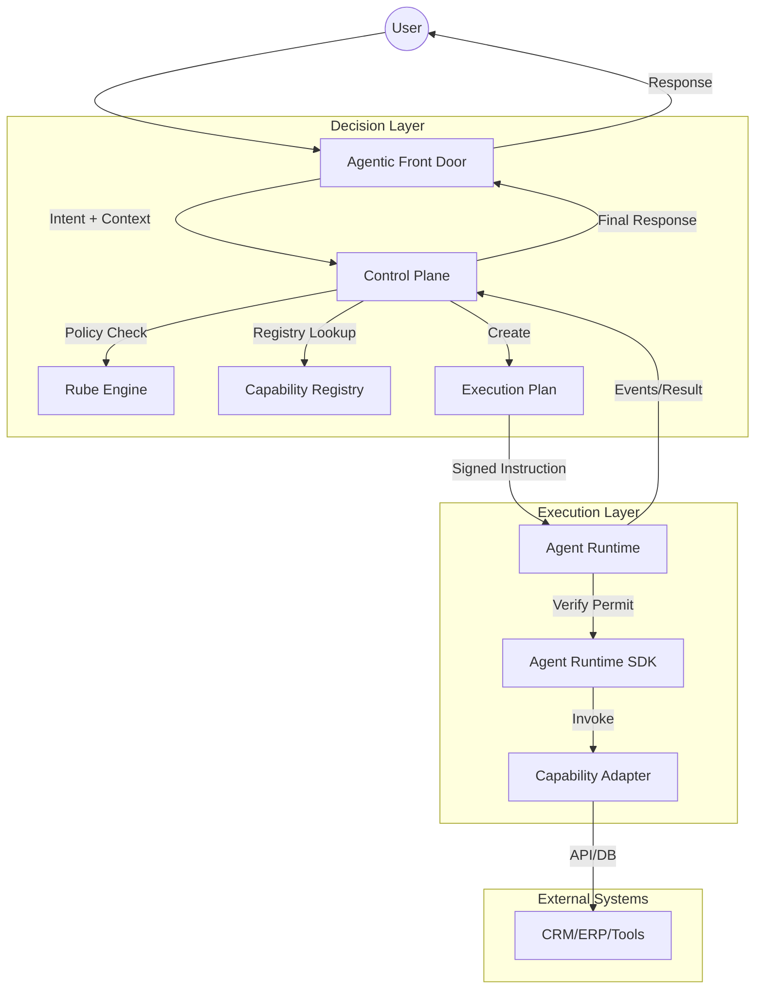

# SBA-Agentic Comprehensive Architecture

**Version**: 1.0.0
**Status**: Production-Ready

---

## 1. Executive Summary

SBA-Agentic adalah arsitektur agen AI tingkat enterprise yang dirancang untuk skalabilitas, keamanan, dan determinisme. Berbeda dengan sistem agen tradisional yang berbasis prompt murni, SBA-Agentic memisahkan **Otoritas Keputusan (Control Plane)** dari **Otoritas Eksekusi (Agent Runtime)** menggunakan kontrak **Execution Plan**.

## 2. High-Level Architecture Diagram

## 3. Core Components

### 3.1 Agentic Front Door (AFD)

- **Role**: Gerbang utama interaksi.
- **Functions**: Autentikasi, manajemen sesi, klasifikasi intent awal, dan routing ke Control Plane.
- **Technology**: Apps/front-door.

### 3.2 Control Plane (The "Brain")

- **Role**: Otoritas strategis dan tata kelola.
- **Functions**:
  - Intent Resolution (mendalami maksud user).
  - Policy Enforcement (via Rube Engine).
  - Capability Selection.
  - Pembuatan **Execution Plan** yang immutable.

- **Technology**: Apps/app.

### 3.3 Rube Engine (The "Guard")

- **Role**: Mesin kebijakan deklaratif.
- **Functions**: Memvalidasi apakah suatu aksi diizinkan berdasarkan tenant, user, risk level, dan quota.

### 3.4 Agent Runtime & SDK (The "Hands")

- **Role**: Lingkungan eksekusi terisolasi.
- **Functions**:
  - Verifikasi integritas Execution Plan.
  - Injeksi konteks (tenant_id, trace_id).
  - Eksekusi Capability Adapter.

- **Technology**: packages/sdk.

### 3.5 Capability Adapters (MCP-Compliant)

- **Role**: Unit eksekusi deterministik dan terstandardisasi.
- **Functions**:
  - Interaksi dengan sistem eksternal (CRM, ERP, Knowledge Base).
  - **Standardisasi**: Mengadopsi **Model Context Protocol (MCP)** untuk interoperabilitas alat (tool) lintas framework.
  - **Self-Describing**: Setiap adapter menyediakan manifest (name, description, input schema) yang dapat dibaca oleh Control Plane.

- **Technology**: packages/capabilities.

### 3.6 Agentic Information Literacy & Web Research

- **Role**: Pengumpulan informasi eksternal yang terverifikasi.
- **Functions**:
  - **6-Step Search Strategy**: Implementasi alur Starting -> Chaining -> Browsing -> Differentiating -> Monitoring -> Extracting.
  - **Hybrid Retrieval**: Gabungan semantic search (pgvector) dan Reranking untuk akurasi tinggi.
  - **Source Evaluation**: Penggunaan metode ROBOT dan Lateral Reading untuk memvalidasi kredibilitas sumber web.

- **Performance Benchmarks**:
  - **Latency**: p90 < 2s untuk orchestrated search; p90 < 200ms untuk cached hits.
  - **Accuracy**: >98% intent recognition accuracy pada multimodal capture.
  - **Resilience**: Circuit Breaker terintegrasi (5 failures/60s) dengan fallback ke knowledge base lokal.

## 4. Operational Flow (The Lifecycle)

1. **Ingress**: AFD menerima pesan "Update stok barang X".
2. **Analysis**: Control Plane mendeteksi intent `inventory.update`.
3. **Governance**: Rube Engine memverifikasi apakah Tenant A memiliki fitur `inventory-sync`.
4. **Planning**: Control Plane menerbitkan Execution Plan berisi instruksi untuk `inventory-adapter`.

5. **Execution (MCP Pattern)**:
   - Agent Runtime memuat adapter yang sesuai.
   - SDK membungkus adapter dalam **MCP Server** (atau adapter lokal) untuk eksekusi yang aman.
   - Parameter diinjeksi dan divalidasi secara ketat.

6. **Observability**: Setiap langkah dicatat dalam audit log dengan `trace_id` yang sama.

## 5. Security & Multi-tenancy

- **Isolation**: Setiap tenant memiliki context snapshot sendiri.
- **Zero Trust**: Adapter tidak bisa mengakses resource di luar yang diizinkan dalam Execution Plan.
- **Signed Plans**: Agent Runtime hanya mengeksekusi rencana yang ditandatangani secara kriptografis oleh Control Plane.

## 6. Observability & Feedback Loop

- **Tracing**: Menggunakan OpenTelemetry untuk melacak alur dari AFD hingga Adapter.
- **Metrics**: Memantau latensi eksekusi, tingkat keberhasilan intent, dan konsumsi kuota.
- **Reflection**: Control Plane mengevaluasi hasil eksekusi untuk meningkatkan akurasi intent di masa depan.
