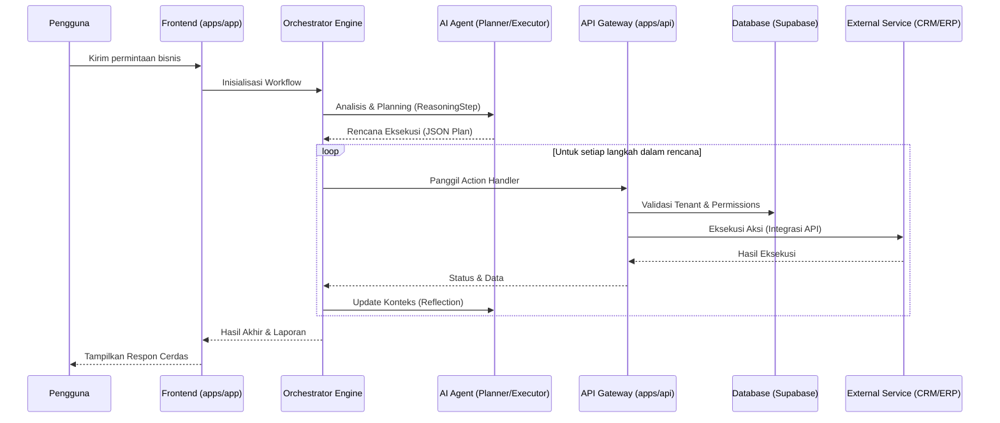
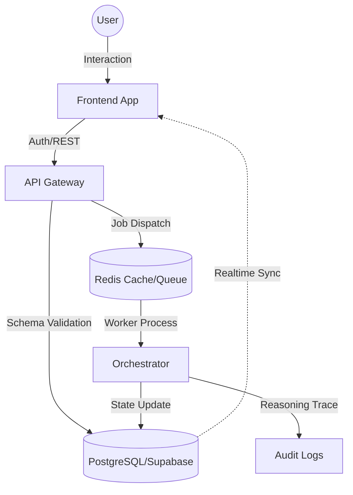
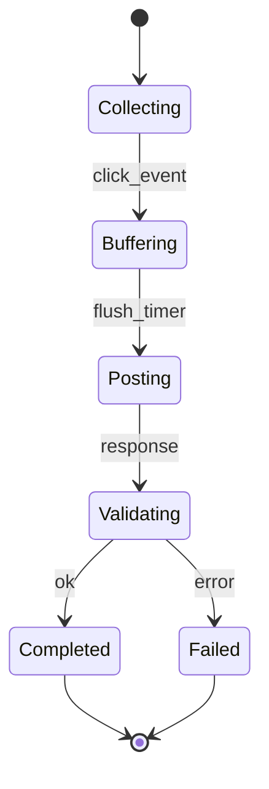
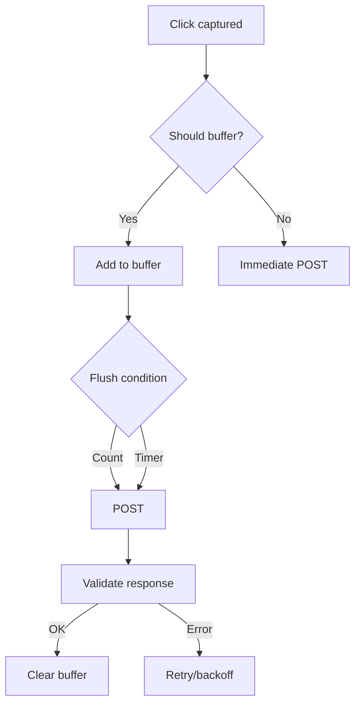

# 🏛️ 02 - Arsitektur Sistem

Dokumentasi ini memberikan gambaran komprehensif mengenai arsitektur, komponen, dan standar teknis sistem **SBA-Agentic**.

## 1. Overview
Sistem Smart Business Assistant (SBA-Agentic) dirancang untuk memberikan asisten cerdas bagi operasi bisnis. Sistem ini memanfaatkan arsitektur multi-agent untuk mengotomatisasi tugas, memberikan wawasan, dan memfasilitasi pengambilan keputusan.

## 2. Tujuan & Paradigma Arsitektur

### 2.1 Tujuan Sistem
Meningkatkan efisiensi dan efektivitas bisnis melalui otomatisasi cerdas dan wawasan berbasis data. Sistem ini bertujuan untuk merampingkan alur kerja, meningkatkan komunikasi, dan mendukung perencanaan strategis.

### 2.2 Paradigma Arsitektur
SBA-Agentic menggunakan pendekatan arsitektur hybrid yang menggabungkan beberapa paradigma mapan:

*   **Frontend**: Menggunakan pendekatan **Feature-Sliced Design (FSD)**, yang mengatur kode berdasarkan fitur daripada jenis, mempromosikan modularitas.
*   **Domain Layer**: Mengimplementasikan prinsip **Domain-Driven Design (DDD)**, berfokus pada pemahaman mendalam tentang domain bisnis.
*   **User Interface (UI)**: Mematuhi prinsip **Atomic Design**, memecah UI menjadi komponen terkecil (atoms) hingga struktur kompleks (pages).
*   **Monorepo**: Dikelola menggunakan **Turborepo** untuk optimalisasi proses build dan manajemen dependensi.

### 2.3 Diagram Arsitektur

```mermaid
flowchart LR
  subgraph Frontends
    A[apps/app (Next.js 15)]
    W[apps/web (Next.js 14)]
  end
  API[apps/api (NestJS)]
  SP[Shared Packages @sba/*]
  SB[(Supabase: Postgres + Realtime)]
  Q[Queue: Redis/BullMQ]

  A -- REST --> API
  A -- SSE/WS --> API
  W -- Fetch --> API
  W -- CRUD/Realtime --> SB

  API -- uses --> SP
  A -- transpile --> SP
  W -- transpile --> SP
  API -- Jobs --> Q
  API -- Prisma --> SB
```

**Deskripsi Diagram Arsitektur:**
Diagram di atas menunjukkan hubungan antara komponen utama SBA-Agentic. Terdapat dua aplikasi frontend (`apps/app` dan `apps/web`) yang berinteraksi dengan `apps/api` (NestJS) dan langsung ke Supabase. Shared packages digunakan oleh semua aplikasi. Queue (Redis/BullMQ) digunakan untuk pemrosesan latar belakang oleh API, sementara Prisma digunakan untuk interaksi database dengan Supabase.

## 3. Struktur Direktori & Konvensi

Sistem mematuhi struktur direktori yang didefinisikan dengan baik, mengikuti prinsip FSD yang dilengkapi dengan DDD dan Atomic Design.

### 3.1 Root Level Structure
```
sba-agentic/
├── apps/                   # Aplikasi individu (web, app, api)
├── packages/               # Paket/library yang dapat digunakan kembali (ui, sdk, types)
├── docs/                   # Dokumentasi proyek dan panduan arsitektur
├── workspace/              # Artefak proyek, PRD, desain arsitektur, agent flows
├── .github/                # Workflow GitHub Actions
├── package.json            # Dependensi monorepo dan script
├── turborepo.json          # Konfigurasi Turborepo
```

### 3.2 Frontend Application Structure (`src/`)
Mengikuti pola Feature-Sliced Design (FSD):
```
src/
├── app/                    # Application layer (Next.js app router, global config, providers)
├── pages/                  # Page components (routes)
├── widgets/                # Unit UI mandiri dengan logika bisnis
├── features/               # Fungsionalitas yang dihadapi pengguna
├── entities/               # Entitas bisnis inti, model, dan aturan dasar
├── shared/                 # Utilitas bersama, komponen UI dasar, API clients
```

## 4. Alur Kerja & Diagram (Workflow)

### 4.1 Alur Sistem Lengkap (Full System Flow)
Diagram berikut menggambarkan interaksi antara pengguna, asisten AI, dan sistem eksternal.



**Deskripsi Alur Sistem:**
Pengguna memulai dengan mengirimkan permintaan melalui dashboard. `Orchestrator Engine` kemudian berkoordinasi dengan `AI Agent` untuk merancang rencana langkah demi langkah. Setiap langkah dieksekusi melalui `API Gateway` yang melakukan validasi keamanan dan berinteraksi dengan layanan eksternal atau database. Hasilnya dikumpulkan kembali ke agent untuk refleksi sebelum diberikan jawaban akhir ke pengguna.

### 4.2 Alur Data & Komunikasi (Data Flow)
Diagram berikut menunjukkan bagaimana data mengalir dan disimpan di dalam sistem.



**Deskripsi Alur Data:**
Data interaksi pengguna masuk melalui frontend dan divalidasi oleh API Gateway. Informasi persisten disimpan di PostgreSQL, sementara tugas-tugas asinkron dikirim ke antrian Redis. Orchestrator memproses tugas-tugas tersebut, memperbarui status di database, dan mencatat jejak penalaran (reasoning trace) ke dalam log audit untuk transparansi.

### 4.3 Analytics Heatmap Flow


**Deskripsi State Machine:**
Diagram status ini menunjukkan siklus hidup pelacakan event klik. Dimulai dari status `Collecting`, event kemudian masuk ke `Buffering`. Setelah timer flush tercapai, sistem masuk ke status `Posting` untuk mengirim data. Hasil pengiriman divalidasi di status `Validating`, yang kemudian berakhir di status `Completed` (sukses) atau `Failed` (gagal).

#### Decision Tree


**Deskripsi Decision Tree:**
Diagram alur keputusan untuk penanganan klik UI. Ketika klik ditangkap, sistem memutuskan apakah harus melakukan buffering. Jika ya, data ditambahkan ke buffer hingga kondisi flush (jumlah atau waktu) terpenuhi sebelum di-POST. Jika tidak, data langsung di-POST. Setelah POST, respon divalidasi untuk menentukan apakah buffer harus dibersihkan atau dilakukan percobaan ulang (retry).

## 5. Komponen Utama (Deep Dive)

### 5.1 Orchestrator Engine
Orchestrator adalah otak dari sistem yang mengelola siklus hidup workflow.
- **State Management**: Menyimpan status eksekusi di PostgreSQL dan cache Redis.
- **Event Dispatching**: Mengirim event real-time ke frontend via SSE.
- **Error Recovery**: Menangani retry logic dan fallback jika agent gagal.

### 5.2 Agentic Core (Planner & Executor)
Sistem menggunakan pola pemisahan tugas antara perencanaan dan eksekusi:
- **PlannerAgent**: Menganalisis permintaan pengguna, memecah tugas menjadi `ReasoningStep`, dan membuat rencana eksekusi dalam format JSON.
- **ExecutorAgent**: Mengambil langkah dari rencana dan memanggil `Action Handler` yang sesuai.
- **Reflection**: Setelah setiap aksi, agent mengevaluasi hasilnya untuk memutuskan langkah selanjutnya.

### 5.3 Action Handlers (Tool Registry)
Semua aksi (API external, DB query, Document processing) dibungkus dalam handler standar:
- **Isolation**: Handler hanya memiliki akses ke resource yang diizinkan untuk tenant tersebut.
- **Validation**: Menggunakan Zod untuk memvalidasi input dan output.

## 6. Keamanan & Multi-tenancy

### 6.1 Isolasi Data (Multi-tenancy)
Kami menerapkan isolasi data yang ketat di tingkat database:
- **Row Level Security (RLS)**: Setiap tabel memiliki kebijakan RLS yang memastikan user hanya dapat mengakses data milik `tenant_id` mereka.
- **Tenant Context**: Setiap permintaan API wajib menyertakan konteks tenant yang divalidasi oleh middleware.

### 6.2 Autentikasi & RBAC
- **Autentikasi**: Menggunakan Clerk atau Supabase Auth untuk manajemen identitas.
- **RBAC (Role-Based Access Control)**: Izin diberikan berdasarkan peran (Admin, Manager, Agent). Pengecekan dilakukan di level API Gateway dan Action Handlers.

### 6.3 Audit Logging
Setiap keputusan agent dan aksi sistem dicatat dalam log audit yang tidak dapat diubah (immutable), mencakup:
- `ReasoningTrace`: Langkah pemikiran agent.
- `ActionPayload`: Data yang dikirim ke sistem eksternal.
- `ResultSnapshot`: Hasil dari aksi tersebut.

## 7. Strategi Pengujian (Testing Strategy)

Sistem menggunakan piramida pengujian yang komprehensif:
1.  **Unit Tests**: Menguji logika bisnis terkecil (Vitest).
2.  **Integration Tests**: Menguji interaksi antar komponen (Prisma + Docker Postgres).
3.  **E2E Tests**: Menguji alur pengguna lengkap (Playwright).
4.  **Agentic Simulation**: Menguji ketangguhan agent dalam skenario bisnis yang kompleks.

---
## 📖 Konten Detail
- **[Arsitektur internal-console.md](./Arsitektur%20internal-console.md)**: Arsitektur detail untuk Internal Control Plane (Tauri app).
- **[ARCHITECTURE_OVERVIEW.md](./ARCHITECTURE_OVERVIEW.md)**: Gambaran teknis mendalam dan teknologi stack.
- **[TECHNICAL_SPEC.md](./TECHNICAL_SPEC.md)**: Spesifikasi teknis dan rencana implementasi E2E.
- **[SYSTEM_CONSTITUTION.md](./SYSTEM_CONSTITUTION.md)**: Prinsip dasar dan konstitusi sistem.
- **[INTEGRATIONS_ARCHITECTURE.md](./INTEGRATIONS_ARCHITECTURE.md)**: Arsitektur integrasi pihak ketiga.
- **[ATOMIC_DESIGN.md](./ATOMIC_DESIGN.md)**: Standar desain UI berbasis Atomic Design.

## 👥 Audience
- **System Architects**: Untuk memahami gambaran besar dan integrasi.
- **Developers**: Untuk panduan implementasi dan struktur kode.
- **AI Agents**: Untuk navigasi dan konteks sistem.
