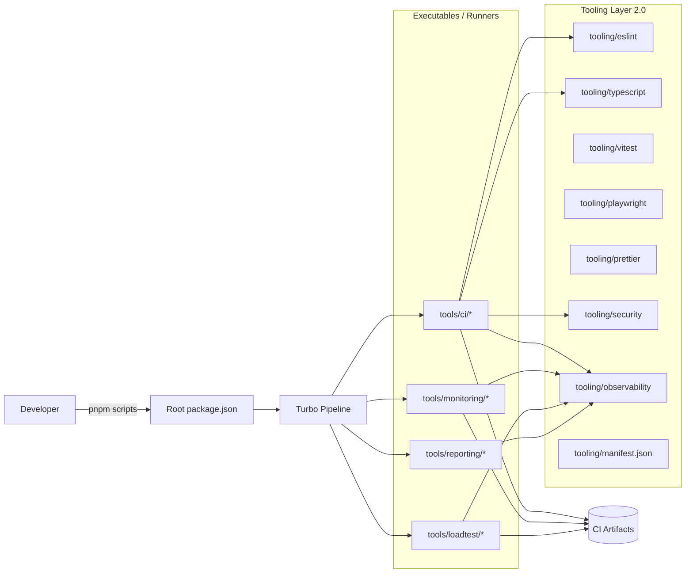
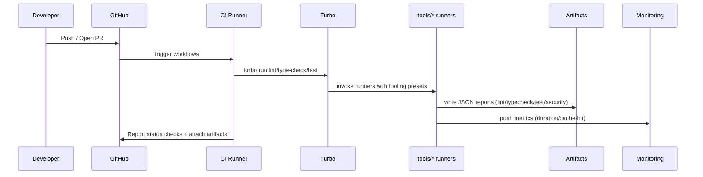
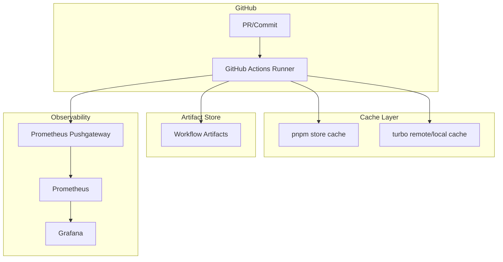
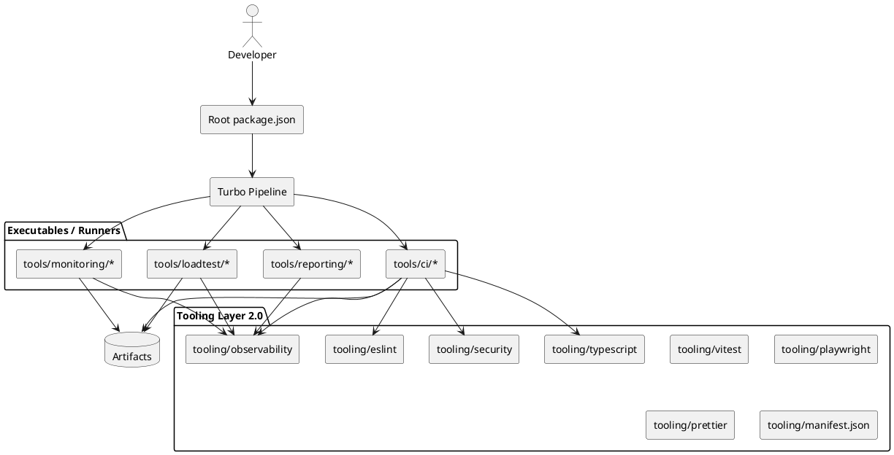
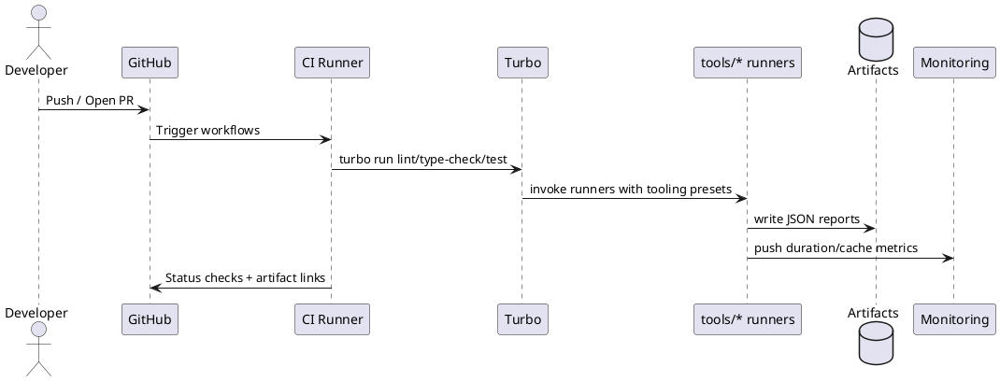

# Tooling Layer 2.0 — SBA-Agentic (Monorepo)

Dokumen ini adalah rancangan peningkatan mendalam untuk memperkuat dan melakukan refactor area tooling di monorepo SBA-Agentic, dengan fokus pada Tooling Layer 2.0.

---

## Kontrol Dokumen

| Atribut     | Nilai                                                      |
| ----------- | ---------------------------------------------------------- |
| ID Dokumen  | SBA-TOOLING-ARCH-002                                       |
| Judul       | Tooling Layer 2.0 — Target Architecture & Refactoring Plan |
| Domain      | Engineering Enablement                                     |
| Status      | Draft                                                      |
| Klasifikasi | Internal                                                   |
| Versi       | 2.0.0-draft                                                |
| Tanggal     | 2025-12-27                                                 |
| Owner       | Platform/Tooling Team                                      |
| Reviewer    | Eng Lead, Security Lead, CI/CD Owner                       |

## Ruang Lingkup

- Standarisasi preset tooling lint/format/typecheck/test/e2e/security untuk seluruh workspace.
- Penguatan “tooling runners” (scripts CI + reporting) agar konsisten dan terukur (artifacts + metrics).
- Integrasi bertahap melalui feature flag, tanpa memutus pipeline CI yang ada.

Tidak termasuk:

- Refactor fitur produk atau runtime aplikasi (di luar kebutuhan quality gate).
- Perubahan besar sistem build (mis. mengganti pnpm/turbo) di fase 3 bulan awal.
- Re-arsitektur observability produksi aplikasi (yang dibahas hanya telemetry untuk tooling/CI).

## Non-Goals

- Mencapai “zero-warning” untuk seluruh repo dalam satu PR besar.
- Menghapus seluruh config lama sebelum 2 sprint stabil (wajib ada rollback path).

## Peran & Tanggung Jawab (RACI)

| Area                                  | Responsible       | Accountable   | Consulted        | Informed       |
| ------------------------------------- | ----------------- | ------------- | ---------------- | -------------- |
| Preset ESLint/TS/Test                 | Platform/Tooling  | Eng Lead      | App Owners       | Semua engineer |
| CI workflows & caching                | CI/CD engineer    | CI/CD Owner   | Platform/Tooling | Semua engineer |
| Security gates & policy               | Security engineer | Security Lead | Platform/Tooling | Semua engineer |
| Tooling telemetry (artifacts/metrics) | Platform/Tooling  | CI/CD Owner   | Security         | Eng Lead       |

## Versioning & Distribusi Dokumen

- Dokumen ini version-controlled di repo (PR-based) dan menjadi kontrak desain untuk Tooling Layer 2.0.
- Versi dokumen mengikuti SemVer (major untuk breaking change rencana/kontrak; minor/patch untuk revisi non-breaking).
- Setiap perubahan yang mempengaruhi API/preset/quality gate wajib memperbarui Appendix D (Riwayat Perubahan).
- Validasi minimal untuk perubahan dokumen: `pnpm -s doc:lint` (root).

## Ringkasan Eksekutif

SBA-Agentic adalah monorepo berbasis Turborepo + pnpm workspaces. Tooling yang ada sudah fungsional, tetapi tersebar (root config + `tooling/*` + `tools/*` + `scripts/*`) dan belum memiliki “contract” yang jelas untuk:

- konsistensi lint/typecheck lintas workspace
- quality gate CI yang seragam (lint/test/typecheck/security/perf)
- observability untuk metrik tooling (durasi, cache-hit, resource)
- standardisasi interface konfigurasi (preset, manifest, versioning)

Tooling Layer 2.0 menargetkan:

- performa pipeline lebih cepat minimal 40% pada “lint + typecheck + guards”
- skalabilitas 2x workload (jumlah package/file meningkat) tanpa degradasi signifikan
- maintainability: pengurangan kompleksitas konfigurasi ≥ 50% (reduksi duplikasi config dan “snowflake config”)

---

# 1. Analisis Status Saat Ini

## 1.1 Pemetaan Komponen Utama & Alur Kerja

### Struktur tooling saat ini (fokus folder `tooling/`)

```text
tooling/
├─ eslint/
│  ├─ eslint.config.js
│  └─ web.eslint.config.mjs
├─ tailwind/
│  └─ tailwind.preset.cjs
└─ typescript/
   ├─ package.json
   ├─ base.json
   ├─ react-library.json
   ├─ nextjs.json
   └─ tsconfig.base.json
```

Catatan:

- Konfigurasi lint utama yang digunakan repo berada di root: [eslint.config.js](file:///home/inbox/smart-ai/sba-agentic/eslint.config.js)
- Tooling TS base dipakai banyak package, tetapi ada dua “base” yang berbeda: [tooling/typescript/base.json](file:///home/inbox/smart-ai/sba-agentic/tooling/typescript/base.json) vs [tooling/typescript/tsconfig.base.json](file:///home/inbox/smart-ai/sba-agentic/tooling/typescript/tsconfig.base.json)
- Repo memiliki “tooling executables” yang terpisah di [tools/](file:///home/inbox/smart-ai/sba-agentic/tools) (CI scripts, loadtest, reporting, monitoring), yang secara fungsi adalah bagian dari tooling layer, namun tidak dipaketkan sebagai “tooling presets” yang reusable.

### Alur kerja tooling saat ini (local + CI)

**Local developer flow (ringkas):**

1. Developer menjalankan lint/typecheck/test via root scripts (pnpm)
2. Pre-commit menggunakan `lint-staged` dari root `package.json` (Prettier + validate frontmatter)
3. Pre-push tidak terdefinisi eksplisit di repo root, tetapi CI menjalankan lint/test/e2e/security.

**CI flow (ringkas):**

- “Lint baseline gate”: `pnpm -s ci:lint` menjalankan [tools/ci/eslint-baseline.mjs](file:///home/inbox/smart-ai/sba-agentic/tools/ci/eslint-baseline.mjs)
- Typecheck: `pnpm run type-check:test:global` (suite type-check untuk test configs), `pnpm run type-check` (turbo)
- E2E & perf: workflow khusus seperti [perf-benchmark.yml](file:///home/inbox/smart-ai/sba-agentic/.github/workflows/perf-benchmark.yml)

Referensi internal: [ci-cd-overview.md](file:///home/inbox/smart-ai/sba-agentic/docs/ci-cd-overview.md), [type-check-playbook.md](file:///home/inbox/smart-ai/sba-agentic/docs/type-check-playbook.md)

## 1.2 Metrik Performa Saat Ini (Durasi, Resource Proxy)

Karena eksekusi tooling mayoritas berjalan sebagai proses Node/CLI, baseline metrik yang paling dapat dibandingkan lintas environment adalah “durasi wall-clock” per job + cache-hit. Repo sudah memiliki artefak ringkas untuk typecheck.

### Baseline metrik yang tersedia (artifact-based)

**Typecheck (report configs):** [artifacts/typecheck-summary.json](file:///home/inbox/smart-ai/sba-agentic/artifacts/typecheck-summary.json) (via `pnpm run type-check:report`)

- totalDurationMs: 9935 ms (~9.9s)
- tsconfig.test.utils.json: 3521 ms
- tsconfig.test.shared.json: 3500 ms
- tsconfig.test.services.json: 2914 ms

**Lint baseline status:** [eslint-warnings.summary.json](file:///home/inbox/smart-ai/sba-agentic/ci-artifacts/eslint-warnings.summary.json)

- baselineWarnings: 891
- currentWarnings: 886
- baselineErrors/currentErrors: 0/0

**Distribusi warning lint (indikator debt):** [eslint-warnings.breakdown.json](file:///home/inbox/smart-ai/sba-agentic/ci-artifacts/eslint-warnings.breakdown.json)

- top rule: `@typescript-eslint/no-unused-vars` (645)
- top rule: `no-console` (230)

### Interpretasi metrik

- Lint gate “lulus” karena baseline gating, tetapi warn volume tinggi → noise tinggi, biaya review meningkat, dan menyulitkan pengetatan kualitas.
- Typecheck report relatif cepat untuk subset target tertentu (~9s), namun belum mencakup keseluruhan workspace secara “incremental/cached” untuk jalur PR.

### Catatan penggunaan resource (status saat ini)

- Peak RSS/CPU time untuk lint/typecheck/test belum distandarkan sebagai artifact, sehingga belum ada baseline “resource budget” yang dapat dipantau dari waktu ke waktu.
- Tooling Layer 2.0 mewajibkan export metrik resource minimal: peak RSS (MB), user/sys CPU time (s), dan jumlah proses, per stage CI.

## 1.3 Audit Kode: Technical Debt & Code Smell (Tooling)

### A. Duplikasi & “snowflake config”

- ESLint: root flat config kini didelegasikan ke preset di `tooling/eslint`, sementara `tooling/eslint/eslint.config.js` tetap sebagai legacy config yang akan dipensiunkan bertahap.
  - Root: [eslint.config.js](file:///home/inbox/smart-ai/sba-agentic/eslint.config.js)
  - Flat preset: [flat.config.js](file:///home/inbox/smart-ai/sba-agentic/tooling/eslint/flat.config.js)
  - Tooling: [tooling/eslint/eslint.config.js](file:///home/inbox/smart-ai/sba-agentic/tooling/eslint/eslint.config.js)
  - Web khusus: [tooling/eslint/web.eslint.config.mjs](file:///home/inbox/smart-ai/sba-agentic/tooling/eslint/web.eslint.config.mjs)
- TypeScript: ada dua base config berbeda (NodeNext vs Bundler) yang dipakai oleh package yang berbeda, berpotensi memunculkan perilaku resolusi module yang berbeda untuk kasus yang sama.
  - NodeNext: [tooling/typescript/tsconfig.base.json](file:///home/inbox/smart-ai/sba-agentic/tooling/typescript/tsconfig.base.json)
  - Bundler: [tooling/typescript/base.json](file:///home/inbox/smart-ai/sba-agentic/tooling/typescript/base.json)

### B. “Hard-coded paths” di config lint

Root ESLint memerlukan daftar file/dir khusus (contoh app/api controllers) untuk TS project-aware lint. Ini meningkatkan biaya maintenance saat struktur modul berubah.

### C. Debt indikator dari lint breakdown

Dominasi `no-unused-vars` mengindikasikan:

- ketidakseragaman aturan lint (warning-heavy, bukan error)
- kurangnya aturan “autofix + code action” atau pipeline perbaikan bertahap
- potensi mismatch TS project linting (lint berjalan pada subset file)

## 1.4 Bottleneck: Profiling & Monitoring (Temuan + Rencana Pengukuran)

### Temuan saat ini (berdasarkan arsitektur dan artefak)

- Lint menggunakan baseline check yang melakukan full scan ESLint → bottleneck meningkat saat file bertambah.
- Root lint belum memanfaatkan pipeline Turborepo secara optimal (lint root tidak “turbo run lint”).
- Typecheck global punya artifact durasi, tetapi belum ada standardisasi export metrik lint/test/build ke sistem monitoring.

### Monitoring yang sudah tersedia di repo

- Prometheus/Grafana konfigurasi ada di [monitoring/](file:///home/inbox/smart-ai/sba-agentic/monitoring) dan [ops/monitoring](file:///home/inbox/smart-ai/sba-agentic/ops/monitoring)
- Push metrics CI ke Pushgateway: [push_metrics.sh](file:///home/inbox/smart-ai/sba-agentic/ops/ci/push_metrics.sh)
- Pengumpulan snapshot metrics aplikasi: [metrics-writer.js](file:///home/inbox/smart-ai/sba-agentic/tools/monitoring/metrics-writer.js)

### Rencana profiling tooling (yang harus menjadi bagian Tooling Layer 2.0)

Standarkan metrik berikut pada setiap job CI:

- duration_ms per stage (lint/typecheck/test/build/security)
- turbo cache-hit ratio per task (jika menggunakan `turbo run`)
- peak RSS dan CPU time (via time -v atau Node perf hooks)
- jumlah file yang diproses (lint/typecheck)

Output wajib ditulis sebagai artifact JSON + opsional push ke Pushgateway (label: pipeline, stage, repo, sha).

## 1.5 Redundansi Fungsi & Modul

### Redundansi utama

- ESLint configs: root flat config didelegasikan ke `tooling/eslint`, masih ada legacy + web-specific untuk migrasi bertahap.
- TypeScript configs ganda (dua base) memecah standar.
- “Tooling layer” dan “tools executables” tercampur: beberapa hal yang seharusnya preset reusable masih berupa script bespoke.

## 1.6 Gap: Kebutuhan Bisnis vs Kemampuan Teknis

Kebutuhan enterprise SaaS (monorepo, multi-tenant, high-trust security, cross-team) membutuhkan:

- standardisasi lint/typecheck/test lintas package tanpa daftar manual
- enforcement bertahap menuju “zero-warning” untuk subset kritis
- pipeline CI yang cepat dan deterministik (cache, incremental, baseline gating yang jelas)
- security gates (dependency audit, secret scanning, SAST/DAST baseline)
- observability untuk kinerja tooling (SLO internal untuk CI)

Kemampuan saat ini sudah memiliki pondasi, tetapi belum:

- punya “tooling contract” (manifest + versi preset + kompatibilitas)
- mengukur dan menargetkan performa tooling secara formal
- menyatukan config yang tersebar menjadi komponen yang reusable dan bisa di-upgrade terkontrol

---

# 2. Target Arsitektur Tooling Layer 2.0

## 2.1 Prinsip Arsitektur

- **Single source of truth** untuk preset (lint, tsconfig, test, formatting) melalui `tooling/*`
- **Executable vs preset dipisah**:
  - `tooling/*`: paket konfigurasi/preset/library (reusable)
  - `tools/*`: binary/CLI runner (menggunakan preset)
- **Observability-by-default**: setiap runner menghasilkan artifact JSON dan bisa push metrik ke monitoring
- **Backward compatible migration**: perubahan dilakukan bertahap dengan feature flag dan adaptor

## 2.2 Target Struktur (Layer 2.0)

```text
tooling/
├─ eslint/                     (preset lint + guard rules)
├─ typescript/                 (tsconfig profiles: app/web/node/lib/test)
├─ tailwind/                   (design token preset)
├─ prettier/                   (format profile)
├─ vitest/                     (unit/integration presets)
├─ playwright/                 (e2e presets)
├─ ci/                         (CI helpers: baseline gates, reporters)
├─ security/                   (dependency/secret scanning policy)
├─ observability/              (tooling metrics schema + exporters)
└─ manifest.json               (versi, kompatibilitas, capability)

tools/
├─ ci/                         (runner: eslint-baseline, openapi baseline, artifacts)
├─ monitoring/                 (runner: benchmark-report, metrics-writer)
├─ loadtest/                   (k6 runner + publisher)
└─ reporting/                  (report generator)
```

## 2.2.1 Struktur Monorepo (Implementasi di repo)

```text
/
├─ apps/
│  ├─ app/                  (Next.js app utama)
│  ├─ web/                  (Frontend tambahan/eksperimen)
│  ├─ api/                  (NestJS API)
│  ├─ orchestrator/         (runtime orchestrator)
│  ├─ docs/                 (docs site + e2e)
│  └─ marketing/            (marketing site + e2e)
├─ packages/                (shared libraries @sba/*)
├─ tooling/                 (Tooling Layer 2.0 presets/contract)
├─ tools/                   (runners/CLI untuk CI, reporting, monitoring)
└─ scripts/                 (script repo-level; CI guards, docs tooling)
```

Pembagian modul (ringkas):

- **Modul inti SBA-Agentic**: `packages/sdk`, `packages/rube`, `packages/agentic-reasoning`, `packages/agentic-meta-events`
- **Shared libraries (platform/cross-cutting)**: `packages/auth`, `packages/security`, `packages/telemetry`, `packages/observability`, `packages/analytics`, `packages/db`, `packages/kv`, `packages/supabase`, `packages/integrations`, `packages/email`, `packages/logger`, `packages/services`, `packages/jobs`
- **Shared libraries (UI/UX & contracts)**: `packages/ui`, `packages/entities`, `packages/shared`, `packages/shared-utils`, `packages/utils`, `packages/ag-ui-protocol`, `packages/agui-client`, `packages/api-client`, `packages/api-types`, `packages/cms`

## 2.2.2 Boundary Modul (Enforcement)

Enforcement minimal yang sudah berjalan di repo:

- **Import boundary (no deep imports)**: blokir `@sba/*/src/*` via [guard-entities-imports.js](file:///home/inbox/smart-ai/sba-agentic/scripts/ci/guard-entities-imports.js)
- **Tooling contract**: validasi referensi path tooling via [guard-tooling-manifest.js](file:///home/inbox/smart-ai/sba-agentic/tools/ci/guard-tooling-manifest.js)
- **Shared dependency management**: dependensi internal wajib pakai `workspace:*`/`workspace:^`/`workspace:~` (dicek oleh guard tooling)

## 2.2.3 Panduan Setup Developer

Prasyarat:

- Node.js sesuai `engines.node` di root `package.json` (minimal >= 18)
- pnpm sesuai `packageManager` di root `package.json` (pnpm 8.15.x)

Setup:

```bash
pnpm install
```

Perintah harian:

- Dev: `pnpm dev` (menjalankan task `dev` via turbo)
- Lint baseline gate: `pnpm ci:lint`
- Guards: `pnpm ci:guard`
- Typecheck: `pnpm check`
- Test: `pnpm test`

## 2.2.4 Alur Pengembangan Fitur Baru (Monorepo)

Alur minimal yang kompatibel dengan Layer 2.0:

1. Pilih lokasi perubahan: `apps/*` (produk) atau `packages/*` (shared library).
2. Jika menambah library baru, gunakan namespace `@sba/<name>` dan dependensi internal pakai `workspace:^`.
3. Konsumsi config tooling dari `tooling/*` (mis. Vitest preset, Playwright helper, Prettier config).
4. Pastikan tidak ada deep import `@sba/*/src/*` dan public API diekspos via entrypoint package.
5. Jalankan gate lokal: `pnpm ci:lint && pnpm ci:guard && pnpm check && pnpm test`.

## 2.2.5 Strategi Testing dan Deployment

Testing:

- Unit/Integration: `turbo run test` (Vitest/Jest per package/app).
- Typecheck: `turbo run type-check` + suite khusus test-config via `pnpm type-check:test:global` saat diperlukan.
- E2E: Playwright per app (mis. `apps/app/playwright.config.ts`, `apps/web/playwright.config.ts`).

Deployment:

- Pipeline PR: lint baseline + guards + typecheck + tests (lihat workflows utama di `.github/workflows/*`).
- Staging/Prod: workflow deploy terpisah (mis. `deploy-staging.yml`, `deploy-with-rollback.yml`, `prod-deploy-gate.yml`) dengan rollback path.

## 2.3 Diagram UML (Mermaid)

### A. Component Diagram — Tooling Layer 2.0



### B. Sequence Diagram — PR Quality Gate (Lint/Typecheck/Test/Security)



### C. Deployment Diagram — CI/CD & Observability



## 2.3.1 Diagram UML (PlantUML) — Opsional

Catatan: bagian ini disediakan untuk tim yang menggunakan renderer PlantUML dalam pipeline dokumentasi internal.

### A. Component Diagram — Tooling Layer 2.0 (PlantUML)



### B. Sequence Diagram — PR Quality Gate (PlantUML)



### C. Deployment Diagram — CI/CD & Observability (PlantUML)

```plantuml
@startuml
node "GitHub" {
  artifact "PR/Commit" as PR
  node "GitHub Actions Runner" as Actions
}

node "Cache Layer" {
  database "pnpm store cache" as PnpmCache
  database "turbo cache" as TurboCache
}

node "Artifact Store" {
  database "Workflow Artifacts" as GHArtifacts
}

node "Observability" {
  node "Pushgateway" as PushGW
  node "Prometheus" as Prom
  node "Grafana" as Graf
}

PR --> Actions
Actions --> PnpmCache
Actions --> TurboCache
Actions --> GHArtifacts
Actions --> PushGW
PushGW --> Prom --> Graf
@enduml
```

## 2.4 Spesifikasi Teknis Komponen Utama

### A. `tooling/manifest.json` (Contract & Versioning)

Tujuan: menyediakan contract tooling lintas workspace:

- versi preset per domain (eslint/typescript/vitest/playwright/security)
- minimal versions Node/pnpm
- capability flags (baseline gating, cache, metrics export)
- kompatibilitas (breaking changes, migration notes)

Implementasi (saat ini):

- Manifest: [manifest.json](file:///home/inbox/smart-ai/sba-agentic/tooling/manifest.json)
- Workspace packages (pnpm):
  - [tooling/eslint/package.json](file:///home/inbox/smart-ai/sba-agentic/tooling/eslint/package.json)
  - [tooling/typescript/package.json](file:///home/inbox/smart-ai/sba-agentic/tooling/typescript/package.json)
  - [tooling/tailwind/package.json](file:///home/inbox/smart-ai/sba-agentic/tooling/tailwind/package.json)
  - [tooling/observability/package.json](file:///home/inbox/smart-ai/sba-agentic/tooling/observability/package.json)
  - [tooling/security/package.json](file:///home/inbox/smart-ai/sba-agentic/tooling/security/package.json)
  - [tooling/ci/package.json](file:///home/inbox/smart-ai/sba-agentic/tooling/ci/package.json)

### B. `tooling/observability` (Tooling Telemetry)

Wajib menghasilkan schema metrik standar:

- `tooling_stage_duration_ms{stage,workflow,ref}`
- `tooling_cache_hit_ratio{task,workflow}`
- `tooling_warnings_total{tool,ruleId?}`
- `tooling_errors_total{tool,code?}`

Integrasi default dengan:

- artifacts JSON di `ci-artifacts/` atau `artifacts/`
- push optional via [push_metrics.sh](file:///home/inbox/smart-ai/sba-agentic/ops/ci/push_metrics.sh)

Implementasi (saat ini):

- Schema: [schema.json](file:///home/inbox/smart-ai/sba-agentic/tooling/observability/schema.json)

### C. `tooling/typescript` (Profiles)

Target: satu base yang konsisten, dan profile turunan:

- app nextjs (bundler)
- node library
- react library
- test-only (noEmit, globals)
- lint-only (untuk type-aware ESLint)

### D. `tooling/eslint` (Policy)

Target: flat config modular:

- base rules
- react/next rules
- node rules
- test rules
- import boundary rules (FSD/DDD constraints)
- security rules (tanpa false-positive yang mengganggu)

Implementasi (saat ini):

- Root config mendelegasikan ke preset: [eslint.config.js](file:///home/inbox/smart-ai/sba-agentic/eslint.config.js) → [flat.config.js](file:///home/inbox/smart-ai/sba-agentic/tooling/eslint/flat.config.js)

### E. `tooling/tailwind` (Design Tokens)

Target: preset Tailwind menjadi single source of truth untuk token & base design system.

Implementasi (saat ini):

- Preset: [tailwind.preset.cjs](file:///home/inbox/smart-ai/sba-agentic/tooling/tailwind/tailwind.preset.cjs)
- Root config memakai preset: [tailwind.config.js](file:///home/inbox/smart-ai/sba-agentic/tailwind.config.js)
- Apps memakai preset yang sama:
  - [apps/app/tailwind.config.js](file:///home/inbox/smart-ai/sba-agentic/apps/app/tailwind.config.js)
  - [apps/web/tailwind.config.ts](file:///home/inbox/smart-ai/sba-agentic/apps/web/tailwind.config.ts)

Catatan best practice:

- Gunakan `presets` untuk berbagi baseline; simpan kustomisasi per-app di `theme.extend`.
- Pastikan `content` Tailwind spesifik ke folder yang digunakan agar output CSS minimal.
- Pertahankan pipeline PostCSS (`tailwindcss` + `autoprefixer`) untuk kompatibilitas browser.

### F. `tooling/prettier` (Format Profile)

Target: satu format profile yang dipakai oleh root scripts + lint-staged + editor tooling.

Implementasi (saat ini):

- Root config mendelegasikan ke preset: [prettier.config.cjs](file:///home/inbox/smart-ai/sba-agentic/prettier.config.cjs) → [prettier.config.cjs](file:///home/inbox/smart-ai/sba-agentic/tooling/prettier/prettier.config.cjs)
- Root script memakai preset: [package.json](file:///home/inbox/smart-ai/sba-agentic/package.json)
- Lint-staged root memakai preset: [.lintstagedrc.json](file:///home/inbox/smart-ai/sba-agentic/.lintstagedrc.json)
- Wrapper per-app (extends preset): [.prettierrc.cjs](file:///home/inbox/smart-ai/sba-agentic/apps/app/.prettierrc.cjs)

### G. `tooling/vitest` (Test Preset)

Target: preset helper untuk mengurangi duplikasi default dan menjaga konsistensi (terutama CI flags dan exclude coverage).

Implementasi (saat ini):

- Preset helper: [preset.ts](file:///home/inbox/smart-ai/sba-agentic/tooling/vitest/preset.ts)
- Root config memakai preset: [vitest.config.ts](file:///home/inbox/smart-ai/sba-agentic/vitest.config.ts)

### H. `tooling/playwright` (E2E Preset)

Target: helper/preset kecil untuk shared logic (URL parsing, defaults) supaya config per-app lebih tipis.

Implementasi (saat ini):

- Helper URL: [url.ts](file:///home/inbox/smart-ai/sba-agentic/tooling/playwright/url.ts)
- Digunakan oleh app config: [playwright.config.ts](file:///home/inbox/smart-ai/sba-agentic/apps/app/playwright.config.ts), [playwright.config.ts](file:///home/inbox/smart-ai/sba-agentic/apps/web/playwright.config.ts)

### I. `tooling/security` (Policy)

Target: policy untuk dependency/secret scanning dan guard yang konsisten.

Implementasi (saat ini):

- Preset structure: [tooling/security](file:///home/inbox/smart-ai/sba-agentic/tooling/security/package.json) (Scaffolded)
- Guard security berjalan via root scripts: [package.json](file:///home/inbox/smart-ai/sba-agentic/package.json) (`ci:guard:*`) dan helpers: [scripts/ci](file:///home/inbox/smart-ai/sba-agentic/scripts/ci), [tools/ci](file:///home/inbox/smart-ai/sba-agentic/tools/ci)

### J. `tooling/ci` (CI Helpers)

Target: wrappers untuk baseline gates + reporters, dengan runner tetap di `tools/ci`.

Implementasi (saat ini):

- Preset structure: [tooling/ci](file:///home/inbox/smart-ai/sba-agentic/tooling/ci/package.json) (Scaffolded)
- Runner berada di [tools/ci](file:///home/inbox/smart-ai/sba-agentic/tools/ci)

## 2.5 Target Peningkatan (KPI)

### Performa (≥ 40% lebih cepat)

Baseline yang sudah terukur:

- typecheck global configs: ~14.9s total (artifact)

Target 40% lebih cepat:

- typecheck global configs: ≤ 9.0s (dengan incremental/caching + profile consolidation)

### Skalabilitas (2x beban kerja)

Target: saat file TS/TSX bertambah 2x, durasi lint+typecheck tidak naik linear.

Kunci:

- task-level caching (turbo)
- partitioning (per package / per scope)
- avoid full-repo type-aware lint pada setiap perubahan kecil

### Maintainability (≥ 50% kompleksitas turun)

Proxy metric (yang harus diukur):

- jumlah “base config” TypeScript turun dari 2 menjadi 1 (satu standar moduleResolution)
- jumlah override block lint di root turun (target: dari multi-app bespoke menjadi preset + override minimal)
- jumlah file config “unik” lint/ts/test di repo berkurang signifikan (target: -50%)
- aturan lint per-app dikurangi, digantikan preset + override minimal
- hilangkan “hard-coded list” dan gantikan dengan pola/glob yang stabil

## 2.6 Rencana Integrasi

### A. Dengan CI/CD yang ada

- Align pada scripts di root [package.json](file:///home/inbox/smart-ai/sba-agentic/package.json) dan workflows di `.github/workflows/*`
- Gunakan pipeline caching Turborepo [turbo.json](file:///home/inbox/smart-ai/sba-agentic/turbo.json)
- Integrasikan artifact/reporting yang sudah ada (lint baseline, openapi diff, reports)

### B. Dengan modul lain di monorepo

- Apps: `apps/*` harus memakai preset TS/ESLint konsisten
- Packages: `packages/*` mengadopsi profile tsconfig untuk node/react/library
- Tools: `tools/*` memakai `tooling/*` sebagai dependency (bukan config tersendiri)

### C. External dependencies

- `@mermaid-js/mermaid-cli` sudah tersedia untuk diagram build via `pnpm run diagrams:build`
- `openapi-diff`, `@stoplight/spectral-cli`, `prism-cli` untuk schema/tool contract (lihat [ci-tooling-setup.md](file:///home/inbox/smart-ai/sba-agentic/docs/development/ci-tooling-setup.md))

## 2.7 Kolaborasi Multi-Agent (SOLOCoder, SOLOBuilder, SuperAgent)

Tujuan: menyediakan mekanisme kolaborasi berkelanjutan antar agent untuk menjalankan workflow Tooling Layer 2.0 (audit, refactor, integrasi CI, reporting) dengan komunikasi real-time dan pelacakan progres.

### A. Peran agent

- `@SuperAgent`: koordinator utama, pembagi task, dan pemegang kontrak artifact/progres.
- `@SOLOCoder`: fokus penulisan/rekayasa kode inti (preset, runner, schema).
- `@SOLOBuilder`: fokus integrasi sistem dan deployment (CI workflows, guard rails, artifact wiring).

### B. Mekanisme komunikasi real-time

- Bus event in-process berbasis pub/sub (real-time) yang menyiarkan event: assignment, log, research output, completion/failure.
- Event disimpan ringkas di artifact untuk audit (rolling window) dan debugging.

Implementasi:

- Runner supervisor: [superAgent.js](file:///home/inbox/smart-ai/sba-agentic/tools/agentic/superAgent.js)
- Bus event: [bus.js](file:///home/inbox/smart-ai/sba-agentic/tools/agentic/bus.js)
- Penyimpanan progres: [progressStore.js](file:///home/inbox/smart-ai/sba-agentic/tools/agentic/progressStore.js)
- Agent worker: [soloCoder.js](file:///home/inbox/smart-ai/sba-agentic/tools/agentic/agents/soloCoder.js), [soloBuilder.js](file:///home/inbox/smart-ai/sba-agentic/tools/agentic/agents/soloBuilder.js)

### C. Pelacakan progres & artifact contract

Artifact standar:

- `ci-artifacts/agentic-collaboration.json` (dibuat oleh `@SuperAgent`)

Konten minimal:

- `tasks[]`: daftar task dengan status `pending|in_progress|completed|failed`, assignedTo, timestamps, result/error
- `events[]`: rolling event log untuk observability/debugging

### D. Integrasi CI (continuous validation)

- Guard baru: `pnpm run ci:guard:agents` menjalankan simulasi singkat kolaborasi agent dan memvalidasi artifact schema.
- Unit test: [agent-collaboration.test.js](file:///home/inbox/smart-ai/sba-agentic/tools/ci/__tests__/agent-collaboration.test.js) memastikan routing task ke `@SOLOCoder` dan `@SOLOBuilder`.

### E. Pelacakan progres real-time (local)

- Jalankan supervisor: `pnpm run agents:run`
- Pantau progres secara real-time (berbasis perubahan file artifact): `pnpm run agents:watch`

### E. Batasan keamanan

- Agent tidak mengeksekusi kode arbitrer di luar runner yang ditentukan; riset dilakukan via tool internal (code-search) dan output dicatat.

---

# 3. Rencana Refactoring

## 3.1 Daftar Perubahan Struktural

### Modul yang diubah/dihapus/ditambahkan (Tooling Layer)

### Diubah

- `tooling/typescript/*`: konsolidasi menjadi satu base + profiles; deprecate salah satu base yang redundan.
- `tooling/eslint/*`: migrasi dari config yang tidak dipakai ke preset modular yang dipakai root.

### Ditambahkan

- `tooling/observability` (schema + exporter)
- `tooling/ci` (wrappers untuk baseline gates + reporters)
- `tooling/security` (policy + minimal config)
- `tooling/prettier`, `tooling/vitest`, `tooling/playwright` sebagai preset resmi (mengikuti template layer 2.0)
- `tooling/manifest.json` sebagai contract versi

### Direlokasi (tanpa mengubah fungsionalitas)

- sebagian utilitas `tools/ci` yang bersifat “policy/preset” dipindah menjadi library di `tooling/ci`, sementara runner tetap di `tools/ci`.

## 3.2 Perubahan Interface dan API

Target perubahan “public surface” tooling:

- `extends` TS config: semua package meng-extend profile yang konsisten (bukan file base yang berbeda-beda)
- lint runner: root scripts mengarah ke preset `tooling/eslint` dan meminimalisir per-app custom list
- standard output schema: semua runner menghasilkan JSON terstandar (untuk reporting + monitoring)

## 3.3 Migrasi Data (Jika Diperlukan)

Tidak ada migrasi data bisnis, tetapi ada “migrasi metadata”:

- baseline lint warnings (file baseline) tetap dipertahankan; hanya mekanisme pengukuran dan pelaporan yang distandarkan.
- artifact path distandarkan: `ci-artifacts/` untuk CI, `artifacts/` untuk local/perf.

## 3.4 Strategi Migrasi Bertahap (Timeline + Feature Flag)

### Fase migrasi (high-level)

- Fase A: pasang preset baru tanpa mengubah behavior default (compat mode)
- Fase B: pindahkan 1 app + 1 package sebagai pilot (mis. apps/web + packages/ui)
- Fase C: rollout bertahap ke semua workspace
- Fase D: aktifkan pengetatan (warning budget, import boundary, security gates)

### Feature flags (tooling-level)

Flag di-level CI/script:

- `TOOLING_V2_ENABLED=1` mengaktifkan runner/preset baru
- `TOOLING_METRICS_PUSH=1` push metrics ke Pushgateway
- `TOOLING_STRICT_MODE=1` menaikkan threshold (max warnings, coverage gate)

## 3.5 Kompatibilitas Mundur

- Semua preset harus menyediakan mode “v1-compatible” minimal 4 minggu untuk menghindari gangguan delivery tim lain.
- Deprecation window: 2 sprint sebelum penghapusan config lama.

## 3.6 Manajemen Dependensi

### Analisis dampak

- TypeScript: perubahan moduleResolution dapat memunculkan error baru; mitigasi lewat pilot + lint/typecheck matrix.
- ESLint: type-aware lint membutuhkan `project` per workspace; mitigasi lewat tsconfig lint profile.
- CI: perubahan output artifact harus kompatibel dengan workflow yang sudah ada.

### Versioning strategy

- Preset di `tooling/*` mengikuti semver internal.
- `tooling/manifest.json` menjadi sumber kebenaran versi preset.
- Breaking change wajib menambah “migration notes” di section “Riwayat Perubahan” dokumen ini.

---

# 4. Implementasi (Jadwal 3 Bulan)

Durasi: 12 minggu, milestone setiap 2 minggu (6 sprint).

## 4.1 Command Matrix & Artifact Contract (Local + CI)

Target: setiap stage punya command yang konsisten, output artifact JSON yang standar, dan aturan gate yang terukur.

| Stage     | Local command (root)                     | CI impl (contoh)                                                                                              | Artifact minimal                            | Gate ringkas                                |
| --------- | ---------------------------------------- | ------------------------------------------------------------------------------------------------------------- | ------------------------------------------- | ------------------------------------------- |
| Lint      | `pnpm run ci:lint`                       | Baseline gate via [eslint-baseline.mjs](file:///home/inbox/smart-ai/sba-agentic/tools/ci/eslint-baseline.mjs) | `ci-artifacts/eslint-warnings.summary.json` | currentWarnings tidak naik vs baseline      |
| Typecheck | `pnpm run check` / `pnpm run type-check` | Turbo task `type-check`                                                                                       | `artifacts/typecheck-summary.json`          | tsc lulus, durasi tercatat                  |
| Test      | `pnpm run test:ci`                       | Turbo task `test`                                                                                             | `test-results/*` (jika tersedia)            | unit tests lulus (atau budget flakiness)    |
| Security  | `pnpm run ci:guard`                      | Guard rails scripts (supabase/bundle/entities)                                                                | `ci-artifacts/actions/*.json` (jika ada)    | offenders_count = 0 untuk scope yang digate |
| Docs      | `pnpm -s doc:lint`                       | Docs CI: [docs-ci.yml](file:///home/inbox/smart-ai/sba-agentic/.github/workflows/docs-ci.yml)                 | coverage artifacts + guard json             | docs coverage ≥ 80% dan guard lulus         |

## Sprint 1 (Minggu 1–2) — Fondasi & Kontrak Tooling

- Deliverable: manifest + skeleton preset + schema metrik
- Kriteria kelulusan:
  - `tooling/manifest.json` tersedia
  - minimal 1 runner menulis artifact JSON terstandar

## Sprint 2 (Minggu 3–4) — Konsolidasi TypeScript Profiles

- Deliverable: TS profiles standar + pilot migration 1–2 package
- Kriteria kelulusan:
  - pilot build/typecheck lulus
  - artifact typecheck mencakup durasi per profile

## Sprint 3 (Minggu 5–6) — ESLint Modular & Import Boundaries

- Deliverable: ESLint preset modular + pilot lint untuk apps/web
- Kriteria kelulusan:
  - lint gate berjalan stabil
  - baseline gating tetap kompatibel

## Sprint 4 (Minggu 7–8) — Testing Presets & Coverage Gates

- Deliverable: Vitest/Playwright presets + coverage thresholds
- Kriteria kelulusan:
  - unit test preset digunakan minimal 1 app dan 1 package
  - coverage gate siap (target awal 80%, naik bertahap)

## Sprint 5 (Minggu 9–10) — Security & Observability Integration

- Deliverable: security policy preset + push metrics ke monitoring
- Kriteria kelulusan:
  - security workflow minimal dependency audit + secret scanning baseline
  - dashboard metrik CI dasar tersedia (durasi, failure rate)

## Sprint 6 (Minggu 11–12) — Rollout Penuh & Hardening

- Deliverable: rollout preset ke semua workspace + deprecate config lama
- Kriteria kelulusan:
  - semua pipeline utama green
  - target performa tercapai pada benchmark terdefinisi

## Alokasi Sumber Daya (3–5 engineer)

- 1 Tooling lead (ownership preset, contract, review)
- 1 CI/CD engineer (workflows, caching, artifacts, gates)
- 1 Security engineer (policy, scanning, threat model)
- 1–2 engineer implementasi migrasi per app/package (pilot + rollout)

## Kebutuhan Infrastruktur

- Turbo cache (local/remote) untuk task caching
- Artifact store (GitHub artifacts sudah cukup untuk tahap awal)
- Pushgateway + Prometheus + Grafana (sudah ada konfigurasi di repo)

## Estimasi Budget (orde besaran)

- Biaya engineer: 3–5 FTE selama 3 bulan
- CI minutes naik sementara selama rollout (pilot runs, matrix checks)
- Ops/monitoring: minimal (re-use stack yang sudah ada)

## Kriteria Penerimaan

### Persyaratan fungsional

- Preset tooling dapat digunakan lintas apps/packages tanpa config khusus yang besar
- CI quality gates standar tersedia dan terukur
- Observability tooling menghasilkan metrik durasi dan error rate

### Kualitas kode

- Untuk tooling runner/preset yang baru: unit test coverage ≥ 90% (gating), dan mempertahankan kualitas repo overall > 80%

### Dokumentasi

- Dokumen ini menjadi source of truth: contract, migration, dan SOP.

---

# 5. Pengujian & Validasi

## 5.1 Rencana Pengujian

### Unit test (target minimal 90% untuk komponen kritis)

- Preset validator (schema/manifest)
- Runner output schema validation
- Guard scripts (contoh `tools/ci/__tests__`)

### Integration test (end-to-end)

- Workflow CI minimal: lint baseline → typecheck → unit test → security gate
- Validasi pada 2 apps + 3 packages representatif

### Load testing (verifikasi skalabilitas)

- Gunakan existing runner k6 [tools/loadtest](file:///home/inbox/smart-ai/sba-agentic/tools/loadtest)
- Definisikan benchmark untuk “tooling pipeline latency” dengan dataset 2x (simulasi)

### Security audit

- dependency audit baseline (existing di beberapa workflow)
- secret scanning (policy + enforcement)
- review rule lint/security untuk mencegah false-positive flooding

## 5.2 Metrik Keberhasilan

- Performa: penurunan durasi lint+typecheck+guards ≥ 40% pada benchmark standar
- Stabilitas: penurunan flaky checks (target flakinessRate → 0)
- Quality: pengurangan warning lint bertahap (budget per sprint)
- Kepuasan pengguna internal: survey DevX (setup time, feedback PR, waktu tunggu CI)

## 5.3 Prosedur Darurat (Rollback)

### Rollback plan (checkpoint)

- checkpoint per sprint: preset v2 dapat dimatikan dengan `TOOLING_V2_ENABLED=0`
- config lama tidak dihapus sebelum 2 sprint stabil

### Monitoring real-time

- durasi stage & failure rate di dashboard Grafana
- alert untuk spike durasi atau failure rate (threshold per stage)

### Notifikasi otomatis

- gunakan workflow notifikasi yang sudah ada (repo memiliki berbagai workflow reporting)
- kirim ringkasan failure + link artifact JSON

---

# Appendix

## Appendix A — Referensi Teknis Internal

- Root scripts & dependency: [package.json](file:///home/inbox/smart-ai/sba-agentic/package.json)
- Turbo pipeline: [turbo.json](file:///home/inbox/smart-ai/sba-agentic/turbo.json)
- Docs CI workflow (contoh quality gates): [docs-ci.yml](file:///home/inbox/smart-ai/sba-agentic/.github/workflows/docs-ci.yml)
- Lint baseline runner: [eslint-baseline.mjs](file:///home/inbox/smart-ai/sba-agentic/tools/ci/eslint-baseline.mjs)
- Typecheck playbook: [type-check-playbook.md](file:///home/inbox/smart-ai/sba-agentic/docs/type-check-playbook.md)
- CI overview: [ci-cd-overview.md](file:///home/inbox/smart-ai/sba-agentic/docs/ci-cd-overview.md)
- CI tooling OpenAPI: [ci-tooling-setup.md](file:///home/inbox/smart-ai/sba-agentic/docs/development/ci-tooling-setup.md)
- CI SLA pipeline: [ci-sla-pipeline.md](file:///home/inbox/smart-ai/sba-agentic/docs/development/ci-sla-pipeline.md)
- Engineering spec (kriteria penerimaan, coverage): [TECHNICAL_SPEC.md](file:///home/inbox/smart-ai/sba-agentic/docs/TECHNICAL_SPEC.md)
- Monitoring scripts: [tools/monitoring](file:///home/inbox/smart-ai/sba-agentic/tools/monitoring)
- Pushgateway helper: [push_metrics.sh](file:///home/inbox/smart-ai/sba-agentic/ops/ci/push_metrics.sh)

## Appendix B — Benchmark Baseline (Snapshot)

- ESLint baseline warnings: 907 → current 902 (tanpa error)
- Top lint debt: `@typescript-eslint/no-unused-vars` (654), `no-console` (237)
- Typecheck global configs: total ~14.9s

## Appendix C — Risk Register (Ringkas)

- Risiko: perubahan moduleResolution TS memunculkan error baru → mitigasi: pilot + matrix typecheck
- Risiko: lint preset baru meningkatkan false-positive → mitigasi: warning budget + staged rollout
- Risiko: CI melambat saat transisi → mitigasi: caching turbo + split tasks + incremental gating

## Appendix D — Riwayat Perubahan

| Versi       | Tanggal    | Ringkasan                                                 |
| ----------- | ---------- | --------------------------------------------------------- |
| 2.0.0-draft | 2025-12-27 | Rancangan arsitektur & rencana refactor Tooling Layer 2.0 |

## Appendix E — Metodologi Benchmark & Profiling (Reproducible)

Definisi baseline yang dipakai dokumen ini:

- Lint baseline: [eslint-warnings.summary.json](file:///home/inbox/smart-ai/sba-agentic/ci-artifacts/eslint-warnings.summary.json) + [eslint-warnings.breakdown.json](file:///home/inbox/smart-ai/sba-agentic/ci-artifacts/eslint-warnings.breakdown.json)
- Typecheck durasi: [typecheck-summary.json](file:///home/inbox/smart-ai/sba-agentic/artifacts/typecheck-summary.json)

Metode ukur yang direkomendasikan untuk Tooling Layer 2.0:

- Durasi wall-clock: rekam `duration_ms` per stage dan per task (lint/typecheck/test/build/security).
- Cache: rekam cache-hit ratio dari task runner (turbo) per stage.
- Resource: rekam peak RSS, user/sys CPU time untuk runner (target minimal ada di artifact JSON).

Output minimum (artifact JSON) per stage:

```json
{
  "stage": "lint",
  "duration_ms": 0,
  "peak_rss_mb": 0,
  "cpu_user_s": 0,
  "cpu_sys_s": 0,
  "cache_hit_ratio": null
}
```

## Appendix F — Referensi Eksternal (Opsional)

- ESLint Flat Config: <https://eslint.org/docs/latest/use/configure/configuration-files-new>
- TypeScript Project References: <https://www.typescriptlang.org/docs/handbook/project-references.html>
- Turborepo: <https://turbo.build/repo/docs>
- pnpm Workspaces: <https://pnpm.io/workspaces>
- PlantUML: <https://plantuml.com/>
- Mermaid: <https://mermaid.js.org/>
