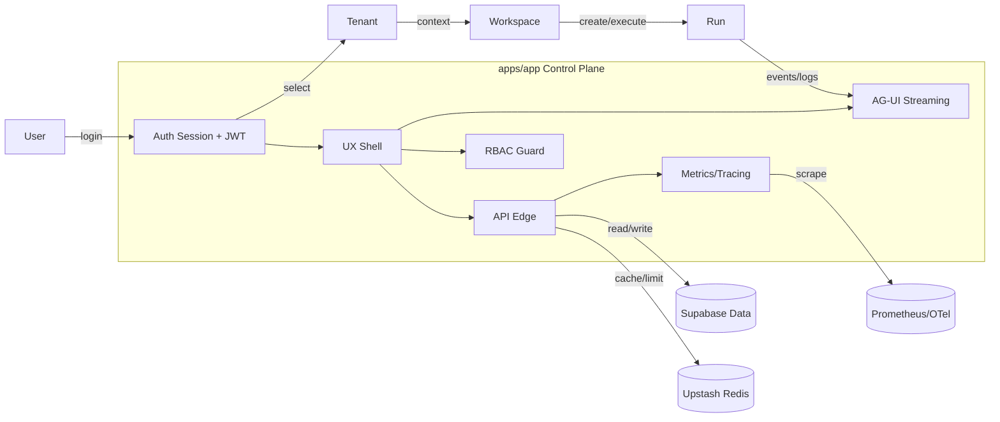
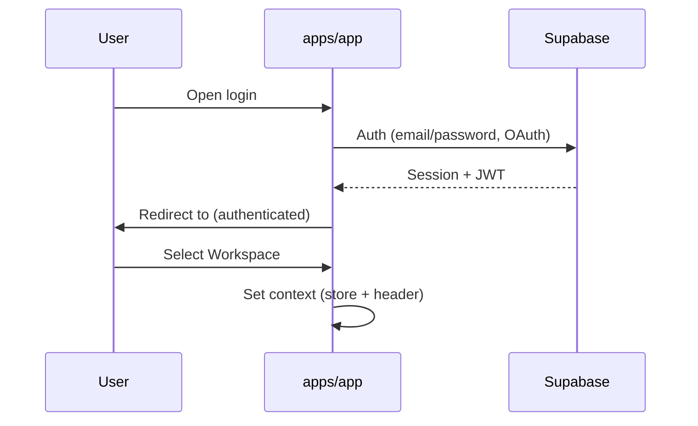
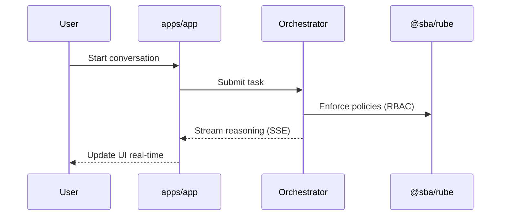
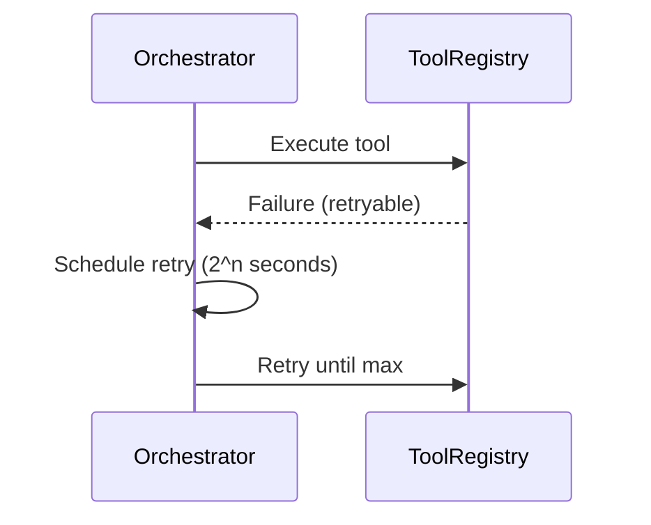
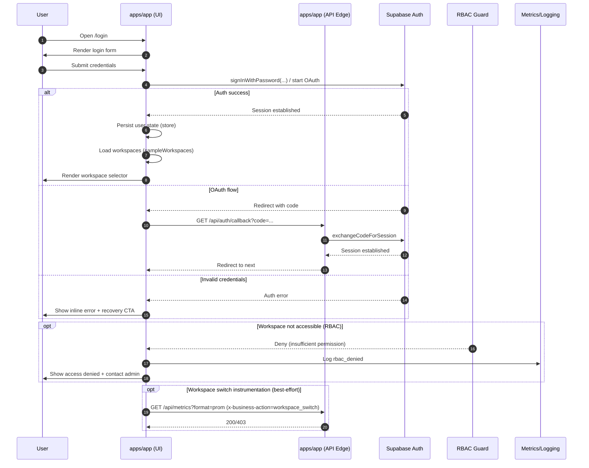

# SBA-Agentic — Single Control Plane for AI-Driven Business Operations

1. Pendahuluan dan Latar Belakang
   1.1 Tujuan Dokumen
   1.2 Ruang Lingkup
   1.3 Definisi dan Terminologi

2. Arsitektur Sistem dan Kontrol Plane
   2.1 Ikhtisar Arsitektur
   2.2 Komponen Utama Kontrol Plane
   2.3 Integrasi Backend Produksi (Supabase/Auth, Observability)
   2.4 Diagram Arsitektur

3. Spesifikasi Use-Case (apps/app)
   3.1 Ringkasan Eksekutif
   3.2 Context & Scope
   3.3 Personas & Aktor
   3.4 Use-Case Utama (UC-01 s/d UC-08)

4. Implementasi Teknis (apps/app)
   4.1 Struktur Kode
   4.2 Alur Kerja Bisnis yang Diotomasi
   4.3 Komponen AI dan Reasoning
   4.4 Observability & Metrics
   4.5 Keamanan & RBAC

5. Panduan Integrasi Sistem
   5.1 Konfigurasi Lingkungan
   5.2 API & Endpoints
   5.3 Model Data Bisnis
   5.4 Mekanisme Otorisasi

6. Diagram Sequence
   6.1 Alur Bisnis Utama
   6.2 Pengambilan Keputusan AI
   6.3 Error Handling & Retry

7. Manajemen Produk & UX
   7.1 Roadmap Pengembangan
   7.2 Matriks Prioritas Fitur
   7.3 Metrik Keberhasilan
   7.4 Prinsip UX & Aksesibilitas

8. Panduan Deployment Staging
   8.1 Langkah-langkah Deployment
   8.2 Konfigurasi Lingkungan
   8.3 Skrip Utilitas
   8.4 Rollback & Verifikasi

9. Referensi dan Lampiran
   9.1 Referensi Dokumen
   9.2 Lampiran Diagram
   9.3 Matriks Fitur

---

# 1. Pendahuluan dan Latar Belakang

SBA-Agentic menghadirkan Single Control Plane untuk operasi bisnis berbasis AI. Dokumen ini menyatukan arsitektur, spesifikasi use-case, implementasi teknis di `apps/app`, panduan integrasi, serta deliverables operasional.

Dokumentasi ini disusun untuk menjadi pedoman yang dapat langsung dipakai lintas peran (product, engineering, ops) agar investasi pengembangan tetap terarah, dapat diaudit, dan dapat dioperasikan.

Terminologi konsisten mengikuti pedoman di `docs/README.md`, termasuk keamanan (CSP, RBAC), observability (Prometheus/OTel), dan readiness produk.

## 1.1 Tujuan Dokumen

- Menetapkan definisi dan ruang lingkup kontrol plane SBA (produk, teknis, operasional).
- Menyediakan artefak arsitektur yang terverifikasi terhadap implementasi `apps/app`.
- Menjadi referensi tunggal untuk integrasi (env, endpoint, otorisasi) dan standar operasional (metrics/health).

## 1.2 Ruang Lingkup

In-scope (berdasarkan `docs/Use-Case Specification apps-app.md`):

- Tenant & Workspace experience
- Agent lifecycle, reasoning UI, interrupt & control
- Run/workflow control dan observability
- Analytics & monitoring UX
- Onboarding & adoption, aksesibilitas, performa

Out-of-scope:

- Model training internal
- Infrastruktur runtime agent di luar UI/API edge

## 1.3 Definisi dan Terminologi

- Control Plane: lapisan koordinasi UX, governance, observability, dan kontrol agentic untuk operasi bisnis.
- Tenant: boundary multi-tenant untuk konfigurasi, data, dan kebijakan.
- Workspace: konteks kerja di dalam tenant untuk tim/proyek.
- Agent: unit AI yang dapat diajak berinteraksi dan menjalankan tugas.
- Run: eksekusi workflow/agent task yang dapat diobservasi (logs, metrics, status).
- AG-UI: protokol antarmuka agentic untuk streaming message/reasoning/interrupt/meta-event.

# 2. Arsitektur Sistem dan Kontrol Plane

## 2.1 Ikhtisar

Kontrol plane mengoordinasikan UX, Reasoning, Observability, dan Integrasi Backend. `apps/app` bertindak sebagai edge untuk API Next.js dan permukaan produk utama.

## 2.2 Komponen Utama

- UX Shell (layout, routing, auth, i18n)
- Product Features (dashboard, agents, runs, analytics)
- Real-time Interfaces (SSE/WS/AG-UI)
- Observability (metrics, tracing)
- API Edge (Next.js route handlers)

## 2.3 Integrasi Backend Produksi

- Supabase Auth dan Data: env publik (`NEXT_PUBLIC_SUPABASE_*`) dan klien server (`@sba/supabase/clients/server`)
- Observability: Prometheus/OTel, endpoints `/api/metrics/json|prometheus`
- Keamanan: CSP nonce, RBAC guard, rate limiting

## 2.4 Diagram Arsitektur

```mermaid
flowchart TD
  User((User)) -->|Auth| App[apps/app]
  subgraph ControlPlane
    App --> UX[UX Shell]
    App --> AG[Agents & Runs]
    App --> AN[Analytics]
    App --> OBS[Observability]
    App --> API[Next.js API Edge]
  end
  API --> SUP[(Supabase Auth & Data)]
  OBS --> PROM[(Prometheus/OTel)]
  AG --> ORCH[Orchestrator]
  ORCH --> RUBE[@sba/rube]
```

### 2.4.1 Diagram Aliran Data Bisnis (Tenant → Workspace → Run)



# 3. Spesifikasi Use-Case (apps/app)

Ringkasan dan spesifikasi diadaptasi dari `docs/Use-Case Specification apps-app.md`.

## 3.1 Ringkasan Eksekutif

> “Single Control Plane for AI-Driven Business Operations”

`apps/app` adalah orchestrator pengalaman bisnis berbasis AI: tenant/workspace/agent/run/knowledge, real-time reasoning, analytics, dan observability.

## 3.2 Context & Scope

```text
apps/app
 ├─ UX Shell (layout, routing, auth, i18n)
 ├─ Product Features (dashboard, agents, runs, analytics)
 ├─ Real-time Interfaces (SSE, WS, AG-UI)
 ├─ Product Telemetry (metrics, observability)
 └─ API Edge (Next.js route handlers)
```

## 3.3 Personas & Aktor

- Business Owner — automasi & insight
- Ops Manager — monitoring & reliability
- AI Operator — control agent & workflow
- Admin — governance & security

## 3.4 Use-Case Utama

- UC-01 Authenticate & Enter Workspace
- UC-02 Navigate Product Domains
- UC-03 Manage Agents & Conversations
- UC-04 Execute & Observe Runs
- UC-05 Analyze Business Metrics
- UC-06 Monitor System Health
- UC-07 Onboarding & Activation
- UC-08 Governance, RBAC & Audit

## 3.5 Ringkasan Use-Case (Detail)

Bagian ini merangkum spesifikasi detail yang bersumber dari `docs/Use-Case Specification apps-app.md`.

### UC-01 Authenticate & Enter Workspace

- Alur: login (Supabase client) → session terbentuk → state user tersimpan → pilih workspace (sementara: `sampleWorkspaces`) → set context (store + header).
- Target UX: state tanpa ambiguitas, error recovery jelas, form aksesibel.
- Rujukan: Bagian 6.1 dan Bagian 7.5.

### UC-02 Navigate Product Domains

- Alur: navigasi antar domain produk tanpa kehilangan konteks tenant/workspace.
- Target UX: keyboard accessible, hirarki prediktabel, tidak ada full reload.

### UC-03 Manage Agents & Conversations

- Alur: create agent → mulai percakapan → reasoning streamed (SSE/WS) → UI update real-time.
- Diferensiasi: reasoning transparency, interrupt & control, progressive disclosure.
- Rujukan: Bagian 4.3 dan Bagian 6.2.

### UC-04 Execute & Observe Runs

- Alur: eksekusi workflow/run → live logs + status semantics → failure reason surfaced.
- Target UX: tidak ada silent failure, timeline-based logs.

### UC-05 Analyze Business Metrics

- Peran: decision support (bukan sekadar grafik).
- Output: metrik usage/performance/KPI bisnis, ekspor report.

### UC-06 Monitor System Health

- Alur: lihat health/metrics → alert visibility → no false calm.
- Rujukan: Bagian 4.4, Bagian 5.2, Bagian 8.

### UC-07 Onboarding & Activation

- Strategi: langkah progresif, feedback sukses jelas, boleh skip.
- Metrik: activation rate dan time-to-first-value.

### UC-08 Governance, RBAC & Audit

- Prinsip: security visible, not obstructive.
- Mekanisme: RBAC guard, audit store, security headers.

# 4. Implementasi Teknis (apps/app)

## 4.1 Struktur Kode

Struktur utama `apps/app` menyertakan UX Shell, fitur produk (agents, runs, analytics), integrasi real-time, dan API edge.

Rujukan operasional:

- Kebijakan impor UI dan panduan a11y/E2E: `apps/app/README.md`

Ringkasan modul (evidence: struktur folder `apps/app/src/*`):

- `src/app/*`: routing Next.js App Router, halaman domain, dan route handlers API.
- `src/features/*`: fitur produk (agentic, run-controls, analytics, onboarding).
- `src/domains/*`: domain logic (auth, workspace).
- `src/entities/*`: state & model UI untuk tenant/workspace/run/dll.
- `src/shared/*`: util lintas fitur (rbac guard, metrics registry, konfigurasi).
- `src/lib/*`: integrasi protokol dan helper (AG-UI, supabase, test utils).

## 4.2 Alur Kerja Bisnis yang Diotomasi

Kontrol plane memfasilitasi alur kerja utama berikut:

- Orkestrasi percakapan agentic dan kontrol eksekusi (create agent → run → observasi hasil).
- Monitoring health dan metrik aplikasi untuk reliability operasi.
- Query/ingest knowledge untuk mendukung reasoning dan pencarian kontekstual.
- Workflow dan task scheduling untuk automasi proses bisnis.

## 4.3 Komponen AI dan Reasoning

Komponen AI antarmuka berfokus pada transparansi dan kontrol:

- AG-UI protocol: message, multimodal content, reasoning steps, interrupts, meta-events (`apps/app/src/lib/agui/protocol.ts`).
- Real-time reasoning: streaming via SSE/WS, UI mengikat event stream untuk state mesin percakapan.
- Kontrol eksekusi: interrupt/pause/stop untuk memastikan user dapat memegang kendali.

## 4.4 Observability & Metrics

Observability menjadi kontrak utama kontrol plane untuk operasi produksi:

- Metrics (RBAC `analytics:read`):
  - `GET /api/metrics/json` menyediakan snapshot counters/errors/histograms serta `p95/p99`.
  - `GET /api/metrics/prometheus` menyediakan format Prometheus dan gauge ringkas (p95/p99/error rate/throughput).
- Health:
  - `GET /api/health` menyediakan status cepat readiness/liveness.
- Tenant labeling:
  - Header `x-tenant-id` dinormalisasi oleh util `ensureTenantHeader` agar label tenant konsisten.

## 4.5 Keamanan & RBAC

Keamanan kontrol plane menggabungkan autentikasi, RBAC, dan security headers:

- Autentikasi: session/JWT via Supabase.
- Otorisasi: guard RBAC pada endpoint sensitif menggunakan `withPermissions` dan/atau `withRBAC`.
- Tenant isolation: konteks tenant wajib tersedia melalui header `x-tenant-id`.
- Rate limiting: Upstash Redis untuk proteksi endpoint publik dan auth.

# 5. Panduan Integrasi Sistem

## 5.1 Konfigurasi Lingkungan

Variabel environment minimal mengacu ke `docs/README.md`:

- `NEXT_PUBLIC_APP_URL`
- `NEXT_PUBLIC_SUPABASE_URL`
- `NEXT_PUBLIC_SUPABASE_ANON_KEY`
- `UPSTASH_REDIS_REST_URL`
- `UPSTASH_REDIS_REST_TOKEN`

Untuk staging, rujuk `docs/DEPLOYMENT_STAGING.md` dan playbook go-live di `docs/README.md`.

## 5.2 API & Endpoints

Spesifikasi ringkas endpoint kontrol plane (tidak menggantikan OpenAPI penuh):

| Area      | Method   | Endpoint                  | Otorisasi                | Catatan                                  |
| --------- | -------- | ------------------------- | ------------------------ | ---------------------------------------- |
| Health    | GET      | `/api/health`             | Publik                   | Readiness/liveness cepat                 |
| Metrics   | GET      | `/api/metrics/json`       | RBAC `analytics:read`    | Snapshot metrik (JSON)                   |
| Metrics   | GET      | `/api/metrics/prometheus` | RBAC `analytics:read`    | Export Prometheus                        |
| Docs      | GET      | `/api/openapi`            | Permission `system.docs` | Dokumen OpenAPI (JSON)                   |
| Auth      | GET      | `/api/auth/callback`      | Publik                   | OAuth callback (exchange code → session) |
| Auth      | POST     | `/api/auth/login`         | Publik                   | Endpoint demo/rate-limit (non-prod)      |
| Knowledge | POST     | `/api/knowledge/search`   | Sesuai kebijakan         | Search knowledge + caching               |
| Runs      | GET/POST | `/api/runs`               | Sesuai kebijakan         | List/create runs                         |
| Workflows | GET/POST | `/api/workflows`          | Sesuai kebijakan         | List/create workflows                    |

Catatan tenant:

- Header `x-tenant-id` wajib pada operasi multi-tenant; util `ensureTenantHeader` menormalisasi nilai kosong/hilang menjadi `unknown`.

## 5.3 Model Data Bisnis

Model data bisnis yang terefleksi di kontrol plane (ringkas):

- Tenant: konfigurasi tenant dan batasan fitur/limit (lihat store tenant).
- Workspace: konteks kerja termasuk membership dan flags fitur (chat/automation/timeline) (lihat store workspace).
- Agent: konfigurasi agent dan state percakapan.
- Run: status eksekusi workflow dan telemetry (logs/metrics/events).
- Knowledge: dokumen/embeddings/index untuk retrieval.

Sumber teknis:

- State/model UI tenant: `apps/app/src/entities/tenant/model.ts`
- State/model UI workspace: `apps/app/src/entities/workspace/model.ts`
- Endpoint dan integrasi: `apps/app/src/app/api/*/route.ts`

## 5.4 Mekanisme Otorisasi

Mekanisme otorisasi menggabungkan Supabase session dan RBAC guard:

- Supabase menyediakan session/JWT; role user dapat dipropagasikan dari server session.
- RBAC guard mengevaluasi permission terhadap role untuk endpoint tertentu.
- Mode test/dev dapat memakai cookie `__test_auth=admin` untuk mem-bypass atau menyuntikkan role sesuai kebijakan lingkungan.

# 6. Diagram Sequence

## 6.1 Alur Bisnis Utama — Authenticate & Enter Workspace



## 6.2 Pengambilan Keputusan AI — Agent Run



## 6.3 Error Handling & Retry — Exponential Backoff



# 7. Manajemen Produk & UX

## 7.1 Roadmap Pengembangan

- Now: Reliability, UX clarity, adoption
- Next: Monetization hooks, pricing UX
- Later: Marketplace, extensibility

## 7.2 Matriks Prioritas Fitur

| Fitur      | Nilai Bisnis | Kompleksitas | Prioritas |
| ---------- | ------------ | ------------ | --------- |
| Agents     | Tinggi       | Sedang       | P1        |
| Runs       | Tinggi       | Sedang       | P1        |
| Analytics  | Tinggi       | Tinggi       | P1        |
| Onboarding | Sedang       | Rendah       | P2        |

## 7.3 Metrik Keberhasilan

- Activation rate, Time-to-First-Value
- Error rate ≤0.5%, p95 latency ≤500ms

## 7.4 Prinsip UX & Aksesibilitas

- Continuity, Explainability, Control, Observability, Accessibility (WCAG)

## 7.5 Peran Kolaboratif & Tanggung Jawab

Pengembangan SBA melibatkan peran spesifik untuk menjamin kualitas dan integritas sistem:

| Peran            | Fokus Utama        | Tanggung Jawab Kunci                                                 |
| ---------------- | ------------------ | -------------------------------------------------------------------- |
| **@SOLOCoder**   | Core Development   | Clean code, unit testing (>90%), API contracts, security validation. |
| **@SOLOBuilder** | Architecture & Ops | Scalability, CI/CD pipelines, cloud infra, failover mechanisms.      |
| **@SuperAgent**  | Orchestration      | Task tracking, requirement traceability, stakeholder validation.     |

## 7.6 Visualisasi UX — UC-01 Login & Workspace Selector

Skenario ini dipilih karena menjadi pintu masuk kontrol plane, memerlukan navigasi yang jelas, elemen antarmuka utama yang eksplisit (form input, CTA, error), serta state interaksi yang terdefinisi untuk menghindari ambiguitas.

### 7.6.1 Wireframe (Responsive + States)

Sumber: `workspace/03_Design-System/wireframes/sba-uc01-login-workspace-wireframe.mmd`

```mermaid
flowchart TB
  classDef frame fill:#ffffff,stroke:#111827,stroke-width:2px;
  classDef panel fill:#f9fafb,stroke:#374151,stroke-width:1px;
  classDef content fill:#ffffff,stroke:#9ca3af,stroke-dasharray: 4 3;
  classDef btn fill:#e5e7eb,stroke:#111827,stroke-width:1px;
  classDef btnHover fill:#dbeafe,stroke:#1d4ed8,stroke-width:2px;
  classDef btnActive fill:#bfdbfe,stroke:#1d4ed8,stroke-width:3px;
  classDef badge fill:#111827,stroke:#111827,color:#ffffff;
  classDef error fill:#fee2e2,stroke:#b91c1c,stroke-width:2px;
  classDef focus fill:#ecfeff,stroke:#0891b2,stroke-width:2px;

  subgraph D[Desktop >= 1024px]
    direction TB
    DFrame[App Shell]
    DFrame --> DH[Header: Logo • Workspace • Profile]
    DFrame --> DB[Body]
    DB --> DSide[Sidebar: Dashboard / Agents / Runs / Analytics / Monitoring]
    DB --> DMain[Main Content Area]
    DMain --> DTitle[Title: Select Workspace]
    DMain --> DSearch[Search / Filter]
    DMain --> DList[Workspace List - cards]
    DList --> DCard1[Workspace Card: Name + Tenant Badge]
    DList --> DCard2[Workspace Card: Name + Tenant Badge]
    DMain --> DCTA[Primary Button: Enter Workspace]
    DMain --> DHelp[Secondary: Help / Docs]
  end

  subgraph M[Mobile <= 480px]
    direction TB
    MFrame[App Shell]
    MFrame --> MH[Header: Logo • Menu • Profile]
    MFrame --> MMain[Main]
    MMain --> MTitle[Title: Select Workspace]
    MMain --> MSearch[Search]
    MMain --> MList[Workspace List - stacked]
    MList --> MCard1[Workspace Row: Name + Tenant Badge]
    MList --> MCard2[Workspace Row: Name + Tenant Badge]
    MMain --> MCTA[Primary Button: Enter]
  end

  subgraph S[States - Interactive]
    direction TB
    S0[Default State]
    S1[Hover State]
    S2[Active/Pressed State]
    S3[Error State]
    S4[Focus State - Keyboard]

    BtnDefault[CTA Button]
    BtnHover[CTA Button]
    BtnActive[CTA Button]
    ErrBanner[Inline Error Banner: Login failed • Workspace not accessible]
    FieldFocus[Focused Input: Workspace Search]

    S0 --> BtnDefault
    S1 --> BtnHover
    S2 --> BtnActive
    S3 --> ErrBanner
    S4 --> FieldFocus
  end

  class DFrame,MFrame frame;
  class DH,DB,DMain,MH,MMain panel;
  class DSide,DTitle,DSearch,DCard1,DCard2,DHelp,MTitle,MSearch,MCard1,MCard2 content;
  class DList,MList panel;
  class DCTA,MCTA,BtnDefault btn;
  class BtnHover btnHover;
  class BtnActive btnActive;
  class S0,S1,S2,S3,S4 badge;
  class ErrBanner error;
  class FieldFocus focus;
```



### 7.6.2 Sequence Diagram — Error Recovery & RBAC

Sumber: `workspace/02_Architecture/diagrams/sba-sequence-uc01-error-recovery.mmd`



### 7.6.3 Validasi UX

Status: pending sign-off UX.

Checklist UAT (UX):

- Layout desktop (>=1024px) menampilkan header, sidebar, list workspace, dan CTA utama.
- Layout mobile (<=480px) menampilkan header ringkas, list workspace stacked, dan CTA utama.
- States minimum terdefinisi: default, hover, active/pressed, error, focus (keyboard).
- Copy error tidak ambigu dan menyediakan recovery action.
- Aksesibilitas: fokus keyboard terlihat, urutan tab masuk akal, kontras CTA memadai.

Kriteria penerimaan teknis:

- Source diagram terverifikasi:
  - `workspace/03_Design-System/wireframes/sba-uc01-login-workspace-wireframe.mmd`
  - `workspace/02_Architecture/diagrams/sba-sequence-uc01-error-recovery.mmd`
- Render pipeline menghasilkan artefak tanpa error via `pnpm diagrams:build`.

## 7.7 Matriks Keterlacakan (Requirement Traceability Matrix)

Matriks ini mengikat kebutuhan bisnis (use-case) ke bukti implementasi untuk memastikan cakupan 100%.

| ID    | Use Case         | Komponen UI                  | API Handler                      | Store/Hook                   | Status         |
| ----- | ---------------- | ---------------------------- | -------------------------------- | ---------------------------- | -------------- |
| UC-01 | Auth & Workspace | `/login`, `WorkspacesClient` | `/api/auth/*`, `/api/workspaces` | `useWorkspaces`, `useAuth`   | ✅ Implemented |
| UC-02 | Navigate Domains | Sidebar, Navbar              | N/A                              | `LayoutShell`                | ✅ Implemented |
| UC-03 | Manage Agents    | `/agents`, `AgentsClient`    | `/api/agents`                    | `useAgents`, `useAgentStore` | ✅ Implemented |
| UC-04 | Execute Runs     | `/runs`                      | `/api/runs`                      | `useRuns`                    | 🚧 In Progress |
| UC-05 | Business Metrics | `/analytics`                 | `/api/metrics/*`                 | `useMetrics`                 | ✅ Implemented |
| UC-06 | Monitor Health   | `/settings/system`           | `/api/health`                    | `useHealth`                  | ✅ Implemented |
| UC-07 | Onboarding       | `/onboarding`                | `/api/user/status`               | `useOnboarding`              | 📅 Planned     |
| UC-08 | Governance       | `/settings/roles`            | `/api/admin/*`                   | `useRBAC`                    | 🚧 Partial     |

# 8. Panduan Deployment Staging

Ringkas dari `docs/DEPLOYMENT_STAGING.md`:

- Persiapan: lint, test, build
- Migrasi DB dan start services
- Rollback: stop, revert code/db, rebuild restart
- Verifikasi: health, logs, metrics, smoke test

Panduan implementasi teknis (deployment + verifikasi) tersedia pada `docs/SBA-Implementation-Guide.md`.

# 9. Referensi dan Lampiran

## 9.1 Referensi Dokumen

- `docs/README.md`, `docs/DEPLOYMENT_STAGING.md`
- `docs/Use-Case Specification apps-app.md`
- Observability: `docs/TESTING-OBSERVABILITY.md`

Dokumen deliverable pendamping:

- Matriks fitur: `docs/SBA-Feature-Matrix.md`
- Panduan implementasi: `docs/SBA-Implementation-Guide.md`

## 9.2 Lampiran Diagram

- Mermaid blocks dan file `.mmd` terkait (render via `pnpm diagrams:build`)

## 9.3 Matriks Fitur

Berikut ringkasan mapping requirement vs implementasi (sumber: `docs/SBA-Feature-Matrix.md`):

| Requirement      | Implementasi                            | Status      | Dependensi                |
| ---------------- | --------------------------------------- | ----------- | ------------------------- |
| Auth (Supabase)  | `apps/app` login, session/JWT           | Implemented | Supabase URL/Key          |
| RBAC             | `withRBAC`, `ensureTenantHeader`        | Implemented | Tenant context            |
| Agents           | `features/agentic`, AG-UI               | Implemented | Orchestrator, `@sba/rube` |
| Runs             | `features/run-controls`, `/api/runs/*`  | Implemented | ToolRegistry              |
| Analytics        | `features/analytics`, metrics endpoints | Implemented | Observability/OTel        |
| Monitoring       | `/monitoring`, `/metrics/*`             | Implemented | Prometheus                |
| Onboarding       | `features/onboarding`                   | Implemented | UX shell                  |
| Governance/Audit | audit store, RBAC guard                 | Implemented | Security headers          |
