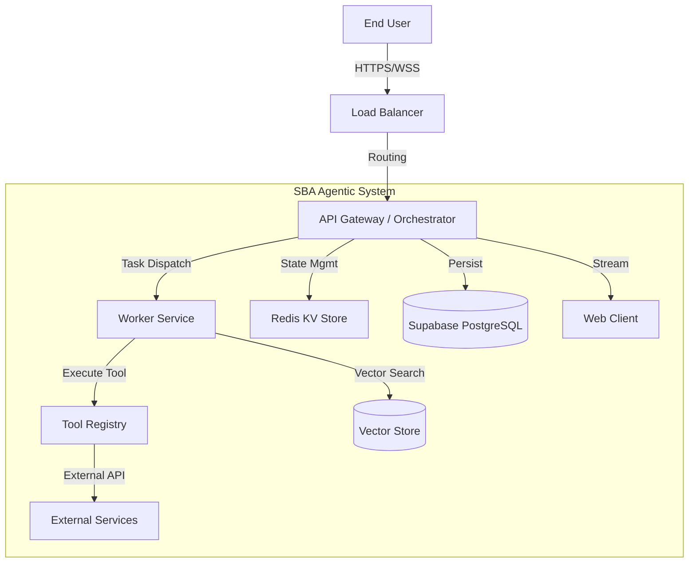
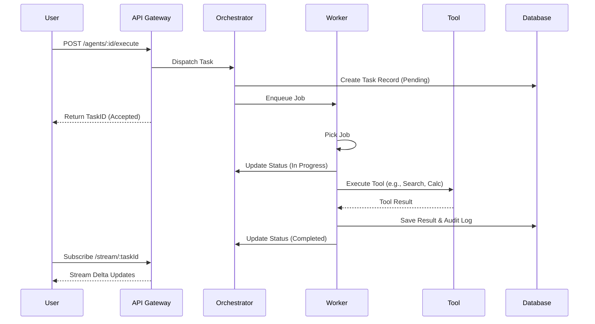

# System Constitution untuk SBA-Agentic

## 1. Visi & Misi

**Visi**: Menjadi asisten bisnis cerdas (Smart Business Assistant) yang otonom, terukur, dan terpercaya untuk mengotomatisasi operasi bisnis end-to-end.
**Misi**:

- Menyediakan orkestrasi task yang modular dan reliable.
- Memastikan integrasi data real-time yang aman.
- Memberikan pengalaman pengguna yang seamless melalui antarmuka responsif.

## 2. Prinsip Desain (Design Principles)

1. **Modularity**: Sistem dibangun dari komponen terisolasi (Agent, Tool, Worker) yang dapat diganti atau ditingkatkan secara independen.
2. **Reliability**: Mekanisme retry, fallback, dan circuit breaker wajib ada di setiap interaksi eksternal.
3. **Observability**: Setiap aksi sistem harus terukur (metrics), terlacak (traces), dan tercatat (logs).
4. **Security First**: Zero Trust architecture, validasi input ketat (Zod), dan audit trail lengkap.
5. **User-Centric**: Responsivitas UI dan feedback loop yang jelas kepada pengguna adalah prioritas.

## 3. Arsitektur Sistem (System Architecture)

### 3.1 High-Level Architecture (C4 Model - Level 1)

## 4. Komponen Utama

- **Orchestrator**: Mengelola lifecycle task, state workflow, dan distribusi job ke worker.
- **Worker Service**: Menjalankan tool dan logika bisnis secara asinkron menggunakan antrian (BullMQ).
- **Tool Registry**: Katalog kemampuan (capabilities) yang dapat digunakan oleh agent (e.g., SendEmail, QueryDB).
- **Pipeline Module**: Ingest, validasi, dan transformasi data real-time dari sumber eksternal.

## 5. Alur Kerja (Workflows)

### 5.1 Agent Execution Flow

## 6. Standar Pengembangan

- **Code Style**: ESLint + Prettier (Standard configuration).
- **Type Safety**: Strict TypeScript, Zod untuk runtime validation.
- **Testing**:
  - Unit Test (Vitest) untuk logika bisnis.
  - E2E Test (Supertest) untuk API endpoint.
- **Git Flow**: Trunk-based development dengan short-lived feature branches.

## 7. Spesifikasi Teknis & Dependensi

| Component | Technology | Version | Purpose |
| :--- | :--- | :--- | :--- |
| Runtime | Node.js | v20+ | Server-side execution |
| Framework | NestJS | v10+ | Modular backend architecture |
| Language | TypeScript | v5+ | Type safety |
| Database | PostgreSQL (Supabase) | v15+ | Relational data |
| Queue | BullMQ / Redis | v5+ | Async task processing |
| Validation | Zod | v3+ | Runtime schema validation |
| Testing | Vitest | v2+ | Unit & E2E testing |
