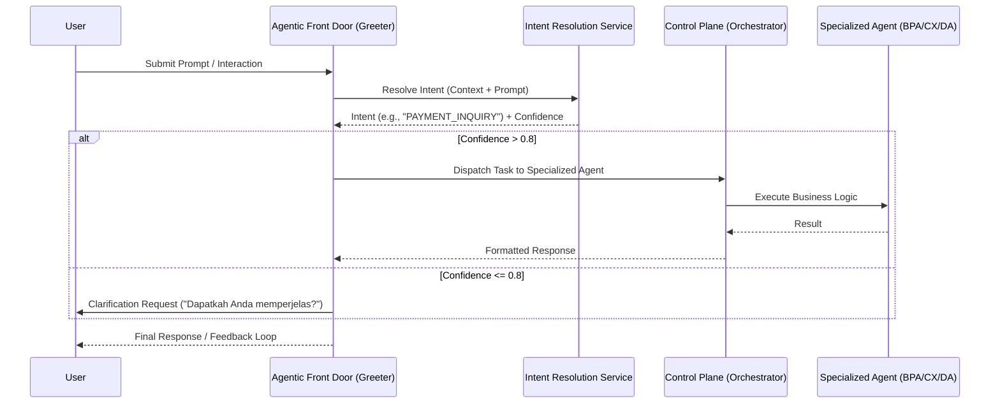
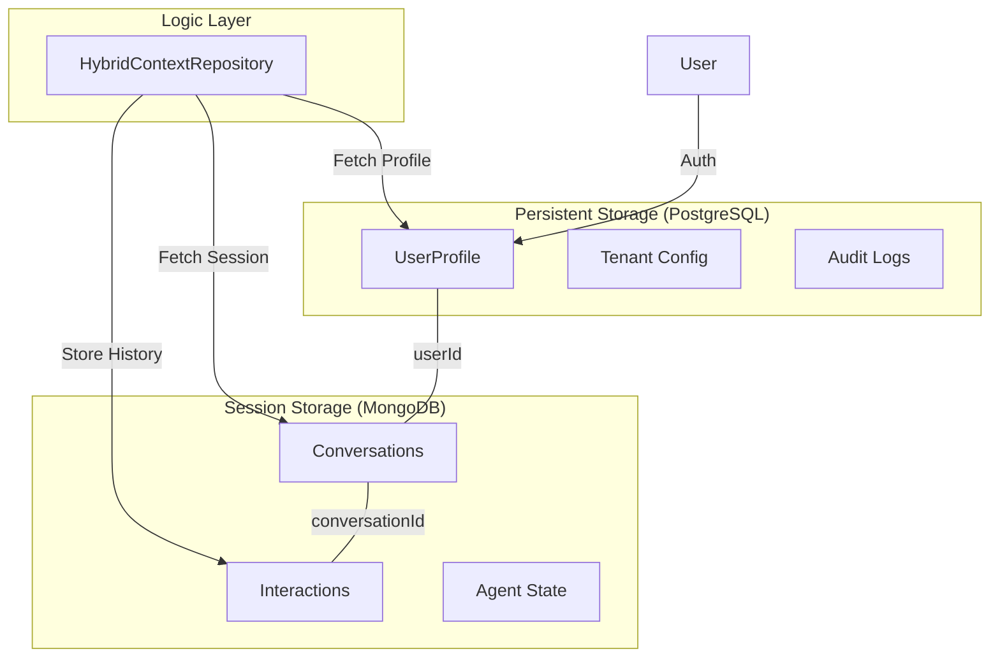

# Architecture Patterns: Greeter & Hybrid Context

Dokumen ini mendefinisikan pola arsitektur inti yang digunakan dalam SBA-Agentic untuk menangani interaksi pengguna dan manajemen konteks.

## 1. Greeter Pattern (Intent Resolution)

Greeter Agent berfungsi sebagai pintu masuk utama (Agentic Front Door) yang bertanggung jawab untuk menyapa pengguna, mengidentifikasi intent, dan merutekan permintaan ke agen spesialis yang tepat.

### Key Components:
- **Greeter Agent**: Menangani `interaction.greet` dan memelihara keramahan brand.
- **Intent Resolution Service**: Menggunakan Semantic Router untuk memetakan prompt ke kategori intent.
- **Specialized Agents**: Agen yang memiliki kapabilitas spesifik (misalnya, `BusinessPaymentAgent`).

---

## 2. Hybrid Context Repository

SBA-Agentic menggunakan strategi penyimpanan hibrida untuk mengoptimalkan integritas data relasional dan skalabilitas data dokumen.

### Data Distribution:
- **PostgreSQL**: Digunakan untuk data yang memerlukan konsistensi ACID tinggi dan relasi kompleks (Profile, Tenant, Permissions).
- **MongoDB**: Digunakan untuk data bervolume tinggi, semi-terstruktur, dan berumur pendek (Chat History, Temporary Agent State, Telemetry).
- **HybridContextRepository**: Abstraksi yang menyatukan kedua sumber data ini, memberikan interface tunggal bagi agen untuk mengakses konteks lengkap pengguna.

---
Terakhir diperbarui: 2026-01-01
