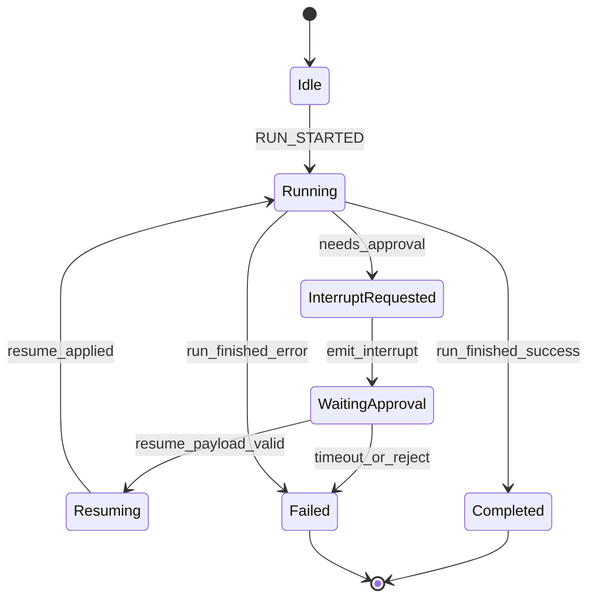
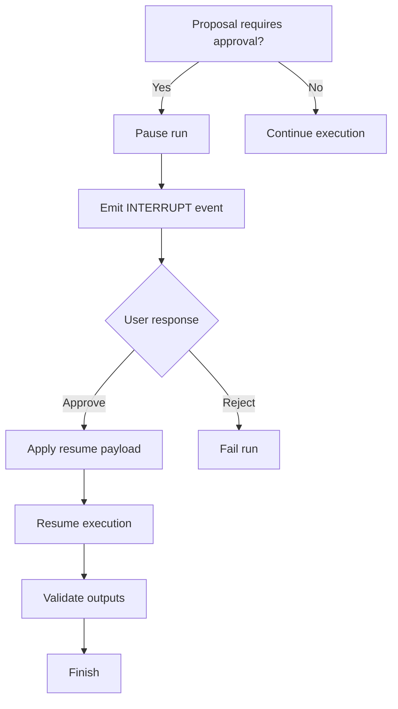
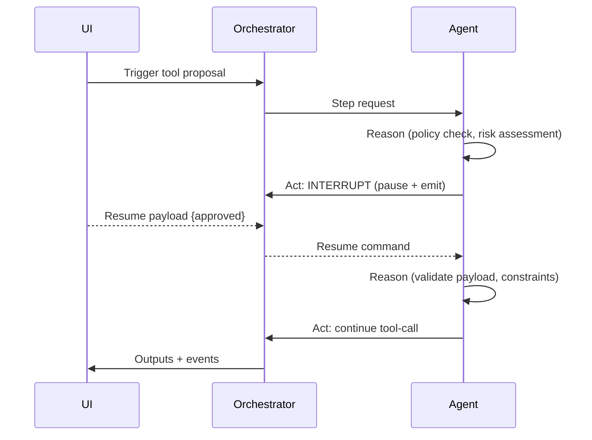

# Ikhtisar

- Agen mendukung interupsi terkontrol untuk persetujuan manusia dan melanjutkan eksekusi dengan payload yang tervalidasi.

# State Machine

# Decision Tree

# Pipeline Trigger → Reason → Act

# Input Processing

- Kanal: UI resume form, API resume endpoint, webhook.
- Validasi awal: schema payload (approved:boolean, notes:string?), RBAC gate, tenant header.

# Parsing & Perception

- Normalisasi payload, binding ke `interruptId` dan `runId`.
- Persepsi konteks: status run, waktu tunggu, kapasitas.

# Reasoning

- Kebijakan approval, guard-rails, dan evaluasi risiko tool-call.
- Strategi: rule-based + heuristik prioritas; fallback bila ambigu.

# Execution

- Pause runner, emit event, tunggu resume.
- Setelah approve: lanjutkan tool-call dengan timeout, retry/backoff.

# Output Validation

- Validasi idempotensi hasil, verifikasi schema, dan kebijakan bisnis.
- Penanganan kesalahan: kategori `policy_violation`, `timeout`, `invalid_payload`.

# Logging

- Event konsisten: RUN_STARTED, INTERRUPT_EMITTED, RUN_PAUSED, RUN_RESUMED, RUN_FINISHED.
- Skema log JSON (wajib): `requestId`, `x-tenant-id`, `runId`, `threadId`, `agentId`, `interruptId`, `event`, `state`, `ts`, `durationMs`, `outcome`, `errorCode`.

# Lifecycle Testing

- Happy-path: approve → resume → selesai.
- Error-path: reject → gagal; timeout → gagal.
- Verifikasi urutan event SSE/WS dan transisi state.

# Integrasi

- Orchestrator engine dan event bus kompatibel dengan mapping state/aksi.
- Observability: label `x-tenant-id`; metrics via `withMetrics`.

# Test Cases & Skenario

- Approve resume valid → run selesai.
- Resume payload invalid → gagal dengan `invalid_payload`.
- Tidak ada respons hingga SLA → gagal `timeout`.

## Referensi Kode

- apps/app/src/app/api/knowledge/route.ts:19-29,32-44
- apps/app/src/shared/lib/openapi.ts:100-142

## Versi & Metadata Diagram

- Diagram BPMN: `workspace/04_Agent-Flows/bpmn/agent_interrupt_resume.bpmn`
- Versi: 1.0.0 — 2025-12-08
- Pemilik: lead@sba — Status: Draft
