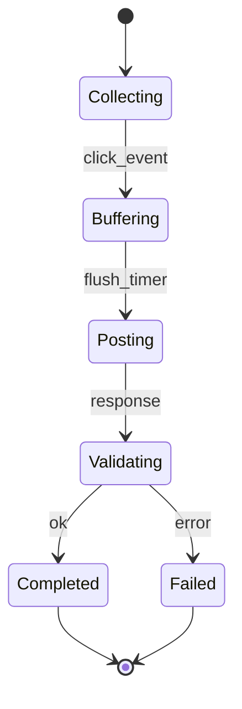
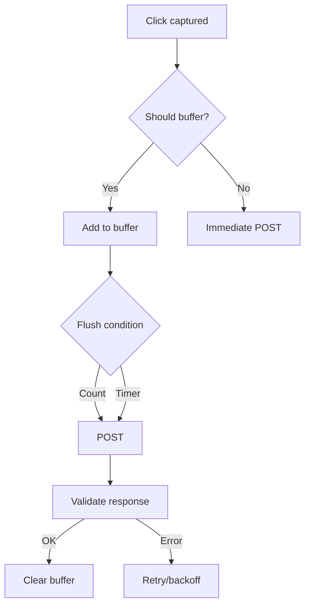
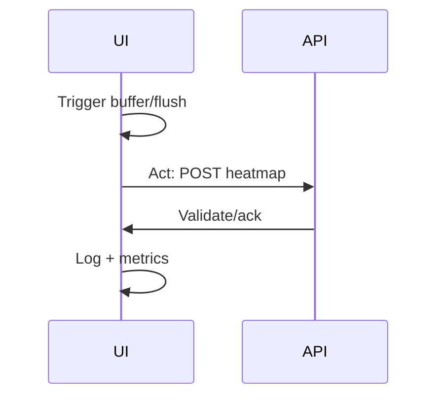

# Ikhtisar

- Pelacakan klik UI → buffer → POST `/api/analytics/heatmap` dengan label tenant dan kontrol privasi.

# State Machine

# Decision Tree

# Pipeline Trigger → Reason → Act

# Input Processing

- Kanal: UI event handler.
- Validasi awal: schema event, anonymization, RBAC jika diperlukan.

# Parsing & Perception

- Normalisasi atribut: selector, viewport, timestamp.
- Persepsi: tenant, session, rate-limit state.

# Reasoning

- Keputusan buffer vs immediate, threshold, dan kebijakan privasi.

# Execution

- POST dengan retry/backoff; manajemen quota dan timeout.

# Output Validation

- Periksa ack, ukuran, dan status; kategorisasi kesalahan `rate_limited`, `invalid_payload`.

# Logging

- Event: CLICK_CAPTURED, BUFFERED, POST_REQUESTED, POST_ACKED, POST_FAILED.
- Metadata wajib: `requestId`, `x-tenant-id`, `selector`, `count`, `batchId`.

# Lifecycle Testing

- Flush by count/timer; error rate-limit; validasi anonymization.

# Integrasi

- Endpoint App Router dibungkus `withMetrics`; label tenant wajib.

# Test Cases & Skenario

- Beban tinggi → rate limit → retry dengan backoff.
- Data tanpa `x-tenant-id` → ditolak.
