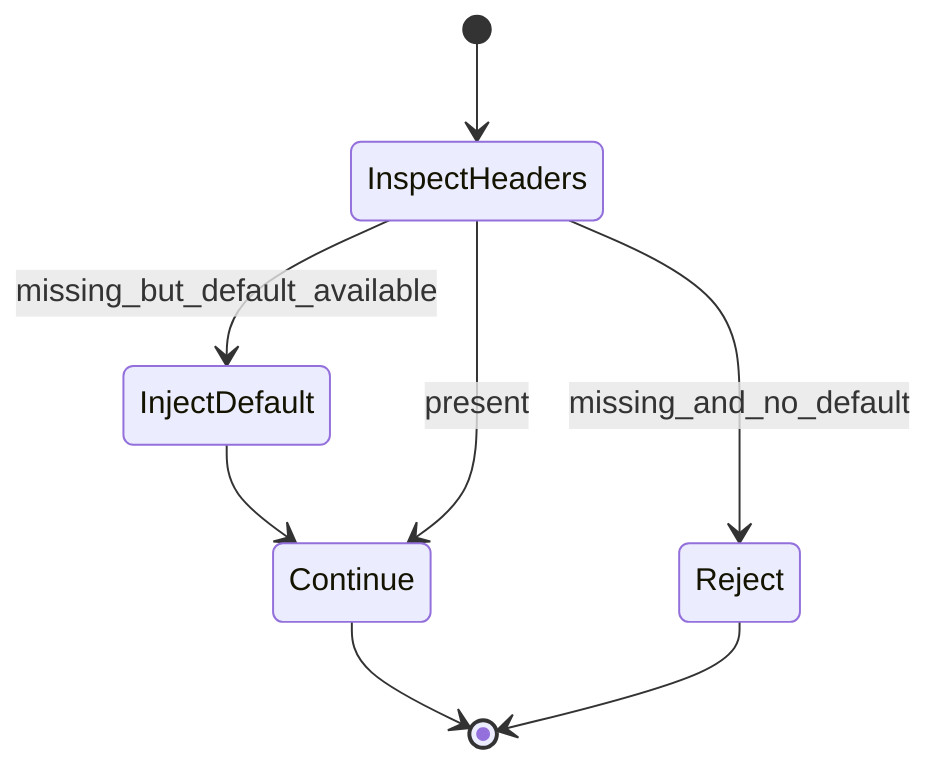
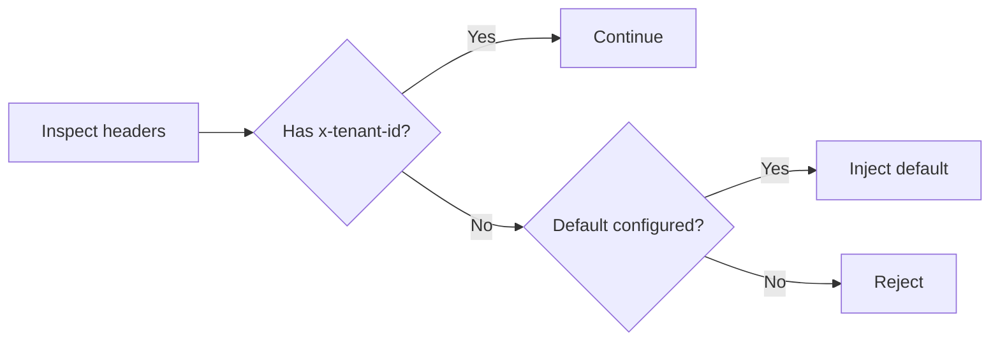
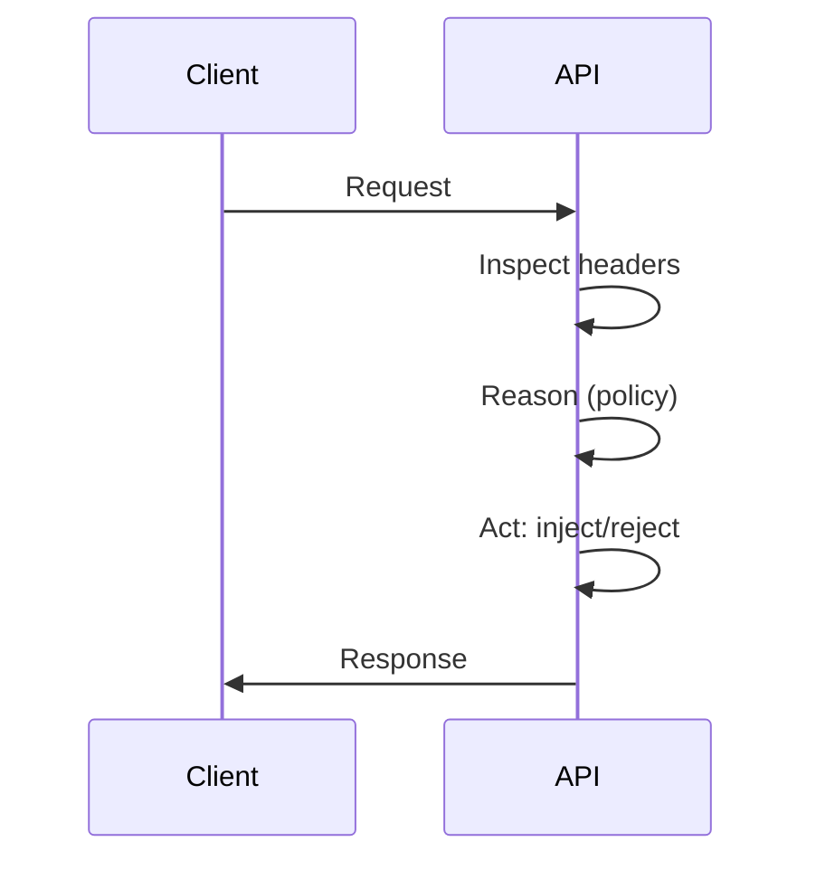

# Ikhtisar

- Memastikan `x-tenant-id` hadir untuk setiap request demi observability dan pemisahan metrik.

# State Machine

# Decision Tree

# Pipeline Trigger → Reason → Act

# Input Processing

- Header inspeksi; validasi keberadaan.

# Parsing & Perception

- Persepsi konfigurasi default tenant dari env.

# Reasoning

- Kebijakan injeksi atau penolakan sesuai mode.

# Execution

- Inject nilai default atau kembalikan error.

# Output Validation

- Pastikan downstream menerima label; error terstandar bila penolakan.

# Logging

- Event: TENANT_HEADER_PRESENT, INJECTED_DEFAULT, TENANT_HEADER_MISSING.
- Metadata: `requestId`, `x-tenant-id` (setelah injeksi), `policy`.

# Lifecycle Testing

- Request tanpa header dengan default aktif → lanjut.
- Request tanpa header tanpa default → ditolak.

# Integrasi

- `ensureTenantHeader` wrapper dipakai sebelum `withMetrics`.

## Referensi Kode

- apps/app/src/app/api/knowledge/route.ts:38-40
