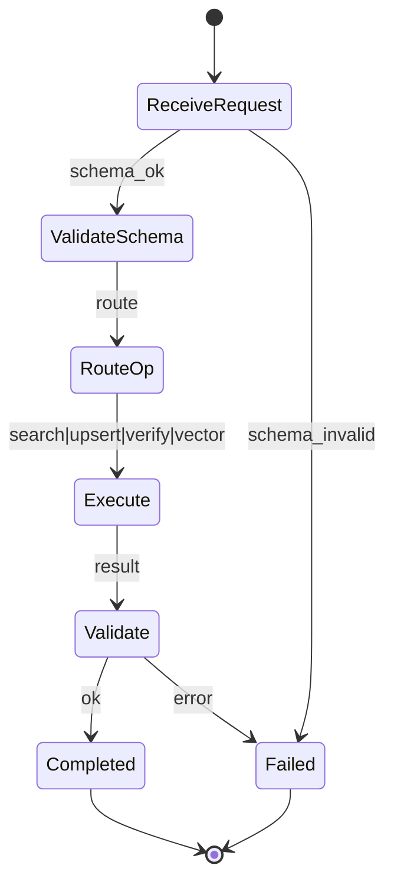
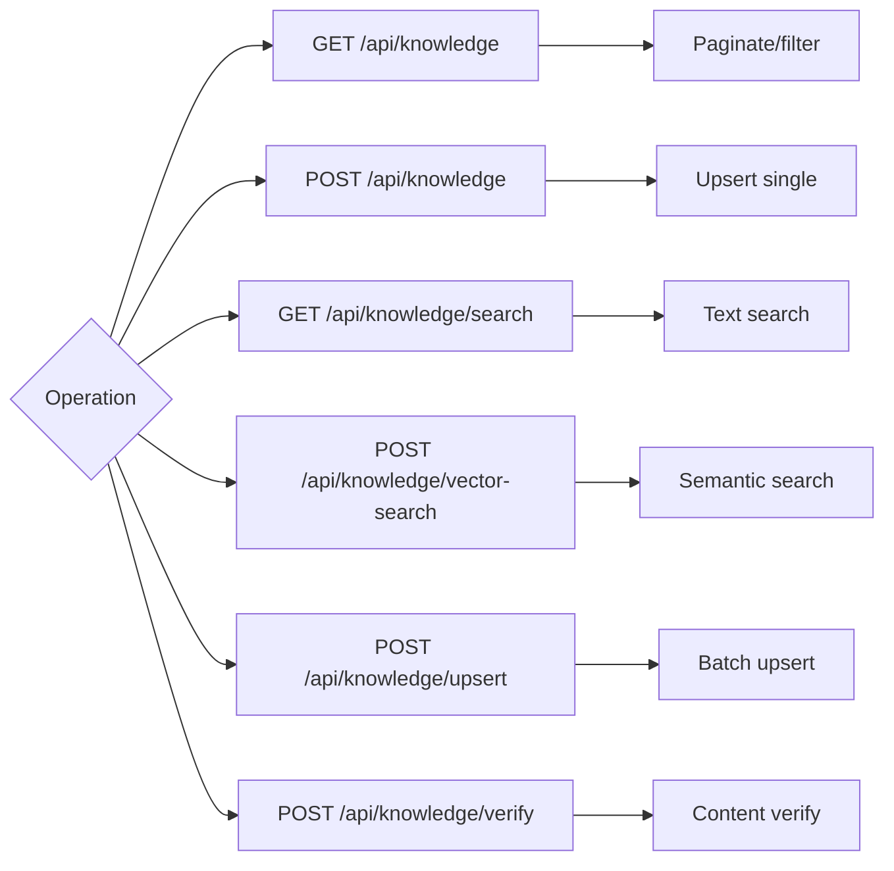
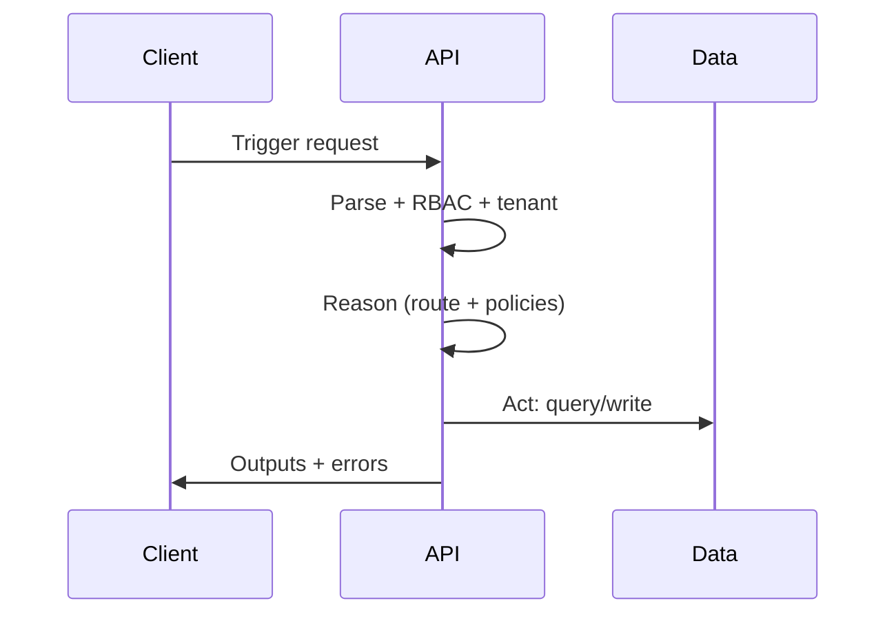

# Ikhtisar

- Operasi pencarian, upsert, verify, vector-search dengan scoping tenant, RBAC, dan observability.

# State Machine

# Decision Tree

# Pipeline Trigger → Reason → Act

# Input Processing

- Header wajib: `x-tenant-id`, `Authorization` bila non-test.
- Validasi awal: Zod/JSON Schema sesuai dokumen API.

# Parsing & Perception

- Normalisasi query/body; persepsi konteks tenant dan rate-limit.

# Reasoning

- Pilih operasi berdasarkan route; cek kebijakan RBAC dan kapasitas.

# Execution

- Query/Write ke storage/indeks; kelola idempotensi via `externalId`.

# Output Validation

- Verifikasi bentuk hasil dan kebijakan; kategori kesalahan standar.

# Logging

- Event: REQUEST_RECEIVED, VALIDATED, ROUTED, EXECUTED, RESPONDED.
- Metadata wajib: `requestId`, `x-tenant-id`, `op`, `page/pageSize`, `externalId`.

# Lifecycle Testing

- Happy-path tiap operasi; error-path (schema invalid, unauthorized, rate limited).

# Integrasi

- Konsisten dengan spesifikasi OpenAPI dan implementasi App Router.

# Test Cases & Skenario

- Upsert idempoten dengan `externalId` yang sama.
- Vector-search dengan `topK` dan metrik berbeda.

## Referensi Kode

- apps/app/src/app/api/knowledge/route.ts:19-29,32-44
- apps/app/src/shared/lib/openapi.ts:100-142

## Versi & Metadata Diagram

- Diagram BPMN: `workspace/04_Agent-Flows/bpmn/knowledge_operations.bpmn`
- Versi: 1.0.0 — 2025-12-08
- Pemilik: lead@sba — Status: Draft
