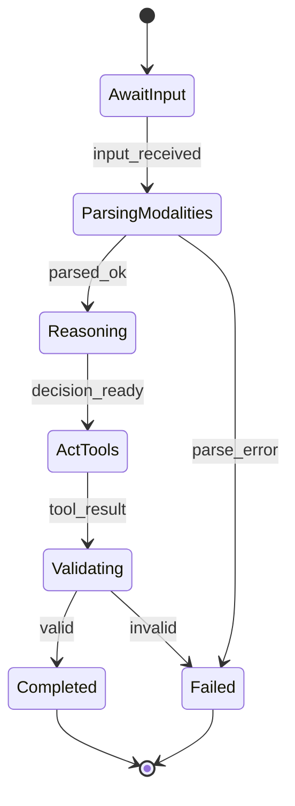
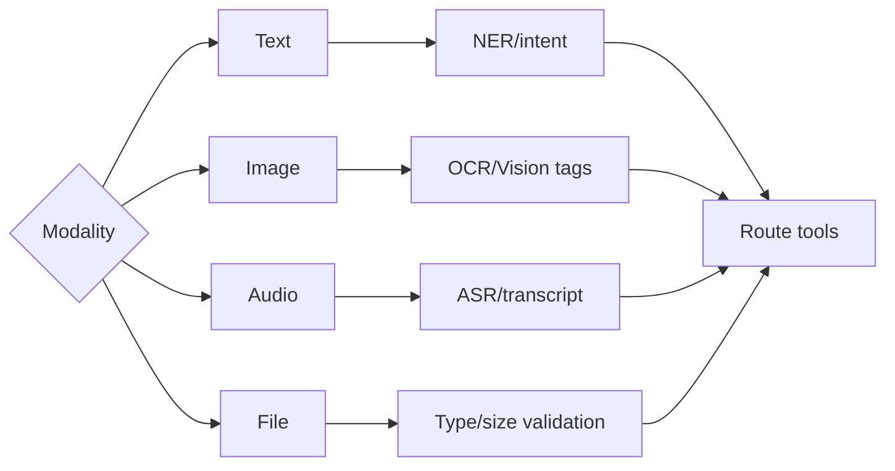
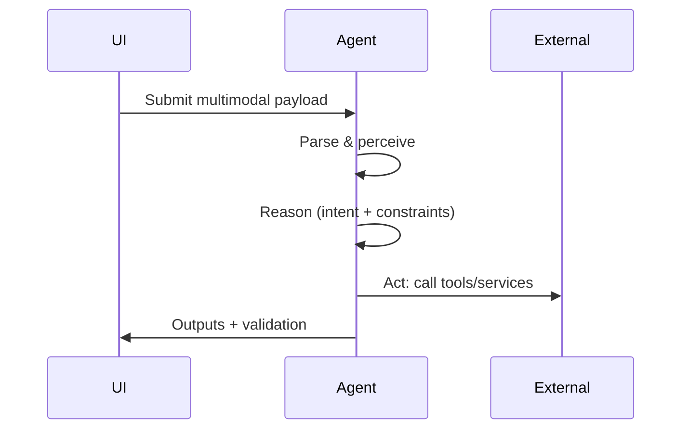

# Ikhtisar

- Dukungan input teks, gambar, audio, file dengan kompatibilitas UI dan degradasi yang aman.

# State Machine

# Decision Tree

# Pipeline Trigger → Reason → Act

# Input Processing

- Kanal: form/chat upload, API.
- Validasi awal: ukuran/tipe file, schema konten, RBAC.

# Parsing & Perception

- Ekstraksi entitas, OCR/ASR untuk modalitas non-teks.
- Persepsi konteks: thread/run/session.

# Reasoning

- Intent extraction dan pemilihan tools.
- Guard-rails privasi & keamanan konten.

# Execution

- Orkestrasi pipeline OCR/ASR/vision dan tools domain.
- Manajemen sumber daya: quota, timeout, concurrency.

# Output Validation

- Verifikasi struktur hasil dan kesesuaian tujuan.
- Penanganan kesalahan: `unsupported_modality`, `size_exceeded`, `parse_error`.

# Logging

- Event: INPUT_RECEIVED, PARSED, TOOL_CALL_REQUESTED, TOOL_CALL_RESULT, RUN_FINISHED.
- Metadata wajib: `requestId`, `x-tenant-id`, `modality`, `sizeBytes`, `toolCallId`.

# Lifecycle Testing

- Setiap modalitas: happy-path dan error-path.
- Verifikasi guard RBAC dan rate limit.

# Integrasi

- UI App Router dan endpoint API konsisten; metrics dan tenant label aktif.

# Test Cases & Skenario

- Gambar besar melebihi batas → ditolak.
- Audio tanpa transkrip → fallback.
- File tipe tak didukung → error `unsupported_modality`.

## Versi & Metadata Diagram

- Diagram BPMN: `workspace/04_Agent-Flows/bpmn/multimodal_messages.bpmn`
- Versi: 1.0.0 — 2025-12-08
- Pemilik: lead@sba — Status: Draft
