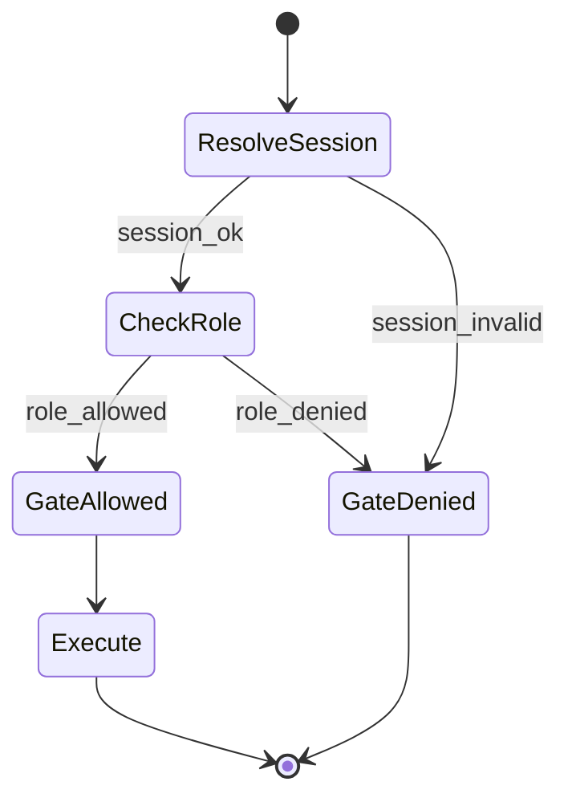
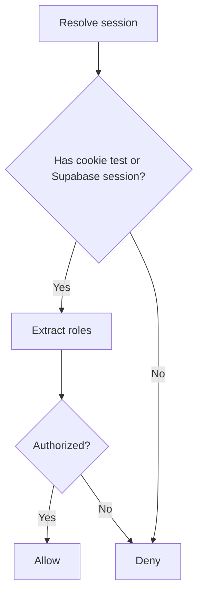
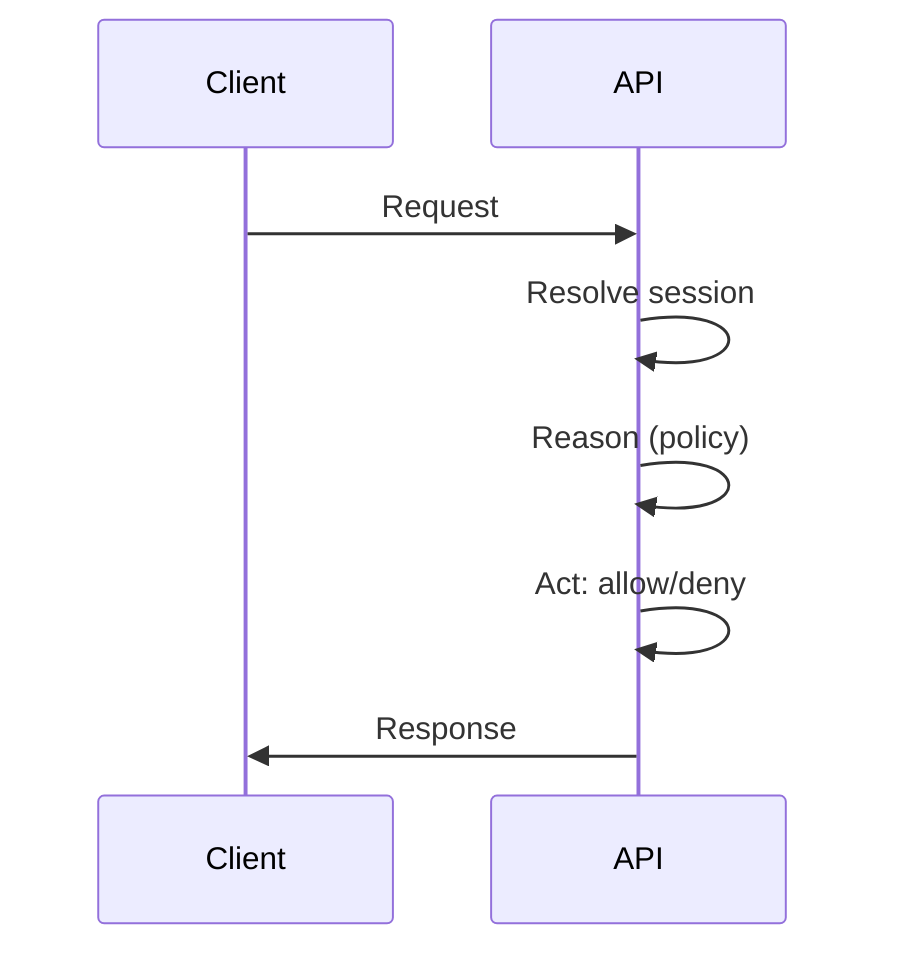

# Ikhtisar

- RBAC di App Router memeriksa peran dari sesi Supabase atau cookie test dan meng-gate akses API.

# State Machine

# Decision Tree

# Pipeline Trigger → Reason → Act

# Input Processing

- Header dan cookies, validasi awal identitas.

# Parsing & Perception

- Ekstraksi role dari sesi/cookie; persepsi resource dan action.

# Reasoning

- Evaluasi kebijakan role-permission per resource/action.

# Execution

- Gate request; teruskan ke handler atau kembalikan error.

# Output Validation

- Pastikan error terstandar; audit-denied dicatat.

# Logging

- Event: RBAC_RESOLVED, RBAC_ALLOWED, RBAC_DENIED.
- Metadata: `requestId`, `x-tenant-id`, `roles`, `resource`, `action`.

# Lifecycle Testing

- Sesi valid tapi role tidak sesuai → denied.
- Cookie test dengan peran admin → allowed.

# Integrasi

- Wrapper `withRBAC` di App Router API.

## Referensi Kode

- apps/app/src/app/api/knowledge/route.ts:16-18,41-44
