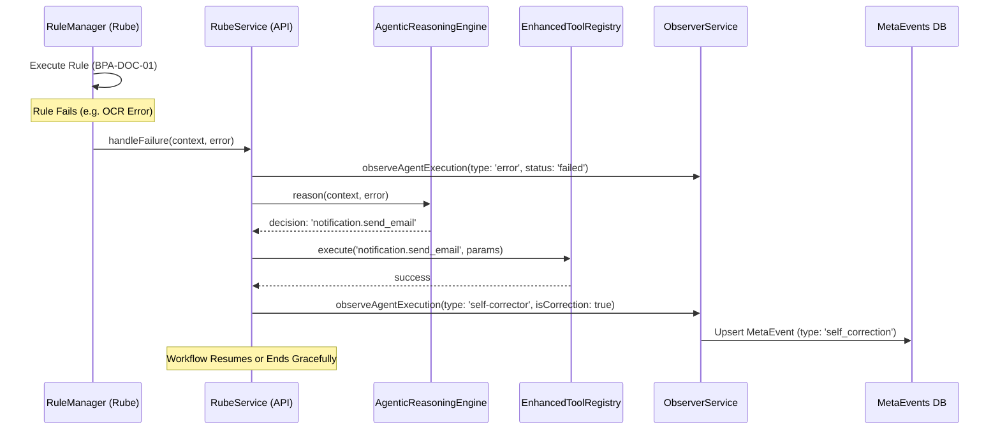

# Self-Correction Flow

Dokumen ini mendefinisikan alur teknis proses koreksi diri (self-correction) ketika terjadi kegagalan pada eksekusi rule di SBA-Agentic.

## Sequence Diagram

## Logic Breakdown

1.  **Detection**: `RuleExecutor` menangkap exception dan memanggil callback `handleFailure` yang dikonfigurasi saat inisialisasi `RuleManager`.
2.  **Analysis**: `AgenticReasoningEngine` menggunakan template prompt khusus kegagalan untuk menganalisis payload asli dan pesan error.
3.  **Action**: Jika perbaikan dimungkinkan via tool (misal: kirim email alert ke tim operasional), tool tersebut dijalankan dengan flag idempotency.
4.  **Logging**: Event dicatat dengan tipe khusus `self_correction` agar dashboard dapat membedakannya dari flow normal.

## Error Handling

- Jika `AgenticReasoningEngine` gagal memberikan keputusan, sistem akan mencatat kegagalan permanen.
- Jika corrective tool gagal, sistem tidak akan mencoba rekursi lebih lanjut untuk menghindari infinite loop.

## References

- [PRD-015: Self-Correction & Autonomous Recovery](file:///home/inbox/smart-ai/sba-agentic/docs/01-product/prd/20251228-self-correction-autonomous-recovery.md)
- [ADR-015: Autonomous Self-Correction & Recovery Mechanism](file:///home/inbox/smart-ai/sba-agentic/docs/02-architecture/adr/ADR-015-autonomous-self-correction-recovery.md)
