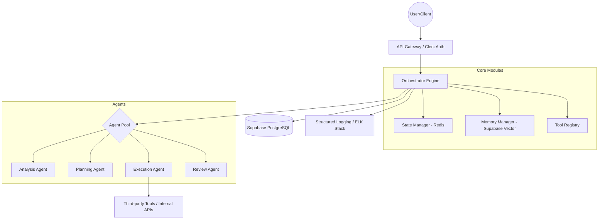
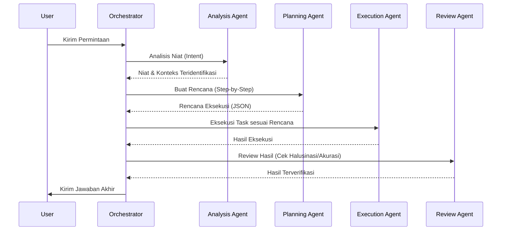

# SBA-Agentic Project Rules & Governance
> **Version:** 1.4.0 | **Status:** Active | **Last Updated:** 2025-12-28 | **Classification:** Internal

Dokumen ini mendefinisikan standar, prosedur, dan panduan untuk pengembangan dan operasional **SBA-Agentic (Smart Business Assistant)**. Seluruh kontributor dan sistem AI (Agent) wajib mematuhi aturan ini untuk menjaga integritas, keamanan, dan skalabilitas sistem.

---

## 1. Struktur dan Format Standar

### 1.1 Hierarki Direktori `.trae/rules/`
Semua aturan proyek harus disimpan dalam struktur berikut untuk memastikan keteraturan dan kemudahan akses oleh agent:

```text
.trae/rules/
├── README.md                # Indeks utama dan ringkasan aturan
├── PROJECT_RULES.md         # Dokumen otoritas pusat (file ini)
├── STYLE_GUIDE.md           # Panduan gaya penulisan kode dan dokumentasi
├── DEPENDENCIES.md          # Tata kelola dependensi dan stack teknologi
├── core/                    # Invariant system rules (Auth, Logging, Error)
│   ├── authentication.yaml
│   ├── authorization.yaml
│   ├── logging.yaml
│   └── error_handling.yaml
│   └── meta_cognitive_governance.yaml
├── business_logic/          # Domain-aware & Tenant-aware rules
│   ├── agent_execution.yaml
│   ├── workspace_management.yaml
│   ├── billing.yaml         # Aturan kuota dan penagihan
│   └── knowledge_access.yaml
├── validation/              # Guardrail & Safety net rules
│   ├── input_schema.yaml
│   ├── output_contract.yaml
│   └── policy_validation.yaml # Validasi kebijakan keamanan dinamis
└── templates/               # Template untuk pembuatan rule baru
    ├── base_rule.template.yaml
    ├── agent_rule.template.yaml
    └── api_rule.template.yaml # Template untuk integrasi API baru
```

### 1.2 Konvensi Penamaan
- **File Markdown (.md):** Gunakan `UPPER_SNAKE_CASE.md`. (Contoh: `STYLE_GUIDE.md`).
- **File YAML (.yaml):** Gunakan `lower_snake_case.yaml`. (Contoh: `agent_execution.yaml`).
- **Folder:** Gunakan `lower_snake_case/`.
- **Branch Git:** `feat/`, `fix/`, `docs/`, `refactor/` diikuti oleh deskripsi singkat (kebab-case). (Contoh: `feat/add-auth-rule`).

### 1.3 Template Metadata Wajib
Setiap dokumen aturan wajib menyertakan metadata di bagian atas (Header):

```markdown
---
id: [namespace].[category].[name]
version: [x.y.z]
author: [name/team]
status: [draft | active | deprecated]
scope: [global | tenant | workspace]
tags: [tag1, tag2]
---
```
- **Scope:** Menentukan jangkauan aturan (`global` untuk seluruh sistem, `tenant` untuk organisasi tertentu, `workspace` untuk area kerja spesifik).
- **Status:** Mengatur lifecycle aturan (`draft` untuk pengembangan, `active` untuk produksi, `deprecated` untuk aturan usang).

### 1.4 Kontrak Aturan (YAML Contract)
Semua rule berbasis YAML harus mengikuti struktur kontrak standar agar dapat di-parse oleh agent secara otomatis:

```yaml
metadata:
  id: <namespace>.<category>.<name>
  version: 1.0.0
  scope: <global|tenant|workspace>

description: >
  Penjelasan singkat mengenai tujuan dan fungsi aturan ini.

trigger:
  event: <event_name> (e.g., http.request.received, agent.task.requested)
  conditions:
    - field: <field_path>
      operator: <exists|equals|in|not_in>
      value: <value>

actions:
  - type: <action_type>
    params:
      key: value
    on_success: <continue|stop|next_action>
    on_failure: <deny|retry|fail_fast>

error_handling:
  strategy: <fail_fast|fail_safe|retry>
  on_error:
    log_level: <info|warn|error>
    emit_event: <event_name>
```

---

## 2. Panduan Pengembangan SBA-Agentic

### 2.1 Prinsip Dasar Agentic AI
SBA-Agentic dibangun di atas filosofi **"Reasoning First, Execution Second"**.
- **Filosofi Desain Berbasis Agent:** Sistem bukan sekadar sekumpulan API, melainkan entitas otonom yang mampu memahami tujuan (*goals*) dan merencanakan langkah (*planning*) untuk mencapainya.
- **Karakteristik Utama:**
  - **Proaktif:** Mengantisipasi kebutuhan user berdasarkan konteks historis dan tren data.
  - **Adaptif:** Mampu menyesuaikan rencana eksekusi jika terjadi kegagalan atau perubahan input.
  - **Reliable:** Menjamin akurasi melalui mekanisme verifikasi berlapis (*Reasoning Chain*).
- **Etika dan Tanggung Jawab AI:**
  - **Transparansi:** Setiap keputusan agent harus dapat dijelaskan (*Explainable AI*).
  - **Anti-Bias:** Audit rutin pada prompt dan dataset untuk mencegah diskriminasi.
  - **Privasi:** Perlindungan data pengguna melalui anonimisasi sebelum dikirim ke model LLM eksternal.

### 2.2 Arsitektur Sistem & Spesifikasi Modul
SBA-Agentic menggunakan arsitektur **Micro-Orchestration** yang modular.



#### Spesifikasi Teknis Modul Inti:
- **Orchestrator Engine:** Bertanggung jawab atas manajemen lifecycle agent, pengalokasian resource, dan penanganan kegagalan global.
- **State Manager (Redis):** Menyimpan konteks percakapan aktif dan status eksekusi task secara *real-time*.
- **Memory Manager (Supabase Vector):** Mengelola memori jangka panjang agent menggunakan *vector embeddings* (pgvector) untuk RAG (*Retrieval-Augmented Generation*).
- **Tool Registry:** Katalog API dan fungsi internal yang dapat dipanggil oleh agent secara dinamis.

#### Pola Komunikasi Antar-Agent (Reasoning Chain):


### 2.3 Standar Kode
- **JavaScript/TypeScript:**
  - Gunakan **PascalCase** untuk `Class`, `Interface`, dan `Enum`.
  - Gunakan **camelCase** untuk variabel, fungsi, dan properti.
  - Wajib menggunakan `strict: true` di `tsconfig.json`.
- **Python:**
  - Ikuti standar **PEP 8**.
  - Gunakan `snake_case` untuk fungsi dan variabel.
  - Gunakan `PascalCase` untuk Class.
- **Dokumentasi:**
  - Setiap fungsi publik wajib memiliki **JSDoc** (JS/TS) atau **Docstrings** (Python).
  - Jelaskan "Why" (alasan logis) daripada "What" (apa yang dilakukan kode).
- **Version Control:**
  - Gunakan **Conventional Commits** (e.g., `feat(auth): add clerk integration`).
  - Minimal 2 reviewer (1 Human, 1 Agent Reviewer).

### 2.4 Keamanan dan Privasi
- **Protokol Enkripsi:**
  - **Data at Rest:** AES-256 menggunakan AWS KMS atau HashiCorp Vault.
  - **Data in Transit:** TLS 1.3 wajib diterapkan pada semua komunikasi API.
- **Autentikasi & Otorisasi:**
  - **Clerk:** Digunakan untuk manajemen session dan MFA (Multi-Factor Authentication).
  - **RBAC:** Kontrol akses berbasis peran (Admin, Manager, Staff) dengan isolasi tenant yang ketat.
- **Penanganan Data Sensitif:**
  - Masking otomatis untuk PII (Email, Phone, Address) pada log.
  - Anonimisasi data sebelum dikirim ke model LLM pihak ketiga.

---

## 3. Prosedur Operasional

### 3.1 Alur Kerja Pengembangan
1. **Feature Discovery:** Identifikasi kebutuhan melalui Business Requirements Document (BRD).
2. **RFC (Request for Comments):** Buat dokumen RFC untuk perubahan arsitektur besar.
3. **Branching Strategy:** `main` (stable), `staging` (pre-release), `feat/` (fitur), `fix/` (bug).
4. **Code Review:** Reviewer harus memeriksa kepatuhan terhadap `STYLE_GUIDE.md` dan `PROJECT_RULES.md`.

### 3.2 Validasi dan Testing
- **Unit Testing:** Target coverage minimal 85%. Gunakan `Jest` (JS/TS) atau `Pytest` (Python).
- **Integration Testing:** Memastikan interaksi antar modul (e.g., Orchestrator <-> Redis).
- **E2E Testing:** Gunakan `Playwright` untuk memverifikasi alur pengguna kritis.
- **CI Pipeline Validation Steps:**
  1. **YAML Lint:** Validasi format file aturan.
  2. **Schema Validation:** Validasi terhadap JSON Schema kontrak aturan.
  3. **Rule Unit Test:** Simulasi event payload (dry-run).

### 3.3 Quality & Governance Metrics
- **Rule Hit Count:** Frekuensi penggunaan aturan.
- **Rule Failure Rate:** Persentase kegagalan tindakan dalam aturan.
- **Hallucination Rate:** Persentase jawaban yang ditolak oleh `Review Agent`.

### 3.4 Deployment dan Maintenance
- **Strategi Deployment:**
  - **Canary:** Rilis ke 5-10% user untuk monitoring awal.
  - **Blue-Green:** Untuk rilis besar guna meminimalisir downtime.
- **Rollback Darurat:** Otomatis jika tingkat error meningkat > 2% dalam 5 menit pertama.
- **Jadwal Maintenance:** Setiap hari Minggu pukul 02:00 - 04:00 UTC.

---

## 4. Template dan Contoh Implementasi

### 4.1 Skenario Bisnis: Automated Reporting Agent
**Tujuan:** Membuat laporan performa mingguan secara otomatis.
**Snippet Implementasi (Python):**
```python
class ReportingAgent(BaseAgent):
    def __init__(self, tenant_id: str):
        self.memory = MemoryManager(tenant_id)
        self.tools = ToolRegistry()

    async def execute(self):
        # 1. Analisis data
        raw_data = await self.tools.call("get_weekly_sales")
        
        # 2. Planning visualisasi
        plan = await self.planner.create_chart_plan(raw_data)
        
        # 3. Eksekusi
        report_pdf = await self.executor.generate_pdf(plan)
        
        # 4. Review
        is_valid = await self.reviewer.verify_data(report_pdf, raw_data)
        if is_valid:
            await self.tools.call("send_email", report_pdf)
```

### 4.2 Studi Kasus: Mitigasi Halusinasi
**Masalah:** Agent memberikan data stok barang yang tidak ada di database.
**Solusi:** Implementasi `validation/output_contract.yaml` yang mewajibkan setiap item dalam jawaban agent divalidasi silang (*cross-check*) dengan database inventaris sebelum ditampilkan ke user.

---

## 5. Referensi dan Checklist

### 5.1 Referensi Industri
- [ISO/IEC 42001:2023 - AI Management System](https://www.iso.org/standard/81230.html)
- [NIST AI Risk Management Framework](https://www.nist.gov/itl/ai-risk-management-framework)
- [OWASP Top 10 for LLM Applications](https://owasp.org/www-project-top-10-for-large-language-model-applications/)

### 5.2 Checklist Verifikasi
- [ ] Apakah metadata YAML sudah lengkap (id, version, scope)?
- [ ] Apakah fungsi publik memiliki JSDoc/Docstrings?
- [ ] Apakah diagram Mermaid sudah diuji rendernya?
- [ ] Apakah rahasia (API Keys) sudah disimpan di Environment Variables?
- [ ] Apakah aturan sudah mencakup `error_handling` strategy?

---
**Versioning Dokumen:**
- v1.0.0 - v1.2.0: Pengembangan awal dan spesifikasi modul.
- v1.3.0: Penambahan standar YAML Contract dan metrik tata kelola.
- v1.4.0: Penguatan prinsip dasar Agentic AI, spesifikasi modul inti, dan penambahan contoh implementasi kode serta studi kasus mitigasi halusinasi.
