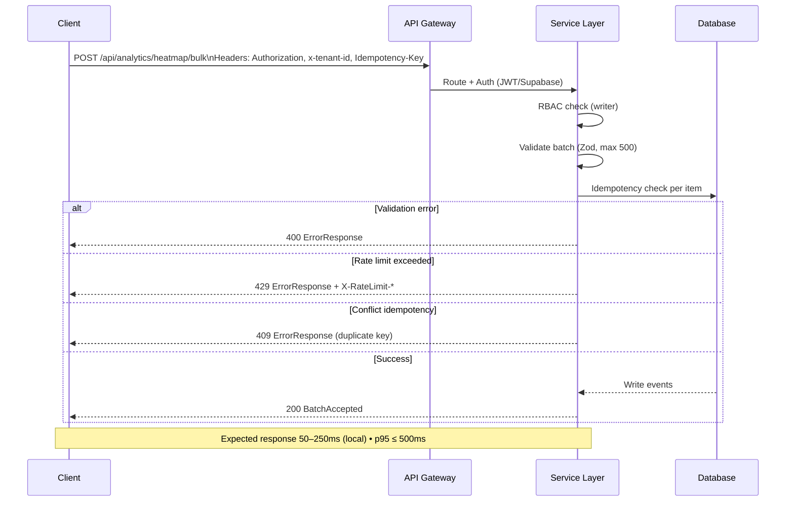
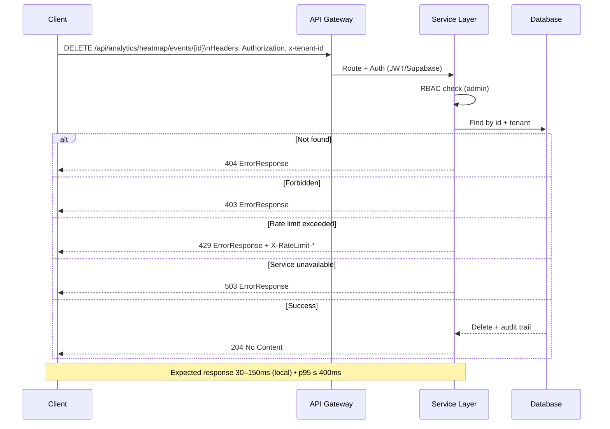

# Spesifikasi API — Analytics Heatmap

## Ringkasan

- Tujuan: mengumpulkan event interaksi UI (click/hover/scroll) untuk visualisasi heatmap dan analitik.
- Prinsip: REST stateless, deterministik (idempotensi), multitenant (`x-tenant-id`), dokumentasi jelas, kopling longgar.
- Integrasi monorepo: RBAC, Upstash rate limit, observability metrics (`withMetrics`).

## Endpoints (v1)

- `POST /api/analytics/heatmap/events`
  - Fungsi: kirim satu event.
  - Header: `Authorization: Bearer <JWT>` atau Supabase session cookie; `x-tenant-id: <tenant>` (wajib); `Idempotency-Key: <key>` (disarankan).
  - Response: `201 Created` payload `EventCreated`; `200 OK` jika duplikat; `409 Conflict` jika idempotency collision; `429 Too Many Requests` saat limit.
- `POST /api/analytics/heatmap/bulk`
  - Fungsi: kirim batch event (maks 500 item per request); semantik idempotensi per item.
- `GET /api/analytics/heatmap/events`
  - Fungsi: daftar event dengan filter query: `page`, `type`, `from`, `to`, `sessionId`, `limit`, `cursor`.
- `GET /api/analytics/heatmap/stats`
  - Fungsi: ringkasan agregat per `page/selector/type` dan densitas; window waktu via `from/to`.
- `GET /api/analytics/heatmap/export`
  - Fungsi: unduhan CSV atau NDJSON; paginasi streaming; parameter `format=csv|ndjson`.
- `DELETE /api/analytics/heatmap/events/:id`
  - Fungsi: hapus event (admin-only) dengan audit trail.

## Deskripsi Fungsional & RBAC

- Peran `writer`: `POST /events`, `POST /bulk`.
- Peran `reader`: `GET /events`, `GET /stats`, `GET /export` (export bisa `admin` jika kebijakan ketat).
- Peran `admin`: `DELETE /events/:id`, akses penuh termasuk audit.
- Isolasi tenant: semua operasi mengharuskan `x-tenant-id` dan difilter per tenant.

## Skema (JSON Schema)

```json
{
  "$id": "https://sba-agentic.schemas/heatmap-event.json",
  "$schema": "https://json-schema.org/draft/2020-12/schema",
  "type": "object",
  "required": [
    "eventId",
    "type",
    "page",
    "selector",
    "x",
    "y",
    "vw",
    "vh",
    "ts"
  ],
  "properties": {
    "eventId": { "type": "string", "format": "uuid" },
    "type": { "type": "string", "enum": ["click", "hover", "scroll"] },
    "page": { "type": "string", "pattern": "^/" },
    "selector": { "type": "string" },
    "x": { "type": "number" },
    "y": { "type": "number" },
    "vw": { "type": "number" },
    "vh": { "type": "number" },
    "density": { "type": "number", "minimum": 0 },
    "sessionId": { "type": "string" },
    "userId": { "type": "string" },
    "device": { "type": "string" },
    "referrer": { "type": "string" },
    "ts": { "type": "string", "format": "date-time" }
  }
}
```

## Validasi Runtime (Zod)

```ts
import { z } from 'zod';

export const HeatmapEventZ = z.object({
  eventId: z.string().uuid(),
  type: z.enum(['click', 'hover', 'scroll']),
  page: z.string().regex(/^\//),
  selector: z.string(),
  x: z.number(),
  y: z.number(),
  vw: z.number(),
  vh: z.number(),
  density: z.number().min(0).optional(),
  sessionId: z.string().optional(),
  userId: z.string().optional(),
  device: z.string().optional(),
  referrer: z.string().optional(),
  ts: z.string().datetime(),
});

export const HeatmapEventBatchZ = z.object({
  items: z.array(HeatmapEventZ).max(500),
});
```

## Struktur Response

- `EventCreated`:

```json
{ "eventId": "uuid", "status": "created", "receivedAt": "2025-12-08T12:00:00Z" }
```

- `BatchAccepted`:

```json
{
  "accepted": 123,
  "duplicates": 7,
  "failed": 2,
  "errors": [{ "index": 10, "code": "validation", "message": "x is required" }]
}
```

- `StatsResponse`:

```json
{
  "page": "/integrations",
  "window": { "from": "2025-12-08T00:00:00Z", "to": "2025-12-08T23:59:59Z" },
  "topSelectors": [
    {
      "selector": "button[data-testid=connect]",
      "count": 120,
      "density": 0.87
    },
    { "selector": "nav a[href=/monitoring]", "count": 75, "density": 0.42 }
  ],
  "totals": { "click": 200, "hover": 420, "scroll": 670 }
}
```

## Autentikasi & Otorisasi

- JWT Bearer (`Authorization` header) atau Supabase session; header `x-tenant-id` wajib.
- RBAC ketat per peran di atas; audit di semua operasi perubahan.

## Rate Limiting

- Publik: 60 req/min/IP; Auth (writer): 600 req/min/tenant.
- Respons menyertakan `X-RateLimit-Limit`, `X-RateLimit-Remaining`, `Retry-After`.
- Pelanggaran: `429 Too Many Requests` dengan body error standar.

## Error Standar

```json
{
  "code": "validation",
  "message": "field x must be a number",
  "details": { "field": "x" },
  "requestId": "req_abc123"
}
```

- Kode: 400, 401, 403, 404, 409, 422, 429, 500.

## Event/Webhook

- Event:
  - `analytics.heatmap.event.created`
  - `analytics.heatmap.bulk.accepted`
  - `analytics.heatmap.export.ready`
- Header webhook: `X-Webhook-Signature` (HMAC), `X-Event-Id`, `X-Event-Type`.
- Retry: exponential backoff (max 10), dead-letter bila gagal.

## Contoh curl

```sh
curl -X POST "${BASE}/api/analytics/heatmap/events" \
  -H "Authorization: Bearer $JWT" \
  -H "x-tenant-id: tenant_123" \
  -H "Idempotency-Key: a1b2c3" \
  -H "Content-Type: application/json" \
  -d '{
    "eventId":"1b1ddf12-77b5-4f03-a0f7-4d6f21e3ef01",
    "type":"click",
    "page":"/integrations",
    "selector":"button[data-testid=connect]",
    "x":320,"y":640,"vw":1280,"vh":720,
    "sessionId":"s_001",
    "ts":"2025-12-08T12:00:00Z"
  }'
```

## Determinisme

- Input identik dengan `Idempotency-Key` identik → selalu respon identik (`200 OK` dengan status `duplicate` atau `201 Created` saat first insert).
- Operasi atomik tanpa side-effect tak terduga.

## Referensi Monorepo

- README: RBAC, rate limit Upstash, observability metrics.
- Observability UI: membaca metrik latensi p95/p99.

## Catatan Implementasi

- Gunakan `withMetrics` untuk membungkus handler; `ensureTenantHeader` memvalidasi `x-tenant-id`.
- Validasi body dengan Zod dan kembalikan 400 bila invalid; format error standar.

## Diagram Alur (Mermaid)

```mermaid
flowchart LR
  Client -->|HTTP| API
  API --> Auth[Auth Middleware (JWT/Supabase)]
  Auth --> RBAC[RBAC Guard]
  RBAC --> Handler[Endpoint Handler]
  Handler --> Idem[Idempotency Check]
  Idem --> Store[(Event Store)]
  Store --> Bus[[Event Bus]]
  Bus --> Webhook[Webhook Dispatcher]
  Handler --> Resp[Response]

  subgraph Errors
    E400[400 Validation]
    E401[401 Unauthorized]
    E403[403 Forbidden]
    E429[429 Rate Limit]
    E500[500 Server Error]
  end

  Auth -->|invalid token| E401
  RBAC -->|deny| E403
  Handler -->|invalid body| E400
  Handler -->|over limit| E429
  Handler -->|unexpected| E500
```

### Sequence — POST /bulk



### Sequence — DELETE /events/{id}



### Sequence — GET /events

```mermaid
sequenceDiagram
  actor C as Client
  boundary G as API Gateway
  control S as Service Layer
  entity Cache as Cache
  entity DB as Database
  C->>G: GET /api/analytics/heatmap/events?page&type&limit
  G->>S: Route + Auth (JWT/Supabase)
  S->>S: Validate params (page/type/limit/cursor)
  S->>Cache: Check cache (key by tenant+query)
  alt Cache hit
    Cache-->>S: Return cached list
    S-->>C: 200 EventListResponse
  else Cache miss
    S->>DB: Query events with filters + pagination
    DB-->>S: Items + nextCursor
    S->>Cache: Set cache (TTL)
    S-->>C: 200 EventListResponse
  end
  Note over C,S: Expected response 40–200ms • p95 ≤ 450ms
```

### Sequence — GET /stats

```mermaid
sequenceDiagram
  actor C as Client
  boundary G as API Gateway
  control S as Service Layer
  entity DB as Database
  C->>G: GET /api/analytics/heatmap/stats?page&from&to
  G->>S: Route + Auth (JWT/Supabase)
  S->>S: Validate params (page/from/to)
  S->>DB: Aggregate by selector/type within window
  DB-->>S: Aggregates (totals, topSelectors)
  S-->>C: 200 StatsResponse (formatted)
  Note over C,S: Expected response 60–250ms • p95 ≤ 500ms
```

#### Legend (UML Notation)

- actor: Client
- boundary: API Gateway
- control: Service Layer
- entity: Database/Cache
- Notes: waktu respons dan p95 target

## Artefak Load Runner

- Iteration data: `workspace/05_API/load_runner_data.csv`
- Environment template: `workspace/05_API/postman_env.json`
