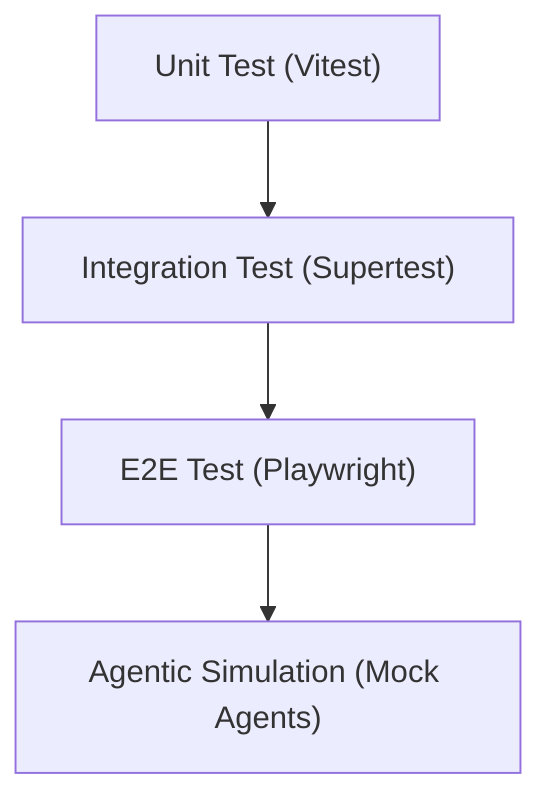

# 🧪 07 - Testing & Quality

Dokumentasi ini merinci strategi pengujian, metrik kualitas, dan standar validasi untuk memastikan sistem **SBA-Agentic** tetap stabil, aman, dan berperforma tinggi.

## 1. Strategi & Hirarki Pengujian

Sistem menggunakan strategi pengujian komprehensif mulai dari unit test terisolasi hingga validasi skenario bisnis end-to-end.

**Deskripsi Hirarki Pengujian:**
Diagram di atas menunjukkan tingkatan strategi pengujian di SBA-Agentic. Pengujian dimulai dari Unit Test yang paling mendasar, naik ke Integration Test untuk interaksi antar modul, kemudian End-to-End (E2E) Test untuk simulasi alur pengguna nyata, dan puncaknya adalah Agentic Simulation untuk memvalidasi perilaku agen AI.

### 1.1 Fokus Pengujian
*   **Unit Tests**: Validasi fungsi individu, komponen UI, dan logika bisnis secara terisolasi.
*   **Integration Tests**: Verifikasi interaksi antar modul, service, atau endpoint API.
*   **End-to-End (E2E) Tests**: Simulasi perjalanan pengguna lengkap (user journeys) di seluruh stack aplikasi.
*   **Agentic Simulation**: Pengujian khusus untuk perilaku dan loop sistem agentic menggunakan mock agents.
*   **Contract Tests**: Validasi kontrak API antara client dan server untuk mencegah breaking changes.

## 2. Persyaratan & Target Coverage

Kami menjaga standar kualitas yang ketat dengan target cakupan (coverage) berikut:

*   **Unit Testing**:
    *   Target: Lines/Functions/Statements ≥ 80%, Branches ≥ 70%.
    *   UI Components: Target ≥ 90%.
*   **Accessibility Testing**: Kepatuhan terhadap WCAG 2.1 AA, kompatibilitas screen reader, dan navigasi keyboard.

## 3. Toolkit Pengujian

*   **Unit & Integration**: Vitest, React Testing Library, Supertest, MSW (Mock Service Worker).
*   **End-to-End**: Playwright.
*   **Contract**: Prism mock server.

## 4. Automasi & Kriteria Penerimaan

Setiap rilis harus memenuhi kriteria berikut:
*   Seluruh suite pengujian harus lulus ("green").
*   Metrik cakupan kode harus memenuhi atau melampaui ambang batas.
*   Alur pengguna kritis harus tercakup sepenuhnya dan stabil.

## 📖 Konten Utama
- **[TESTING_STRATEGY.md](./TESTING_STRATEGY.md)**: Strategi pengujian menyeluruh (Unit, Integration, E2E).
- **[QUALITY_METRICS.md](./QUALITY_METRICS.md)**: Metrik kualitas kunci dan ambang batas.
- **[A11Y_GUIDE.md](./A11Y_GUIDE.md)**: Panduan aksesibilitas (WCAG 2.1 AA).

## 👥 Audience
- **QA Engineers**: Untuk pelaksanaan dan pemeliharaan test suite.
- **Developers**: Untuk panduan penulisan test dan standar coverage.
- **AI Agents**: Untuk memahami kriteria validasi sistem.
