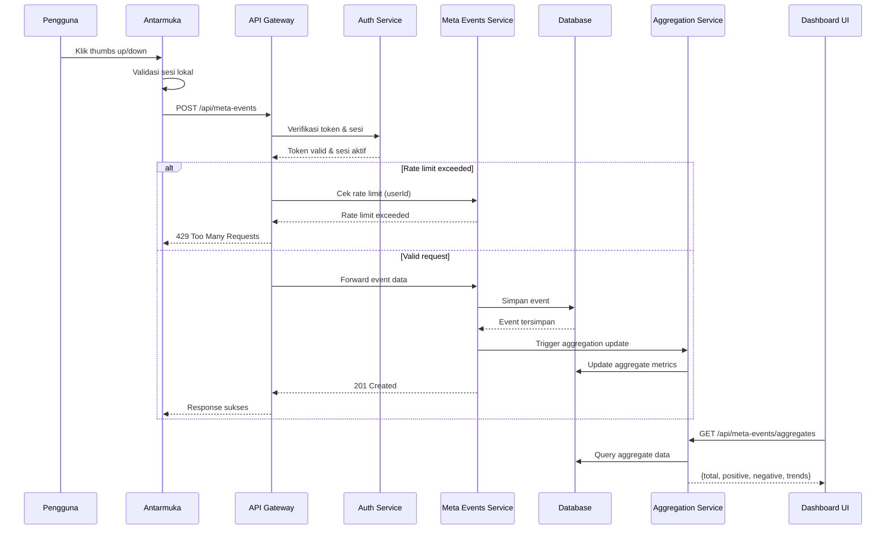

# 🚢 10 - Release & Go-Live

Dokumentasi ini berisi panduan, checklist, dan rencana peluncuran sistem **SBA-Agentic** ke lingkungan produksi secara bertahap dan aman.

## 1. Rencana Peluncuran Bertahap (Phased Deployment)

Untuk meminimalkan risiko, peluncuran dilakukan dalam empat fase utama:

*   **Fase 1: Staging Environment (Minggu 1)**
    *   Deploy ke lingkungan staging.
    *   Pengujian internal bersama tim QA.
*   **Fase 2: Beta Testing (Minggu 2)**
    *   Deploy ke lingkungan beta.
    *   Rekrutmen 50-100 beta testers.
*   **Fase 3: A/B Testing (Minggu 3)**
    *   Deploy ke 25% basis pengguna.
*   **Fase 4: Full Rollout (Minggu 4)**
    *   Deploy ke 100% basis pengguna.

## 2. Milestone & Jalur Kritis

Milestone utama didefinisikan dengan kriteria penerimaan yang jelas. Jalur kritis dipantau secara terus-menerus untuk memastikan fungsionalitas inti terintegrasi sesuai jadwal. Kami mengalokasikan waktu cadangan (buffer) sebesar 15-20% untuk menghadapi tantangan teknis yang tidak terduga.

## 3. Alur Meta-Events (Sequence Diagram)

Diagram berikut menunjukkan dependensi antar layanan untuk alur meta-events selama operasional:

## 📖 Konten Utama
- **[PRODUCTION_READINESS_CHECKLIST.md](./PRODUCTION_READINESS_CHECKLIST.md)**: Daftar periksa kesiapan produksi.
- **[DEPLOYMENT_GUIDE.md](./DEPLOYMENT_GUIDE.md)**: Panduan teknis deployment.
- **[GO_NOGO_DECISION.md](./GO_NOGO_DECISION.md)**: Protokol keputusan Go/No-Go.
- **[ROADMAP_GO_LIVE.md](./ROADMAP_GO_LIVE.md)**: Peta jalan peluncuran.

## 👥 Audience
- **DevOps Engineers**: Untuk eksekusi deployment dan monitoring.
- **Release Managers**: Untuk koordinasi fase peluncuran.
- **Product Owners**: Untuk validasi milestone dan kriteria rilis.
