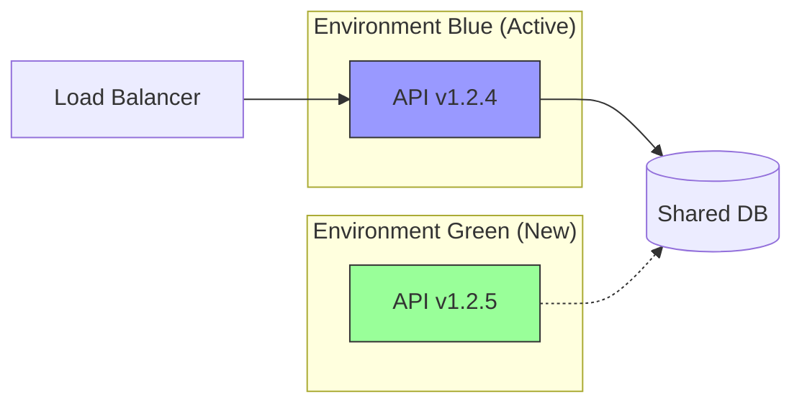

# Zero-Downtime Deployment Strategy

Strategi ini memastikan pembaruan platform SBA-Agentic dapat dilakukan tanpa mengganggu layanan yang sedang berjalan (99.99% Uptime).

## 1. Blue-Green Deployment Flow

Kami menggunakan model Blue-Green untuk isolasi lingkungan produksi yang aman.

### Langkah-langkah:
1.  **Provision Green**: Deploy versi baru di infrastruktur terpisah.
2.  **Smoke Test**: Jalankan pengujian otomatis di lingkungan Green.
3.  **Switch Traffic**: Alihkan traffic Load Balancer dari Blue ke Green.
4.  **Monitoring**: Pantau error rate dan latensi selama 15 menit.
5.  **Decommission Blue**: Hapus lingkungan lama setelah validasi berhasil.

## 2. Database Migration (Expanding/Contracting)

Untuk mencegah kegagalan saat migrasi schema, kami mengikuti pola **Expand and Contract**:

1.  **Expand (v1)**: Tambahkan kolom atau tabel baru (non-breaking). Kode lama tetap bisa berjalan.
2.  **Migrate (v1.1)**: Salin data dari kolom lama ke baru (jika ada transformasi).
3.  **Use New (v2)**: Update aplikasi untuk menggunakan schema baru.
4.  **Contract (v3)**: Hapus kolom atau tabel lama yang sudah tidak digunakan.

## 3. Circuit Breakers & Rollback

- **Circuit Breaker**: Jika versi baru (Green) menghasilkan >5% error dalam 1 menit, Load Balancer akan otomatis dialihkan kembali ke Blue.
- **Instant Rollback**: Script `ops:rollback` tersedia untuk memicu pengalihan manual dalam <1 menit.
- **Data Integrity**: Jika migrasi database gagal, transaksi akan di-rollback secara otomatis menggunakan Prisma Transaction API.

## 4. Disaster Recovery Targets

| Metric | Target | Deskripsi |
| --- | --- | --- |
| **RTO** | < 15 Menit | Waktu maksimal untuk memulihkan layanan setelah kegagalan total. |
| **RPO** | < 1 Menit | Jumlah data maksimal yang boleh hilang saat terjadi bencana. |

---
Terakhir diperbarui: 2026-01-01
