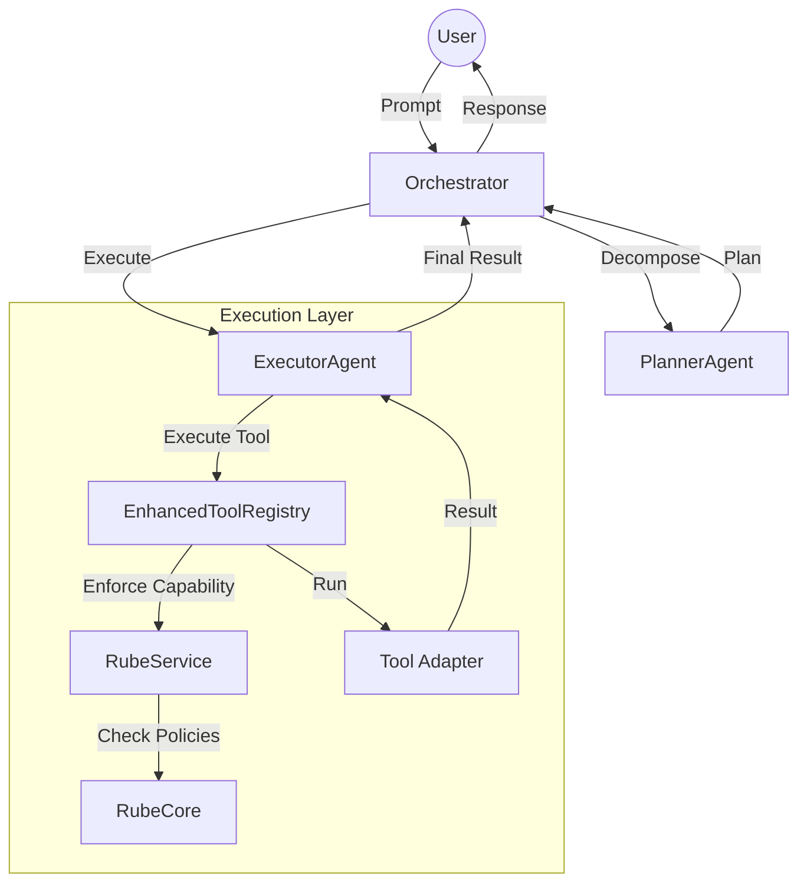

# Technical Specification: Rube + Orchestrator Integration

## Overview
Sistem SBA-Agentic mengintegrasikan `Orchestrator` (Multi-agent workflow) dengan `Rube` (Rule Engine & Security Guard) untuk memastikan setiap aksi agen AI mematuhi kebijakan keamanan Zero Trust dan isolasi multi-tenant.

## Architecture
Integrasi ini beroperasi pada lapisan **Tool Execution**. Setiap kali `ExecutorAgent` memicu sebuah tool melalui `EnhancedToolRegistry`, sistem akan melakukan penegakan kebijakan secara sinkron.

### Component Diagram (Mermaid)


### Component Interaction
1. **PlannerAgent**: Membuat rencana (Plan) yang terdiri dari langkah-langkah (Steps) menggunakan metadata dari Rube.
2. **ExecutorAgent**: Menjalankan langkah-langkah tersebut.
3. **EnhancedToolRegistry**: Bertindak sebagai gateway eksekusi tool.
4. **RubeService**: Menyediakan metode `enforce()` untuk memvalidasi konteks eksekusi terhadap kebijakan keamanan.

## Security Enforcement (Zero Trust)
Setiap eksekusi tool wajib melewati pemeriksaan berikut:
- **Tenant Validation**: Memastikan `tenantId` tersedia dan valid.
- **User Authentication**: Memastikan `userId` terautentikasi (non-anonymous).
- **Cross-tenant Protection**: Mencegah agen mengakses resource milik tenant lain.
- **Capability Authorization**: Memastikan tool yang diminta terdaftar dan diizinkan untuk peran user tersebut.

## Technical Implementation

### RubeGuardContext
Konteks yang dikirimkan ke Rube untuk penegakan kebijakan:
```typescript
export interface RubeGuardContext {
  tenantId: string;
  workspaceId?: string;
  resourceTenantId: string;
  userRoles: string[];
  userId: string;
  parameters?: Record<string, any>;
}
```

### Tool Registration Workflow
1. Developer mendaftarkan tool di `EnhancedToolRegistry`.
2. `EnhancedToolRegistry` secara otomatis memanggil `rubeService.registerToolCapability()`.
3. Rube mendaftarkan tool tersebut sebagai `capability` dengan guard default (`enforce_tenant`, `audit_log`).

## API Reference

### Orchestrator
- `startRun(input: RunInput)`: Memulai workflow baru.
- `continueRun(runId: string, input: any)`: Melanjutkan workflow (HITL/Feedback).

### RubeService
- `enforce(capability: string, context: RubeGuardContext)`: Menegakkan kebijakan keamanan.
- `registerToolCapability(toolName: string, description: string, metadata: any)`: Pendaftaran capability dinamis.

## Verification & Testing
Integritas sistem divalidasi melalui:
- **E2E Tests**: `e2e.4-agent.spec.ts` & `e2e.4-agent.extended.spec.ts`.
- **Security Tests**: Memastikan pelanggaran Zero Trust (missing tenantId/userId) menghasilkan error yang tepat.
- **Coverage**: Menargetkan >90% coverage pada modul inti integrasi.
