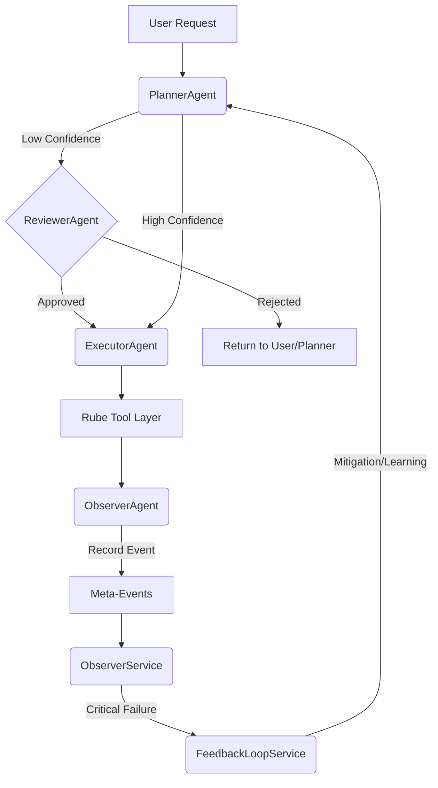

# 🛠️ SBA-Agentic Operational Guide

## 📌 Overview
Panduan ini menjelaskan cara mengoperasikan dan memantau alur kerja multi-agent di SBA-Agentic, termasuk mekanisme koordinasi, pembelajaran mandiri, dan intervensi manusia (HITL).

## 🤖 Multi-Agent Coordination Flow
Sistem menggunakan 4 peran agen utama yang berkoordinasi secara otomatis:

### 1. PlannerAgent
- **Tanggung Jawab**: Dekomposisi tugas dan perencanaan.
- **Trigger**: Permintaan baru dari pengguna.
- **Output**: Rencana aksi dalam format JSON dengan `confidence_score`.

### 2. ExecutorAgent
- **Tanggung Jawab**: Eksekusi tool dan workflow.
- **Trigger**: Rencana yang disetujui dari Planner atau Reviewer.
- **Keamanan**: Menjalankan aksi melalui Tool Registry dengan **Zero Trust Policy Enforcement** (ADR-004).
- **Tooling**: 
    - **Functional Tools**: `document.extract_data` (OCR/NLP), `analytics.generate_report`, `support.route_to_department`.
    - **Utility Tools**: `agent.personalize_response`, `knowledge.extract`.
    - **BPA/CX Tools**: `workflow.approval_request`, `cx.customer_profile`.

### 3. ReviewerAgent (HITL)
- **Tanggung Jawab**: Persetujuan manual untuk rencana berisiko tinggi atau kepercayaan rendah.
- **Trigger**: `confidence_score < 0.7` dari PlannerAgent.
- **Notifikasi**: Mengirim permintaan ke Slack/Email untuk admin.

### 4. ObserverAgent & Service
- **Tanggung Jawab**: Audit, deteksi anomali, dan pemantauan real-time.
- **Trigger**: Setiap event sistem (tool call, error, reflection).
- **Integrasi**: Menghubungkan kejadian kritis langsung ke FeedbackLoopService.

## 🧠 Self-Learning & Feedback Loop
Sistem secara otomatis belajar dari kegagalan menggunakan strategi 6 langkah:

1.  **Identify High Risk Areas**: Mencari pola error tertinggi di database.
2.  **Analyze Failure Patterns**: Mengelompokkan penyebab kegagalan (latensi, tool error, logic drift).
3.  **Automated Research**: Melakukan pencarian web untuk solusi teknis terbaru.
4.  **Calculate Drift**: Mengukur penyimpangan antara performa saat ini dan baseline.
5.  **Enhanced Monitoring**: Menambahkan tracing tambahan pada area yang bermasalah.
6.  **Apply Mitigation**: Menyesuaikan parameter (concurrency, timeout) atau mengupdate knowledge base.

## 📈 Monitoring & Health Check
- **Dashboard Admin**: Pantau latensi, token usage, dan error rate per agent.
- **Meta-Events**: Log terpusat untuk semua aktivitas agen (termasking PII).
- **Health Endpoint**: `GET /api/health` untuk status ekosistem secara keseluruhan.

## 🚨 Incident Response
Jika terjadi kegagalan sistemik:
1.  ObserverService akan mendeteksi `critical` severity.
2.  FeedbackLoopService memicu `triggerImmediateAnalysis`.
3.  Sistem secara otomatis mengurangi `concurrency` atau mengaktifkan `safe-mode` untuk tenant yang terdampak.
4.  Admin menerima notifikasi eskalasi dari ReviewerAgent.

## 🚢 Deployment & Maintenance
### Prosedur Deployment
1. **Validation**: Jalankan E2E tests (`npm test e2e.4-agent.extended`) di staging.
2. **Security Check**: Pastikan `ENABLE_RUBE=true` di environment production.
3. **Migration**: Jalankan prisma migration jika ada perubahan skema database.
4. **Monitoring Setup**: Pastikan OpenTelemetry spans terhubung ke collector (Jaeger/Honeycomb).

### Maintenance Checklist
- [ ] Review `meta-events` mingguan untuk deteksi logic drift.
- [ ] Update tool capabilities di Rube Registry jika ada parameter baru.
- [ ] Validasi cache hit rate pada `RedisCache` adapter.

---
*Dokumentasi ini dihasilkan secara otomatis oleh Super Agent - 2025-12-31*
