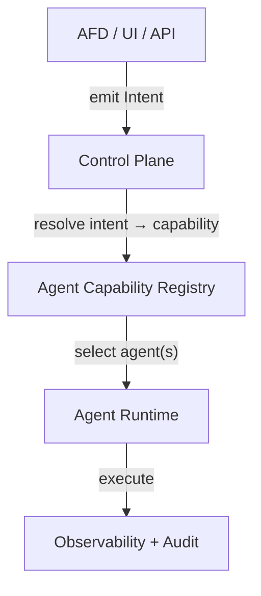

# Agent Capability Registry Spec
**Smart Business Assistant (SBA-Agentic)**

Berikut adalah **Agent Capability Registry Spec** yang *production-grade*, *agent-agnostic*, dan menjadi tulang punggung **Control Plane SBA-Agentic**. Dokumen ini dirancang sejalan langsung dengan:
- Intent Taxonomy (Global SBA)
- Capability Coverage Map
- AFD → Control Plane → Agent Flow
- Internal Console & Policy Engine

---

## 1. Tujuan Registry (WHY IT EXISTS)
Agent Capability Registry adalah **single source of truth** untuk menjawab pertanyaan:
> "Agent ini bisa melakukan apa, dengan syarat apa, dan seberapa aman?"

Registry ini memungkinkan:
- **Routing deterministik** (bukan prompt-based guessing).
- **Policy enforcement** sebelum eksekusi.
- **Observability & auditability**.
- **Dynamic agent orchestration**.
- **Capability-based monetization**.

---

## 2. Posisi Registry dalam Arsitektur

❗ **Control Plane tidak boleh** routing agent tanpa registry.

---

## 3. Prinsip Desain (NON-NEGOTIABLE)

| Prinsip | Penjelasan |
| :--- | :--- |
| **Agent ≠ Capability** | Agent hanya *provider* capability. |
| **Declarative** | Registry bersifat deklaratif, bukan kode. |
| **Policy-first** | Capability tidak aktif tanpa policy. |
| **Observable** | Semua eksekusi bisa diaudit. |
| **Hot-reloadable** | Agent bisa register/unregister runtime. |

---

## 4. Core Concepts

### 4.1 Entity Relationship
- **Agent**
  - ├── provides → **Capability[]**
  - ├── constrained by → **Policy[]**
  - └── operates under → **SLA / Risk**

---

## 5. Registry Data Model (Canonical)

### 5.1 Agent Registry Entry
```typescript
export interface AgentRegistryEntry {
  agentId: string;
  agentType: 'ai' | 'human' | 'hybrid';

  description: string;

  owner: 'system' | 'tenant' | 'partner';

  capabilities: AgentCapabilityBinding[];

  constraints: {
    tenantScope: 'global' | 'tenant-only';
    regions?: string[];
    maxConcurrency?: number;
  };

  lifecycle: {
    status: 'active' | 'paused' | 'deprecated';
    registeredAt: ISODateString;
    lastHeartbeatAt: ISODateString;
  };

  observability: {
    traceLevel: 'full' | 'partial';
    auditRequired: boolean;
  };
}
```

### 5.2 Capability Binding (Agent → Capability)
```typescript
export interface AgentCapabilityBinding {
  capabilityId: string;

  mode: 'sync' | 'async';

  confidenceScore: number; // 0.0 – 1.0

  costProfile: {
    costTier: 'free' | 'standard' | 'premium';
    estimatedCostUnit?: number;
  };

  riskProfile: {
    riskLevel: 'low' | 'medium' | 'high';
    requiresApproval?: boolean;
  };

  inputSchemaRef: string;
  outputSchemaRef: string;
}
```
➡️ **Capability tetap global**, binding bersifat *agent-specific*.

---

## 6. Capability Registration Lifecycle

### 6.1 Registration Flow
1. **Agent Boot** → Register capabilities.
2. **Control Plane** validates.
3. **Store** in Registry.
4. **Emit** `AgentRegistered`.

### 6.2 Deregistration
1. **Agent Offline / Policy Change** → Capability revoked.
2. **Routing** auto-adjust.

---

## 7. Query Interface (DIGUNAKAN CONTROL PLANE)

### 7.1 Resolve Agent by Capability
```typescript
findAgentsByCapability({
  capabilityId: 'marketing.lead.collect',
  tenantId,
  riskLevel,
  costTier
})
```

### 7.2 Resolve Best Agent (Scored)
```typescript
resolveBestAgent({
  intent,
  requiredCapabilities,
  context
})
```
Scoring mempertimbangkan: **confidenceScore, SLA, cost, risk, availability**.

---

## 8. Policy Enforcement Hook
Sebelum agent dipilih:
1. **Capability** → Policy Check.
2. **Tenant Entitlement**.
3. **Risk Approval**.
4. **Budget Limit**.

Jika gagal → **NO ROUTE**.

---

## 9. Human-in-the-Loop Support
Registry mendukung agent tipe: `agentType: 'human'`.
Contoh:
- Compliance officer
- Finance approval
- Legal review
➡️ Control Plane bisa route intent ke **human agent**.

---

## 10. Observability Contract
Setiap binding capability → agent wajib emit:
- `AgentSelected`
- `CapabilityInvoked`
- `CapabilityCompleted`
- `CapabilityFailed`

Dengan metadata: `agentId`, `capabilityId`, `intentId`, `tenantId`, `latency`, `cost`.

---

## 11. Security & Trust Rules
❌ **Agent tidak boleh:**
- Self-declare privileged capability.
- Override policy.
- Hide execution trace.

✅ **Semua capability:**
- Registered.
- Validated.
- Observable.

---

## 12. Internal Console Representation
Internal Console **WAJIB** punya:
- **A. Agent Capability Matrix**: Agent × Capability grid.
- **B. Capability Health**: Success rate, latency, error rate.
- **C. Risk View**: High-risk capability usage, approval status.

---

## 13. Anti-Pattern (DILARANG KERAS)
- ❌ Prompt routing.
- ❌ Hardcoded agent selection.
- ❌ Agent without registry entry.
- ❌ Capability execution without policy.

---

## 14. Example (Concrete)
```json
{
  "agentId": "agent-marketing-core",
  "agentType": "ai",
  "owner": "system",
  "capabilities": [
    {
      "capabilityId": "marketing.lead.collect",
      "mode": "sync",
      "confidenceScore": 0.95,
      "costProfile": { "costTier": "free" },
      "riskProfile": { "riskLevel": "low" },
      "inputSchemaRef": "schemas/lead-input.json",
      "outputSchemaRef": "schemas/lead-output.json"
    }
  ]
}
```

---

## 15. Dampak Strategis ke SBA
- ✔ Agent swapping tanpa UI change.
- ✔ Safe multi-tenant orchestration.
- ✔ Monetization berbasis capability.
- ✔ Audit-ready (ISO / PDP).
- ✔ Trust & explainability meningkat.

---

## 16. Checklist FINAL (WAJIB ADA)
- [ ] Agent ≠ Capability
- [ ] Declarative registry
- [ ] Policy-aware routing
- [ ] Human agent supported
- [ ] Observability mandatory
- [ ] Monetization-ready

---

## NEXT STEP (URUTAN SEHAT)
Setelah ini, logis dan wajib:
1. ✅ Capability Coverage Map
2. ✅ Agent Capability Registry Spec (INI)
3. **Policy Enforcement Spec (Rules + Examples)**
4. **Control Plane Routing Algorithm**
5. **Internal Console: Agent Ops View**

👉 **Langkah berikut PALING KRITIS:**
**Policy Enforcement Spec — Capability × Tenant × Risk**

Jika Anda mau, saya bisa langsung lanjut ke sana tanpa mengulang konteks.
