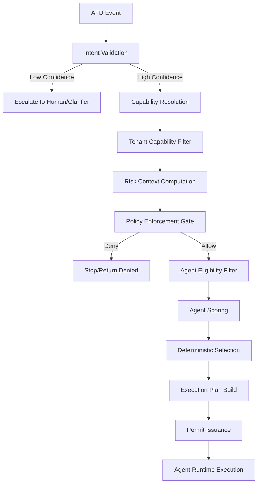

# Control Plane Routing Algorithm
**Deterministic & Policy-Aware Execution Engine**
*Smart Business Assistant (SBA-Agentic)*

---

## 1. Pendahuluan (WHY IT EXISTS)

Dokumen ini mendefinisikan **otak eksekusi** SBA-Agentic yang mengubah **Intent → Capability → Agent → Execution Plan** secara deterministik. Algoritma ini berfungsi sebagai "Single Source of Execution Truth" yang menjamin setiap permintaan diproses tanpa ambiguitas, sesuai dengan kebijakan (policy) yang berlaku, dan dapat diaudit sepenuhnya.

### 1.1 Tujuan Algoritma
Menentukan satu dan hanya satu Execution Plan yang valid, aman, dan dapat diaudit untuk setiap intent masuk dengan menjawab 4 pertanyaan inti:
1. **Capability** apa yang relevan dengan maksud pengguna?
2. Apakah **Tenant** diizinkan menggunakan capability tersebut?
3. Apakah **Risiko** eksekusi masih dalam batas aman?
4. **Agent** mana yang paling tepat, sehat, dan diizinkan untuk mengeksekusi?

### 1.2 Non-Goals
* ❌ Tidak melakukan reasoning bisnis (itu tugas agent).
* ❌ Tidak menjalankan agent (tugas Agent Runtime).
* ❌ Tidak mengubah intent (tugas AFD/Intent Resolver).

---

## 2. Karakteristik & Prinsip Desain

| Karakteristik | Penjelasan |
| :--- | :--- |
| **Deterministic** | Input yang sama harus selalu menghasilkan output yang sama (replayable). |
| **Policy-first** | Tidak ada routing yang terjadi sebelum lolos evaluasi policy (Hard Gate). |
| **Score-based** | Pemilihan agent didasarkan pada bobot objektif, bukan pilihan acak. |
| **Explainable** | Setiap keputusan routing harus memiliki alasan dan breakdown skor yang jelas. |
| **Idempotent** | Aman untuk dilakukan percobaan ulang (retry) tanpa efek samping ganda. |
| **Multi-tenant Safe** | Isolasi ketat; data dan akses tidak boleh bocor antar tenant. |
| **Fail-closed** | Jika terjadi error pada algoritma, default-nya adalah STOP (tidak ada eksekusi). |

---

## 3. Kontrak Input & Output

### 3.1 Routing Input (Immutable)
```ts
export interface RoutingInput {
  intent: {
    name: string;
    type: string;
    confidence: number;
    risk: 'low' | 'medium' | 'high' | 'critical';
    rawText: string;
  };
  tenant: {
    tenantId: string;
    tier: string;
    enabledCapabilities: string[];
  };
  context: {
    userId?: string;
    channel: 'web' | 'api' | 'agent';
    locale: string;
    region: string;
  };
  afdEventId: string;
  timestamp: string;
}
```

### 3.2 Routing Output (Execution Plan)
```ts
export interface ExecutionPlan {
  planId: string;
  capabilityId: string;
  decision: 'execute' | 'deny' | 'degrade' | 'escalate';
  selectedAgent: {
    agentId: string;
    version: string;
  };
  fallbackAgents?: {
    agentId: string;
    version: string;
  }[];
  constraints: {
    timeoutMs: number;
    retryPolicy: {
      maxRetries: number;
      retryOn: string[];
    };
  };
  policyTraceId: string;
  auditRef: string;
  reason?: string;
}
```

---

## 4. Alur Proses (Execution Flow)



---

## 5. Algoritma Langkah-demi-Langkah (Detailed)

### STEP 1: Intent Validation
Memastikan intent yang diterima dari AFD memenuhi ambang batas kualitas.
* **Rule**: Jika `intent.confidence < MIN_CONFIDENCE`, maka `decision = escalate`.
* **Rule**: Tidak boleh ada penebakan (guessing) pada tahap ini.

### STEP 2: Capability Resolution
Memetakan intent ke capability yang sesuai menggunakan **Intent → Capability Mapping Matrix**.
* **Fail-Fast**: Jika tidak ditemukan, return `UNKNOWN_INTENT`.

### STEP 3: Tenant Capability Filter
Memastikan tenant memiliki hak akses ke capability tersebut.
* **Logic**: Jika `capabilityId` TIDAK ada dalam `tenant.enabledCapabilities`, maka hapus dari kandidat.
* **Fail-Fast**: Jika semua kandidat terhapus, return `TENANT_NOT_AUTHORIZED`.

### STEP 4: Risk Context Computation
Menghitung profil risiko berdasarkan konteks permintaan (bukan dari agent).
* **Faktor**: `dataScope`, `userAuthLevel`, `frequency`, dan `channel`.

### STEP 5: Policy Enforcement (HARD GATE)
Evaluasi kebijakan keamanan dan bisnis secara ketat sebelum routing dilakukan.
* **Action**: `PolicyDecision = PolicyEngine.evaluate(capabilityId, tenant, riskContext)`
* **Handling**: `deny` (STOP), `require_approval` (WAIT), `allow` (CONTINUE).

### STEP 6: Agent Eligibility Filter
Mencari agent yang terdaftar di **Agent Capability Registry** yang mendukung `capabilityId`.
* **Kriteria Eliminasi**: Region mismatch, Tenant tier mismatch, Health status down, atau `agent.riskLimit < intent.risk`.

### STEP 7: Agent Scoring (CORE)
Jika terdapat lebih dari satu agent kandidat, lakukan penilaian objektif (Total 100 Poin).

| Faktor | Bobot | Penjelasan |
| :--- | :--- | :--- |
| **Capability Match** | 30 | Seberapa spesifik agent menangani capability ini. |
| **Reliability (SLO)** | 25 | Track record keberhasilan eksekusi (success rate). |
| **Latency (p95)** | 15 | Kecepatan respon rata-rata agent. |
| **Cost Efficiency** | 10 | Efisiensi biaya penggunaan resource agent. |
| **Freshness** | 10 | Penggunaan versi agent terbaru. |
| **Load Saturation** | 10 | Beban kerja agent saat ini (load balancing). |

### STEP 8: Deterministic Selection
* **Primary**: Pilih agent dengan skor tertinggi.
* **Fallback**: Ambil N agent berikutnya sebagai cadangan.
* **Tie-breaker**: Gunakan `agentId` leksikografis + `stableHash(afdEventId)`.

### STEP 9: Execution Plan Construction
Menyusun instruksi final untuk Agent Runtime, termasuk batasan (constraints) dan timeout.

### STEP 10: Permit Issuance (MANDATORY)
Menerbitkan token otorisasi eksekusi (`ExecutionPermit`). Tanpa permit yang valid, Agent Runtime **WAJIB MENOLAK** eksekusi.

---

## 6. Strategi Kegagalan & Fallback

### 6.1 Kegagalan Agent Utama
Jika agent utama mengalami timeout atau error 5xx:
1. Mencoba `fallbackAgents[0]`.
2. Jika gagal, mencoba `fallbackAgents[1]`.
3. Jika semua gagal, `abort` dan kirim notifikasi `EXECUTION_FAILED`.

### 6.2 Kondisi Hard Stop
Eksekusi harus segera dihentikan jika:
* Policy dicabut di tengah jalan (revoked).
* Health status agent menurun drastis.
* Kill switch manual diaktifkan oleh Admin.

---

## 7. Tabel Kegagalan (Failure Modes)

| Skenario | Hasil | Tindakan |
| :--- | :--- | :--- |
| Tidak ada policy yang cocok | **deny** | Log sebagai security event. |
| Error pada Policy Engine | **deny** | Fail-closed, beri tahu SRE. |
| Tidak ada agent tersedia | **escalate** | Minta bantuan manusia/clarifier. |
| Permit kadaluarsa | **deny** | Minta routing ulang. |
| Risiko > Ambang Batas | **degrade** | Jalankan dengan fitur terbatas. |

---

## 8. Contoh Implementasi (Pseudocode)

```ts
function routeIntent(input: RoutingInput): ExecutionPlan {
  // 1. Validation
  validateIntent(input);

  // 2. Resolution & Tenant Filter
  const capabilities = resolveCapabilities(input.intent);
  const tenantCaps = filterByTenant(capabilities, input.tenant);
  if (!tenantCaps.length) throw new Error('NO_CAPABILITY_AVAILABLE');

  // 3. Risk & Policy Gate
  const risk = computeRisk(input);
  const policy = PolicyEngine.evaluate(tenantCaps[0], input.tenant, risk);
  if (policy.type !== 'allow') return handleNonAllow(policy);

  // 4. Scoring & Selection
  const candidates = AgentRegistry.findEligible(tenantCaps[0], input.tenant, risk);
  const scoredAgents = scoreAgents(candidates, input);
  const sorted = stableSort(scoredAgents);

  // 5. Plan & Permit
  const plan = buildExecutionPlan(sorted[0], policy.traceId);
  const permit = issuePermit(plan);
  
  return { ...plan, permit, decision: 'execute' };
}
```

---

## 9. Contoh Kasus Penggunaan
1. **Automated Reporting**: Intent "buat laporan mingguan" → Capability "reporting.generate" → Policy check (tier check) → Score agents (latency vs cost) → Execute.
2. **Customer Support**: Intent "cek status order" → Capability "order.status" → Policy check (PII mask) → Execute.

---

## 10. Titik Integrasi & Penempatan File

| Sistem | Peran |
| :--- | :--- |
| **AFD** | Sumber Intent Event. |
| **Control Plane** | Otoritas pengambil keputusan (Algoritma ini). |
| **Policy Engine** | Gatekeeper keamanan (Hard Gate). |
| **Agent Runtime** | Pelaksana eksekusi berdasarkan Execution Plan. |

**Struktur Kode (Referensi):**
`packages/control-plane/router/` berisi `route.ts`, `risk.ts`, `policy.ts`, dan `agent-selector.ts`.

---

## 11. Anti-Patterns (DILARANG KERAS)
* ❌ **Agent Self-selection**: Agent tidak boleh memilih tugasnya sendiri.
* ❌ **Random Routing**: Penggunaan `Math.random()` dalam pemilihan agent.
* ❌ **Policy inside Agent**: Logika kebijakan tidak boleh berada di dalam agent.
* ❌ **Hidden Fallback**: Fallback yang tidak terdaftar dalam Execution Plan.

---

## 12. Catatan Perubahan (Change Log)

| Versi | Tanggal | Penulis | Deskripsi Perubahan |
| :--- | :--- | :--- | :--- |
| 1.0.0 | 2025-12-28 | Core Team | Inisiasi dokumen spesifikasi routing. |
| 1.1.0 | 2025-12-30 | Super Agent | Penggabungan informasi dari spec-2; penambahan 10-step algorithm, mermaid diagram, permit issuance, dan failure modes table. |

---

## NEXT (WAJIB SEBELUM IMPLEMENTASI)

1. ✅ Control Plane Routing Algorithm
2. **Execution Plan Contract (Agent Runtime API)**
3. **Fallback & Retry Spec (Global)**
4. **Routing Simulator (Internal Console)**

👉 **Execution Plan Contract — Control Plane ↔ Agent Runtime**
