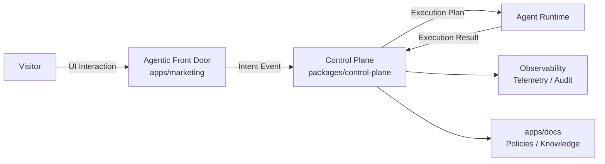
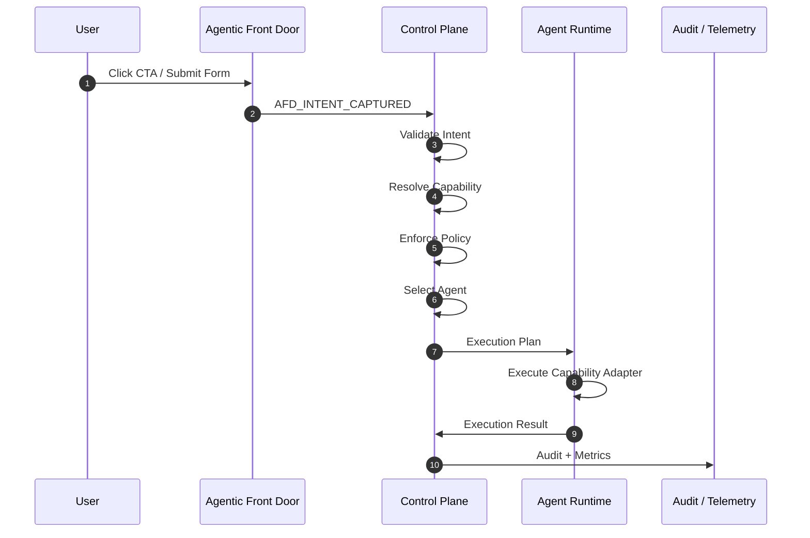
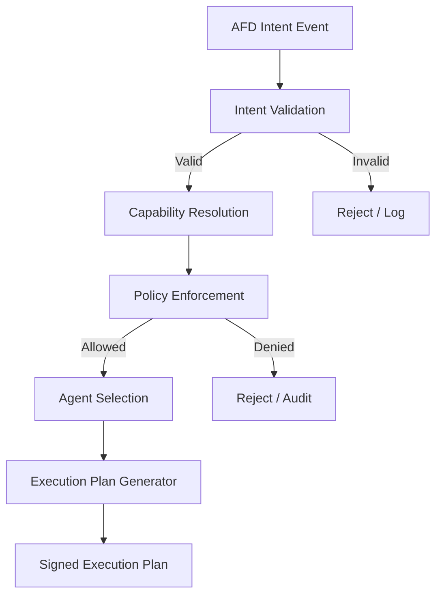
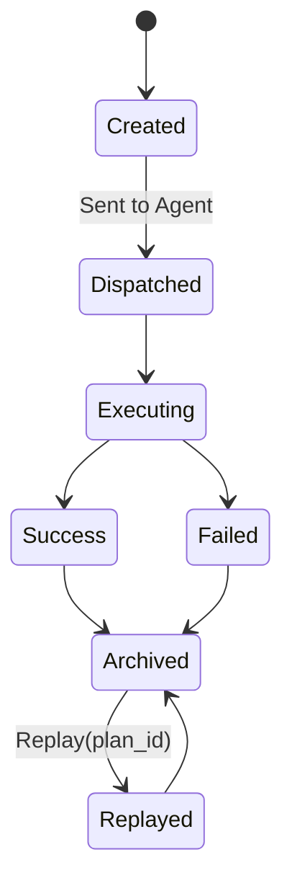
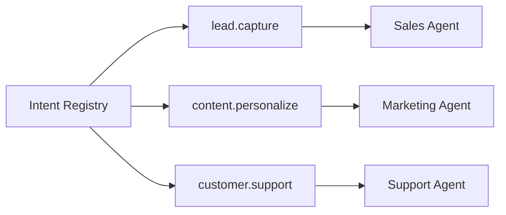
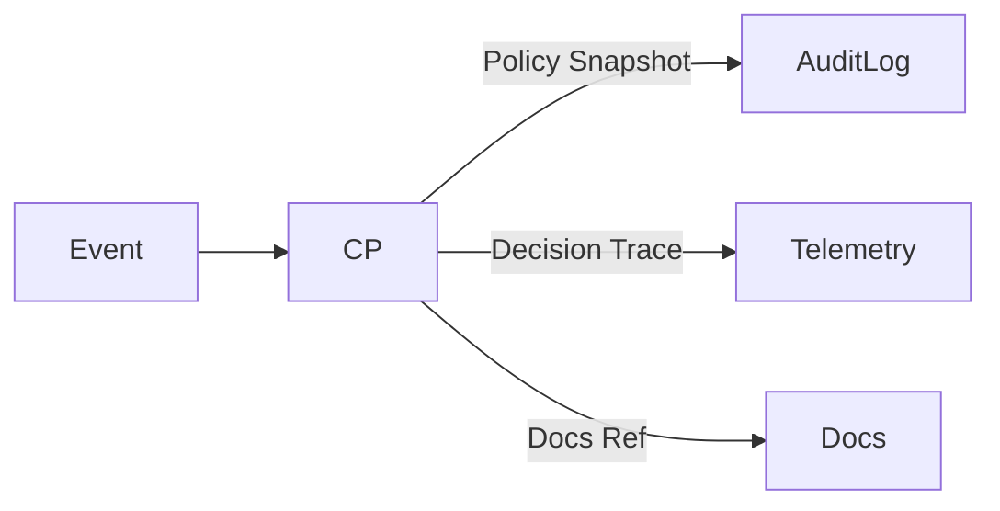

Baik. Berikut saya berikan **Diagram Visual lengkap (Mermaid)** untuk **SBA-Agentic — Agentic Front Door (AFD) → Control Plane → Agent Runtime**, disusun **berlapis dan saling konsisten**, sehingga bisa langsung:

* dimasukkan ke `docs/02-architecture`
* dipakai diskusi arsitektur
* dipakai validasi implementasi tim

Saya bagi menjadi **4 diagram inti** (ini standar enterprise-grade).

---

# 1️⃣ High-Level System Context Diagram

**(Apa berbicara dengan siapa)**



### Makna Arsitektural

* **AFD = signal producer**
* **Control Plane = otoritas keputusan**
* **Agent Runtime = executor**
* **Docs = single source of truth**
* **Observability = hukum & jejak**

---

# 2️⃣ Detailed Event Flow Diagram

**(AFD → Control Plane → Agent)**



### Invariant Rules (terlihat jelas di diagram)

* ❌ AFD tidak memilih agent
* ❌ Agent tidak memilih capability
* ✅ Semua keputusan ada di Control Plane

---

# 3️⃣ Control Plane Internal Decision Diagram

**(Decision Pipeline Deterministic)**



### Catatan Penting

* Setiap node = **pure function**
* Output **deterministic**
* Bisa di-snapshot & di-replay

---

# 4️⃣ Execution Plan Lifecycle Diagram

**(Immutable & Replayable)**



### Ini yang membuat SBA **beda dari AI biasa**

* Execution Plan = **kontrak hukum**
* Replay = **alat audit & debugging**
* Tidak ada “AI magic” tersembunyi

---

# 5️⃣ Capability–Intent Mapping Diagram

**(Mental Model Global SBA)**



➡️ **Intent ≠ Capability ≠ Agent**
Ini pemisahan yang membuat sistem scalable & aman.

---

# 6️⃣ Trust & Compliance Overlay

**(Why this passes enterprise review)**



Setiap keputusan bisa dijawab:

* **kenapa**
* **berdasarkan policy apa**
* **versi agent mana**
* **dampak apa**

---

## Status Arsitektur Saat Ini (JUJUR)

✅ Arsitektur **sudah lengkap**
✅ Tidak ada missing block konseptual
✅ Siap masuk implementasi bertahap
❌ Belum dikodekan → **ini bagus**, artinya desain sehat

---

## Langkah Selanjutnya (pilih 1)

Saya sarankan **urutannya**:

1️⃣ **Generate docs final**

```
docs/02-architecture/
 ├─ agentic-front-door.md
 ├─ control-plane.md
 ├─ execution-plan.md
 └─ diagrams.md
```

2️⃣ **Scaffold kode**

* `packages/control-plane`
* `packages/agent-runtime-sdk`
* `apps/marketing` (AFD adapter)

👉 Tinggal jawab:
**“Docs dulu”** atau **“Code dulu”**
