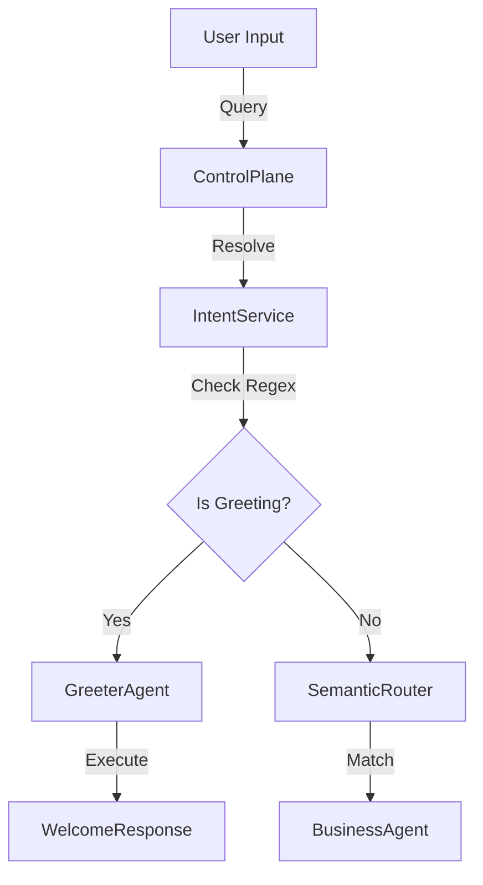

# Greeter Pattern Implementation
**Version**: 1.0.0
**Date**: 2025-12-31

## Overview
The **Greeter Pattern** is the entry point for user interaction in the SBA-Agentic platform. It ensures that every user session starts with a resolved intent, even if that intent is a simple greeting.

## Implementation Details

### 1. Intent Resolution Strategy
We have implemented a **Hybrid Intent Resolution** mechanism in the `IntentResolutionService`:

1.  **Level 0: Keyword/Regex Fallback (Latency < 10ms)**
    *   Detects common greetings (`hello`, `hi`, `help`, etc.).
    *   Maps immediately to `intent.interaction.greet`.
    *   Bypasses expensive semantic search.

2.  **Level 1: Semantic Routing (Latency ~200ms)**
    *   Uses `SemanticRouter` to match user query against vector embeddings of known intents.
    *   Used for complex business queries (e.g., "Create an invoice for $500").

### 2. The Greeter Agent
A specialized agent has been added to the system:

*   **Name**: SBA Greeter Agent
*   **Type**: Executor
*   **Capabilities**:
    *   `interaction.greet` (Priority: 1)
    *   `interaction.ask_clarification` (Priority: 1)
*   **Role**: Handles initial context setting and welcomes the user.

### 3. Workflow

## Next Steps
*   Enhance `GreeterAgent` to pull user profile data from `ContextService`.
*   Implement `interaction.ask_clarification` logic for ambiguous intents.
