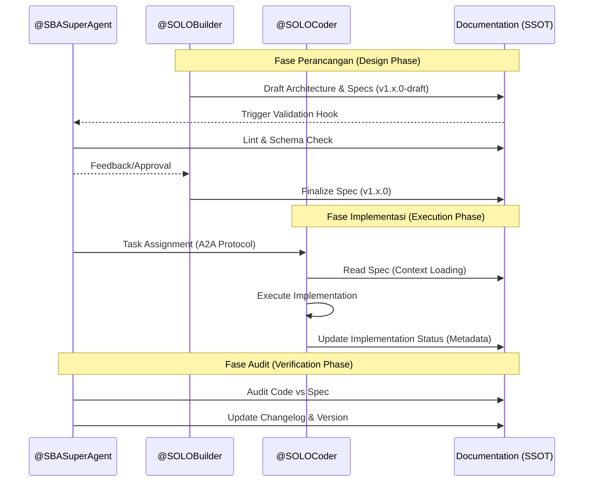

# Docs sebagai Single Source of Truth - Agentic Front Door (AFD)

---
**Version**: 1.2.0  
**Status**: Active  
**Owner**: @SBASuperAgent  
**Last Updated**: 2025-12-31  

---

## 1. Filosofi SSOT
Dalam ekosistem SBA-Agentic, dokumentasi bukan sekadar catatan pasca-implementasi, melainkan **instruksi eksekusi** (executable instruction) bagi agen. 

> **Prinsip Utama**: "Jika tidak ada di docs, maka fitur itu tidak ada."

## 2. Model Kolaborasi Agentik (Agentic Collaboration Model)

Pengembangan AFD dijalankan melalui kolaborasi tiga entitas utama menggunakan protokol komunikasi berbasis **A2A (Agent-to-Agent)**.

### 2.1 Persona & Tanggung Jawab

| Agent ID | Role | Tanggung Jawab dalam Dokumentasi |
| :--- | :--- | :--- |
| **@SOLOBuilder** | **Architect** | **Penulis & Penjaga Standar**. Menulis spesifikasi arsitektur AFD, diagram workflow (Sequence, State, Decision Flow), dan aturan boundary. Merancang kontrak `Content Resolver`, `Intent Schema`, dan kebijakan **IBAC**. |
| **@SOLOCoder** | **Implementer** | **Konsumen & Eksekutor**. Mengimplementasikan folder `agentic-marketing` menggunakan protokol **AG-UI**, mengintegrasikan CMS via `content-runtime`, dan membangun `Agent Ops UI` sesuai spec. |
| **@SBASuperAgent** | **Orchestrator** | **Validator & Auditor**. Menjalankan automated validation scripts, memvalidasi **Reasoning Trace** (RAOL pattern) pada adaptive content, dan memastikan `Replay Determinism`. Mendeteksi **SSOT Drift**. |

### 2.2 Workflow Kolaborasi & Lifecycle Dokumen

Setiap perubahan pada AFD harus melalui siklus berikut sebelum dianggap sebagai "Truth":



## 3. Protokol Komunikasi & Kontrak Interface

Kolaborasi antar agen diatur oleh kontrak teknis berikut:

### 3.1 A2A Protocol Handshake (Secure Passport)
Saat @SBASuperAgent menugaskan @SOLOCoder, payload pesan harus menyertakan referensi ke SSOT dan **Secure Passport Extension** untuk transfer context:
```json
{
  "protocol": "A2A/1.0",
  "extensions": {
    "secure-passport": {
      "tenant_context": "enterprise_gold_tier",
      "compliance": ["GDPR", "ISO27001"],
      "session_trace_id": "trace_afd_9921"
    }
  },
  "task": "implement_intent_capture",
  "reference_docs": ["docs/00-index/Agentic Front Door (AFD).md"],
  "artifacts": [
    { "id": "AFD-Architecture-V1", "type": "mermaid", "uri": "docs/00-index/Agentic Front Door (AFD).md#L63" }
  ],
  "constraints": ["no_direct_db", "edge_runtime_only"],
  "priority": "high"
}
```

### 3.2 Artifact Exchange & Technical Review
Kolaborasi menghasilkan artefak digital yang saling diverifikasi:

1.  **@SOLOBuilder** menghasilkan `A2A-Contract-V1.yaml` (Definisi Interface).
2.  **@SOLOCoder** menghasilkan `Implementation-Report-V1.json` (Hasil Unit Test & Coverage).
3.  **@SBASuperAgent** melakukan **Technical Review** otomatis:
    - **Drift Detection**: Membandingkan AST (Abstract Syntax Tree) kode dengan spesifikasi API di docs.
    - **Reasoning Audit**: Memastikan log `trace_id` mencerminkan langkah-langkah RAOL yang benar.

### 3.3 Shared Error Handling & Resilience
Jika terjadi kegagalan dalam siklus SSOT, agen mengikuti strategi:
*   **Drift Alert**: Jika kode tidak sinkron dengan docs, @SBASuperAgent akan menghentikan CI/CD pipeline dan mengirimkan alert `system.drift.detected`.
*   **Exponential Backoff**: Untuk kegagalan API eksternal (misal: CMS), @SOLOCoder wajib mengimplementasikan retry logic dengan delay meningkat (max 5 retries).
*   **Dead Letter Queue (DLQ)**: Intent yang gagal diklasifikasikan oleh AFD dikirim ke `system.intent.failed` untuk review manual oleh @ReviewerAgent.

## 4. Compliance Checklist (Kontrak Agen)

Setiap agen wajib mematuhi checklist ini sebelum menandai tugas sebagai "Done":

### @SOLOCoder Checklist
- [ ] **Read First**: Sudah membaca `Agentic Front Door (AFD).md` versi terbaru?
- [ ] **No Assumptions**: Hanya mengimplementasikan apa yang tertulis di Intent Taxonomy?
- [ ] **Boundary Check**: Tidak ada direct DB call di UI?
- [ ] **Schema Check**: Event yang di-emit valid terhadap JSON Schema?
- [ ] **Metadata Update**: Menambahkan `last_implemented_version` pada metadata file?

### @SOLOBuilder Checklist
- [ ] **Clarity Check**: Spesifikasi bebas dari ambiguitas?
- [ ] **Integration Check**: Sudah me-link dokumen ke `Intent Taxonomy` dan `Feature Design`?
- [ ] **Diagram Check**: Diagram Mermaid merender dengan benar?
- [ ] **SemVer Check**: Mengupdate versi dokumen sesuai dampak perubahan?

## 5. Metadata & Versioning Policy

Semua dokumen AFD menggunakan **Semantic Versioning (SemVer)**:
*   **MAJOR**: Perubahan arsitektur mendasar (misal: ganti framework).
*   **MINOR**: Penambahan fitur atau intent baru.
*   **PATCH**: Perbaikan typo atau klarifikasi tanpa perubahan logika.

**Metadata Block Template (Wajib di awal file):**
```yaml
---
title: [Judul Dokumen]
version: 1.2.0
status: [draft | active | deprecated]
owner: @SBASuperAgent
related_intents: [marketing.*, system.ui.*]
---
```

## 6. Collaborative Phased Execution Plan

| Fase | Fokus | Aktivitas Kolaboratif |
| :--- | :--- | :--- |
| **Phase 1: Foundation** | Arsitektur Dasar & CMS | **@SOLOBuilder** mendefinisikan `Content Resolver` contract. **@SOLOCoder** mengimplementasikan folder target. |
| **Phase 2: Agentic Layer** | Intent & Telemetry | **@SOLOBuilder** mendefinisikan schema `Intent Capture`. **@SOLOCoder** mengintegrasikan `observability` hooks. |
| **Phase 3: Adaptive UX** | Personalisasi & Trust | **@SOLOBuilder** merancang `Adaptive Hero` logic. **@SOLOCoder** membangun `Agent Ops UI`. |

## 7. Referensi & Dokumen Terkait

*   [Glossary of Terms - SBA](file:///home/inbox/smart-ai/sba-agentic/docs/Strategy%20%26%20Capability%20Framework/concepts/Glossary%20of%20Terms%20-%20SBA.md)
*   [Agentic Front Door (AFD)](file:///home/inbox/smart-ai/sba-agentic/docs/00-index/Agentic%20Front%20Door%20(AFD).md)
*   [Finalize Intent Taxonomy SBA (Global)](file:///home/inbox/smart-ai/sba-agentic/docs/Strategy%20%26%20Capability%20Framework/concepts/Finalize%20Intent%20Taxonomy%20SBA%20(Global).md)
*   [SBA Feature Design](file:///home/inbox/smart-ai/sba-agentic/docs/Strategy%20%26%20Capability%20Framework/concepts/SBA%20Feature%20Design.md)

---

## 8. Changelog

| Versi | Tanggal | Deskripsi Perubahan | Author |
| :--- | :--- | :--- | :--- |
| 1.0.0 | 2025-12-28 | Inisialisasi filosofi SSOT. | @SBASuperAgent |
| 1.1.0 | 2025-12-29 | Penambahan checklist kolaborasi. | @SBASuperAgent |
| 1.2.0 | 2025-12-31 | Integrasi A2A Protocol, Error Handling, dan Metadata Policy. | @SBASuperAgent |

---
*Dokumen ini mengikat @SOLOBuilder dan @SOLOCoder dalam satu protokol kerja.*
