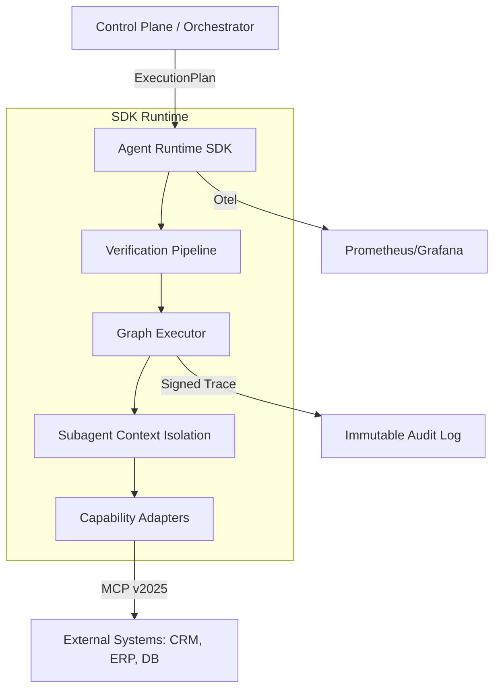

# Agent Runtime SDK (TypeScript)

**SBA-Agentic – Development Standard v1.3.0 (Update 2025-12-31)**

SDK ini menyediakan kontrak, utility, dan runtime engine untuk membangun **Capability Adapter** yang deterministik, aman, dan *policy-aware* di dalam ekosistem SBA-Agentic. SDK ini mengadopsi standar industri terbaru (MCP 2025) untuk menjamin interoperabilitas dan keamanan tingkat enterprise.

## 1. Pendahuluan & Filosofi

SBA-Agentic Runtime SDK dirancang untuk mengubah instruksi non-deterministik dari LLM menjadi eksekusi yang dapat diprediksi, diaudit, dan aman.

### Prinsip Utama:
- **Deterministic Execution**: Menggunakan `GraphExecutor` untuk memastikan langkah-langkah dieksekusi sesuai urutan dependensi yang divalidasi.
- **Policy-Awareness**: Integrasi *deep-link* dengan Rube Engine untuk validasi kebijakan dinamis (RBAC, ABAC, Rate Limiting).
- **Observable-by-Default**: Instrumentasi OpenTelemetry (Otel) pada setiap langkah (step-level tracing).
- **Multi-tenancy Isolation**: Konteks tenant diinjeksi ke setiap tool call melalui `TenantContext` yang terenkripsi.
- **Model Context Protocol (MCP) Native**: Dukungan penuh untuk MCP Server (2025 Spec) untuk integrasi tool eksternal yang plug-and-play.

## 2. Arsitektur & Pola Orchestrator

SDK ini mendukung pola **Orchestrator-Subagent** untuk menangani tugas kompleks dengan isolasi konteks yang ketat.



## 3. Spesifikasi Teknis

### 3.1 ExecutionPlan Interface (v2.0)
Rencana eksekusi sekarang menyertakan `SecurityManifest` untuk menjamin integritas dan otorisasi.

```typescript
export interface ExecutionPlan {
  id: string; // Unified ID
  tenantId: string;
  steps: ExecutionStep[];
  priority?: 'low' | 'normal' | 'high' | 'critical';
}

export interface ExecutionStep {
  id: string;
  name: string;
  tool: string;
  params: Record<string, any>;
  dependsOn?: string[];
}
```

### 3.2 SDK Core Components

#### 3.2.1 GraphExecutor
`GraphExecutor` bertanggung jawab untuk mengeksekusi `ExecutionPlan` secara deterministik dengan menangani dependensi antar langkah.

- **Dependency Resolution**: Langkah-langkah dieksekusi hanya jika dependensinya telah selesai.
- **Error Handling**: Mendukung status `skipped` jika dependensi gagal, dan status `partially_completed` jika beberapa langkah berhasil.
- **Parameter Resolution**: Mendukung referensi output dari langkah sebelumnya menggunakan notasi `{{stepId.field}}`.

#### 3.2.2 Orchestrator
`Orchestrator` mengelola antrian tugas (`AgentTask`), konkurensi, dan mekanisme *self-healing*.

- **Concurrency Control**: Membatasi jumlah tugas yang berjalan secara bersamaan.
- **Priority Queue**: Menangani tugas berdasarkan tingkat prioritas.
- **Self-Healing**: Mendukung *exponential backoff* jika terjadi kegagalan sistem berulang.
- **PII Masking**: Otomatis menyamarkan data sensitif dalam log audit.

#### 3.2.3 AgentRuntime
Entry point utama untuk aplikasi yang ingin menggunakan kapabilitas agentic.

```typescript
const runtime = new AgentRuntime(config, toolRegistry);
runtime.boot();

// Menyerahkan tugas tunggal
runtime.submit({ id: 'task_1', tool: { name: 'crm.create_lead', params: { ... } } });

// Menyerahkan rencana eksekusi
runtime.submit({ id: 'plan_1', plan: { ... } });
```

### 3.3 Autonomous Mode (Reasoning Integration)
SDK terintegrasi dengan `AgenticReasoningEngine` untuk menangani tugas yang bersifat otonom.

1. **Analysis**: Menganalisis kebutuhan pengguna dan batasan bisnis.
2. **Planning**: Membuat rencana tindakan (tool call atau langkah-langkah).
3. **Validation**: Memastikan tindakan mematuhi kebijakan keamanan Rube.
4. **Execution**: Menyerahkan hasil penalaran ke `AgentRuntime` untuk dieksekusi.

```typescript
// Contoh eksekusi otonom di AgenticExecutor (API)
const reasoningResult = await reasoningEngine.reason(taskDescription, context);
if (reasoningResult.metadata.toolCall) {
  runtime.submit({ 
    id: taskId, 
    tool: reasoningResult.metadata.toolCall 
  });
}
```

### 3.2 Requirements & Constraints
| Kategori | Requirement | Constraint |
| :--- | :--- | :--- |
| **Runtime** | Node.js 20+ (LTS) / TypeScript 5.x | Max execution time 5 menit per plan. |
| **Security** | PII Masking aktif secara default. | Dilarang menggunakan `eval()` atau `new Function()`. |
| **Memory** | Isolated context per subagent. | Max context size 128KB per tool call. |
| **Networking** | Wajib menggunakan TLS 1.3 for MCP. | Hanya domain yang terdaftar di manifest yang diizinkan. |

## 4. Panduan Implementasi Capability

### 4.1 Membuat Capability Adapter (Deterministic)
Setiap adapter menggunakan `Zod` untuk kontrak data yang ketat.

```typescript
import { BaseAdapter, ExecutionContext, CapabilityResult } from '@sba/agent-sdk';
import { z } from 'zod';

const OrderSyncSchema = z.object({
  orderId: z.string().uuid(),
  status: z.enum(['pending', 'shipped', 'cancelled']),
  notifyCustomer: z.boolean().default(false),
});

export class OrderSyncAdapter extends BaseAdapter {
  readonly capabilityId = 'erp.sync_order';
  
  async invoke(input: unknown, ctx: ExecutionContext): Promise<CapabilityResult> {
    // 1. Validasi & Parsing (Schema Enforcement)
    const data = OrderSyncSchema.parse(input);

    // 2. Audit Logging (PII Masked)
    this.logger.info(`Syncing order ${data.orderId}`, { tenant: ctx.tenantId });

    // 3. MCP Call (External Integration)
    const result = await this.mcp.call('erp-system', 'update_order', data);

    return {
      success: true,
      data: result,
      trace: ctx.captureTrace()
    };
  }
}
```

### 4.2 Dynamic MCP Server Registration
SDK memungkinkan registrasi server MCP secara dinamis berdasarkan konteks tenant.

```typescript
await sdk.mcp.register({
  id: 'custom-crm',
  transport: 'http',
  url: `https://crm.${ctx.tenantId}.ext-service.com/mcp`,
  auth: {
    type: 'OAuth2.1',
    credentials: ctx.getCredentials('crm')
  }
});
```

## 5. Fitur Unggulan SBA-Agentic

### 5.1 Automated Business Analysis (ABA)
SDK secara otomatis menjalankan analisis dampak sebelum eksekusi (`pre-flight check`). Jika terdeteksi risiko bisnis (misal: duplikasi pembayaran), eksekusi akan dipause.

### 5.2 Context Isolation & Compact State
Untuk mencegah "Context Drift", SDK membersihkan history yang tidak relevan di setiap pergantian step, hanya menyisakan `State Snapshot` yang esensial.

### 5.3 Self-Healing & Fallback
Jika kapabilitas utama gagal, SDK merujuk ke `Fallback Catalog` di Rube Engine untuk mencari alternatif yang setara (misal: `resend_email` -> `sendgrid_fallback`).

## 6. Security & Compliance (2025 Standards)

- **OAuth 2.1 Integration**: Semua tool calls menggunakan token scoped yang di-generate per eksekusi.
- **Sandboxed Execution**: Adapter dijalankan dalam V8 Isolate yang terisolasi untuk mencegah akses sistem ilegal.
- **Reasoning Traceability**: Setiap keputusan "Mengapa langkah ini diambil?" dicatat dalam audit log yang tidak dapat diubah (Immutable).

## 7. Testing & Verifikasi

### 7.1 Integration Testing (The "Dry Run")
SDK menyediakan mode `dryRun` untuk memvalidasi rencana eksekusi tanpa benar-benar memicu aksi eksternal.

```typescript
const result = await sdk.execute(plan, { mode: 'dryRun' });
console.log(result.validationSteps); // Melihat hasil validasi kebijakan & schema
```

---
*Dokumentasi Terkait:*
- [SBA Implementation Guide](./SBA_Implementation_Guide.md)
- [Policy Enforcement Spec](../specs/Policy%20Enforcement%20Spec%20—%20Capability%20×%20Tenant%20×%20Risk.md)
- [Agent Capability Registry Spec](../specs/Agent%20Capability%20Registry%20Spec.md)
