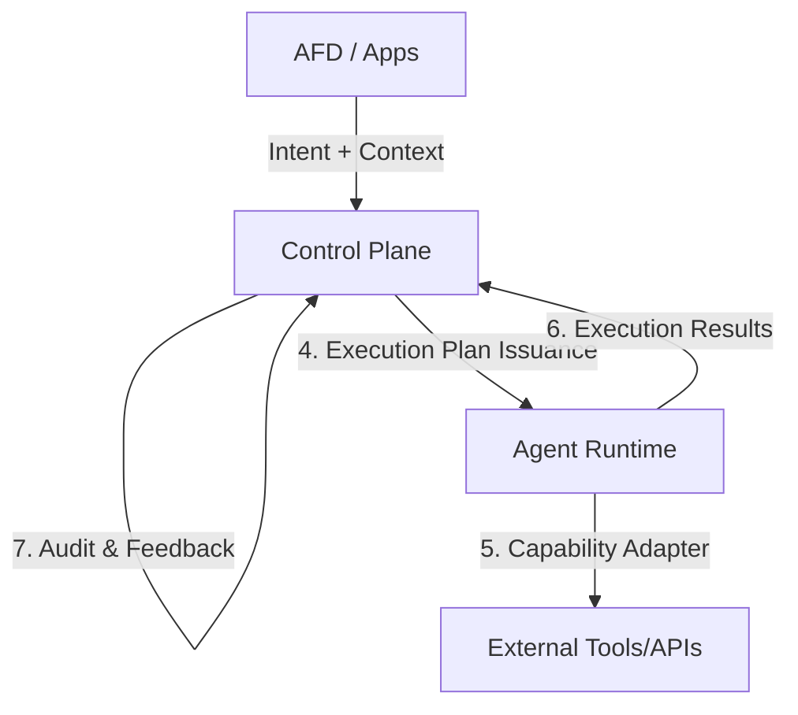

# Capability Adapter Example

**SBA-Agentic – Production Pattern**

---

## 1. Arsitektur Terintegrasi (AFD, Control Plane, SDK)

Dalam ekosistem **SBA-Agentic**, Capability Adapter tidak berdiri sendiri. Ia adalah bagian dari aliran kerja yang terorkestrasi secara ketat melalui **Execution Plan Contract**:

1.  **Agentic Front Door (AFD)**: Menangkap intent pengguna dan konteks awal, lalu meneruskannya ke Control Plane.
2.  **Control Plane (Otoritas Keputusan)**: Menganalisis intent, menegakkan kebijakan (Policy), dan menerbitkan **Execution Plan** yang ditandatangani secara kriptografis.
3.  **Agent Runtime SDK**: Memverifikasi **Execution Permit**, menyiapkan lingkungan terisolasi, dan menginjeksi `ExecutionContext` ke dalam adapter.
4.  **Capability Adapter (Otoritas Eksekusi)**: Unit deterministik yang menjalankan instruksi spesifik berdasarkan rencana yang telah divalidasi.



---

## 2. Execution Plan Contract (Integrasi CP ↔ AR)

Execution Plan adalah **izin eksekusi sementara (time-boxed, scope-boxed)** yang mengikat intent, capability, dan policy ke dalam satu paket instruksi yang tidak dapat dimodifikasi oleh agent.

### 2.1 Skema Execution Plan (Ringkasan)
Setiap pemanggilan adapter dijamin oleh kontrak data berikut yang diinjeksi ke `ExecutionContext`:

```ts
export interface ExecutionPlan {
  planId: string;
  expiresAt: string; // TTL Hard Limit
  tenantContext: {
    tenantId: string;
    subscriptionTier: string;
  };
  constraints: {
    allowedActions: string[];
    maxDurationMs: number;
    dataScopes: string[];
  };
  signature: string; // Verifikasi integritas rencana
}
```

---

## 3. Klasifikasi Capability di SBA

Dalam SBA, capability **bukan sekadar fungsi**, tapi **kontrak eksekusi** yang divalidasi oleh Control Plane.

### Tipe Capability (Standar)

| Tipe                | Deskripsi | Contoh |
| ------------------- | --------- | ------ |
| `intent-processing` | Memproses input mentah menjadi data terstruktur | classify intent, enrich context |
| `decision-support`  | Memberikan rekomendasi atau skor | scoring, ranking, recommendation |
| `action-execution`  | Melakukan aksi di sistem eksternal | send email, create ticket, capture lead |
| `knowledge-access`  | Mengambil data dari basis pengetahuan | query docs, SOP search |
| `observability`     | Mencatat audit dan metrik | log, audit, trace emission |
| `compliance`        | Verifikasi kepatuhan dan izin | consent check, policy verify |

---

## 3. Struktur Folder & Standar SDK

Mengikuti standar **Agent Runtime SDK (TypeScript)**:

```txt
packages/capabilities
├── marketing
│   ├── capture-lead
│   │   ├── adapter.ts      # Logika eksekusi (SDK-compliant)
│   │   ├── schema.ts       # Zod schemas (Input/Output)
│   │   ├── policy.ts       # Declarative Policy untuk Control Plane
│   │   └── README.md       # Dokumentasi teknis & contoh
│
├── docs
│   └── search-knowledge
│
└── ops
    └── create-ticket
```

---

## 4. Capability Adapter Contract (MCP & SDK Standard)

Semua adapter harus mengimplementasikan interface dari `@sba/sdk` yang kini mendukung **Model Context Protocol (MCP)** untuk interoperabilitas maksimal.

```ts
import { 
  CapabilityAdapter, 
  ExecutionContext, 
  CapabilityResult 
} from '@sba/sdk'

export interface SBA_CapabilityAdapter extends CapabilityAdapter {
  capabilityId: string
  version: string
  
  // MCP Manifest: Memungkinkan Control Plane memahami kapabilitas adapter secara otomatis
  getManifest(): {
    name: string
    description: string
    inputSchema: object
  }

  invoke(
    input: unknown,
    context: ExecutionContext
  ): Promise<CapabilityResult>
}
```

---

## 5. Example 1 — Marketing: `capture-lead` (Advanced Production)

### 5.1 schema.ts (Input & Output — MCP Compliant)

Menggunakan Zod untuk validasi tipe data dan dokumentasi otomatis (MCP).

```ts
import { z } from 'zod'

export const CaptureLeadInputSchema = z.object({
  source: z.string().describe('Asal lead, misal: landing_page, exhibition'),
  email: z.string().email().describe('Email valid dari lead'),
  name: z.string().min(2).describe('Nama lengkap lead'),
  company: z.string().optional(),
  intent: z.string().describe('Intent yang dideteksi oleh AFD'),
  metadata: z.record(z.any()).optional()
})

export const CaptureLeadOutputSchema = z.object({
  leadId: z.string().uuid(),
  status: z.enum(['captured', 'duplicate', 'blacklisted']),
  integrationRef: z.string().optional(),
  timestamp: z.string().datetime()
})
```

### 5.2 adapter.ts (Implementation with Resilience & Observability)

Adapter menggunakan `ExecutionContext` dengan pola **Circuit Breaker** dan **Retry** otomatis.

```ts
import { CaptureLeadInputSchema, CaptureLeadOutputSchema } from './schema'
import { 
  CapabilityExecutionError, 
  CapabilityDeniedError,
  RetryableError 
} from '@sba/sdk/errors'
import { withResilience } from '@sba/sdk/resilience'

export class CaptureLeadAdapter implements CapabilityAdapter {
  capabilityId = 'marketing.capture-lead'
  version = '1.3.0'

  getManifest() {
    return {
      name: 'Capture Lead',
      description: 'Mendaftarkan lead baru ke sistem CRM dengan validasi tenant',
      inputSchema: CaptureLeadInputSchema.shape
    }
  }

  async invoke(input: unknown, ctx: ExecutionContext) {
    const plan = ctx.executionPlan;
    const logger = ctx.logger.child({ capability: this.capabilityId });

    // 1. Validation
    const result = CaptureLeadInputSchema.safeParse(input)
    if (!result.success) {
      throw new CapabilityExecutionError('Invalid input schema', result.error)
    }
    const data = result.data

    // 2. Resilience Wrapper (Retry & Circuit Breaker)
    return withResilience(async () => {
      logger.info('Starting lead capture process', { email: data.email });

      // 3. TTL & Policy Check
      if (new Date() > new Date(plan.expiresAt)) {
        throw new CapabilityExecutionError('Execution Plan has expired')
      }

      try {
        const lead = await ctx.tools.crm.upsertLead({
          tenantId: plan.tenantContext.tenantId,
          email: data.email,
          name: data.name,
          source: data.source,
          traceId: ctx.traceId
        })

        logger.info('Lead captured successfully', { leadId: lead.id });

        return CaptureLeadOutputSchema.parse({
          leadId: lead.id,
          status: lead.isNew ? 'captured' : 'duplicate',
          integrationRef: lead.crmId,
          timestamp: new Date().toISOString()
        })
      } catch (error) {
        // Deteksi error yang layak dicoba kembali (misal: rate limit CRM)
        if (error.status === 429 || error.code === 'ECONNRESET') {
          throw new RetryableError('CRM temporary unavailable', error);
        }
        throw new CapabilityExecutionError('Failed to sync with CRM', error)
      }
    }, {
      retries: 3,
      circuitBreaker: true,
      onRetry: (attempt) => logger.warn(`Retrying CRM sync... attempt ${attempt}`)
    });
  }
}
```

### 5.3 policy.ts (Declarative Policy)

Dipakai oleh **Control Plane** untuk *Static Analysis* dan *Routing*.

```ts
export const CaptureLeadPolicy = {
  allowedTenants: ['trial', 'pro', 'enterprise'],
  riskLevel: 'medium',
  dataAccess: ['pii.email', 'pii.name', 'org.company'],
  auditRequired: true,
  rateLimit: {
    window: '1m',
    max: 50
  }
}
```

---

## 6. Integrasi dengan Agentic Front Door (AFD)

AFD memanggil capability ini setelah proses *Intent Classification*:

```json
// AFD Request to Control Plane
{
  "user_id": "user_123",
  "message": "Cek data pameran dan masukkan Budi dari PT Jaya ke sistem lead",
  "context": { "current_page": "admin/dashboard" }
}

// Control Plane Result (Execution Plan)
{
  "plan_id": "plan_abc",
  "steps": [
    {
      "step": 1,
      "capability": "marketing.capture-lead",
      "input": {
        "name": "Budi",
        "company": "PT Jaya",
        "source": "exhibition",
        "email": "budi@jaya.com",
        "intent": "manual_entry"
      }
    }
  ]
}
```

---

## 7. Error & Resilience Model

Adapter harus menangani error secara terstruktur agar **Control Plane** bisa melakukan *Self-Correction* atau *Human-in-the-loop*.

| Error Type | Action by Control Plane |
| ---------- | ----------------------- |
| `ValidationError` | Minta klarifikasi ke user via AFD |
| `CapabilityDeniedError` | Beri tahu user tentang batasan paket/lisensi |
| `CapabilityExecutionError` (Retryable) | Jalankan mekanisme retry otomatis di Runtime |
| `CapabilityExecutionError` (Fatal) | Eskalasi ke tim support/developer |

---

## 8. Observability & Audit

Setiap pemanggilan adapter secara otomatis menghasilkan *Trace* di **Control Plane Dashboard**:

- **Input Trace**: Payload mentah yang masuk ke adapter.
- **Reasoning Step**: "Validating lead budi@jaya.com against CRM database..."
- **Outcome**: `SUCCESS` atau `FAILED`.
- **Latency**: Waktu eksekusi untuk monitoring performa (KPI).

---

## 9. Checklist Kesiapan Produksi (Go-Live)

Gunakan checklist ini sebelum mendaftarkan capability baru ke **Agent Capability Registry**:

- [ ] `capabilityId` unik secara global.
- [ ] Versi mengikuti SemVer.
- [ ] Schema Input & Output divalidasi dengan Zod.
- [ ] Penanganan error menggunakan SDK Error Classes.
- [ ] Policy dideklarasikan (Risk, Data Access, Rate Limit).
- [ ] Unit Test mencakup minimal 80% coverage (termasuk edge cases).
- [ ] Dokumentasi di `README.md` folder capability lengkap.

---

## 10. Advanced Testing Strategy

Produksi yang tangguh membutuhkan pengujian berlapis. Adapter diuji untuk skenario sukses, kegagalan sistem, dan pelanggaran kebijakan.

### 10.1 Unit Test (Mocking SDK & Tools)

Menggunakan Vitest/Jest untuk memastikan logika adapter benar secara terisolasi.

```ts
import { describe, it, expect, vi } from 'vitest'
import { CaptureLeadAdapter } from './adapter'
import { createMockContext } from '@sba/sdk/testing'

describe('CaptureLeadAdapter', () => {
  it('should successfully capture lead when input is valid', async () => {
    const adapter = new CaptureLeadAdapter()
    const mockCtx = createMockContext({
      tenantId: 'tenant_pro_123',
      tools: {
        crm: { upsertLead: vi.fn().mockResolvedValue({ id: 'lead_abc', isNew: true }) }
      }
    })

    const input = {
      name: 'Budi Jaya',
      email: 'budi@jaya.com',
      source: 'web_form',
      intent: 'inquiry'
    }

    const result = await adapter.invoke(input, mockCtx)
    
    expect(result.status).toBe('captured')
    expect(mockCtx.tools.crm.upsertLead).toHaveBeenCalledWith(expect.objectContaining({
      email: 'budi@jaya.com'
    }))
  })

  it('should throw RetryableError on CRM rate limit', async () => {
    const adapter = new CaptureLeadAdapter()
    const mockCtx = createMockContext({
      tools: {
        crm: { upsertLead: vi.fn().mockRejectedValue({ status: 429 }) }
      }
    })

    await expect(adapter.invoke(validInput, mockCtx)).rejects.toThrow(RetryableError)
  })
})
```

---

## 11. Advanced Observability (Tracing & Metrics)

Adapter SBA secara otomatis terintegrasi dengan **OpenTelemetry** dan **LangSmith** melalui SDK.

### 11.1 Custom Spans & Attributes
Gunakan `ctx.tracer` untuk menambahkan detail spesifik ke dalam trace eksekusi.

```ts
async invoke(input: any, ctx: ExecutionContext) {
  return ctx.tracer.startActiveSpan('capture-lead-operation', async (span) => {
    span.setAttribute('lead.email', input.email);
    span.setAttribute('lead.source', input.source);
    
    try {
      const result = await performAction();
      span.setStatus({ code: SpanStatusCode.OK });
      return result;
    } catch (e) {
      span.recordException(e);
      span.setStatus({ code: SpanStatusCode.ERROR });
      throw e;
    }
  });
}
```

### 11.2 Business Metrics
Emit metrik untuk dashboard performa bisnis (KPI).

```ts
ctx.metrics.increment('capability.lead_captured.count', 1, { 
  tenant: ctx.tenantId,
  source: input.source 
});
```

---

## 12. Security & PII Masking

Sesuai standar **BPA-SEC-01**, data sensitif tidak boleh muncul di log mentah.

### 12.1 Log Masking
Gunakan logger yang disediakan SDK yang memiliki middleware masking otomatis.

```ts
// Logger otomatis me-mask field yang ada di daftar PII (email, phone, name)
ctx.logger.info('Processing lead', { 
  data: data // Field 'email' dan 'name' akan di-mask di log eksternal
});
```

### 12.2 Data Scoping
Pastikan adapter hanya mengakses data yang diizinkan dalam `ExecutionPlan`.

```ts
if (!plan.constraints.dataScopes.includes('crm.write')) {
  throw new CapabilityDeniedError('Insufficient data scope for CRM write');
}
```

---

## 13. Self-Correction Flow (Human-in-the-loop)

Jika adapter mendeteksi ambiguitas yang tidak bisa dipecahkan secara otomatis, ia bisa memicu status `NEED_CLARIFICATION`.

```ts
if (isAmbiguous(data.name)) {
  return {
    status: 'NEED_CLARIFICATION',
    message: 'Nama lead terdeteksi tidak lengkap. Mohon konfirmasi nama lengkap.',
    context: { partial_data: data }
  };
}
```

---

## 14. Kesimpulan & Nilai Bisnis

Dengan pola **Capability Adapter** yang selaras dengan AFD dan Control Plane:

*   **Skalabilitas**: Menambah fitur baru hanya perlu menambah satu folder capability tanpa merusak inti sistem.
*   **Keamanan**: Kontrak yang ketat mencegah agen melakukan aksi yang tidak diinginkan atau mengakses data di luar batas tenant.
*   **Transparansi**: Setiap aksi agen dapat ditelusuri dan dipertanggungjawabkan (Accountable).
