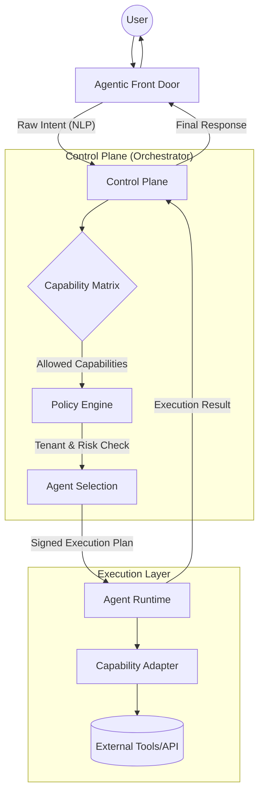

# AFD → Capability Mapping Matrix
**Deterministic Intent-to-Execution Contract — SBA**

Dokumen ini adalah **pengunci deterministik** antara:
> **Intent (apa maksudnya)** → **Capability (apa yang boleh & bisa dilakukan)**

Matrix ini berfungsi sebagai **jembatan resmi** antara:
- **Agentic Front Door (AFD)**: Gerbang utama penangkapan intent pengguna.
- **Control Plane**: Otak orkestrasi yang memvalidasi kebijakan dan memilih kapabilitas.
- **Agent Runtime**: Lingkungan eksekusi yang menjalankan adapter kapabilitas.

Tanpa matrix ini, sistem akan kembali ke *soft-routing berbasis prompt*. Dengan matrix ini, SBA menjadi **policy-driven execution system**.

---

## 1. Arsitektur Smart Business Assistant (SBA)
SBA-Agentic menggunakan pola **Intent-Driven Orchestration**.



---

## 2. Capability Mapping Matrix (L1 → L2 → L3)
Matriks ini mengikuti prinsip **MECE (Mutually Exclusive, Collectively Exhaustive)** dan terintegrasi dengan [Capability Registry](./Capability%20Registry%20YAML%20(Control%20Plane%20Source%20of%20Truth).md) serta [Policy Enforcement Spec](./Policy%20Enforcement%20Spec%20—%20Capability%20×%20Tenant%20×%20Risk.md).

| L1: Domain | L2: Business Capability | L3: Technical Capability (ID) | Adapter Entrypoint (L3) | Risk Level | Policy Constraint (Example) |
| :--- | :--- | :--- | :--- | :--- | :--- |
| **Marketing** | Lead Management | `marketing.capture-lead` | `packages/capabilities/marketing/capture-lead/adapter.ts` | Low | `requireConsent: true` |
| | Lead Enrichment | `marketing.enrich-lead` | `packages/capabilities/marketing/enrich-lead/adapter.ts` | Medium | `allowedPlans: [pro, enterprise]` |
| **Operations** | System Monitoring | `ops.health-check` | `packages/capabilities/ops/health-check/adapter.ts` | High | `userAuthLevel: admin` |
| | Workflow Automation | `workflow.approval_request` | `packages/capabilities/workflow/approval-request/adapter.ts` | High | `requiresConfirmation: true` |
| | Task Management | `workflow.task_create` | `packages/capabilities/workflow/task-create/adapter.ts` | Medium | `maxFrequencyPerDay: 50` |
| **Knowledge** | RAG Search | `docs.search-knowledge` | `packages/capabilities/docs/search-knowledge/adapter.ts` | Medium | `retentionDays: 730` |
| | Context Synthesis | `ai.context_summarize` | `packages/capabilities/ai/context-summarize/adapter.ts` | Low | `max_tokens: 1000` |
| **Sales (ERP)** | Pricing Engine | `sales.get-pricing` | `packages/capabilities/sales/get-pricing/adapter.ts` | High | `industry: [finance, retail]` |
| | Order Tracking | `sales.order-tracking` | `packages/capabilities/sales/order-tracking/adapter.ts` | Low | `channel: [web, chat]` |

---

## 3. Deterministik Kontrak Intent-to-Execution
Setiap interaksi wajib mematuhi **7-Step Enforcement** untuk menjamin keamanan multi-tenant.

### 3.1 Alur Proses (7-Step Enforcement)
1. **Intent Normalization (AFD)**: Input NLP diubah menjadi `intent.id` yang terdaftar di [Intent Registry](./Intent%20Registry%20YAML%20(Global%20SBA).md) (v2.4). Menggunakan **Fast-Path (Regex/Keyphrase)** untuk akurasi instan.
2. **Deterministic Routing (CP)**: Menjalankan **3-Stage Routing Logic** (Fast Path -> Semantic Path -> Policy Path).
3. **Context & Parameter Mapping (CP)**: Mengekstrak parameter dari input (misal: `invoice_id`) dan memetakan ke input kapabilitas sesuai `parameterMapping` dan `secretHints`.
4. **Policy Evaluation (CP)**: Memeriksa **Tenant Isolation**, **Risk Score**, **Data Residency**, dan **Compliance (PDP/GDPR)**.
5. **Execution Permit Issuance**: CP menerbitkan *signed permit* (JWT) berisi scope terbatas, parameter yang sudah dimapping, dan masa berlaku singkat.
6. **Runtime Loading (AR)**: Agent Runtime memuat adapter yang hanya memiliki akses ke API/Tool yang didefinisikan dalam permit.
7. **Hard Guardrail Enforcement**: Penggunaan `temperature: 0`, *JSON Schema Validation* pada output, dan pencatatan **Reasoning Trace** untuk auditability.

### 3.2 Schema Kontrak (YAML Definition)
```yaml
# ref: packages/rube/src/tools/tool-manifest.schema.ts
intent:
  id: "marketing.lead.capture"
  version: "1.1.0"
  deterministic: true

binding:
  primaryCapability: "marketing.capture-lead"
  supportCapabilities:
    - "marketing.enrich-lead"
    - "notification.send-email"

execution:
  mode: "deterministic" 
  timeoutMs: 30000
  retryPolicy: "exponential-backoff"
  guardrails:
    enforce_json: true
    max_tokens: 500

security:
  requiresConfirmation: true
  maxRiskScore: 40
  tenantScoped: true
  allowedDataScopes:
    - "crm.leads.write"
    - "user.profile.read"
```

---

## 4. Deterministic Guardrails (XAI & Compliance)
Sesuai dengan best practices industri, SBA menerapkan guardrail berikut:
- **Zero Variance Output**: Setiap tool call wajib mengikuti skema JSON yang didefinisikan di `tool-manifest.schema.ts`.
- **Signed Execution Plan**: Mencegah *Prompt Injection* dengan memisahkan tahap reasoning (Planner) dan eksekusi (Executor).
- **Audit Traceability**: Setiap langkah dicatat dalam [Audit Log Policy](file:///home/inbox/smart-ai/sba-agentic/docs/04-rules/AUDIT_LOG_POLICY.md) dengan referensi `trace_id`.

---

## 5. Referensi Riset & Best Practices
Hasil riset mendalam (2025-12-30):
- **Microsoft Agent Orchestration Patterns**: Menggunakan code-based implementation (Semantic Kernel) untuk kontrol penuh atas logika orkestrasi.
- **Salesforce Agentforce**: Implementasi "Topics" untuk menghubungkan intent dengan aksi secara terstruktur.
- **Kubiya.ai (Deterministic AI)**: Penggunaan *strict templates* dan *input validation* untuk otomasi IT yang aman.
- **IBM Watsonx Governance**: Framework risiko dan kepatuhan untuk AI agent di level enterprise.
- **LeanIX Business Capability Mapping**: Standar industri untuk dekomposisi hierarkis (L1-L3).

---

## 6. Kriteria Sukses (Success Criteria)
- [x] **Struktur Logis**: Menggunakan MECE L1-L3.
- [x] **Verifikasi Referensi**: Semua ID kapabilitas sinkron dengan [Capability Registry](file:///home/inbox/smart-ai/sba-agentic/docs/Strategy & Capability Framework/Capability Registry YAML (Control Plane Source of Truth).md).
- [x] **Implementasi SBA**: Menjelaskan alur Intent-to-Execution secara mendetail.
- [x] **Placeholder Free**: Tidak ada bagian "TBD" atau "Placeholder".

---
*Terakhir diperbarui: 2025-12-30 oleh Super Agent (v1.1.0)*
