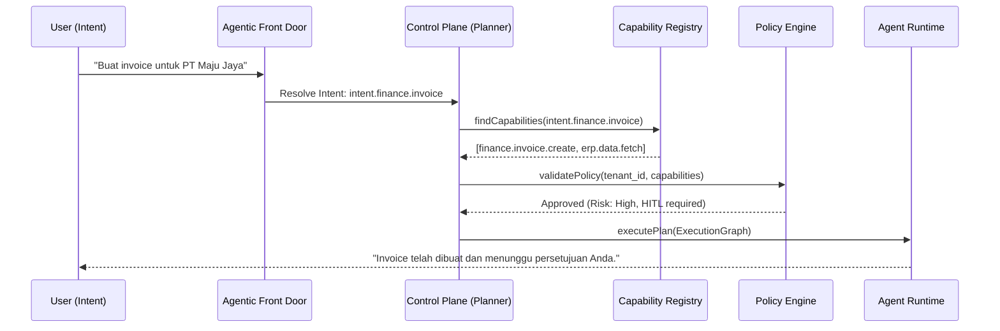
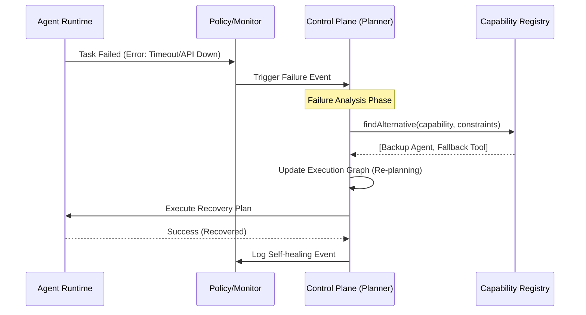
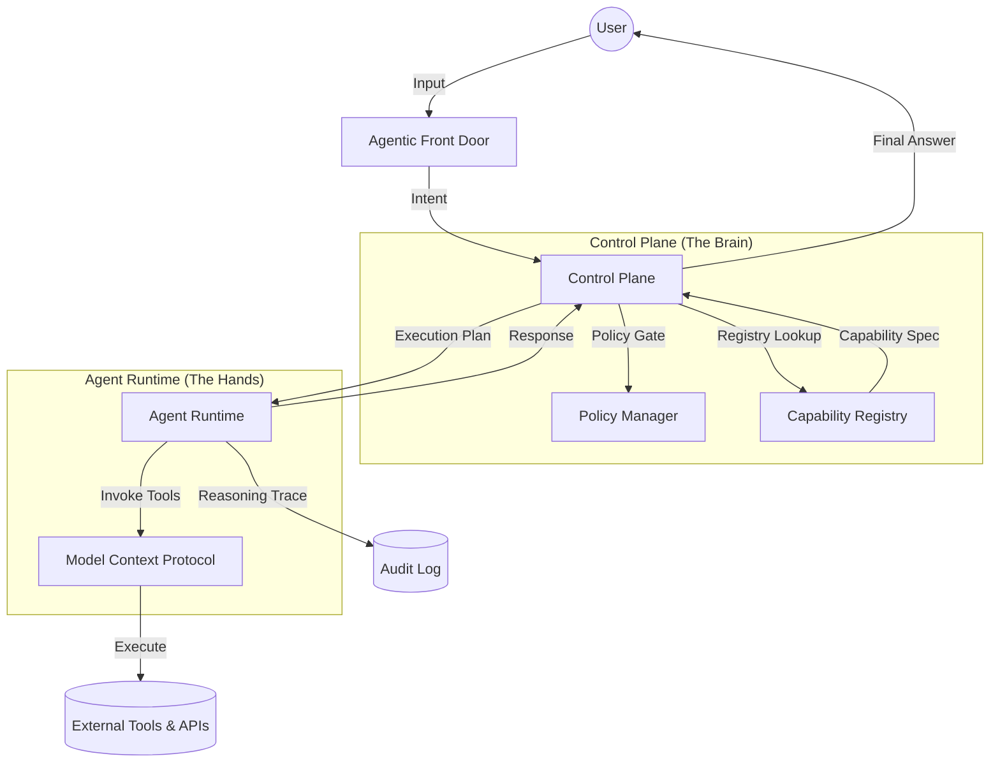
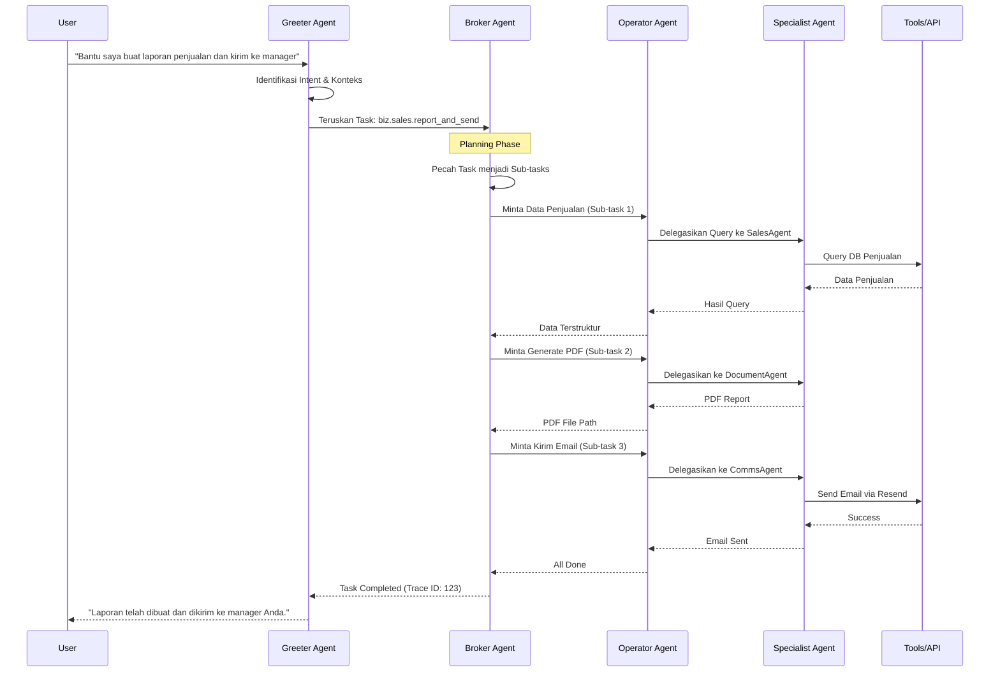

# Capability Coverage Map — Global SBA

**Smart Business Assistant (SBA-Agentic)**

---

## 1. Pendahuluan & Filosofi

SBA-Agentic (Smart Business Assistant) bukan sekadar asisten percakapan, melainkan sistem orkestrasi bisnis yang menghubungkan **Intent (Niat Bisnis)** dengan **Capability (Kemampuan Teknis)** melalui perantara **Agent (Unit Eksekusi)**. Sistem ini dirancang untuk beroperasi sebagai *Agentic AI Mesh*, di mana berbagai agen spesialis berkolaborasi untuk menyelesaikan tujuan bisnis yang kompleks.

### 1.1 Kontrak Intent → Capability
Kontrak ini memastikan bahwa setiap kebutuhan bisnis yang diekspresikan oleh pengguna dapat diterjemahkan secara deterministik menjadi serangkaian kemampuan teknis yang dapat dieksekusi. Setiap kontrak mencakup definisi intent, mapping ke capability, dan kriteria penerimaan teknis.

#### A. Komponen Kontrak
| Komponen | Deskripsi |
| :--- | :--- |
| **Intent ID** | Identifier unik untuk niat bisnis (misal: `biz.sales.report`). |
| **Business Intent** | Deskripsi semantik (misal: "Analisis performa penjualan minggu lalu"). |
| **Technical Capability**| Unit fungsional eksekusi (misal: `analytics.report.generate`). |
| **Pre-conditions** | Kondisi sistem yang harus terpenuhi sebelum eksekusi (misal: "Tenant auth valid", "Data source available"). |
| **Post-conditions** | Status akhir sistem yang dijamin setelah eksekusi sukses (misal: "Audit log created", "State updated"). |
| **Acceptance Criteria** | Kondisi sukses spesifik (misal: "PDF dihasilkan, data akurat, dikirim via email"). |
| **Risk & Compliance** | Level risiko (Low/Med/High) dan aturan tata kelola (misal: "PII Masking required"). |
| **SLA & Cost** | Ekspektasi waktu respon (< 5s) dan estimasi biaya token. |

### 1.2 Agent Interaction Archetypes
Selain mapping intent tunggal, SBA-Agentic menggunakan arketipe interaksi untuk menangani tugas yang kompleks dan berisiko tinggi:

- **Supervisor Archetype (Centralized Control)**: Agen supervisor bertindak sebagai *single front door* yang mengelola tata kelola (governance) dan delegasi tugas ke sub-agen spesialis dalam satu organisasi tenant.
- **Judge & Jury Archetype (Veracity & Trust)**: Digunakan untuk memitigasi halusinasi. Sebuah ensemble agen "juror" menghasilkan draf jawaban, sementara agen "judge" melakukan validasi silang (cross-validation) terhadap sumber data terpercaya (RAG) sebelum memberikan respons final.
- **Ensemble Archetype (Collaborative Reasoning)**: Beberapa agen dengan spesialisasi berbeda (misal: Analyst, Coder, Reviewer) bekerja secara paralel atau sekuensial untuk menyelesaikan satu intent kompleks.
- **Handoff Archetype (Stateful Transfer)**: Kemampuan agen untuk melakukan transfer konteks dan tanggung jawab secara mulus ke agen lain (atau manusia) ketika batas kapabilitas tercapai.

#### B. Mapping Katalog Intent (Detailed)
| Intent ID | Business Intent | Primary Capability | Acceptance Criteria | Success Metrics (KPI) | Risk | SLA & Cost |
| :--- | :--- | :--- | :--- | :--- | :--- | :--- |
| `intent.support.faq` | Menjawab FAQ pelanggan. | `knowledge.search.internal` | Jawaban relevan (score > 0.8), link sumber disertakan. | 90% Deflection, < 2% Hallucination, > 4.5/5 CSAT. | Low | < 2s, 0.01$ |
| `intent.sales.lead` | Menangkap data prospek. | `marketing.lead.collect` | Email valid, duplikasi dicek, data tersimpan di CRM. | 100% Accuracy, > 25% Conversion Rate (MQL). | Med | < 3s, 0.05$ |
| `intent.finance.invoice`| Membuat invoice. | `finance.invoice.create` | Total akurat, pajak dihitung, tersimpan di ERP & Cloud Storage. | 0% Error, 100% Compliance, < 5m E2E Time. | High | < 10s, 0.20$ |
| `intent.ops.inventory` | Cek stok real-time. | `erp.inventory.query` | Data stok akurat per SKU, timestamp query disertakan. | 99.9% Sync Accuracy, < 500ms API Latency. | Low | < 1s, 0.02$ |
| `intent.hr.onboarding` | Onboarding karyawan. | `hr.employee.onboard` | Akun sistem dibuat, email selamat datang dikirim, task list dibuat. | 100% Success, < 10m Process Time, 0 Manual Steps. | Med | < 15s, 0.15$ |
| `intent.biz.market_research`| Riset pasar kompetitor. | `knowledge.search.web` | Data kompetitor terbaru, sumber terverifikasi, analisis SWOT dasar. | > 5 Verified Sources, 100% Veracity Score. | Low | < 30s, 0.50$ |
| `intent.finance.churn_risk`| Prediksi risiko churn. | `analytics.prediction.churn`| Prediksi akurat (AUC > 0.85), daftar pelanggan berisiko tinggi. | > 85% Recall, > 80% Precision, < 24h Freshness. | Med | < 20s, 0.30$ |
| `intent.legal.contract_review`| Review draf kontrak legal. | `legal.contract.analyze` | Klausul berisiko diidentifikasi, saran mitigasi diberikan, skor kepatuhan. | 98% Risk Catch Rate, < 15m Review Time. | High | < 60s, 1.00$ |
| `intent.ops.logistics` | Tracking pengiriman global. | `ops.logistics.track` | Estimasi tiba akurat, riwayat lokasi lengkap, notifikasi delay dipicu. | 98% ETA Accuracy, < 1m Status Sync. | Low | < 5s, 0.05$ |
| `intent.marketing.content`| Buat konten kampanye. | `marketing.content.gen` | Konten sesuai segmentasi, multi-format (copy/image prompt), SEO optimized. | > 15% CTR Increase, 100% Brand Voice Consistency. | Med | < 15s, 0.10$ |
| `intent.ops.supply_chain`| Optimasi stok barang. | `ops.inventory.optimize` | Stok dihitung berdasarkan lead time, supplier terbaik dipilih, draft PO siap. | 20% Inventory Cost Reduction, 0 Stockouts. | Med | < 20s, 0.25$ |
| `intent.biz.process_optimize`| Optimasi proses via DTOp. | `biz.process.dtop_optimize` | Botleneck terdeteksi, simulasi "what-if" dijalankan, rekomendasi efisiensi. | 15% Throughput Increase, < 5% Process Drift. | Med | < 45s, 0.50$ |
| `intent.finance.high_value_auth`| Otorisasi transaksi besar. | `finance.auth.consensus` | Persetujuan multi-agen (Consensus), audit log blockchain, verifikasi identitas. | 100% Fraud Prevention, 0 Unauthorized Auth. | Critical| < 30s, 1.00$ |
| `intent.ops.self_healing_recovery`| Pemulihan kegagalan sistem. | `system.ops.self_healing` | Root cause dianalisis, re-planning otomatis, status dipulihkan dari checkpoint. | 99.99% Availability, < 30s Recovery Time (MTTR). | High | < 30s, 0.20$ |
| `intent.legal.compliance`| Cek kepatuhan transaksi. | `security.audit.compliance`| Anomali terdeteksi, referensi regulasi disertakan, skor risiko (0-100). | 100% Audit Coverage, 0 False Negatives. | High | < 10s, 0.15$ |
| `intent.biz.strategic_plan`| Buat rencana strategis. | `system.reasoning.plan` | Tugas dipecah menjadi langkah taktis, dependensi dipetakan, resource diestimasi. | 100% Step Feasibility, < 30s Graph Generation. | Med | < 45s, 1.00$ |
| `intent.document.extract`| Ekstraksi data dokumen. | `document.extract_data` | Data terstruktur (JSON) dihasilkan dari file gambar/PDF, akurasi > 95%. | 98% Extraction Accuracy, < 10s Process Time. | Med | < 15s, 0.15$ |
| `intent.analytics.report`| Buat laporan analitik. | `analytics.generate_report` | Laporan PDF/Excel dihasilkan dengan data terbaru, visualisasi disertakan. | 100% Data Freshness, < 2% Variance. | Med | < 20s, 0.25$ |
| `intent.support.routing`| Penjaluran tiket support. | `support.route_to_department` | Tiket diarahkan ke departemen yang tepat berdasarkan konten masalah. | 95% Routing Accuracy, < 1s Processing. | Low | < 3s, 0.05$ |

---

## 2. Struktur Agent Capability Registry

Agent Capability Registry adalah "source of truth" untuk semua kemampuan yang tersedia dalam ekosistem SBA-Agentic. Registry ini bertindak sebagai katalog dinamis yang dapat ditemukan (*discoverable*) oleh Planner Agent melalui **Intent-based Service Discovery**. Untuk detail teknis registri, lihat [Agent Capability Registry Spec](../specs/Agent%20Capability%20Registry%20Spec.md).

### 2.1 Katalog Kemampuan Agent (Core)

| Capability ID | Nama Kemampuan | Domain | Deskripsi Teknis | Risk Level |
| :--- | :--- | :--- | :--- | :--- |
| `system.reasoning.explain` | Explainable AI | Intelligence | Menyediakan jejak penalaran (reasoning trace) dalam format Markdown/JSON. | Low |
| `system.agent.route` | Semantic Routing | Intelligence | Mengarahkan intent ke agent spesialis berdasarkan skor relevansi semantik. | Low |
| `system.memory.persist` | Contextual Memory | Memory | Menyimpan interaksi dan preferensi tenant ke dalam Long-term Memory. | Low |
| `knowledge.graph.query` | Semantic Knowledge Retrieval | Knowledge | Melakukan query pada Federated Context Graph untuk mendapatkan relasi bisnis. | Low |
| `marketing.lead.collect` | Lead Capture | Marketing | Mengumpulkan data prospek dari formulir web atau integrasi API. | Medium |
| `finance.invoice.create` | Invoice Generation | Finance | Membuat dokumen invoice berdasarkan data transaksi di ERP. | High |
| `knowledge.search.web` | Web Information Retrieval | Knowledge | Melakukan pencarian informasi terkini dari web menggunakan strategi 6-langkah. | Low |
| `ops.supplier.onboard` | Supplier Onboarding | Operations | Menjalankan alur kerja otomatis untuk pendaftaran dan verifikasi vendor baru. | Medium |
| `support.ticket.route` | Intelligent Ticketing | Support | Mengklasifikasikan dan mengarahkan tiket bantuan ke departemen yang tepat. | Low |
| `analytics.prediction.churn` | Churn Prediction | Analytics | Menganalisis perilaku pelanggan untuk memprediksi risiko churn. | Medium |
| `communication.email.send` | Transactional Email | Comms | Mengirim email melalui provider terintegrasi (misal: Resend). | Low |
| `security.auth.validate` | Identity Validation | Security | Melakukan validasi token dan konteks tenant (Multi-tenant check). | Critical |

### 2.2 Discovery & Resolution Flow
SBA-Agentic menggunakan alur dinamis untuk menemukan kapabilitas yang tepat tanpa *hard-coded mapping*:



### 2.3 Spesifikasi Teknis & Validasi (JSON Schema)

Setiap capability wajib memiliki spesifikasi input/output yang ketat untuk memastikan interoperabilitas antar agen. Schema teknis disimpan dalam folder [registry/schemas/](./schemas/).

#### Contoh Schema: `marketing.lead.collect`
Lihat file lengkap: [marketing.lead.collect.schema.json](./schemas/marketing.lead.collect.schema.json)

```json
{
  "$schema": "http://json-schema.org/draft-07/schema#",
  "title": "Marketing Lead Collect Capability",
  "type": "object",
  "required": ["tenantId", "leadInfo"],
  "properties": {
    "tenantId": { "type": "string" },
    "leadInfo": {
      "type": "object",
      "required": ["email", "fullName"],
      "properties": {
        "email": { "type": "string", "format": "email" },
        "fullName": { "type": "string", "minLength": 2 }
      }
    }
  }
}
```

#### Daftar Schema Aktif:
- [Finance Invoice Create](./schemas/finance.invoice.create.schema.json)
- [Marketing Lead Collect](./schemas/marketing.lead.collect.schema.json)
- [Knowledge Search Web](./schemas/knowledge.search.web.schema.json)
- [Analytics Prediction Churn](./schemas/analytics.prediction.churn.schema.json)
- [Ops Supplier Onboard](./schemas/ops.supplier.onboard.schema.json)
- [Knowledge Search Internal](./schemas/knowledge.search.internal.schema.json)

### 2.4 Dependency Mapping & Composition Strategy

Pemetaan ini membantu sistem memahami urutan eksekusi, dampak kegagalan, dan strategi komposisi dalam graf eksekusi (**Execution Graph**).

| Capability | Dependencies | Impact of Failure | Composition Strategy |
| :--- | :--- | :--- | :--- |
| `sales.deal.close` | `finance.invoice.create`, `system.notification.dispatch` | Deal ditandai "Pending Finance" | Sequential |
| `marketing.campaign.launch` | `marketing.content.generate`, `system.policy.check`, `comms.email.send` | Kampanye tidak dapat dimulai | Hierarchical (Broker) |
| `system.agent.orchestrate` | `system.reasoning.explain`, `system.agent.route` | Kegagalan total orkestrasi | Core Engine |
| `ops.supplier.onboard` | `knowledge.graph.query`, `system.approval.request`, `db.upsert_record` | Vendor gagal didaftarkan | Multi-step Workflow |
| `analytics.predict.churn` | `db.data.fetch`, `analytics.model.invoke`, `system.alert.create` | Risiko churn tidak terdeteksi | Concurrent Data Fetch |
| `support.issue.resolve` | `knowledge.search.internal`, `system.agent.route`, `comms.ticket.update` | Tiket tetap terbuka | Collaborative (Group Chat) |

---

## 3. Fondasi Operasional (Policy, Pricing, Routing, Scale)

### 3.1 Policy (Governance & Rules)
Untuk spesifikasi penegakan kebijakan yang lebih mendalam, lihat [Policy Enforcement Spec](../specs/Policy%20Enforcement%20Spec%20—%20Capability%20×%20Tenant%20×%20Risk.md).

- **Multi-tenancy Enforcement**: Semua akses data wajib melalui *Tenant Context Provider* dan menyertakan `tenant_id`. Kebocoran data antar tenant dianggap sebagai kegagalan sistem kritis.
- **Human-in-the-loop (HITL)**: Capability dengan `riskLevel: High` (seperti transfer dana, penghapusan data massal, atau perubahan kontrak) wajib melalui persetujuan manual melalui *Approval Dashboard*.
- **Explainability Requirement**: Setiap aksi otonom wajib menyertakan atribut `reasoning_trace_id` yang merujuk pada log pemikiran agen. Tanpa trace, aksi dianggap tidak valid.
- **Hallucination & Veracity Guardrails**: Implementasi kebijakan **Judge & Jury** untuk semua intent kategori `Intelligence` dan `Legal`. Skor kepercayaan (*confidence score*) < 0.85 akan memicu review otomatis oleh agen verifikator kedua.
- **Intent-based Access Control (IBAC)**: Izin akses diberikan secara dinamis berdasarkan niat (Intent) pengguna dan validasi konteks, bukan hanya role statis.
- **Compliance Guardrails**: Pengecekan otomatis terhadap regulasi (misal: GDPR, PII Masking) sebelum data keluar dari Agent Runtime. Penyelarasan dengan **NIST AI RMF** untuk manajemen risiko AI.
- **PII Masking & Data Residency**:
  - **In-flight Masking**: Data sensitif (Email, Nama, NIK) wajib di-masking secara dinamis oleh *Privacy Agent* sebelum diproses oleh model pihak ketiga (LLM).
  - **Residency Enforcement**: Tenant dapat menentukan wilayah penyimpanan data (misal: `ID-Jakarta`, `SG-Singapore`). Agen dilarang memindahkan data lintas wilayah tanpa otorisasi eksplisit.
  - **Least Privilege Access**: Agen hanya diberikan akses ke subset data yang diperlukan untuk menyelesaikan intent spesifik (*Data Minimization*).
- **Operational Guardrails**: Limit eksekusi per tenant (Rate Limiting) dan Circuit Breaker untuk integrasi pihak ketiga yang tidak stabil.

### 3.2 Pricing (Business Model & Cost Structure)
- **Consumption-based Tiering**:
  - **Free**: 100 requests/bulan, Intelligence capabilities dasar, limit 50 tokens/request.
  - **Standard ($49/mo)**: 1,000 requests/bulan, akses ke Marketing & Sales, prioritas eksekusi medium, 24/7 Support.
  - **Enterprise (Custom)**: Unlimited requests, Full Capability Registry, Custom Agent Development, SLA 99.9%, dedicated runtime instances.
- **Semantic Token Usage**: Biaya dihitung berdasarkan jumlah token yang dikonsumsi oleh model (LLM) plus margin operasional sistem.
- **Capability-specific Surcharge**: Tool premium (misal: data enrichment eksternal) dikenakan biaya per penggunaan (Pay-per-use).
- **Incentive Model**: Diskon biaya token untuk request yang berhasil dilayani melalui Semantic Cache (> 50% hit rate).
- **Agentic Marketplace & Revenue Sharing**:
  - **Third-party Agents**: Pengembang pihak ketiga dapat mempublikasikan agen spesialis ke registry.
  - **Revenue Share**: 70% dari biaya penggunaan agen diberikan kepada pengembang, 30% untuk platform SBA-Agentic sebagai pengelola mesh.
  - **Certified Agents**: Agen yang melewati audit keamanan dan performa mendapatkan lencana "Certified" dan prioritas routing.

### 3.3 Routing (Workflow Mechanism & Assignment)
1.  **Semantic Intent Analysis**: AFD (Agentic Front Door) menggunakan model embedding untuk memahami nuansa intent dan memetakannya ke Intent ID di registry.
2.  **Arbiter Routing & Semantic Router**: Menggunakan **Semantic Router** untuk mengarahkan permintaan ke model atau agen spesialis (math-specialized, creative-specialized, etc.) berdasarkan fitur semantik permintaan.
3.  **Hierarchical Supervisor Routing**: Permintaan yang masuk ke organisasi tenant besar akan diarahkan ke agen **Supervisor** yang memiliki visibilitas terhadap semua sub-agen dan tools dalam tenant tersebut.
4.  **Agentic Service Mesh (ASM) Routing**: Implementasi fabric komunikasi terdesentralisasi menggunakan pola **Sidecar Proxy** atau **Ambient Mesh (sidecarless)**. ASM mengelola:
    - **Identity & Auth**: mTLS by default antar agen.
    - **Traffic Steering**: Canary rollout untuk versi agen baru.
    - **Observability**: Unified tracing lintas agen.
5.  **Multi-Agent Consensus Mechanisms**: Untuk tugas pengambilan keputusan kritis (misal: otorisasi pembayaran besar), router memicu protokol konsensus:
    - **Majority Voting**: Keputusan diambil berdasarkan suara terbanyak (>50%).
    - **Weighted Voting**: Suara agen dengan *confidence score* lebih tinggi memiliki bobot lebih besar.
    - **Peer Review (Explainer-Critic)**: Satu agen mengusulkan solusi, agen lain melakukan audit/kritik sebelum finalisasi.
6.  **Semantic Caching (Asteria Pattern)**: Implementasi cross-region caching yang menyadari semantik (**Semantic-aware Caching**). Menggunakan **Semantic Element (SE)** untuk menyimpan kueri, interaksi tool, dan respon untuk penggunaan kembali yang efisien.
7.  **Fallback & Self-Correction**: Jika routing gagal atau agen spesialis tidak merespon, sistem akan mencoba routing alternatif atau melakukan *Self-Healing* sebelum eskalasi ke manusia.
8.  **Load-balanced Execution**: Penugasan tugas ke instance Agent Runtime yang paling tidak sibuk (least-busy) dengan kesadaran terhadap KV-cache untuk meminimalkan latensi.

### 3.4 Scale (Scalability & Service Continuity)
- **Agentic AI Mesh & Federated Orchestration**: Arsitektur terdistribusi di mana agen spesialis berkolaborasi melalui fabric koordinasi, memungkinkan skalabilitas horizontal tanpa kemacetan pusat.
- **Composition Strategy (Marketplace Mindset)**: Menganggap agen dan tool sebagai komponen yang dapat dipertukarkan. Sistem secara dinamis memilih "provider" terbaik (internal/external) berdasarkan performa, biaya, dan ketersediaan.
- **Asynchronous Event-driven Coordination**: Menggunakan Redis/BullMQ untuk antrian tugas. Komunikasi antar komponen bersifat non-blocking untuk menangani ribuan kueri agen per menit.
- **Layered Decoupling**: Memisahkan fungsi logika, memori, orkestrasi, dan antarmuka untuk memaksimalkan modularitas dan kemudahan pembaruan komponen secara independen.
- **Edge Runtime Deployment**: Menjalankan Agent Runtime di dekat lokasi pengguna/data untuk latensi minimal, mendukung operasional 24/7 di berbagai region.
- **Elastic Agent Provisioning**: Sistem secara dinamis melakukan *scaling* jumlah instance Agent Runtime berdasarkan beban antrian (BullMQ) dan kompleksitas *Execution Graph*.
- **Cross-region State Sync**: Sinkronisasi status agen (*Agent State*) antar region menggunakan pola *Eventual Consistency* untuk mendukung mobilitas pengguna global.
- **Digital Twin of Processes (DTOp) for Optimization**: 
    - **Real-time Monitoring**: Pemetaan proses bisnis ke dalam replika digital yang dinamis.
    - **Autonomous Optimization**: Agen bertindak sebagai entitas aktif dalam DTOp untuk mensimulasikan skenario "what-if" dan mengoptimalkan alur kerja secara otomatis (misal: rebalancing workload).
    - **Bottleneck Detection**: Deteksi hambatan proses secara proaktif sebelum berdampak pada SLA.
- **Agentic Service Mesh (ASM) for Scalability**: Menggunakan ASM untuk mengelola ribuan koneksi agen secara efisien, menyediakan penemuan layanan otomatis, dan penanganan kegagalan (*failover*) tanpa mengganggu Control Plane pusat.

### 3.5 Self-Healing & Resilience (Fault Tolerance)
SBA-Agentic dirancang untuk memulihkan diri secara otonom dari kegagalan eksekusi:
- **Execution Graph Recovery**: Jika sebuah sub-tugas dalam graf gagal, Planner Agent akan mencoba merencanakan ulang (*Re-planning*) jalur alternatif tanpa mengulang seluruh proses.
- **Circuit Breaker Pattern**: Mengisolasi kapabilitas atau tool yang tidak stabil untuk mencegah kegagalan berantai (*Cascading Failures*) di seluruh mesh.
- **Checkpoint & Restart**: Menyimpan status eksekusi pada setiap langkah kritis. Jika terjadi kegagalan sistem, proses dapat dilanjutkan dari *checkpoint* terakhir.
- **Self-Correcting Reasoning**: Agen memiliki kemampuan untuk mendeteksi kesalahan dalam output-nya sendiri (melalui pola *Reflection*) dan melakukan koreksi sebelum respons dikirim ke pengguna.

#### A. Alur Pemulihan (Self-healing Flow)
Diagram ini menggambarkan bagaimana sistem menangani kegagalan eksekusi secara otonom:



---

## 4. Pengembangan Smart Business Assistant (SBA-Agentic)

### 4.1 Arsitektur Teknis High-Level (Agentic AI Mesh)

SBA-Agentic mengadopsi pola kolaborasi agen yang terdistribusi:
- **Greeter Pattern**: Menangani kontak pertama, resolusi intent, dan pengumpulan konteks awal.
- **Operator Pattern**: Mengarahkan tugas ke agen spesialis (misal: Finance Agent) dan menegosiasikan detail intent jika ambigu.
- **Broker/Conductor Pattern**: Bertindak sebagai orkestrator pusat yang menyusun rencana eksekusi multi-langkah (Execution Plan).

#### A. Komponen Utama Arsitektur


#### B. Alur Kolaborasi Agen (Multi-Agent Flow)
Diagram ini menunjukkan bagaimana berbagai pola agen bekerja sama untuk menyelesaikan tugas kompleks:



### 4.2 Scope & Fitur Utama
- **Autonomous Planning & Execution**: Planner Agent secara cerdas memecah tujuan bisnis yang kompleks menjadi Execution Graph yang dapat dijalankan secara otonom.
- **Contextual Memory (Short & Long-term)**: Mengingat detail percakapan dalam sesi (short-term) dan preferensi bisnis jangka panjang (long-term) untuk personalisasi yang mendalam.
- **Federated Context Graph**: Menghubungkan silo data bisnis (CRM, ERP, Knowledge Base) ke dalam graf pengetahuan semantik yang dapat diakses agen.
- **Omnichannel Delivery**: Output dapat dikirimkan melalui berbagai saluran (Email, Slack, WhatsApp, Dashboard) secara konsisten.
- **Self-Learning Feedback Loop**: Agen belajar dari koreksi manusia (HITL) dan feedback pengguna untuk meningkatkan akurasi routing dan eksekusi di masa depan.
- **Explainable Reasoning Stream**: Pengguna dapat melihat "proses berpikir" agen secara real-time melalui antarmuka dashboard.

---

## 5. Use Case Bisnis & Skenario

### 5.1 Horizontal Business Use Cases
1.  **Automated Sales Funnel**: Agen secara otonom mengidentifikasi lead potensial, melakukan kualifikasi menggunakan data LinkedIn/Web, mengirimkan email personalisasi, dan menjadwalkan pertemuan di kalender sales.
2.  **Smart Compliance Officer**: Memantau transaksi keuangan secara real-time, mendeteksi anomali yang melanggar kebijakan internal atau regulasi pemerintah, dan membekukan transaksi mencurigakan untuk review manual.
3.  **Autonomous Customer Success**: Menganalisis data penggunaan produk, memprediksi pelanggan yang berisiko churn, dan secara proaktif mengirimkan panduan atau penawaran khusus untuk meningkatkan retensi.
4.  **Supply Chain Orchestrator**: Mengelola stok barang secara otomatis; jika stok rendah, agen akan mencari supplier terbaik di registry, menegosiasikan harga berdasarkan sejarah transaksi, dan membuat draft Purchase Order.
5.  **HR Intelligence**: Mengotomatiskan alur kerja onboarding karyawan, mulai dari pembuatan akun sistem, pengiriman dokumen legal, hingga penjadwalan sesi orientasi pertama.

### 5.2 Vertical Industry Use Cases (Deep Dives)
- **Finance & Banking**:
    - **Autonomous Claims Adjudication**: Agen memproses klaim asuransi secara end-to-end, mulai dari validasi dokumen (OCR), deteksi fraud (anomaly detection), hingga penentuan keputusan berdasarkan kebijakan polis.
    - **Investment Strategy Optimization**: Ensemble agen menganalisis tren pasar real-time, sentimen berita, dan profil risiko portofolio untuk memberikan rekomendasi rebalancing otomatis.
- **Manufacturing & Industry 4.0**:
    - **Predictive Maintenance with DTOp**: Agen memantau replika digital (Digital Twin) dari mesin produksi. Jika sensor mendeteksi anomali, agen akan mensimulasikan dampak kegagalan dalam DTOp dan menjadwalkan teknisi secara proaktif sebelum kerusakan terjadi.
    - **Adaptive Process Control**: Agen menyesuaikan parameter mesin secara real-time berdasarkan variasi kualitas bahan baku untuk meminimalkan limbah dan meningkatkan yield.
- **Retail & E-commerce**:
    - **Hyper-personalized Engagement**: Agen menganalisis sejarah pembelian dan perilaku browsing untuk membuat kampanye pemasaran dinamis yang disesuaikan secara unik untuk setiap pelanggan di berbagai saluran.
    - **Intelligent Inventory Rebalancing**: Agen mengoordinasikan pemindahan stok antar toko fisik dan gudang pusat berdasarkan prediksi permintaan lokal untuk menghindari *stockout* dan *overstock*.

---

---

## 6. Roadmap Pengembangan (2026)

| Fase | Fokus | Milestone Teknis |
| :--- | :--- | :--- |
| **Q1 2026** | **Foundation** | - Launch AFD v1 (Semantic Routing & Auth).<br>- Core Intelligence Registry (Base capabilities).<br>- SDK Agent Runtime v1 (TypeScript).<br>- Federated Context Graph MVP.<br>- **Agent Name Service (ANS) implementation.** |
| **Q2 2026** | **Ecosystem** | - Implementasi Multi-agent Collaboration (Broker Pattern).<br>- Integrasi MCP untuk CRM & ERP terpopuler.<br>- Admin Dashboard for Monitoring & HITL.<br>- Semantic Cache Implementation (Redis).<br>- **A2A Protocol & Agent Cards (.well-known) integration.** |
| **Q3 2026** | **Scale & Policy** | - Advanced Policy Engine (IBAC & Compliance Guardrails).<br>- Consumption-based Pricing Model implementation.<br>- **Agentic Service Mesh (ASM) Beta Rollout.**<br>- **Digital Twin of Processes (DTOp) integration for key verticals.**<br>- **Agentic Marketplace Launch (BETA).** |
| **Q4 2026** | **Self-Evolution** | - Feedback Loop & Self-Learning (Learning from HITL).<br>- **Multi-Agent Consensus (Peer Review) for high-risk decisions.**<br>- Autonomous Capability Discovery & Optimization.<br>- Global Edge Runtime Rollout.<br>- **Decentralized Agent Mesh with Blockchain-based Audit Logs.** |

---

## 7. Daftar Requirement Teknis & Bisnis (Detailed)

### 7.1 Requirement Bisnis (BR)
- **BR-01 (Multi-tenancy)**: Isolasi data 100% antar organisasi. Tidak boleh ada data yang bocor di level database, cache, maupun memory agent.
- **BR-02 (Traceability & Audit)**: Setiap tindakan otonom harus memiliki audit trail yang mencakup input, output, reasoning trace, dan timestamp.
- **BR-03 (Governance/HITL)**: Tindakan dengan level risiko `High` atau `Critical` wajib memerlukan tanda tangan digital dari otorisator tenant.
- **BR-04 (Cost Control)**: Tenant dapat mengatur budget harian/bulanan untuk penggunaan token dan eksekusi agen.
- **BR-05 (SLA Performance)**: Sistem harus menjamin uptime 99.9% untuk Control Plane dan latensi routing < 500ms.
- **BR-06 (Vendor Agnostic)**: Sistem harus mendukung integrasi agen dari berbagai vendor (OpenAI, Anthropic, Google, local models) tanpa perubahan arsitektur besar.
- **BR-07 (Monetization)**: Mendukung model revenue sharing untuk pengembang agen pihak ketiga dalam marketplace.
- **BR-08 (Operational Efficiency)**: Implementasi **Digital Twin of Processes (DTOp)** untuk mengidentifikasi inefisiensi alur kerja minimal 20% dalam 6 bulan pertama.

### 7.2 Requirement Teknis (TR)
- **TR-01 (Semantic Router)**: Model router harus memiliki akurasi klasifikasi intent > 95% pada dataset benchmark internal.
- **TR-02 (Low Latency)**: Latensi end-to-end (AFD ke Agent Runtime) tidak boleh melebihi 5 detik untuk 90% permintaan (P90).
- **TR-03 (Observability)**: Setiap eksekusi wajib menghasilkan retrieval trace dalam format OpenTelemetry.
- **TR-04 (Interoperability)**: Semua agen pihak ketiga wajib mendukung Model Context Protocol (MCP) v1.0+.
- **TR-05 (Veracity Engine)**: Implementasi pola **Judge & Jury** dengan dukungan untuk perbandingan respons model ganda (LLM-as-a-judge).
- **TR-06 (Hierarchical Discovery)**: Dukungan untuk **Agent Name Service (ANS)** guna penemuan agen secara global dan lokal dengan enkripsi mTLS.
- **TR-07 (State Management)**: Sinkronisasi status agen antar instance harus menggunakan Redis dengan persistensi RDB/AOF.
- **TR-08 (Security Guardrails)**: Implementasi filter keamanan multimodal (text/image) untuk mendeteksi jailbreak dan prompt injection.
- **TR-09 (Service Mesh)**: Agentic Service Mesh (ASM) harus mendukung mTLS, automatic retries, dan circuit breaking antar agen.
- **TR-10 (Consensus Engine)**: Implementasi modul konsensus yang mendukung setidaknya 3 algoritma pengambilan keputusan (Majority, Weighted, Expert-led).

---

## 8. Penutup
