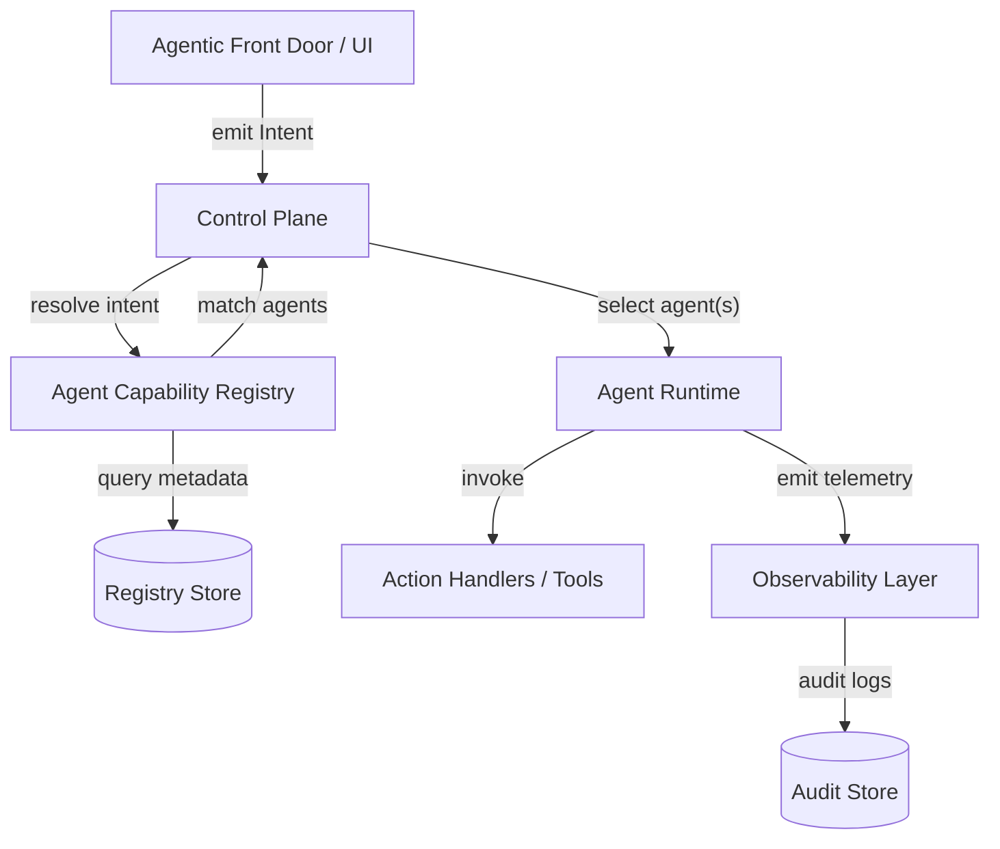
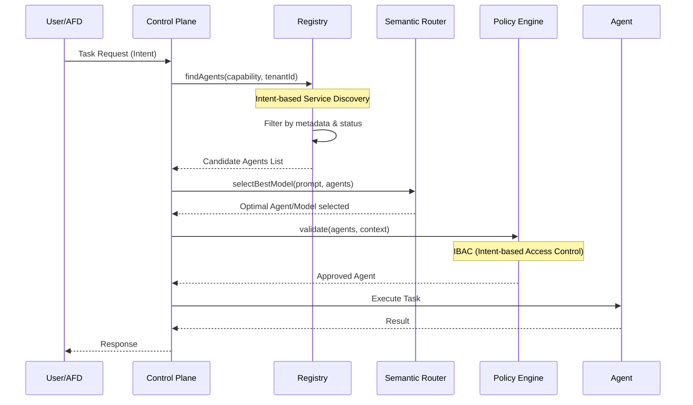
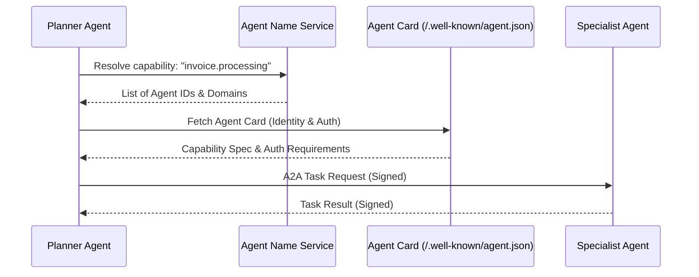

# Agent Capability Registry Spec
**Smart Business Assistant (SBA-Agentic)**

Berikut adalah **Agent Capability Registry Spec** yang *production-grade*, *agent-agnostic*, dan menjadi tulang punggung **Control Plane SBA-Agentic**. Dokumen ini dirancang sejalan langsung dengan:
- Intent Taxonomy (Global SBA)
- Capability Coverage Map
- AFD → Control Plane → Agent Flow
- Internal Console & Policy Engine
- Protocols: MCP, ACP, and A2A integration

---

## 1. Executive Summary
Agent Capability Registry (ACR) adalah komponen inti yang memungkinkan orkestrasi dinamis, penemuan kemampuan (capability discovery), dan tata kelola agen dalam ekosistem SBA-Agentic. Dengan memisahkan identitas agen dari kemampuannya, sistem dapat melakukan routing tugas secara deterministik berdasarkan kebijakan (policy), risiko, dan biaya.

---

## 2. Tujuan Registry (WHY IT EXISTS)
Agent Capability Registry adalah **single source of truth** untuk menjawab pertanyaan:
> "Agent ini bisa melakukan apa, dengan syarat apa, dan seberapa aman?"

Registry ini memungkinkan:
- **Routing deterministik**: Bukan prompt-based guessing, melainkan resolusi berdasarkan metadata.
- **Policy enforcement**: Validasi izin dan batasan sebelum eksekusi (Zero-Trust).
- **Discovery & Search**: Memungkinkan agen atau manusia menemukan agen yang tepat untuk tugas tertentu.
- **Observability & Auditability**: Pelacakan penuh dari niat (intent) hingga eksekusi tool.
- **Dynamic agent orchestration**: Hot-swapping agen tanpa perubahan kode pada UI atau API.
- **Capability-based monetization**: Memungkinkan pembatasan fitur berdasarkan paket langganan tenant.

---

## 3. Arsitektur & Komponen Utama

### 3.1 Posisi Registry dalam Ekosistem


### 3.2 Pola Interaksi (Interaction Patterns)
SBA-Agentic mengadopsi pola interaksi standar enterprise untuk orkestrasi agen:
- **Greeter Pattern**: Menangani kontak pertama, resolusi intent awal menggunakan **Semantic Resolution**, dan pengumpulan konteks dasar.
- **Operator Pattern**: Mengarahkan tugas ke agen spesialis (Specialist Agent) dan menegosiasikan detail intent jika terdapat ambiguitas.
- **Broker/Conductor Pattern**: Orkestrator pusat yang menyusun **Execution Plan** multi-langkah dan mengelola dependensi antar agen.
- **Agentic Service Mesh (ASM) Sidecar**: Setiap agen berjalan dengan *Sidecar Proxy* (ASM Proxy) yang mengelola komunikasi antar-agen, enkripsi mTLS, observabilitas, dan penegakan kebijakan (*policy enforcement*) tanpa mengubah kode logika agen.
- **Specialist Roles**: Kategorisasi fungsional agen (Domain Expert, Knowledge Minion, Assistant, Planner) untuk spesialisasi tugas.

### 3.3 Multi-Agent Interaction Archetypes
Untuk menangani kompleksitas enterprise, registry mendukung arketipe interaksi berikut:
- **Supervisor Archetype**: Agen dengan peran `supervisor` yang memiliki otorisasi penuh untuk mengelola siklus hidup tugas dalam satu tenant. Wajib mengimplementasikan interface `task.delegate` dan `task.monitor`.
- **Judge & Jury Archetype**: Mekanisme verifikasi yang melibatkan minimal 3 agen (2 Juror, 1 Judge). Juror menghasilkan draf, Judge melakukan rekonsiliasi dan penilaian veracity.
- **Ensemble Archetype**: Orkestrasi paralel di mana beberapa agen mengerjakan sub-tugas secara bersamaan dan hasilnya digabungkan oleh Broker Agent.

### 3.4 Discovery & Resolution Flow


---

## 4. Prinsip Desain (NON-NEGOTIABLE)

| Prinsip | Penjelasan |
| :--- | :--- |
| **Agent ≠ Capability** | Agent hanya *provider* capability. Satu agen bisa punya banyak capability. |
| **Declarative** | Registry bersifat deklaratif (YAML/JSON), bukan kode prosedural. |
| **Policy-first** | Capability tidak aktif tanpa policy yang valid (Entitlement & Risk). |
| **Intent-based Discovery** | Penemuan kapabilitas secara dinamis berdasarkan niat bisnis, bukan alamat statis. |
| **Observable** | Setiap pemanggilan capability wajib menghasilkan retrieval trace. |
| **Hot-reloadable** | Agen bisa register/unregister runtime tanpa downtime sistem. |
| **Zero-Trust** | Setiap aksi diverifikasi ulang di layer registry dan tools gateway. |

---

## 5. Core Concepts: Skills vs Tools
Sesuai dengan best practices pengembangan agen modern:
- **Tools**: Fungsi spesifik yang berinteraksi dengan lingkungan (misal: `fetch_url`, `query_db`). Lihat [Action Handlers Catalog](../../.trae/rules/action-handlers-catalog.md).
- **Skills**: Deskripsi kemampuan tingkat tinggi yang memandu penggunaan tool (misal: `troubleshooting`, `research`).
- **Federated Context Graph**: Model pengetahuan terpadu yang memberikan konteks bisnis lintas domain bagi agen.
- **Agent Cards**: Metadata lengkap yang mendeskripsikan identitas dan kemampuan agen.
- **Adapters**: Implementasi konkret untuk setiap capability. Lihat [Capability Adapter Example](./Capability%20Adapter%20Example.md).

---

## 6. Registry Data Model (Canonical)

### 6.1 Agent Registry Entry (Agent Card)
```typescript
export interface AgentRegistryEntry {
  agentId: string;
  agentType: 'ai' | 'human' | 'hybrid';
  name: string;
  version: string;
  description: string;
  endpointUrl?: string; // Untuk agen remote via ACP/MCP
  
  owner: 'system' | 'tenant' | 'partner';
  
  capabilities: AgentCapabilityBinding[]; // Skills/Capabilities
  
  consensusProtocol?: {
    algorithm: 'majority_vote' | 'weighted_vote' | 'peer_review' | 'expert_led';
    minParticipants: number;
    timeoutMs: number;
  };

  dtoPMapping?: {
    processId: string;
    stepId: string;
    roleInProcess: 'executor' | 'monitor' | 'optimizer';
  };

  dtoPMapping?: {
    processId: string;
    stepId: string;
    roleInProcess: 'executor' | 'monitor' | 'optimizer';
  };

  constraints: {
    tenantScope: 'global' | 'tenant-only';
    allowedTenants?: string[];
    regions?: string[];
    maxConcurrency?: number;
  };

  lifecycle: {
    status: 'active' | 'paused' | 'deprecated' | 'stale';
    registeredAt: ISODateString;
    lastHeartbeatAt: ISODateString;
  };

  observability: {
    traceLevel: 'full' | 'partial';
    auditRequired: boolean;
  };
}
```

### 6.2 Capability Binding (Agent → Skill)
```typescript
export interface AgentCapabilityBinding {
  capabilityId: string; // Ref ke Action Handlers Catalog
  name: string;
  description: string;
  mode: 'sync' | 'async';
  
  confidenceScore: number; // 0.0 – 1.0 (Keandalan agen untuk skill ini)
  
  costProfile: {
    costTier: 'free' | 'standard' | 'premium';
    estimatedCostUnit?: number;
  };

  governance: {
    piiMaskingRequired: boolean;
    dataResidencyRegion: string;
    allowedDataSensitivity: ('public' | 'internal' | 'confidential' | 'pii')[];
  };

  riskProfile: {
    riskLevel: 'low' | 'medium' | 'high';
    requiresApproval?: boolean;
    dataSensitivity: 'public' | 'internal' | 'confidential' | 'pii';
  };

  protocol: {
    type: 'internal' | 'mcp' | 'acp' | 'a2a';
    version: string;
  };

  inputSchemaRef: string; // Ref ke registry/schemas/*.schema.json
  outputSchemaRef: string;
}
```

### 6.3 Dependency & Composition Model
Registry melacak dependensi antar kapabilitas untuk membangun **Execution Graph** yang valid:
- **Hard Dependency**: Kapabilitas A tidak bisa berjalan tanpa output dari B (misal: `invoice.create` butuh `erp.data.fetch`).
- **Soft Dependency**: Kapabilitas A lebih optimal jika ada B, tapi bisa berjalan dengan fallback (misal: `response.personalize` lebih baik jika ada `crm.profile.fetch`).
- **Composition Logic**: Mendefinisikan apakah eksekusi bersifat `sequential`, `parallel`, atau `conditional`.

#### 6.3.1 Dependency Metadata Schema
```typescript
export interface CapabilityDependency {
  dependentId: string; // ID capability yang dibutuhkan
  type: 'hard' | 'soft';
  fallbackStrategy?: 'fail' | 'default_value' | 'skip';
  dataMapping: {
    sourcePath: string; // JSONPath dari output dependency
    targetPath: string; // JSONPath ke input capability saat ini
  };
}
```

### 6.4 Schema Registry
Semua schema validasi untuk capability dikelola secara terpusat dalam folder `registry/schemas/`. Setiap entry dalam registry wajib merujuk pada schema yang valid untuk menjamin integritas data saat eksekusi antar agen.

### 6.5 Validation & Integrity Guards (New)
Untuk memastikan keamanan dan keandalan, registry menerapkan guardrail otomatis:
1. **Input/Output Validation**: Setiap pesan yang masuk dan keluar dari agen divalidasi terhadap JSON Schema yang terdaftar. Kegagalan validasi memicu `ExecutionError` dan menghentikan alur kerja sebelum efek samping (side-effects) terjadi.
2. **Semantic Integrity Check**: Memastikan output agen tidak hanya valid secara skema, tetapi juga konsisten secara semantik dengan instruksi awal (mencegah halusinasi).
3. **Circular Dependency Detection**: Registry secara otomatis memvalidasi graph dependensi saat pendaftaran agen untuk mencegah *infinite loops*.
4. **Contract Testing**: Mendukung pengujian otomatis berbasis kontrak untuk memastikan perubahan pada satu agen tidak merusak agen lain yang bergantung padanya.

---

## 7. Katalog Kemampuan (Capability Catalog)
Berikut adalah kategori kemampuan utama yang didaftarkan dalam Registry:

### 7.1 Business Process Automation (BPA)
- `workflow.approval_request`: Menginisialisasi alur persetujuan baru.
- `document.extract_data`: OCR dan ekstraksi data terstruktur.
- `workflow.escalate_request`: Menjalankan alur eskalasi ke manajer.
- `ops.supplier.onboard`: Pendaftaran dan verifikasi vendor baru.

### 7.2 Customer Experience (CX)
- `support.route_to_department`: Klasifikasi dan routing tiket dukungan ke departemen terkait.
- `agent.personalize_response`: Personalisasi respon berdasarkan profil dan konteks.
- `knowledge.search`: Pencarian informasi (RAG) dengan retrieval trace.
- `knowledge.search.internal`: Pencarian di basis pengetahuan internal tenant.
- `knowledge.search.web`: Pencarian informasi publik di web.

### 7.3 Data Analytics (DA)
- `analytics.generate_report`: Pembuatan laporan otomatis (PDF/Excel) dari dataset bisnis.
- `analytics.query`: (Experimental) Menjalankan query pada dataset bisnis.
- `analytics.prediction.churn`: Analisis risiko churn pelanggan.

### 7.4 System Integration (SI)
- `crm.create_lead`: Membuat entry lead baru di CRM eksternal.
- `erp.sync_inventory`: Sinkronisasi data stok real-time pada sistem ERP.

---

## 8. Lifecycle Management

### 8.1 Registration Flow
1. **Agent Boot**: Agen mengirimkan Agent Card ke endpoint `/registry/register`.
2. **Validation**: Control Plane memvalidasi schema dan integritas Agent Card.
3. **Intent Indexing**: Metadata diindeks secara semantik untuk mendukung **Intent-based Service Discovery**.
4. **Store**: Metadata disimpan di Registry Store (PostgreSQL/Redis).
5. **Event**: Emit `AgentRegistered` event untuk memperbarui cache Control Plane.

### 8.2 Semantic Caching
Sistem menggunakan **Semantic Cache** untuk menyimpan hasil resolusi intent yang serupa. Hal ini:
- Mempercepat respon untuk tugas yang berulang.
- Mengurangi konsumsi token dan biaya operasional LLM.
- Meningkatkan konsistensi jawaban dalam konteks tenant yang sama.

### 8.3 Heartbeat & Health Monitoring
- Agen wajib mengirimkan heartbeat setiap 30-60 detik.
- Jika heartbeat hilang > 3x interval, status agen diubah menjadi `stale` dan dihapus dari routing aktif.

### 8.4 Elastic Provisioning & Self-Healing
Registry bekerja sama dengan Orchestrator untuk mendukung skalabilitas dan ketahanan:
- **Dynamic Capacity Scaling**: Berdasarkan beban kerja di antrian, Registry memicu *provisioning* instance agen tambahan untuk kapabilitas yang mengalami kemacetan (*bottleneck*).
- **Auto-failover**: Jika agen terpilih gagal merespon, Registry secara dinamis memberikan kandidat agen cadangan (*fallback agent*) dengan kapabilitas yang sama untuk melanjutkan tugas.
- **State Recovery Hooks**: Agen dapat mendaftarkan *hook* untuk pemulihan status, memungkinkan sistem untuk memulihkan konteks tugas setelah kegagalan infrastruktur.

### 8.5 Cross-region State Synchronization
- **Federated Registry**: Metadata registry disinkronkan secara global, namun eksekusi tetap diutamakan pada region yang sama dengan data residensi untuk kepatuhan dan latensi.
- **Conflict Resolution**: Menggunakan stempel waktu (*timestamp*) dan vektor logis untuk menangani konflik pembaruan metadata agen antar region.

### 8.3 Deprecation
- Capability dapat ditandai sebagai `deprecated` untuk memicu migrasi ke versi yang lebih baru tanpa memutus workflow yang ada.

---

## 9. Interoperabilitas & Protokol

Registry mendukung integrasi lintas framework dan vendor melalui protokol standar untuk mencegah vendor lock-in:
- **Model Context Protocol (MCP)**: Untuk integrasi dinamis dengan tools dan resource eksternal. Mendukung mekanisme **MCP Subscriptions** di mana agen dapat berlangganan pembaruan kapabilitas secara real-time.
- **Agent-to-Agent (A2A) Protocol**: Standar komunikasi antar agen untuk kolaborasi multi-vendor yang mulus. Menggunakan format pesan terstandarisasi untuk permintaan tugas dan negosiasi kemampuan.
- **Agent Name Service (ANS)**: Mekanisme penemuan agen berbasis DNS yang memungkinkan resolusi identitas agen secara global menggunakan sertifikat PKI untuk keamanan.
- **Agent Cards (.well-known/agent.json)**: Setiap agen wajib menyediakan endpoint metadata standar yang mendeskripsikan kapabilitas, metode JSON-RPC yang didukung, dan persyaratan autentikasi.

### 9.1 Discovery Flow with ANS & A2A


---

## 10. Observability & Keamanan

### 10.1 Retrieval Traces
Setiap eksekusi capability yang melibatkan data (RAG) wajib menyertakan **Retrieval Trace**:
- Sumber data yang digunakan.
- Skor relevansi semantik.
- Timestamp pengambilan.
- Kebijakan privasi yang diterapkan.

### 10.2 Intent-based Access Control (IBAC)
Berbeda dengan RBAC statis, IBAC memberikan izin berdasarkan:
1. **Intent Analysis**: Apakah niat pengguna selaras dengan wewenangnya?
2. **Contextual Risk**: Apakah situasi saat ini (waktu, lokasi, status sistem) aman untuk eksekusi?
3. **Policy Hooks**: Menjalankan cek kustom sebelum agen dipilih.

### 10.3 Policy Enforcement Hooks
Sebelum agen dipilih, Control Plane melakukan cek:
1. **Entitlement**: Apakah tenant memiliki akses ke capability ini?
2. **Budget**: Apakah kuota penggunaan masih tersedia?
3. **Risk**: Jika `riskLevel: high`, apakah ada persetujuan dari `ReviewerAgent`?

### 10.4 Agentic Service Mesh (ASM) Governance
ASM menyediakan layer keamanan tambahan di level jaringan agen:
- **mTLS by Default**: Semua komunikasi A2A wajib menggunakan Mutual TLS untuk menjamin identitas pengirim dan penerima.
- **Traffic Shifting**: Kemampuan untuk melakukan *canary rollout* pada versi agen baru dengan mengalihkan sebagian trafik secara bertahap.
- **Circuit Breaking**: Menghentikan trafik ke agen yang menunjukkan tingkat error tinggi untuk mencegah kegagalan sistem sistemik.
- **Egress/Ingress Filtering**: Membatasi domain web atau API eksternal yang dapat diakses oleh agen berdasarkan kebijakan tenant.

---

## 11. Use Cases

### Skenario 1: Penanganan Keluhan Pelanggan (CX)
1. User mengirim pesan keluhan.
2. Control Plane mengidentifikasi intent: `cx.support.complaint`.
3. Registry mencari agen dengan capability `support.route_to_department`.
4. Agen terpilih (misal: `SupportAgent-v2`) memproses dan mengarahkan ke departemen terkait.

### Skenario 2: Laporan Keuangan Mingguan (DA)
1. Trigger jadwal (Schedule) aktif.
2. Control Plane memanggil capability `analytics.generate_report`.
3. Registry memilih `AnalystAgent` yang memiliki akses ke database finansial.
4. Laporan dibuat dan dikirim ke stakeholder.

---

## 12. Anti-Pattern (DILARANG KERAS)
- ❌ **Prompt-based Routing**: Memilih agen hanya berdasarkan instruksi teks tanpa metadata registry.
- ❌ **Hardcoded Agent IDs**: Menuliskan ID agen secara langsung dalam kode aplikasi.
- ❌ **Silent Failure**: Mengeksekusi capability tanpa logging atau audit trail.
- ❌ **Self-Declared Privilege**: Agen tidak boleh memberikan izin (permission) pada dirinya sendiri.

---

## 13. Referensi & Standar
- [Agent Protocol (AP)](https://agentprotocol.ai/)
- [Model Context Protocol (MCP)](https://modelcontextprotocol.io/)
- [OpenAPI Specification](https://www.openapis.org/)
- [JSON Schema Standard](https://json-schema.org/)
- [SBA-Agentic Ontology](../03-agentic/ONTOLOGY.md)

---

## NEXT STEP
1. ✅ Agent Capability Registry Spec (INI)
2. **Policy Enforcement Spec (Rules + Examples)** - *IN PROGRESS*
3. **Control Plane Routing Algorithm Implementation**
4. **Internal Console: Agent Ops View UI Development**

👉 **Langkah berikut PALING KRITIS:**
**Policy Enforcement Spec — Memetakan Capability × Tenant × Risk Level.**
