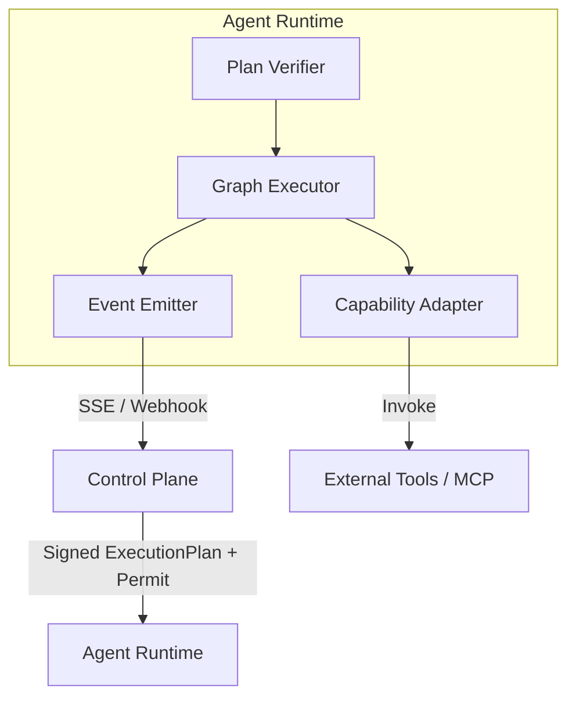
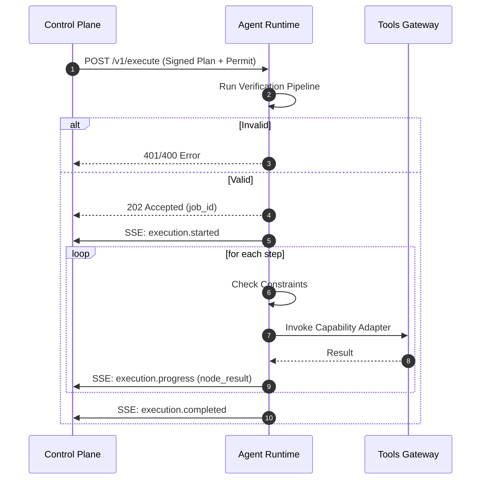

# Agent Runtime Interface Spec
**SBA-Agentic (Smart Business Assistant)**

---

## 1. Purpose & Scope

### 1.1 Tujuan
Agent Runtime Interface adalah **kontrak teknis & perilaku** yang menetapkan bagaimana Agent Runtime menerima Execution Plan, mengeksekusi secara deterministik, dan melaporkan hasilnya ke Control Plane.

Ini adalah **execution interface** yang memastikan:
* Agent dapat di-swap atau di-scale tanpa mengubah logika bisnis.
* Reasoning tetap terpusat di Control Plane.
* Governance dan Policy enforced di level eksekusi.

### 1.2 Scope yang Dicakup
✔ **Plan Ingestion**: Penerimaan dan validasi Execution Plan.
✔ **Execution Lifecycle**: Manajemen status eksekusi (Validated -> Running -> Completed/Failed).
✔ **Security & Verification**: Verifikasi signature Plan dan Permit.
✔ **Constraint Enforcement**: Penegakan batasan (Time, Cost, Steps).
✔ **Observability**: Streaming telemetry dan audit log balik ke Control Plane.

---

## 2. Agent Runtime Positioning



Agent Runtime **TIDAK BERPIKIR STRATEGIS**. Ia adalah "otot" yang menjalankan instruksi dari "otak" (Control Plane).

---

## 3. Runtime Responsibilities (Hard Boundary)

### 3.1 Agent Runtime WAJIB
* **Verifikasi Mutlak**: Memvalidasi Signature Plan dan Permit sebelum eksekusi.
* **Isolasi Tenant**: Memastikan context tenant tidak bocor antar eksekusi.
* **Deterministic Execution**: Menjalankan graph sesuai urutan yang diberikan.
* **Real-time Reporting**: Mengirim event untuk setiap perubahan status node.
* **Fail-Fast**: Menghentikan eksekusi jika terjadi pelanggaran policy atau constraint.

### 3.2 Agent Runtime DILARANG
* Mengubah struktur execution graph.
* Menjalankan tool di luar `allowedActions` dalam Plan.
* Melakukan caching data sensitif lintas tenant.
* Mengambil keputusan routing intent secara mandiri.

---

## 4. Technical Specifications

### 4.1 Communication Protocols
1.  **Command (C2)**: RESTful API (HTTPS/TLS 1.3).
2.  **Telemetry**: Server-Sent Events (SSE) atau Webhooks untuk real-time feedback.
3.  **Format**: JSON (UTF-8).

### 4.2 API Endpoints
| Method | Endpoint | Description |
| :--- | :--- | :--- |
| `POST` | `/v1/execute` | Menjalankan `ExecutionPlan` secara asinkron. |
| `GET` | `/v1/jobs/:job_id/status` | Mengambil status eksekusi job. |
| `GET` | `/v1/jobs/:job_id/stream` | Koneksi SSE untuk streaming event job. |
| `DELETE` | `/v1/jobs/:job_id` | Abort eksekusi job. |

### 4.3 Message Formats (JSON)

#### ExecutionPlan (Request)
```json
{
  "planId": "plan_123",
  "version": "1.1.0",
  "issuedAt": "2025-12-30T10:00:00Z",
  "expiresAt": "2025-12-30T10:05:00Z",
  "tenantContext": {
    "tenantId": "tenant_abc",
    "subscriptionTier": "pro",
    "region": "id-jkt"
  },
  "intent": {
    "id": "intent_001",
    "name": "search_market_trends"
  },
  "capability": {
    "id": "cap_search_001",
    "version": "1.0.0"
  },
  "constraints": {
    "maxSteps": 5,
    "maxDurationMs": 30000,
    "allowedActions": ["knowledge.search", "knowledge.extract"]
  },
  "permit": {
    "permitId": "perm_xyz",
    "planId": "plan_123",
    "decision": "allow",
    "policyHash": "sha256:...",
    "signature": "base64_signed_permit"
  },
  "signature": "base64_signed_plan"
}
```

---

## 5. Execution Verification Logic

Sebelum masuk ke fase eksekusi, Runtime **WAJIB** menjalankan pipeline verifikasi berikut:

### 5.1 Verification Pipeline
1.  **Structural Integrity**: Validasi JSON schema terhadap versi 1.1.0.
2.  **Plan Signature**: Verifikasi `signature` Plan menggunakan public key Control Plane.
3.  **Permit Validation**: 
    *   Verifikasi `permit.signature`.
    *   Pastikan `permit.planId == planId`.
    *   Pastikan `permit.tenantId == tenantContext.tenantId`.
4.  **Temporal Check**: Pastikan `now() < expiresAt`.
5.  **Constraint Feasibility**: Pastikan resource yang diminta tersedia.

**Jika salah satu gagal → Return 401 Unauthorized / 400 Bad Request.**

---

## 6. Execution Lifecycle (State Machine)



---

## 7. Error & Failure Contract

Runtime harus menggunakan error code standar SBA-Agentic:

| Error Code | Status | Cause |
| :--- | :--- | :--- |
| `ERR_AUTH_INVALID` | 401 | Signature Plan/Permit tidak valid. |
| `ERR_PLAN_EXPIRED` | 401 | `expiresAt` telah terlewati. |
| `ERR_CONSTRAINT_VIOLATION` | 403 | Melanggar maxSteps/maxDuration. |
| `ERR_CAPABILITY_MISSING` | 404 | Tool tidak terdaftar di runtime. |
| `ERR_TENANT_MISMATCH` | 403 | Tenant ID di permit tidak sesuai plan. |

---

## 8. Implementation Requirements

### 8.1 Security
* **Kriptografi**: Implementasi RS256 atau Ed25519 untuk verifikasi signature.
* **Sandbox**: Eksekusi tool dalam environment terisolasi (misal: Docker, WASM, atau gVisor).
* **Zero-Trust**: Runtime tidak mempercayai data apapun dalam plan sebelum divalidasi.

### 8.2 Observability
* **Trace Propagation**: Meneruskan `traceId` dari Plan ke setiap log dan outgoing tool call.
* **Metrics**: Mencatat `durationMs` dan `costUnits` per eksekusi.

---

## 9. Strategic Impact
Dengan interface yang terstandarisasi ini, SBA-Agentic mencapai:
1. **Auditability**: Setiap aksi agen memiliki bukti izin (Permit) yang tertanda tangan.
2. **Resilience**: Runtime dapat gagal (fail-fast) tanpa membahayakan integritas data tenant.
3. **Scalability**: Control Plane dapat mendistribusikan beban ke ribuan Agent Runtime secara aman.

---
**Satu plan = satu execution lifecycle**
