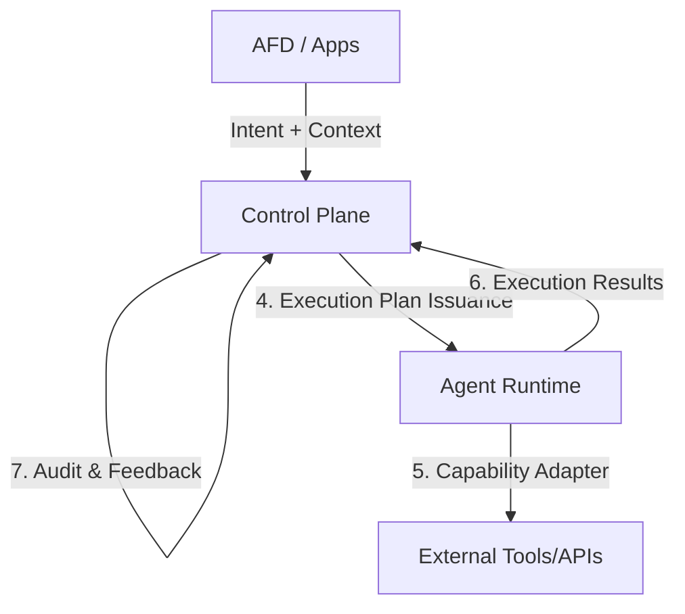

# Execution Plan Contract
**Control Plane ↔ Agent Runtime**
*Smart Business Assistant (SBA-Agentic)*

---

## 1. Pendahuluan (Purpose & Positioning)

Dokumen ini mendefinisikan **kontrak eksekusi keras** antara **Control Plane (otoritas keputusan)** dan **Agent Runtime (otoritas eksekusi)**. Tanpa kontrak ini, sistem tidak akan bersifat *agentic* melainkan hanya otomatisasi tanpa kendali. 

Execution Plan adalah **izin eksekusi sementara (time-boxed, scope-boxed)** yang mengikat intent, capability, policy, dan agent ke dalam satu paket instruksi yang tidak dapat dimodifikasi oleh agent.

### 1.1 Tujuan Kontrak
Execution Plan Contract menjawab:
* **Apa** yang harus dilakukan agent (Intent & Capability).
* **Dalam konteks siapa** (Tenant, User, Risk).
* **Dengan batasan apa** (Policy, Quota, Constraints).
* **Bagaimana hasilnya dilaporkan** (Events & Result).

### 1.2 Posisi Arsitektural
Execution Plan adalah **output final Control Plane** sebelum agent benar-benar bertindak.



---

## 2. Prinsip Desain (Non-Negotiable)

| Prinsip | Penjelasan |
| :--- | :--- |
| **Control Plane is Boss** | Agent tidak membuat keputusan strategis, hanya menjalankan rencana. |
| **Least Privilege** | Hanya memberikan akses ke capability minimal yang diperlukan. |
| **Permit-based** | Tanpa *signed execution plan* (Permit), agent **HARUS FAIL**. |
| **Deterministic** | Tidak ada interpretasi liar; input yang sama menghasilkan instruksi yang sama. |
| **Ephemeral** | Rencana eksekusi selalu memiliki batas waktu (TTL). |
| **Verifiable** | Setiap rencana dapat divalidasi secara kriptografis oleh runtime. |

---

## 3. Kontrak Data — Execution Plan (Authoritative)

### 3.1 Skema Utama
```ts
export interface ExecutionPlan {
  // 1. Identity & Lifecycle
  planId: string;
  version: string;
  issuedAt: string;
  expiresAt: string; // TTL: Hard limit eksekusi

  // 2. Context (Multi-Tenant & Requester)
  tenantContext: {
    tenantId: string;
    workspaceId?: string;
    subscriptionTier: "free" | "pro" | "enterprise";
    region: string;
  };
  requesterContext: {
    actorId: string;
    role: string[];
    trustLevel: "low" | "medium" | "high";
  };

  // 3. Intent & Capability Binding
  intent: {
    id: string;
    name: string;
    confidence: number;
    taxonomy: string;
  };
  capability: {
    id: string;
    version: string;
    executionMode: 'read' | 'write' | 'mixed';
  };

  // 4. Agent Binding
  agent: {
    agentId: string;
    runtime: 'node' | 'python' | 'container';
  };

  // 5. Constraints & Guardrails (HARD)
  constraints: {
    allowedActions: string[];
    deniedActions: string[];
    dataScopes: string[];
    maxSteps: number;
    maxDurationMs: number;
    maxCostUnits: number;
    rateLimit?: {
      maxCalls: number;
      windowSeconds: number;
    };
  };

  // 6. Policy Snapshot (Immutable)
  policy: {
    traceId: string;
    appliedPolicyIds: string[];
    riskLevel: 'low' | 'medium' | 'high';
  };

  // 7. Security & Observability
  permit: ExecutionPermit; // Mandatory permit for runtime validation
  auditRef: string;
  traceId: string;
  signature: string; // Kriptografis dari Control Plane (Plan-level)
}
```

---

## 4. Execution Permit (Mandatory Validation)

Agent Runtime **WAJIB** memverifikasi permit sebelum memulai eksekusi apa pun. Permit ini menjamin integritas keputusan kebijakan.

```ts
interface ExecutionPermit {
  permitId: string;
  planId: string;
  issuedAt: string;
  expiresAt: string;
  capabilityId: string;
  tenantId: string;
  decision: 'allow' | 'degrade' | 'require_confirmation';
  policyHash: string; // Hash dari set kebijakan yang diterapkan
  signature: string;  // Tanda tangan kriptografis dari Control Plane
}
```

**Kondisi Kegagalan**: Jika signature permit invalid, TTL expired, atau data mismatch dengan plan, maka:
`❌ INVALID → AGENT MUST TERMINATE IMMEDIATELY`

---

## 5. Kewajiban Agent Runtime (Hard Rules)

Agent Runtime **HARUS** melakukan:
1. **Validate Signature**: Memastikan rencana benar-benar dari Control Plane.
2. **Validate TTL**: Menolak rencana yang sudah kadaluarsa.
3. **Validate Agent Identity**: Memastikan rencana ditujukan untuk dirinya.
4. **Local Enforcement**: Menegakkan batasan (`constraints`) secara lokal tanpa bypass.
5. **Event Emission**: Melaporkan status eksekusi secara *real-time*.

---

## 6. Lifecycle Eksekusi (State Machine)

Agent tidak boleh melewati atau memanipulasi urutan status berikut:

```text
RECEIVED → VALIDATED → RUNNING → [COMPLETED | FAILED] → REPORT BACK
```

---

## 7. Protokol Komunikasi (Events)

### 7.1 Agent → Control Plane Events
```ts
interface AgentExecutionEvent {
  planId: string;
  agentId: string;
  status: 'started' | 'progress' | 'completed' | 'failed';
  timestamp: string;
  payload?: unknown;
}
```

| Event | Wajib | Deskripsi |
| :--- | :--- | :--- |
| `execution.started` | ✅ | Dipicu segera setelah validasi berhasil. |
| `execution.completed` | ✅ | Berhasil menyelesaikan instruksi dalam rencana. |
| `execution.failed` | ✅ | Gagal karena error internal atau pelanggaran batasan. |
| `execution.progress` | Opsional | Update status untuk tugas yang memakan waktu lama. |

---

## 8. Semantik Kegagalan (Strict)

| Kondisi | Respon Agent |
| :--- | :--- |
| **Plan Expired** | STOP eksekusi segera. |
| **Constraint Violated** | FAIL dan laporkan pelanggaran spesifik. |
| **Capability Mismatch** | FAIL sebelum memanggil adapter. |
| **Rate Limit Hit** | FAIL (Tidak ada *silent retry*). |
| **Unexpected Behavior** | FAIL + Kirim laporan diagnostik lengkap. |

---

## 9. Model Keamanan

### 9.1 Lapisan Perlindungan
* **Signed Plan**: Mencegah tampering instruksi.
* **Immutable Payload**: Agent tidak bisa mengubah parameter rencana.
* **Sandboxed Adapter**: Capability adapter dijalankan dalam isolasi terbatas.

### 9.2 Mitigasi Ancaman
| Ancaman | Mitigasi |
| :--- | :--- |
| **Rogue Agent** | Verifikasi Signature & AgentID. |
| **Tenant Data Leak** | Pembatasan `dataScopes` yang ketat. |
| **Prompt Injection** | Intent sudah di-resolve di Control Plane sebelum ke agent. |
| **Over-execution** | `rateLimit`, `maxSteps`, dan `TTL`. |

---

## 10. Capability Adapter Contract (Agent Internal)

Agent hanya diizinkan memanggil adapter melalui antarmuka yang terkontrol:

```ts
interface CapabilityAdapter {
  capabilityId: string;
  execute(input: unknown, ctx: ExecutionContext): Promise<unknown>;
}

// Context bersifat Read-Only
interface ExecutionContext {
  tenantId: string;
  dataScopes: string[];
  traceId: string;
}
```

---

## 11. Penempatan File (Canonical)

### 11.1 Control Plane Side
`packages/control-plane/execution-plan/`
* `schema.ts`: Definisi kontrak.
* `signer.ts`: Logika penandatanganan rencana.
* `lifecycle.ts`: Manajemen status rencana global.

### 11.2 Agent Runtime Side
`packages/agent-runtime/executor/`
* `validate-plan.ts`: Logika verifikasi signature dan TTL.
* `enforce-constraints.ts`: Guardrail eksekusi lokal.
* `emit-events.ts`: Komunikasi balik ke Control Plane.

---

## 12. Dampak Strategis

Dengan kontrak ini:
✔ Agent **tidak bisa bertindak liar** di luar mandat.
✔ Control Plane memegang **kedaulatan penuh** atas perilaku sistem.
✔ Sistem siap untuk standar **Enterprise Audit** dan **Compliance**.
✔ Multi-tenant dijamin aman secara teknis dan hukum.

---

## NEXT (KRITIS)

👉 **Agent Runtime Interface Spec**
Kita akan mengunci:
* Lifecycle API agent (Startup/Shutdown semantics).
* Health, Versioning, dan Compatibility checks.
* Mekanisme *handshake* awal antara Control Plane dan Runtime.

---
**Catatan Perubahan (Change Log)**
| Versi | Tanggal | Deskripsi |
| :--- | :--- | :--- |
| 1.0.0 | 2025-12-28 | Inisiasi dokumen kontrak eksekusi. |
| 1.1.0 | 2025-12-30 | Sinkronisasi dengan Spec-2: Penambahan Permit layer, Lifecycle State Machine, dan Security Model yang lebih ketat. |
