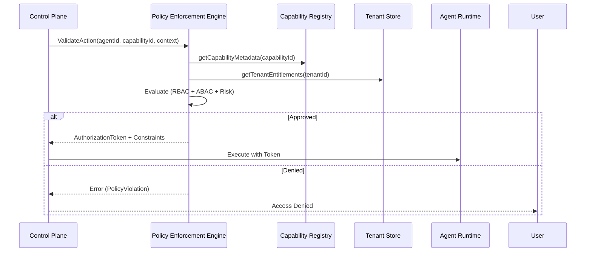

# Policy Enforcement Spec
## Capability × Tenant × Risk
**Deterministic Governance Layer — SBA-Agentic**

Dokumen ini adalah **lapisan otoritas final** sebelum agent melakukan *real execution*. Ini merupakan **garis batas kekuasaan** dalam SBA-Agentic untuk memastikan tidak ada eksekusi tanpa izin eksplisit.

---

## 1. Executive Summary
Policy Enforcement Engine (PEE) adalah penjaga gerbang (gatekeeper) antara **Control Plane** dan **Agent Runtime**. PEE mengambil keputusan berdasarkan metadata dari [Agent Capability Registry Spec](./Agent%20Capability%20Registry%20Spec.md) dan konteks dinamis dari permintaan pengguna.

---

## 2. Arsitektur Enforcement

### 2.1 Enforcement Flow


---

## 3. Prinsip Inti (TIDAK BOLEH DILANGGAR)
1. **Policy-first execution**: Kebijakan divalidasi sebelum eksekusi dimulai.
2. **Explicit deny > implicit allow**: Jika tidak ada aturan yang cocok, akses ditolak.
3. **Tenant-aware**: Selalu memvalidasi batasan (constraints) spesifik tenant.
4. **Risk-bounded**: Aksi dengan risiko tinggi memerlukan verifikasi tambahan (HITL/MFA).
5. **Deterministic**: Hasil evaluasi kebijakan harus konsisten untuk input yang sama.
6. **Explainable**: Setiap keputusan penolakan harus menyertakan alasan yang jelas.

---

## 4. Dimensi Kebijakan (3-Axis Model)

SBA-Agentic menggunakan pendekatan **Hybrid Policy Model**:

### 4.1 Capability Dimension
Setiap capability memiliki metadata kebijakan bawaan:
```yaml
capability: marketing.capture-lead
category: marketing
riskLevel: low
dataSensitivity: pii
sideEffect: write
requiresConsent: true
```

### 4.2 Tenant Dimension
Tenant membawa konteks operasional dan hak (entitlements):
```yaml
tenant:
  id: acme-id
  tier: enterprise | smb | free
  industry: finance | retail | healthcare
  region: id | eu | us
  compliance:
    - PDP
    - ISO27001
  enabledCapabilities:
    - marketing.capture-lead
    - knowledge.search
```

### 4.3 Risk Dimension
Risk adalah *computed context* (bukan input manual):
```yaml
riskContext:
  intentConfidence: 0.92
  userAuthLevel: authenticated | anonymous | admin
  dataScope: public | internal | pii | sensitive
  frequency: normal | burst | abuse
  channel: web | api | agent
```

---

## 5. Data Model (TypeScript)

### 5.1 Policy Definition
```typescript
export interface PolicyDefinition {
  policyId: string;
  name: string;
  description: string;
  
  target: {
    capabilityId?: string;
    agentId?: string;
    tenantType?: 'trial' | 'pro' | 'enterprise';
  };

  rules: {
    effect: 'allow' | 'deny';
    condition: string; // Expression string (e.g., "tenant.quota > 0")
  }[];

  riskMitigation: {
    requiresApproval: boolean;
    approvalLevel?: 'manager' | 'security_officer';
    mfaRequired: boolean;
  };
}
```

### 5.2 Execution Permit (Runtime Guard)
Agen **WAJIB** memverifikasi execution permit yang merupakan bagian dari Execution Plan:
```typescript
interface ExecutionPermit {
  permitId: string;
  planId: string;
  issuedAt: string;
  expiresAt: string;
  capabilityId: string;
  tenantId: string;
  decision: 'allow' | 'degrade' | 'require_confirmation';
  policyHash: string; // Hash dari set kebijakan yang diterapkan
  signature: string;  // Tanda tangan kriptografis dari Control Plane
}
```

---

## 6. Policy Decision Outcomes

| Decision | Makna | Karakteristik |
| :--- | :--- | :--- |
| **allow** | Dieksekusi normal | Risk: Low/Medium |
| **deny** | Ditolak keras | Pelanggaran kebijakan / Quota habis |
| **degrade** | Fallback capability | Misal: Dari Write ke Read-only |
| **require_confirmation** | User approval | **Human-in-the-Loop (HITL)** |
| **escalate** | Manual / Higher agent | Memerlukan intervensi ReviewerAgent |

---

## 7. Example Policies (YAML)

### 7.1 Indonesia PDP Compliance
```yaml
policyId: id-pdp-lead-capture
match:
  capability: marketing.capture-lead
  tenant.region: id
conditions:
  risk.dataScope: pii
decision: require_confirmation
constraints:
  consentType: explicit
  retentionDays: 365
  auditTrail: mandatory
```

### 7.2 Free Tier Restriction
```yaml
policyId: free-tier-block-enrich
match:
  capability: marketing.enrich-lead
  tenant.tier: free
decision: deny
reason: "Lead enrichment not allowed for free tier"
```

---

## 8. Enforcement Algorithm (Control Plane)
1. Load capability metadata dari Registry.
2. Load tenant policy set & entitlements.
3. Compute `riskContext` berdasarkan input dan session.
4. Match applicable policies.
5. Sort by priority (`deny` > `allow`).
6. Apply first decisive rule.
7. Emit decision + **Execution Permit**.

---

## 9. Priority Resolution Rules
1. `deny` > `allow`
2. Tenant-specific > Global
3. Compliance > Business
4. Higher risk > Lower risk
5. Newer policy > Older (versioned)

---

## 10. Audit & Explainability Record
```json
{
  "capability": "marketing.create_lead",
  "tenant": "acme-id",
  "riskScore": 0.23,
  "decision": "require_confirmation",
  "policyApplied": "id-pdp-lead-capture",
  "timestamp": "2025-12-30T10:00:00Z",
  "reason": "Explicit consent required for PII data in ID region"
}
```

---

## 11. Dampak Strategis ke SBA-Agentic
- ✔ Governance kelas enterprise.
- ✔ Aman untuk multi-tenant (Isolasi data & fitur).
- ✔ Siap audit & compliance (ISO27001, PDP).
- ✔ Menghindari "Agent Hallucination" yang merugikan bisnis.

---

## 12. Referensi
- [Agent Capability Registry Spec](./Agent%20Capability%20Registry%20Spec.md)
- [Action Handlers Catalog](../../.trae/rules/action-handlers-catalog.md)
- [Security and Multi-tenancy Rule](../../.trae/rules/security-and-multitenancy.md)

---

## NEXT LOGICAL STEP
👉 **Control Plane Routing Algorithm (Deterministic & Policy-Aware)**
