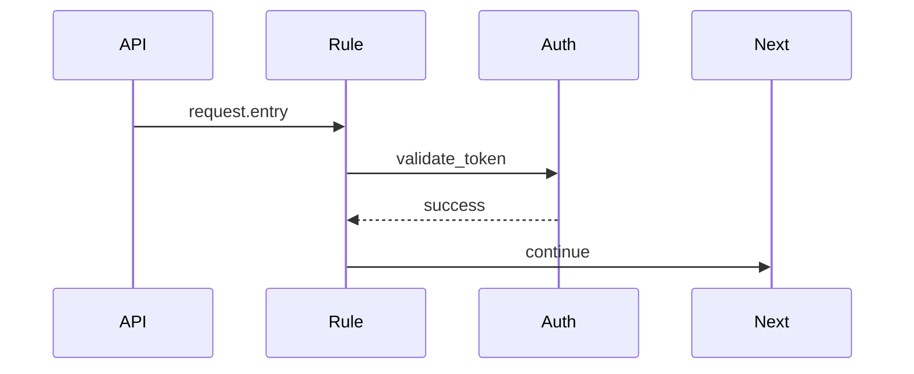

**Draft Project Rules (.trae/rules/*) versi foundation** yang **siap dipakai secara agentic dari fase develop → staging → go-live**, dengan fokus **scalable, auditable, dan mudah di-automate oleh agent** (planner / executor / reviewer).

Saya bagi menjadi 4 bagian besar agar jelas dan operasional.

---

## 1️⃣ Struktur Folder Final (.trae/rules)

Struktur ini **minimal tapi lengkap** untuk sistem rule-based agentic SBA.

```
.trae/
└── rules/
    ├── README.md
    ├── STYLE_GUIDE.md
    ├── DEPENDENCIES.md

    ├── core/
    │   ├── authentication.yaml
    │   ├── authorization.yaml
    │   ├── logging.yaml
    │   ├── error_handling.yaml

    ├── business_logic/
    │   ├── workspace.yaml
    │   ├── billing.yaml
    │   ├── agent_execution.yaml
    │   ├── knowledge_access.yaml

    ├── validation/
    │   ├── input_schema.yaml
    │   ├── output_contract.yaml
    │   ├── policy_validation.yaml

    ├── templates/
    │   ├── base_rule.template.yaml
    │   ├── agent_rule.template.yaml
    │   ├── api_rule.template.yaml
```

📌 **Prinsip desain**

* `core` → invariant system rules (tidak tergantung use-case)
* `business_logic` → domain-aware & tenant-aware
* `validation` → guardrail + safety net agent
* `templates` → **agent-friendly rule authoring**

---

## 2️⃣ Format Standar File Rule (YAML Contract)

Semua rule **WAJIB mengikuti kontrak ini** agar:

* bisa di-parse agent
* bisa di-generate docs
* bisa di-test otomatis

### 🔹 Base Rule Contract

```yaml
metadata:
  id: core.authentication.basic
  version: 1.0.0
  author: sba-platform
  date: 2025-12-28
  status: active
  scope: global | tenant | workspace
  tags: [security, auth, core]

description: >
  Menentukan aturan autentikasi dasar untuk seluruh request
  yang masuk ke SBA-Agentic.

trigger:
  event: http.request.received
  conditions:
    - field: headers.authorization
      operator: exists

actions:
  - type: validate_token
    provider: clerk | internal
    on_success: continue
    on_failure: deny_request

error_handling:
  strategy: fail_fast
  on_error:
    log_level: warn
    emit_event: auth.failed
    response:
      status: 401
      message: Unauthorized
```

📌 **Catatan penting**

* `trigger` → bisa dipakai planner-agent
* `actions` → dieksekusi executor-agent
* `error_handling` → diawasi observer-agent

---

## 3️⃣ Aturan Inti (Core Rules)

### 3.1 `core/authentication.yaml`

**Tujuan**
Menjadi **gerbang pertama** semua interaksi agent & API.

```yaml
metadata:
  id: core.authentication
  version: 1.0.0
  scope: global

description: Autentikasi token dan session pengguna SBA.

trigger:
  event: request.entry

actions:
  - type: extract_identity
  - type: validate_token
  - type: attach_principal_context

error_handling:
  strategy: deny_and_log
```

---

### 3.2 `core/authorization.yaml`

**RBAC + scoped-permission + tenant isolation**

```yaml
metadata:
  id: core.authorization
  version: 1.0.0
  scope: tenant

trigger:
  event: principal.authenticated

actions:
  - type: evaluate_rbac
  - type: enforce_tenant_boundary
  - type: attach_permissions
```

---

### 3.3 `core/logging.yaml`

**Observability agent-ready**

```yaml
metadata:
  id: core.logging
  version: 1.0.0

trigger:
  event: any

actions:
  - type: structured_log
    fields: [trace_id, tenant_id, agent_id, action]

error_handling:
  strategy: never_block
```

---

### 3.4 `core/error_handling.yaml`

**Standardized error taxonomy**

```yaml
metadata:
  id: core.error_handling
  version: 1.0.0

trigger:
  event: error.raised

actions:
  - type: classify_error
  - type: emit_metric
  - type: notify_observer_agent
```

---

## 4️⃣ Business Logic Rules (Agent-Aware)

Contoh **agent execution rule**:

### `business_logic/agent_execution.yaml`

```yaml
metadata:
  id: business.agent.execution
  scope: workspace

description: >
  Mengatur bagaimana agent boleh mengeksekusi task
  berdasarkan plan dan policy.

trigger:
  event: agent.task.requested

conditions:
  - field: agent.role
    operator: in
    value: [executor, planner]

actions:
  - type: validate_plan_signature
  - type: check_execution_budget
  - type: enqueue_task
```

---

## 5️⃣ Validation Rules (Safety & Governance)

### `validation/output_contract.yaml`

```yaml
metadata:
  id: validation.output.contract
  version: 1.0.0

trigger:
  event: agent.task.completed

actions:
  - type: validate_output_schema
  - type: redact_sensitive_fields
  - type: approve_or_reject
```

📌 Ini **krusial untuk production AI agent**
→ mencegah hallucination masuk ke sistem.

---

## 6️⃣ Templates (Untuk Scaling Tim & Agent)

### `templates/base_rule.template.yaml`

```yaml
metadata:
  id: <namespace>.<name>
  version: 0.1.0
  author: <team>

description: ""

trigger:
  event: ""

actions: []

error_handling:
  strategy: fail_safe
```

Agent bisa:

* generate rule baru
* lint rule
* propose PR otomatis

---

## 7️⃣ Integrasi Dokumentasi (Docusaurus)

### 📄 Auto-Generated Docs Flow

```
.rules/*.yaml
      ↓
rules-doc-generator
      ↓
docs/rules/*.md
```

Isi setiap halaman:

* Metadata table
* Trigger diagram (Mermaid)
* Action sequence
* Example event payload

Contoh snippet Mermaid:



---

## 8️⃣ CI Pipeline (Wajib)

### 🔹 Rule Validation Steps

1. **YAML Lint**
2. **Schema Validation (JSON Schema)**
3. **Cross-rule reference check**
4. **Rule Unit Test (dry-run event)**
5. **Deploy to testing environment**

📌 Rule **tidak boleh langsung ke production**

---

## 9️⃣ Quality & Governance Standard

Wajib ada:

* Semantic versioning per rule
* Review minimal 1 agent + 1 human
* Auto-backup sebelum deploy
* Metrics:

  * rule_hit_count
  * rule_failure_rate
  * agent_blocked_by_rule

---

## 🔟 Dokumentasi Root Rules

### `rules/README.md`

Isi:

* Filosofi rule-based agentic SBA
* Cara menambah rule
* Lifecycle rule (draft → active → deprecated)

### `STYLE_GUIDE.md`

* Naming convention
* Allowed actions
* Anti-pattern (mis: logic bercabang kompleks)

### `DEPENDENCIES.md`

* Engine yang membaca rules
* Agent yang mengonsumsi
* Tooling CI

---

## 🎯 Hasil Akhir

Dengan struktur ini:

* SBA-Agentic **bisa dikembangkan agent-first**
* Rules = **single source of truth**
* Aman untuk multi-tenant & enterprise
* Siap observability, audit, dan compliance

Jika Anda mau, langkah berikutnya saya bisa:

* 🔹 Buat **JSON Schema validator untuk rules**
* 🔹 Buat **rule-engine interface TypeScript**
* 🔹 Mapping **rules ↔ agent lifecycle**
* 🔹 Generator **Docusaurus + Mermaid otomatis**

Tinggal arahkan mau lanjut ke bagian mana.
