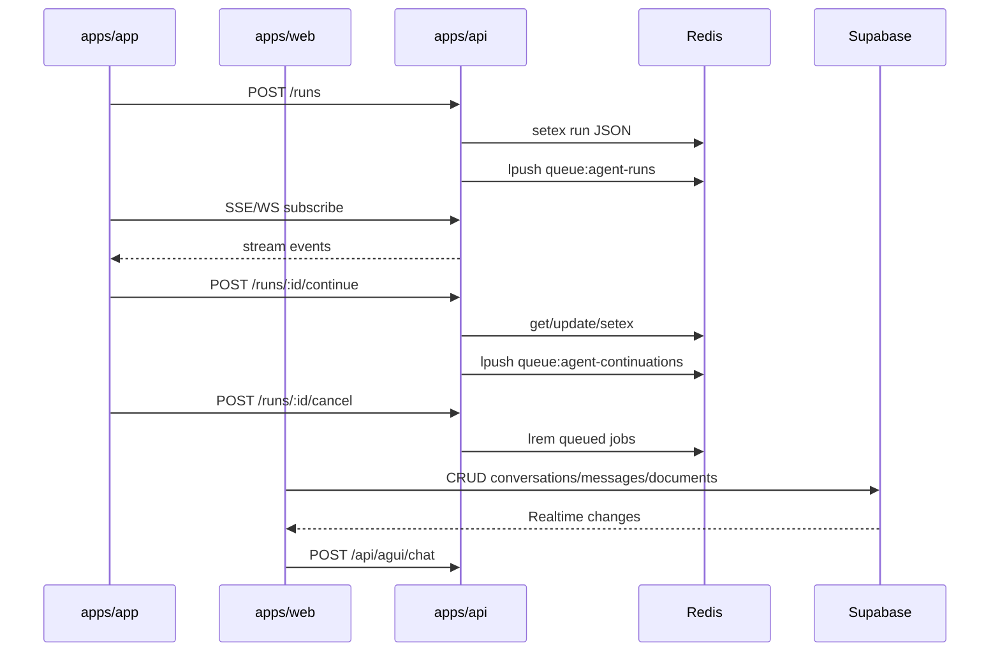

# SBA Orchestrator (Lintas apps/\*)

Versi: 1.0.0
Riwayat Perubahan:

- 1.0.0 (2025-12-05): Dokumen orchestrator lintas modul.

## Tujuan

- Mendefinisikan alur end-to-end antara frontends (`apps/app`, `apps/web`), backend (`apps/api`), antrean (Redis), dan persistence (Supabase), untuk orkestrasi agentic dan fitur end-user.

## Alur Utama

1. Start Run

- `apps/app` memanggil `POST /api/v1/runs` → `apps/api` setex run JSON ke Redis → enqueue `queue:agent-runs` → buka SSE/WS stream.

2. Continue Run

- `apps/app` mengirim input ke `POST /api/v1/runs/:id/continue` → update steps di Redis → enqueue `queue:agent-continuations`.

3. Cancel Run

- `apps/app` memanggil `POST /api/v1/runs/:id/cancel` → update status → lrem dari queue.

4. Chat & Documents (End-user)

- `apps/web` CRUD ke Supabase (conversations/messages/documents) → realtime channel per conversation.
- `apps/web` memanggil endpoint `/api/agui/chat` bila perlu.

## Diagram Orchestrator

## Integrasi & Kontrak

- Header multi-tenant: `X-Tenant-ID` di endpoints runs.
- OpenAPI: `apps/api/docs/openapi.yaml` sebagai sumber kontrak.
- Supabase schemas: tabel `conversations`, `messages`, `documents`, `tenants`.

## Reliabilitas & Observability

- Metrics: `metrics.requestCounter`, `metrics.agentRunCounter`.
- Heartbeat & reconnect di SSE klien.
- Retry eksponensial untuk request.

## Kualitas & Keamanan

- Validasi Zod pada controller; guard tenant; UUID check.
- Hindari logging rahasia; enforce scoping tenant.

## Rencana Peningkatan

- `@sba/api-client` typed dari OpenAPI.
- `@sba/realtime` facade SSE/WS lintas-frontend.
- Contract tests CI untuk REST/WS.

## Referensi

- `apps/api/src/api/runs.controller.ts:32,163,273,428,589`
- `apps/app/src/shared/api/sse.ts:64,135-156,356-434`
- `apps/web/src/shared/api/client.ts:1-156,245-263`
