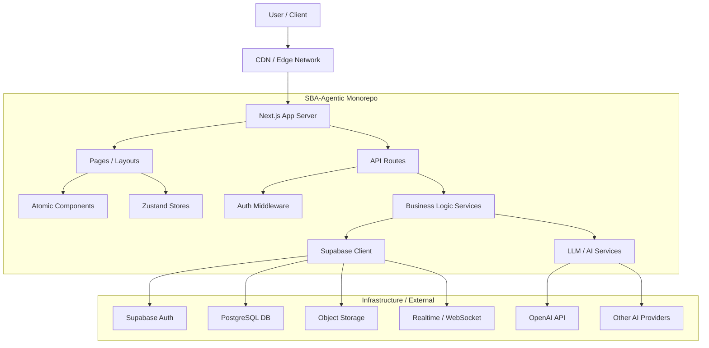

# Architecture Documentation

## Overview

SBA-Agentic is a monorepo built with **TurboRepo**, designed to provide a comprehensive suite of AI-powered business tools. It leverages **Next.js (App Router)** for the frontend and backend API, **Supabase** for database, authentication, and realtime features, and follows a strict **Feature-Sliced Design (FSD)** or Atomic Design hybrid approach for scalability.

## High-Level Architecture

## Key Components

### 1. Frontend (`apps/app`, `apps/web`)

- **Framework**: Next.js 14+ (App Router).
- **Styling**: Tailwind CSS, Radix UI.
- **State Management**: Zustand (using `useStore` hook for hydration-safe server-side rendering compatibility).
- **Structure**:
  - `src/app`: Routes and Pages.
  - `src/components`: UI Components (Atomic Design).
  - `src/features`: Feature-specific logic (FSD).
  - `src/shared`: Shared utilities, hooks, and types.
  - `src/stores`: Global state stores.

### 2. Backend & API

- **API Routes**: Located in `src/app/api`.
- **Middleware**: Authentication checks using Supabase Auth helpers.
- **Caching**: Custom caching layer using `Map` (in-memory) or Redis (optional) with TTL support (`apps/app/src/app/api/_lib/cache.ts`).
- **Knowledge Base**: Vector search integration (`search-cached.route.ts`).

### 3. Data & Authentication

- **Database**: PostgreSQL (managed by Supabase).
- **Authentication**: Supabase Auth (JWT).
- **RBAC**: Role-Based Access Control implementation (`src/shared/lib/rbac`).
- **Multi-tenancy**: Logical separation via `tenant_id` or RLS policies.

### 4. Performance & Monitoring

- **Performance Tracking**: Custom `trackPerformance` utility in `useAuth` hook logs authentication operation latency in non-production environments.
- **Observability**: Integration with monitoring tools (planned).

## Data Flow

1.  **Authentication**:
    - User logs in via Login Page.
    - Supabase Client interacts with Supabase Auth.
    - Session is stored in cookies/local storage.
    - Middleware verifies session for protected routes.

2.  **Agent Creation (Example Flow)**:
    - User submits "Create Agent" form.
    - Frontend validates input.
    - POST request sent to `/api/agents` (or direct Supabase insert if RLS allows).
    - API validates permissions (RBAC).
    - Data inserted into `agents` table.
    - Realtime subscription updates the dashboard list.

3.  **Knowledge Search**:
    - User queries the search bar.
    - Request to `/api/knowledge/search-cached`.
    - Check Cache -> Return Hit if available.
    - If Miss -> Call Vector DB / Search Service -> Cache Result -> Return.

## Security

- **OWASP Compliance**: Input sanitization, CSRF protection (Next.js default), Secure Headers.
- **RLS**: Row Level Security policies in Postgres ensure data isolation.
- **Secrets**: Environment variables management for API keys.
