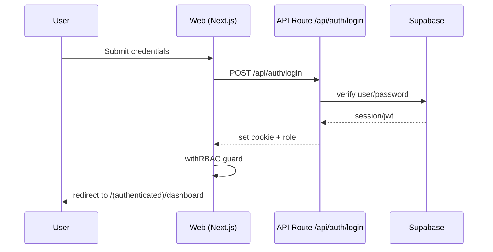

```mermaid
sequenceDiagram
  participant U as User
  participant W as Web (Next.js)
  participant A as API Route /api/auth/login
  participant S as Supabase

  U->>W: Submit credentials
  W->>A: POST /api/auth/login
  A->>S: verify user/password
  S-->>A: session/jwt
  A-->>W: set cookie + role
  W->>W: withRBAC guard
  W-->>U: redirect to /(authenticated)/dashboard
```
